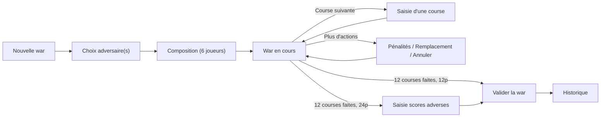

# Documentation fonctionnelle — Stats MKWorld

> Application mobile de suivi des statistiques de *wars* (matchs d'équipe) pour **Mario Kart World**.
> Ce document décrit l'application du point de vue de l'utilisateur, écran par écran, avec les règles métier encodées. Volet architecture : [TECHNICAL.md](TECHNICAL.md).

## Sommaire

1. [À qui s'adresse l'application](#1-à-qui-sadresse-lapplication)
2. [Concepts clés & vocabulaire](#2-concepts-clés--vocabulaire)
3. [Rôles & permissions](#3-rôles--permissions)
4. [Onboarding & connexion](#4-onboarding--connexion)
5. [Accueil & navigation](#5-accueil--navigation)
6. [Cycle de vie d'une war](#6-cycle-de-vie-dune-war)
7. [Historique & détails](#7-historique--détails)
8. [Statistiques](#8-statistiques)
9. [Annuaire & profils](#9-annuaire--profils)
10. [Tableau partageable (PDF)](#10-tableau-partageable-pdf)
11. [Paramètres, données & mode debug](#11-paramètres-données--mode-debug)
12. [Récapitulatif des règles métier](#12-récapitulatif-des-règles-métier)

---

## 1. À qui s'adresse l'application

Aux **équipes compétitives de Mario Kart World** qui disputent des *wars* et veulent en conserver une trace structurée et des statistiques détaillées (par joueur, équipe, adversaire, circuit).

Prérequis utilisateur :
- Être inscrit sur **MKCentral** (registre communautaire des joueurs/équipes MK).
- Avoir un **compte Discord lié à MKCentral** (utilisé pour l'identification).

---

## 2. Concepts clés & vocabulaire

| Terme | Définition |
|---|---|
| **War** | Un match entre équipes, composé d'une série de courses (12 en général). |
| **12 joueurs** | Format 6 v 6 : l'équipe affronte **un** adversaire. |
| **24 joueurs** | Format tournoi : l'équipe affronte **trois** équipes adverses ; les scores finaux sont saisis manuellement. |
| **Course / Track** | Une course sur un circuit, avec les positions d'arrivée des joueurs. |
| **Intermission** | En 24 joueurs, segment alternatif du monde ouvert enchaîné à un circuit (un track peut alors porter 2 circuits). |
| **Position → points** | Chaque place d'arrivée rapporte des points (1ʳᵉ = 15 pts). |
| **Pénalité** | Retrait de points (−10, −15, −20) imputé à une équipe. |
| **Shock** | L'objet **éclair** récupéré en jeu, stratégiquement décisif. Compté par joueur sur une course pour produire des statistiques dédiées (n'affecte pas le calcul du score). |
| **Équipe** | Entité MKCentral complète (identifiant `teamId`), pouvant regrouper plusieurs rosters. Les joueurs y sont rattachés. |
| **Roster** | Composition inscrite sur MKCentral (identifiant `rosterId`) ; une équipe peut en avoir plusieurs. C'est à ce niveau que se rattachent les wars. |
| **Allié** | Joueur de renfort hors roster officiel (rosterId interne `-1`), pouvant participer aux wars. |
| **Multi-roster** | Option : calculer les stats sur tous les rosters de l'équipe ou seulement le sien. |
| **Mode matrix** | Mode debug permettant de simuler les données d'un autre joueur. |

**Scoring synthétique :**
- **12 joueurs** : 82 points distribués par course ; score adverse = 82 − score équipe ; total war 12 courses = 984 (équilibre à 492). L'affichage met en avant l'**écart** (`+/−`) par rapport à l'équilibre.
- **24 joueurs** : 144 points par course ; total war 12 courses = **1728** (valeur de contrôle à la saisie des scores). L'affichage montre les **scores absolus** (pas d'écart `+/−`), le classement se faisant entre 4 équipes.

Détails du barème position→points : voir [TECHNICAL.md §8](TECHNICAL.md#8-algorithmes-de-scoring).

---

## 3. Rôles & permissions

Le rôle est un entier stocké par joueur :

| Rôle (`role`) | Niveau | Peut faire |
|---|---|---|
| **2** | Leader / Manager | Tout : créer des wars, gérer rosters & alliés, changer les rôles des membres |
| **1** | Admin | Créer/gérer des wars, basculer le rôle d'un membre |
| **0** | Membre | Consulter, participer aux wars (pas de création) |

Le rôle ne dépend que de la gestion explicite des rôles (et du statut leader/manager détecté dans le roster MKCentral) : **le cycle de vie d'une war — création, validation, annulation, remplacement de joueur — ne le modifie jamais** (cf. audit B10). Un **allié** (joueur hors équipe) a toujours le rôle `0` : ne faisant pas partie de l'équipe, il ne peut pas la modérer.

Gating concret :
- Le bouton **« Nouvelle war »** n'apparaît que si `role > 0` **ou** le mode matrix est actif (et qu'aucune war n'est en cours).
- Le bouton **« Ajouter en allié »** apparaît si le joueur consulté n'est pas dans l'équipe, n'est pas soi-même, et n'est pas déjà allié.
- Le bouton **« Basculer le rôle »** apparaît si un leader consulte un membre de l'équipe qui n'est ni lui-même ni déjà leader.
- L'accès à l'**écran debug** est réservé (utilisateur de référence id `18595` ou mode matrix actif).

---

## 4. Onboarding & connexion

Écran `Signup` : un pager de 7 pages (`TutorialItem`) piloté par `SignupViewModel` (état `currentPage`, `code`).

| Page | Contenu | Action |
|---|---|---|
| **START** | Présentation de l'app et des prérequis (MKCentral + Discord lié) | Continuer |
| **OPEN_APP** | Autoriser l'ouverture des liens `statsmkworld.com` (Android 12+) | Ouvrir les réglages |
| **NOTIFICATIONS** | Autoriser les notifications (Android 13+) | Activer (déclenche la demande de permission) |
| **AUTH** | Connexion Discord (OAuth2) | Se connecter (ouvre l'autorisation Discord) |
| **FIND_PLAYER** | « Récupération de ton profil… » (fetch MKCentral) | Auto |
| **WELCOME** | Succès — redirection auto vers l'accueil | Auto (~2 s) |
| **ERROR** | Échec : Discord non lié à MKCentral / erreur serveur / réseau | Réessayer (revient à AUTH) |

**Flux technique** : au retour OAuth (deep link portant `code`), l'app échange le code contre un token, récupère l'utilisateur Discord, retrouve le joueur sur MKCentral via son `discord_id`, effectue une **connexion anonyme Firebase** (UID technique pour autoriser l'accès RTDB, transparent pour l'utilisateur ; échec réseau non bloquant), puis enchaîne `fetchData` (joueur → équipe → alliés → équipes → wars). Le joueur est enregistré en DataStore et un `User` Firebase est créé (role 0, sauf si leader détecté dans le roster). La connexion anonyme est aussi re-tentée à chaque démarrage si l'UID a été perdu (ex. après réinstallation).

---

## 5. Accueil & navigation

`HomeScreen` = conteneur à **cinq pôles** (barre du bas — `Accueil · Wars · Stats · Classements · Profil`), avec conservation d'état entre onglets (`saveState`/`restoreState`). Chaque pôle est une destination du `NavHost` imbriqué de `HomeScreen`. L'**Annuaire** n'est plus un onglet : il est accessible via une **icône recherche** (loupe) dans l'app bar des écrans Accueil et Classements (route `Home/Registry` du graphe racine). Le graphe racine (`RootScreen`) conserve `startDestination = Signup` et les deep links Discord (`statsmkworld.com?...=code`) inchangés.

**En-tête commun (app bar) — conforme maquette (#50).** L'app bar de tous les écrans reproduit la maquette : **bande sombre pleine largeur**, **titre aligné à gauche en blanc** + sous-titre, **bouton retour `←`** à gauche sur tous les **écrans poussés** (fiches, détails, war en cours, wizards, annuaire…) et une **action à droite** paramétrable : **icône recherche** (Accueil/Classements → Annuaire) ou, sur le pôle **Wars**, **icône « + » « Créer une war »** (masquée si une war est en cours, #50). Les **racines de pôle** (Accueil, Wars, Stats, Classements, Profil) n'ont pas de flèche retour ; le retour système y suit le comportement bottom-nav (retour au pôle Accueil, puis quitte depuis l'Accueil). Sur les wizards (Créer une war / Saisie de course), la flèche retour applique le **même recul par étape** que le retour système.

### Pôle 1 — Accueil (`WelcomeScreen`) — tableau de bord
État : `teamName/teamLogo`, `playerName/playerLogo`, `currentWar`, `playerStats` + `teamStats` (les **deux** vues 12p, calculées d'emblée par le VM), `recentResults` (3 dernières wars 12p).

L'accueil est un **dashboard** qui met l'essentiel à portée immédiate. **Rendu pixel-perfect** : `WelcomeScreen` reproduit fidèlement le style de la maquette du prototype UX (`docs/prototype/stats-mkworld-5poles.html`, vue `home`) — cartes sombres translucides (fond `rgba(60,64,67,.5)`, bordure blanche, radius 6), eyebrows majuscules, pastilles V/N/D (vert/blanc/rouge), sparkline teintée selon la tendance à aire dégradée, segmentés stylés, bannière « En direct » verte, bandeau série avec flamme colorée, pastilles adversaire colorées. Ce rendu est la **norme** de la refonte (rules 13/15 : pixel-perfect exigé pour tout écran impacté, `WelcomeScreen` = rendu de référence). Les données affichées restent **réelles** (aucune valeur de démo codée en dur). Sections dans l'ordre (calcul 12p uniquement ; le support 24p relèvera d'un ticket dédié) :

1. **Carte de salutation** (cliquable → **Profil**) : pastille/avatar du joueur, « Salut, <prénom> », sous-titre « <équipe> · voir mon profil → ». Sous la carte, un **segmenté `Moi` / `Équipe`** (`Moi` actif par défaut, état UI `rememberSaveable`) **pilote la vue** des stats du dashboard (Momentum + Chiffres clés). Les deux jeux de stats étant précalculés par le VM (`playerStats` avec `userId` = id MKCentral du joueur courant ; `teamStats` avec `userId = null`), le basculement ne déclenche **aucun recalcul**.
2. **War en cours** — bannière « En direct · N joueurs » (dégradé vert, bordure verte) cliquable (→ reprend la war courante), affichée seulement si `currentWar != null`. Le corps réutilise `CurrentWarCell` (données réelles).
3. **Momentum** (reflète le profil sélectionné) : segmenté **`5 dernières` / `10 dernières`** pilotant la fenêtre ; bande de forme en **pastilles V/N/D** (`Stats.chronologicalOutcomes.takeLast(n)`) ; **sparkline** à aire dégradée des scores de la fenêtre (`Stats.scoreTimeline.takeLast(n)`, tracé Compose `Canvas`), **teintée selon la tendance** (vert si delta ≥ 0, rouge sinon) + delta de forme (flèche ↗/↘, winrate de la fenêtre `recentForm5`/`recentForm10` vs all-time), coloré vert/rouge.
4. **Chiffres clés** (reflète le profil sélectionné) : winrate (`allTimeForm.winrate`) · score moyen · 3ᵉ colonne, toutes valeurs en blanc. En vue **Moi** : score = score brut du joueur (`averagePoints`), 3ᵉ = position moyenne (`averagePlayerPosLabel`). En vue **Équipe** : score = écart moyen (`averagePointsLabel`), 3ᵉ = % de manches gagnées (`mapsWon`).
5. **Bandeau highlight — série en cours** (affiché si `currentStreak != 0`) : « Série de N victoires/défaites » + « En cours — record : M » (`bestWinStreak` / `worstLossStreak`). Icône flamme (`ic_flame`) teintée **verte** (série de victoires) ou **rouge** (série de défaites), dans un cercle assorti.
6. **Derniers résultats** : 3 wars 12p (`recentResults`, cliquables → détail de war) + lien **« Voir tout »** → pôle Wars (historique). Réutilise la **cellule `WarCell` unifiée** (voir ci-dessous).

- **Icône recherche** (app bar) → Annuaire.
- Le **sélecteur 12/24 joueurs** et le bouton **« Créer une war »** ne figurent plus sur l'accueil : ils vivent désormais dans le **pôle Wars** — le bouton « Créer une war » dans l'**action droite de l'app bar** de `WarListScreen` (#50), le segmenté 12/24 en tête de `AddWarScreen` (cf. §6). Les destinations de navigation `Home/AddWar/{is24p}` restent inchangées.

> **Cellule `WarCell` unifiée** : la cellule de résultat (`ui/cells/WarCell.kt`) est **partagée** par l'Accueil, l'historique (`WarListScreen`) et les stats (`StatsScreen`), signature publique inchangée. Elle rend **12p** avec le style pixel-perfect de l'Accueil (pastille V/N/D, pastille adversaire, « vs … » + date, score + écart + **maps gagnées**) et **24p** avec le podium des 3 équipes (style minimal, non régressé). L'ancienne implémentation dédoublée a été supprimée.

### Pôle 2 — Wars (`WarListScreen`)
Point d'entrée unifié du domaine « match ». Barre d'app : titre **WARS** + sous-titre **« N wars »** (total affiché). L'écran enchaîne, de haut en bas :

1. **War en cours / création** (règle métier existante) :
   - **Création** : le bouton **« Créer une war »** est désormais l'**action à droite de l'app bar** (icône « + », #50), et non plus un CTA dans la liste. Il est **masqué tant qu'une war est en cours** (même condition qu'avant). → `AddWarScreen`.
   - si une war est en cours (écoutée en temps réel via `FirebaseRepository.listenToCurrentWar`, semée par `getCurrentWar`) → **bannière « En direct »** cliquable (composant partagé `CurrentWarBanner`, cf. ci-dessous) portant l'appel à l'action **« Reprendre — N courses jouées »** → `CurrentWarScreen` (dans la liste).
2. **Chips filtre de résultat** : `Tous` (actif par défaut) / `Victoires` / `Nuls` / `Défaites`. Filtre purement UI (état `rememberSaveable`), sur le signe de la marge de score (`WarDetails.scoreMargin`, 12j comme 24j).
3. **Historique complet**, groupé par mois (en-têtes collants), triés du plus récent au plus ancien. **Tous les modes sont mélangés (12j ET 24j)** — l'ancien filtrage par mode (`is24PEnabled`) a été retiré. Clic sur une war → détail de war. Réutilise la cellule `WarCell` unifiée.

> **Composant `CurrentWarBanner` partagé** (`ui/cells/CurrentWarBanner.kt`) : la bannière « War en cours » (dégradé vert, pastille « En direct », corps = `CurrentWarCell`) est extraite de l'Accueil et **partagée** par l'Accueil et le pôle Wars. Un paramètre `withPlayers` choisit le libellé de pastille (« En direct · N joueurs » côté Accueil, « En direct » côté Wars) et un `callToAction` optionnel affiche « Reprendre — N courses jouées » côté Wars.
>
> **Cellule `CurrentWarCell` restylée** (`ui/cells/CurrentWarCell.kt`) : alignée sur le style des cellules de résultat (`WarCell12p`) — carte `blackAlphaed` + bordure, pastille adversaire (avatar équipe ou tag), « vs … », score + écart — et affiche en sous-ligne le **nombre de courses restantes** (`12 − courses jouées`). En 24p, podium des 3 logos + score de l'hôte + courses restantes. Le « courses restantes » (cellule) et le « N courses jouées » du `callToAction` (bannière, côté Wars) sont complémentaires et cohérents (jouées + restantes = 12).

### Pôle 3 — Stats (`StatsFullScreen`)
Écran riche à **onglets Individuelles / Équipe**, au niveau maquette (pôle Stats du prototype UX). **12p uniquement** pour l'instant : le sélecteur 12 j / 24 j et le comparatif 12/24 sont **temporairement retirés** (réintégration prévue au ticket #37).

- **En-tête** : **photo de profil du joueur** (Individuelles) ou **logo de l'équipe** (Équipe) — vignette MKCentral, fallback initiales/`default_logo` — + nom + sous-titre (« Tes performances · N wars » / « Performances collectives · N wars »). Pas de nombre de courses.
- **Bilan** : gros winrate + V/N/D + barre proportionnelle. Le décompte V/N/D **et** le nombre de wars sont calculés sur la portée affichée : en Individuelles seules les wars où le joueur a joué, en Équipe toutes les wars de l'équipe.
- **Indicateurs** (Individuelles) / **Détails équipe** (Équipe) : **grille régulière** de tuiles **toutes de la même taille** (la place de la ligne de progression **et** du libellé sur 2 lignes est réservée en permanence → aucune tuile ne change de taille, ni au changement de fenêtre ni selon la longueur du libellé), avec **sélecteur all-time / 5 dernières / 10 dernières** qui recalcule la section, et **progression en %** (delta vs all-time, flèche ↗/↘ colorée) sur les métriques comparables. Distinction stricte : Individuelles = **points/war** + position ; Équipe = **écart de points** (le « Score moyen » affiche une différence, pas le total) + score moyen/manche. Tuiles communes : winrate, maps gagnées, régularité, marges V/D, **pénalités** (points perdus), shocks/war. **Position moyenne** et **pénalités** se mettent à jour avec la fenêtre. Valeurs en blanc, seuls les deltas colorés.
- **Contribution** (Individuelles) : % des points de l'équipe + rang de contributeur.
- **Forme & séries** (série en cours + forme sur 10 wars) puis **Records & séries** : **grille 3 lignes × 2 colonnes** avec son propre **sélecteur all-time / 5 / 10** — ligne 1 amplitude (**score min | score max**), ligne 2 (**record V | record D**), ligne 3 (**Top 6 | Bot 6**). Le **texte de série** est en **blanc** (vues Individuelles ET Équipe, #50 pt.3) ; seule la flamme garde sa couleur V/D.
- **Top / Bot équipe** et **Top / Bot adversaire** (onglet **Équipe** uniquement, #64) : deux cartes de compteurs Top / Bot calculés **au global** (toutes wars 12p, tous adversaires/circuits). La table adversaire porte sur les **6 positions adverses** (complément des positions de l'équipe). **La ligne Top 6 / Bot 6 n'est PAS affichée** (redondante avec la ligne Top6/Bot6 de « Records & séries ») → seuls **N = 5→2** apparaissent, et **une ligne à 0 est masquée**. Une carte entièrement vide après ce filtrage est masquée.
- **Répartition des positions** : **sélecteur all-time / 5 / 10** (recalcul par fenêtre) + barres P1→P12 **ancrées sur une ligne de base commune** (labels alignés) + pied Top6/Bot6 avec %.
- **Podium circuits** et **Podium adversaires** : Top 3 / Flop 3 (**chacun sur une ligne**, 3 cellules) + sélecteur **Occurrences (défaut) / Winrate / Score**. « Occurrences » classe par nombre de fois joué (circuit) / de confrontations (adversaire) — Top 3 = les plus joués, Flop 3 = les moins joués. Les deux podiums partagent la **même cellule**, qui reprend **toutes** les infos des cellules historiques (image, nom, puis *nb de fois joué / confrontations*, *winrate*, *score équipe ou position/score joueur*) ; seule l'image change (illustration de circuit vs logo d'équipe). Perspective joueur (score du joueur) en Individuelles, équipe (écart) en Équipe.
- **Contributeurs** (Équipe) : **sélecteur all-time / 5 / 10** + mini-classement du roster recalculé par fenêtre (% de points + winrate, « toi » mis en évidence).

> Les sections « Rythme de war », « Comparatif 12/24 » et l'accordéon « Indicateurs avancés » ont été retirés : leurs indicateurs sont surfacés ailleurs (régularité, marges, pénalités → Indicateurs ; amplitude, records, invaincu → Records), **sauf la position moyenne 1ʳᵉ/2ᵉ moitié de war** qui disparaît avec le rythme (choix produit assumé).

> **`statsfull` — vue « pour un joueur donné »** : même rendu que l'onglet Individuelles, paramétré par `userId` (`StatsFullScreen(showTabs = false)`, route `Statsfull/{userId}`), avec barre de retour et sous-titre = nom du joueur. Mutualisé avec la vue Individuelles. **Point d'entrée câblé** : le clic sur une ligne joueur des **Classements** (#65) ouvre cette vue via `Statsfull/{userId}`. (Un autre point d'entrée « fiche joueur → Voir ses statistiques » relève d'un ticket ultérieur ; la route réutilisable est déjà en place.)
>
> **Saisons masquées** : les libellés de saison (« Record 8 · S2 25 ») dépendent du ticket #30 (non livré) → non affichés (« record 8 » sans suffixe).

### Pôle 4 — Classements (`StatsRankingScreen`)
Écran **unique à sous-onglets** `Joueurs / Adversaires / Circuits` (`MKSegmentedSelector`), **sans menu intermédiaire** (l'ancien `StatsMenuScreen` a été supprimé). Titre **CLASSEMENTS** (le hint « Palmarès triable… » a été **retiré**, #50 pt.5). Chaque onglet propose : **recherche par nom** (marges verticales resserrées et barre de curseur de hauteur minimale, #50 pt.5), **tri à 3 chips** (le chip d'**occurrences en 1ʳᵉ position et sélectionné par défaut**, tri décroissant), **curseur « occurrences minimum »**, et une **grille de cellules podium** (`PodiumCell` mutualisée avec le pôle Stats, **texte blanc dans un cadre transparent-noir** — harmonisé avec les autres écrans, #50 pt.7) — avatar + nom + 3 lignes (occurrences / winrate / score moyen) :
1. **Joueurs** — chips `Wars (défaut) / Winrate / Score moy.`. Liste **sectionnée** en **Membres** (joueurs de l'équipe) et **Alliés** (deux en-têtes). Cellule = **médaillon joueur** (photo de profil MKCentral si dispo, sinon initiales, #50 pt.4) + nom. Ligne → stats joueur (`StatsType.PlayerStats`).
2. **Adversaires** — chips `Occurrences (défaut) / Winrate / Score moy.`. Champ « Rechercher une équipe ». Les wars étant rattachées au **rosterId** adverse, le classement compte **un item par roster** (nom/tag du roster, avatar de l'équipe) ; les wars legacy restent sous un item de niveau équipe. Ligne → **fiche détail adversaire** (`Opponent/{teamId}`, cf. plus bas).
3. **Circuits** — chips `Fréquence (défaut) / Winrate / Score moy.`. Champ « Rechercher un circuit ». Cellule = illustration du circuit + nom. Ligne → **fiche détail circuit** (`Map/{trackIndex}`, cf. plus bas).

**Curseur « occurrences minimum »** (`Slider`, état réactif) : filtre la liste sur le nombre de matchs (**wars** pour Joueurs/Adversaires, **maps jouées** pour Circuits). Min = 1, max = le plus haut compteur de l'onglet courant ; seules les entrées à `occurrences ≥ valeur` sont affichées. Ce filtre utilisateur **remplace, pour l'affichage**, l'ancien seuil fixe : il n'y a plus de carte « En bref » ni de relégation automatique — l'utilisateur choisit lui-même l'échantillon minimum. Le curseur est masqué s'il n'y a rien à filtrer (max ≤ 1). La constante `Stats.MIN_RANKING_SAMPLE` reste utilisée par les **podiums du pôle Stats** (calculs de biais), pas par cet écran.

**Divergence assumée vs prototype** : la maquette prévoit une carte « En bref » (On domine / Bête noire ; Meilleur / Pire) sur les onglets Adversaires et Circuits. Elle a été **retirée sur décision explicite de l'utilisateur** (remplacée par le curseur d'occurrences), au profit d'un contrôle direct de l'échantillon.

Perspective : Joueurs = par joueur ; Adversaires / Circuits = **winrate global de l'équipe** (le prototype n'a pas de switch individuel/équipe sur les Classements). Depuis une ligne Adversaire/Circuit, la navigation ouvre désormais la **fiche dédiée** correspondante (#27, cf. ci-dessous) ; la ligne Joueur ouvre l'**écran Statistiques du joueur cliqué** (#65, route `Statsfull/{userId}` → `StatsFullScreen(showTabs = false)` : rendu Individuelles seul du bon joueur, **sans** sélecteur Indiv/Équipe, sous-titre = nom du joueur) — et non plus l'ancien écran `Stats` générique ni le profil. Le retour (`←`/back système) revient aux Classements (fiche poussée sur le graphe racine par-dessus le pôle, `popBackStack`).

#### Fiches détail Adversaire & Circuit (#27)

Fiches profil « page équipe » (pattern apps sportives), atteintes depuis les Classements. Rendu **pixel-perfect** de la maquette (écrans `opp` / `map`), cartes translucides mutualisées (`ui/stats/MKStatCard.kt` : `StatCard`, `StatHeaderCard`, `BalanceCard`, `WinTieLossBar`, `StatTiles` — extraites de `StatsFullScreen`, rule 16). **12p uniquement**, données réelles. Chaque fiche présente **toutes les données détaillées** de l'écran Statistiques scopées à son entité.

**Sélecteur Indiv / Équipe** (les deux fiches) — `MKSegmentedSelector` partagé (rule 15), libellés courts **« Joueur » / « Équipe »**, état **réactif** du ViewModel (rule 11 : `MutableStateFlow` basculé par `onModeChange`, l'écran reste monté, pas de re-navigation). **Mode initial semé par le contexte d'ouverture** : `OpponentStats`/`MapStats` portent un `userId` (nullable) passé dans la route (`…/{userId}`, arg **nullable** — le littéral « null » est parsé en `null` par `StringType` ⇒ mode Équipe). Les sections réagissent au mode, **sauf** celles explicitement figées ci-dessous.

- **Fiche adversaire** (`OpponentDetailScreen`, route `Opponent/{teamId}/{userId}`, `OpponentDetailViewModel`) : en-tête (nom/tag du roster + avatar de l'équipe, rule 12 ; nb de confrontations + dernière rencontre), **Bilan face à eux** (winrate **coloré selon seuil** — rouge < 50 %, blanc = 50 %, vert > 50 % — + V/N/D + barre), **5 dernières face à eux** (pastilles V/N/D), **Séries & scores** — grille **3 lignes × 2 cellules** : L1 = *Score/diff* (mode-dépendant : Équipe = différence moyenne signée pour − contre ; Indiv = score moyen du joueur) · *Série en cours* ; L2 = *Record série de victoires* · *Record série de défaites* ; L3 = *Shocks joués* · *Shocks/War* (ratio), les deux cellules de la L3 portant l'**illustration shock** à gauche (centrée verticalement) ; **Circuits contre eux** (podium Top3/Flop3 + **sélecteur Occurrences / Winrate / Score moy.** + « **Voir le classement en entier** » → `OpponentTracksRankingScreen`), **sections détaillées** (répartition des positions, Top/Bot 2→6), **Historique des wars** (`WarCell` → `WarDetailsScreen`). Réutilise `withFullStats(teamId=…, userId=…)`.
- **Fiche circuit** (`MapDetailScreen`, route `Map/{trackIndex}/{userId}`, `MapDetailViewModel`) : en-tête (illustration + nom + « joué N fois » ; **plus d'icône/label de coupe**), **Performance** (winrate de manche **coloré selon seuil** + V/N/D + barre), **Scores moyens** : *Score équipe* et *Ta position moyenne* **FIXES** (indépendants du mode — toujours score d'équipe + position du joueur courant) + *Shocks joués* **DYNAMIQUE** (suit le mode), **sections détaillées** (répartition des positions, Top/Bot 2→6, mode-scopées), **Pilotes sur ce circuit** (podium Top3/Flop3 **trié ET affiché par score perso moyen** — critère trié = critère affiché ; position moyenne et nb de manches jouées en infos secondaires ; **membres uniquement — alliés exclus** ; **seuil `MIN_RANKING_SAMPLE`** de manches sur le circuit + « **Voir le classement en entier** » → `MapPilotsRankingScreen`) — **affiché en mode Équipe uniquement** (masqué en Indiv). S'appuie sur `MapStats`.

**Sections détaillées communes** (`ui/stats/MapStatsSections.kt`, `mapStatsDetailSections(MapStats)`) — mêmes calculs/rendus que `StatsFullScreen`, scopés à l'entité ET au mode : **Répartition des positions** (histogramme P1→P12 — positions du joueur en Indiv, de l'ÉQUIPE en Équipe — + pied Top6/Bot6 %, `DistributionChart`/`DistributionFooter`), **Top / Bot équipe** (compteurs Top / Bot, `TopBottomColumns`) et, en **mode Équipe uniquement** (12p), **Top / Bot adversaire** — mêmes compteurs sur les **6 positions adverses** (complément `(1..12) − positions équipe` par manche) (#64). **Ligne Top 6 / Bot 6 non affichée** (redondante avec le pied Top6/Bot6) : seuls **N = 5→2**, **lignes à 0 masquées**. Cartes masquées si vides après filtrage.

**Classements complets** (« Voir le classement en entier », **cellules à texte blanc dans un cadre transparent-noir** — harmonisé avec les autres écrans, #50 pt.7) : `OpponentTracksRankingScreen` (circuits contre l'adversaire, **même sélecteur de tri** Occurrences / Winrate / Score moy. que la fiche et l'écran Classements) et `MapPilotsRankingScreen` (pilotes membres sur le circuit, tri ET affichage par score perso moyen, seuil `MIN_RANKING_SAMPLE`). Rendus via la **grille de podiums mutualisée** `ui/stats/PodiumGrid.kt` (`podiumRows`, extraite de `StatsRankingScreen`, rule 16), en réutilisant le **même ViewModel** que la fiche (mêmes données, même mode, même tri).

Le routage par type se fait dans `RootScreen` (`onStats` dispatche `OpponentStats`→`Opponent/{teamId}/{userId}`, `MapStats`→`Map/{trackIndex}/{userId}`, autres→`Stats`).

**Note calcul** : distinction stricte **score vs position** pour les circuits — la « position moyenne » est la position réelle (1..12) moyenne (du joueur via `MapStats.averagePlayerPosLabel`, de l'équipe via `MapStats.teamAveragePosition`), jamais un score. Les **shocks** sont les objets éclair **joués** (`Shock.playerId` = joueur qui joue l'éclair ; filtrés par joueur en Indiv, tous les joueurs de l'équipe hôte en Équipe). Le winrate coloré selon seuil réutilise `winrateColor()` de `ui/stats/MKStatCard.kt`.

**Flèche retour** : les classements complets, comme tous les écrans poussés, affichent désormais un **bouton retour `←`** dans l'app bar (`BaseScreen(onBack=…)`, #50) en plus du geste/bouton système.

### Pôle 5 — Profil (`ProfileScreen`, onglets fusionnés Joueur / Équipe)
Profil unique du joueur courant / de mon équipe (`me`), **à onglets fusionnés** (écran `profile` du prototype, ticket #28), **rendu pixel-perfect** vis-à-vis de la maquette (rules 13/15). Un seul `BaseScreen` (titre **Profil**), un **segmented partagé** `Joueur` / `Équipe` (`MKSegmentedSelector`) qui bascule l'onglet **dynamiquement** (état interne réactif, sans re-navigation — rule 11). Le contenu de chaque onglet **réutilise** le contenu existant des fiches profil, restylé au niveau maquette via des **composants profil mutualisés** (`ui/cells/ProfileCells.kt` : `ProfilePersonCard`, `ProfileInfoCard`, `ProfileMemberRow`, `ProfileSettingRow`, `RolePill`, `MkcBadge`) :

- **Onglet Joueur** (`PlayerProfileContent`) : **carte identité** centrée (avatar rond 76dp / pastille d'initiales, nom Bungee, pays + **pastille de rôle** Membre/Admin/Leader, bio italique, **badge « Profil MKCentral »**) ; **carte Informations** (grille 2 colonnes : Équipe + tag, Membre depuis **[date exacte jj/mm/aaaa]**, Code ami, Discord, Inscription **[date exacte]**, Rôle) ; boutons de règles métier (fiche d'un autre joueur — « Ajouter en ally », « Changer le rôle ») **en largeur intrinsèque, centrés** ; **carte Réglages** (lignes `setrow` avec **icône de tête** : Rafraîchir, Notifications + toggle, Multi-roster + toggle si ≥ 2 rosters, entrée **Debug** si joueur 18595 / mode matrice, **Déconnexion** en rouge) ; **ligne version** « Stats MKWorld · vX » + dernière synchro.
- **Onglet Équipe** (`TeamProfileContent`) : **carte identité** équipe (logo / pastille de tag, nom, `TAG XX · créée le jj/mm/aaaa`, bio, **badge « Équipe MKCentral »**) ; **carte Informations** (Membres, Alliés, Créée le **[date exacte]**) ; **sous-onglets `MKSegmentedSelector`** Membres / Alliés (remplaçant l'ancien `MKSelectorViewPager`, conformément au style pill de la maquette) ; **lignes membres** (`ProfileMemberRow` : **photo de profil MKCentral** du membre — fallback initiales colorées par roster — nom, **pastille de rôle réel** [nœud Firebase `users` : Leader=2 / Admin=1 / Membre=0], chevron → fiche joueur), **regroupées par roster** (un en-tête par roster) **si l'équipe a ≥ 2 rosters** mkworld, sinon liste plate ; onglet Alliés = bouton « **Ajouter un ally** » **en largeur intrinsèque, centré** (sheet hébergé par l'écran) + lignes alliés (« roster externe »).

Pastilles de rôle (couleurs de la maquette) : **Leader** = or (`gold`), **Admin** = bleu, **Membre / Ally** = blanc translucide. Le **rôle réel** provient du nœud Firebase `users` (un allié vaut toujours 0) ; pour une équipe publique (sans nœud `users`), repli sur les indicateurs MKCentral leader/manager.

Le contenu scrollable réserve une **marge basse** (≈ 90 dp) pour ne pas être masqué par la bottombar (cf. rule `.claude/rules/17-ui-bottombar-inset.md`).

**Fiches profil autonomes** (atteintes depuis l'Annuaire / résultats, graphe racine) : `PlayerProfileScreen(id)` et `TeamProfileScreen(id)` restent des écrans à barre de titre propre, réutilisant le **même** contenu (`PlayerProfileContent` / `TeamProfileContent`, rule 16 — un seul exemplaire, généralisé par paramètres). La **fiche équipe publique** (`id != "me"`, `pteam`) est en lecture seule : membres → fiche joueur (regroupés par roster si ≥ 2 rosters), sans CTA supplémentaire.

### Annuaire (`RegistryScreen`, via icône recherche)
Sélecteur **Joueurs / Équipes** :
- **Joueurs** : recherche déclenchée à partir de **3 caractères** ; pagination de toutes les pages MKCentral. Clic → profil joueur.
- **Équipes** : filtre local par nom/tag (insensible à la casse). Clic → profil équipe.

---

## 6. Cycle de vie d'une war

**Wizard 3 étapes sur un seul écran** (`AddWarScreen`, rendu **pixel-perfect** vs la maquette du prototype UX — écran `addwar`, rules 13/15). En tête : le **segmenté 12/24** (`MKSegmentedSelector`) puis le **stepper cliquable** `1 · Adversaire` → `2 · Joueurs` → `3 · Récap` (composant partagé `MKStepper`). Les étapes basculent **dynamiquement** (état `step` du ViewModel, **aucune re-navigation** ni transition slide, rules 11/14) ; l'étape « Joueurs » n'est accessible qu'une fois l'adversaire complet, et « Récap » qu'une fois les 6 joueurs sélectionnés. Le bouton retour replie d'abord le sélecteur de roster inline, sinon recule d'une étape (3→2→1), sinon retire la dernière équipe, sinon quitte.

> **Le retour en arrière annule la sélection de l'étape rejointe** (demande utilisateur) : revenir à **Adversaire** (== 1ʳᵉ étape, via « Précédent », back système ou clic stepper) fait une **remise à zéro complète** — **désélectionne l'adversaire** (les adversaires en 24p), **réaffiche la liste complète** des équipes **et remet la line-up à zéro** (aucun joueur coché) ; revenir aux **Joueurs** depuis le Récap remet **seulement** la line-up à zéro. Aller **en avant** ne réinitialise rien. Le changement de mode 12/24 (qui repasse par la 1ʳᵉ étape) applique aussi cette remise à zéro complète. Le gating du stepper empêche alors de re-remonter au Récap sans re-compléter la sélection.

> **Divergence assumée vs la maquette** (demande utilisateur explicite, PR #54 / audit B23) : la maquette d'origine ne décrit **que 2 étapes** (Adversaire, Joueurs, avec le CTA « Commencer la war » en pied d'étape Joueurs). À la demande de l'utilisateur, une **3ᵉ étape « Récap »** a été ajoutée : le CTA de lancement est **retiré de l'étape Joueurs** et **déplacé sur l'étape Récap** ; le passage d'étape se fait par la **logique de complétion** (adversaire complet → Joueurs ; 6 joueurs → Récap) et/ou le stepper. Le style reste conforme à la maquette.

### Étape 1 — Choix de l'adversaire
- **Segmenté 12/24 joueurs** : point d'entrée du choix de mode (déménagé de l'Accueil). Le changer bascule le mode **dynamiquement sur le même écran** : l'argument de nav ne fait que semer la valeur initiale, puis `AddWarViewModel.onModeChange` met à jour l'état réactif, **revient à l'étape 1** et **réinitialise la sélection d'adversaires** (1 équipe en 12p, 3 en 24p).
- **12 joueurs** : sélectionner **1** équipe. **24 joueurs** : sélectionner **3** équipes.
- Champ « **Rechercher une équipe / un tag** » (insensible à la casse) ; le texte est comparé au nom et au tag de l'équipe **ainsi qu'au nom et au tag de chacun de ses rosters** — chercher le nom d'un roster fait donc remonter l'équipe parente (affichée une seule fois, avec son avatar). Aucune requête réseau (rosters déjà en local). Sous le champ, une **liste d'équipes** (`MKListRow` : logo de l'équipe, nom + sous-texte `roster · TAG` ou `N rosters mkworld`, chevron), suivie d'un **hint** rappelant « Logo = équipe, nom + tag = roster… ». Un pied de liste réserve de la marge pour ne pas coller au CTA.
- **Sélection du roster adverse** (rule 12) : au clic sur une équipe, l'app récupère ses rosters MK World.
  - **Un seul roster** → il est retenu automatiquement et l'écran passe directement à l'étape 2.
  - **Plusieurs rosters** → un **sélecteur inline** se déplie **sous la ligne** de l'équipe (cadre translucide `roster-pick` de la maquette) : une ligne par roster (nom — tag, avatar hérité de l'équipe). Choisir un roster le retient et passe à l'étape 2. En 24p, l'opération se répète pour chaque équipe adverse.
- Nom de war construit avec les **tags des rosters** : `TAG_rosterHôte - TAG_rosterAdv1 - TAG_rosterAdv2 …`.

### Étape 2 — Composition
- **Carte de progression** : compteur `n / 6` + barre verte + hint « Sélectionne les 6 joueurs… ».
- **Ton roster** : joueurs **groupés par roster** (un eyebrow par roster ; eyebrow « Allies » pour les alliés). Chaque ligne (`MKListRow`) porte la **photo de profil MKCentral** du joueur (résolue en parallèle ; **initiales colorées en repli** tant que la photo n'est pas là, rule 12) et une **pastille de sélection ✓** verte qui bascule au clic.
- **Roster adverse** (indicatif, non saisi) : lignes des joueurs du roster adverse retenu (`OpponentPreview.players`, issus du détail MKCentral), atténuées, en **initiales** (photo non résolue — voir écart ci-dessous), précédées d'un hint « L'adversaire est indicatif… ».
- **Aucun CTA** sur cette étape : dès que **exactement 6** joueurs sont sélectionnés, l'écran **bascule automatiquement** sur l'étape 3 « Récap » (retirer un joueur y ramène). C'est `AddWarViewModel.onPlayerSelected` qui pose `step = 2` quand la composition est complète, `step = 1` sinon.

### Étape 3 — Récap
- **Accessible seulement** quand **adversaire complet ET line-up complète** (les 6 joueurs) : le stepper conditionne l'accès à `nextButtonEnabled && buttonEnabled`.
- Rappel de l'**adversaire (des adversaires en 24p)** : `MKListRow` avec **nom + tag du roster** et **avatar de l'équipe** (rule 12).
- Rappel de la **line-up** : les 6 joueurs sélectionnés (`MKListRow` avec **photo de profil MKCentral** / initiales en repli + pastille ✓).
- Pied : bouton **« Précédent »** (→ étape 2) + **le seul CTA de lancement**, **« Démarrer la war »** (actif tant que la composition reste à 6 joueurs) → appelle `createWar()`.
- À la création : `War(id = now, teamHost = rosterId, teamOpponent = [rosterId…], scores = [WarScore(0)…])` — `teamOpponent` contient le(s) **rosterId** choisi(s) à l'étape 1 (et non le teamId) ; le `currentWar` de chaque joueur est mis à jour en DB **et** Firebase (les alliés `rosterId = -1` vont dans `newAllies`, les autres dans `users`).

> **Écart mineur assumé** : les **photos de profil** ne sont résolues que pour **ton roster** (étape 2 + line-up du Récap), pas pour les joueurs adverses **indicatifs** (qui restent en initiales). Les résoudre imposerait jusqu'à 18 appels `getPlayer` supplémentaires en 24p pour une information seulement indicative — non justifié.

### Étape 4 — War en cours (`CurrentWarScreen`)
> Hôte comme adversaires sont affichés avec le **nom et le tag de leur roster** (l'**avatar** reste celui de l'équipe principale). Idem sur le résumé/détail de war et les cellules de war. Si un adversaire ne peut plus être résolu localement (équipe/roster disparu du cache, war ancienne jamais synchronisée), il n'est **plus effacé** de l'affichage : il apparaît **en dégradé** (« Équipe inconnue » / tag `???`, sans logo) au lieu de disparaître.

**Écran unique scrollable** (`CurrentWarScreen`, ticket #43), **pixel-perfect** vs la maquette du prototype UX (écran `currentwar`, rules 13/15). Plus de pager : un seul `LazyColumn` (marge basse `90.dp` pour la bottombar, rule 17) au style « cartes dashboard » (fond `blackAlphaed`, bordure blanche, radius 6 — même style que l'Accueil). Le **segmenté « Démo : 12/24 joueurs »** de la maquette est un **contrôle de démo** (non reproduit, rule 15) : le mode réel est **déterminé par la war** (`teamOpponent.size > 1`), pas un choix utilisateur.

De haut en bas :
- **Carte « Score du match »** (`.warscore`) : côté hôte VS côté adversaire, chacun avec pastille (avatar de l'équipe ou initiales du tag sur couleur), **nom du roster** et score (en **blanc**), puis **sous le score, la pénalité de l'équipe** (« -N » en rouge) si elle en a une (rattachement pénalité↔équipe via `War.penalties`/`WarPenalty.teamId` — clé hôte = `war.teamHost`/rosterId). La **différence de score seule** est affichée **au centre**, entre les deux scores, **colorisée** (vert si > 0, rouge si < 0, blanc si = 0). Sous la diff : le **total de shocks de la war** (icône éclair + « N shocks », somme de `war.tracks → WarTrack.shocks → Shock.count`). Sous-titre : **« N courses restantes »** (12 − courses jouées), en **blanc** (non colorisé). En 24p, les côtés adverses sont empilés (pas de score chiffré au niveau de la carte tant que non saisi).
- **Carte « Scores des joueurs »** : cellules en **ligne compacte** — nom à gauche (**+ nb de courses jouées entre parenthèses uniquement en cas de remplacement**, i.e. quand le joueur n'a pas joué toutes les courses, via `PlayerScore.trackPlayed`), + pastille de shock si applicable ; « **N pts** » à droite (`Arrangement.SpaceBetween`) — disposées sur **deux colonnes** (6 joueurs → 2 × 3 lignes).
- **Actions** : **CTA principal (dégradé) + « Plus d'actions » (→ `Actions`) sur une MÊME ligne, côte à côte** (deux boutons à poids égal, même espacement) — **disposition identique en cours ET terminée**. Le CTA principal vaut « **Course suivante** » → `AddTrack` tant que la war n'est pas terminée, puis « **Valider la war** » (validation directe) une fois les 12 courses jouées en **12 j**.
- **Validation selon la variante** (uniquement à 12 courses jouées, `isOver`) :
  - **12 j** : le CTA « **Valider la war** » **prend la place de « Course suivante »** dans la ligne d'actions (donc côte à côte avec « Plus d'actions » — plus de bouton pleine largeur séparé) ;
  - **24 j** : la ligne d'actions n'affiche que « **Plus d'actions** » (pas de CTA de validation direct) ; la validation passe par la carte « **Scores des équipes adverses** » (une ligne de saisie par équipe adverse : pastille + nom + champ numérique) + hint + CTA « **Saisir & valider** » affichée juste en dessous. Le **total doit valoir 144 × N courses** (soit 1728 sur 12 courses), pénalités exclues ; toast d'erreur indiquant les points manquants/en trop ; les pénalités sont déduites avant écriture.
- **Section « Courses jouées »** (`.trackgrid`) : **enveloppée dans le même cadre** que les autres sections (`DashboardCard` — `blackAlphaed` + bordure blanche, mêmes radius/padding), eyebrow « Courses jouées · N » puis grille 2 colonnes. Chaque cellule, de gauche à droite : **(1) bande colorée verticale** au bord gauche (vert si diff > 0, rouge si < 0, blanc si = 0) ; **(2) colonne centrale** = image du circuit (rectangle arrondi) + **nom** (`Maps.label`) en dessous ; **(3) zone shocks** = icônes éclair de la manche (`WarTrack.shocks`), de **largeur toujours réservée** (placeholder invisible si aucun shock) pour aligner toutes les cellules ; **(4) score « hôte-adverse »** (ex. « 44-38 », `WarTrackDetails.displayedResult`) **+ diff colorisée** dessous, **à droite**, centrés verticalement. **Hauteur de cellule uniforme** (fixe, calée sur le cas « nom sur 2 lignes ») → toutes les cellules alignées quelle que soit la longueur du nom. Clic → détail de la course. Grille en lignes chunkées (pas de `LazyVerticalGrid` imbriqué dans le `LazyColumn`).

`isOver` = `tracks.size == 12`. `buttonsVisible` = une war en cours existe en DataStore.

> **Écart résiduel assumé** (rule 13) : la carte score des variantes **24 j** n'affiche pas encore le podium des 3 scores en direct comme un rendu final (les scores sont saisis manuellement en fin de war, pas calculés par manche) ; le focus pixel-perfect porte sur la variante 12 j (cas principal), la 24 j réutilise le même style de cartes.

**Récupération des droits d'édition (DataStore vidé).** Le DataStore local peut être vide alors que la war existe encore côté Firebase (logout, réinstallation, autre appareil) : les boutons d'édition disparaîtraient. Pour éviter cela, la war courante enregistre son **créateur** via un `playerHostId` (id MKCentral) sur Firebase. À la lecture de la war courante (accueil comme écran de war en cours), si le DataStore est vide **et** que le joueur courant est le créateur (`playerHostId == mkcPlayer.id`), le DataStore est **réhydraté automatiquement** et l'édition redevient possible. Un utilisateur qui n'est pas le créateur (ou dont le profil MKCentral est lui aussi vidé) ne déclenche pas cette réhydratation. Les wars antérieures à ce mécanisme (sans `playerHostId`) restent lisibles (valeur par défaut, pas de réhydratation).

### Étape 4 — Saisie d'une course (`AddTrackScreen`)
**Wizard sur un seul écran** (rendu **pixel-perfect** vs la maquette du prototype UX — écran `addtrack`, rules 13/15). En tête, le **stepper cliquable** partagé (`MKStepper`). Le **nombre d'étapes dépend du mode** :

- **12 joueurs → 3 étapes** : `Circuit` → `Positions` → `Résumé` (**pas d'Intermission** en 12p).
- **24 joueurs → 4 étapes** : `Circuit` → `Intermission` → `Positions` → `Résumé`.

Les étapes basculent **dynamiquement** (état `step` du `AddTrackViewModel`, **aucune re-navigation** ni transition slide, rule 11) ; l'indexation des étapes est **mode-aware** (`is24p` : `stepCircuit`/`stepIntermission`/`stepPositions`/`stepSummary`). Le **gating** du stepper : `Intermission`/`Positions` accessibles une fois le circuit choisi, `Résumé` une fois toutes les positions saisies. Écran du graphe racine poussé **par-dessus** CurrentWar → **sans bottombar** (rule 17).

1. **Circuit** : recherche par nom/label + grille des 30 circuits (**cellule `MKTrackCell` mutualisée** avec CurrentWar, rule 16), la grille étant **englobée dans un conteneur sombre** (`blackAlphaed`, coins arrondis) pour le contraste. Choisir un circuit **réinitialise la saisie de positions** et avance à l'étape suivante (Intermission en 24p, directement Positions en 12p).
2. **Intermission (24p uniquement)** : chip « **Aucune** » (actif par défaut) ou grille des circuits alternatifs (`Maps.intermissionsTo(...)`) enchaînés (mêmes `MKTrackCell`), cellule active liserée vert ; resélectionner le même circuit l'annule. Boutons « Précédent » / « Suivant · Positions ».
3. **Positions** : aperçu du circuit en tête via la **même cellule que la sélection Circuit** (`MKTrackCell`, **pleine largeur**) ; saisie **joueur par joueur** — carte de progression `Joueur n / total` + barre, nom du joueur courant, grille de positions cliquables (1–12 ou 1–24, cellules plus petites en 24p, **police du numéro réduite** pour l'harmonie) ; les positions déjà prises sont verrouillées. La **dernière** position bascule **automatiquement** au Résumé. Bouton « Précédent » (réinitialise la saisie).
4. **Résumé** : carte en-tête (circuit + **score de la manche calculé** — barème `positionToPoints`, total 82 en 12j) avec **score en blanc** et **diff colorisée** (vert/rouge/blanc via `Int.diffColor`, mutualisé avec CurrentWar) ; en 24p : progression `score actuel → nouveau score` (l'adversaire est saisi ailleurs, sans diff par manche). Grille des cellules joueurs **englobée dans un conteneur sombre** (`blackAlphaed`, comme la grille de circuits, pour le contraste) : cellule joueur (`SummaryPlayerCell`) en **colonne verticale centrée** — **nom** en haut, **position** au milieu **dans un carré blanc** (numéro `MKPosition` + couleur `positionColor`), **compteur de shocks** en bas (illustration `shock` + contrôle `− N +`) pour ajouter/retirer des shocks directement depuis le résumé (shocks **hors calcul du score**). « Confirmer » écrit le `WarTrack` (indices du/des circuit(s), positions, shocks) dans Firebase et met à jour les scores.

> **Petits labels indicatifs retirés (demande utilisateur, round 4)** : les hints/eyebrows décoratifs en petit blanc (`addtrack_intermission_hint`, `addtrack_positions_hint`, `addtrack_summary_hint`, eyebrow « Positions & shocks ») ont été **supprimés** de l'écran pour épurer le rendu — **divergence assumée vs la maquette** (qui les affichait). Ne subsistent que le contenu utile (titres d'étape du stepper, champs, cellules, nom du joueur, score).

- **Retour en arrière (rule 11 wizard)** : revenir au **Circuit** = remise à zéro complète (circuit, intermission, positions, shocks, score) ; revenir à l'**Intermission** (24p) réinitialise le 2ᵉ circuit + les positions ; revenir aux **Positions** vide la line-up. Le bouton retour système recule d'une étape (et applique la réinitialisation de l'étape rejointe), puis quitte depuis l'étape Circuit.
- **Justesse du score** (rule 13) : le score de manche est calculé une seule fois à la dernière position (barème `positionToPoints`) ; le score de war final (`score courant + score de manche`) est recomposé **à la validation**, insensible aux retours arrière / reprises de saisie (plus de cumul incrémental).

### Étape 5 — Plus d'actions (`CurrentWarActionsScreen`, 3 onglets)
Écran conforme à la maquette (`waractions`) : segmenté partagé (`MKSegmentedSelector`)
**Pénalités / Remplacement / Annuler** basculé **dynamiquement** (état local, sans
re-navigation ni pager animé), contenu scrollable.
- **Pénalités** : hint + **une colonne par équipe** (en-tête = nom du **roster** hôte / de l'équipe adverse, rule 12), chaque colonne empilant les montants −10/−15/−20 de son équipe (12p → 2 colonnes hôte/adverse ; 24p → une colonne par équipe adverse en plus). **Sélection unique** toutes équipes confondues ; la tuile active passe en fond **`blackAlphaed`** (texte toujours blanc) ; « Valider » applique et déduit du score de l'équipe visée.
- **Remplacement** : lignes joueur (`MKListRow`, pastille + initiales, coche ✓ verte) ; sélectionner 1 joueur sortant (composition actuelle) + 1 entrant (banc) ; « Remplacer » met à jour `currentWar` des deux joueurs (DB + Firebase).
- **Annuler la war** : carte de confirmation (eyebrow « Annuler la war » + hint) + **bouton danger plein** « Supprimer la war » (fond rouge, texte sombre — franchement actif/cliquable) → abandon complet (réinitialise `currentWar` de tous les joueurs, supprime `currentWars/{rosterId}`, vide le DataStore).

### Étape 6 — Validation finale
`onValidateWar()` : écrit la war dans l'historique Firebase (`wars/{rosterId}/{id}`), réinitialise les `currentWar`, supprime la war en cours, revient à l'accueil. En 24p, la validation des scores (`onValidateScore`) précède.

---

## 7. Historique & détails

### Liste des wars (`WarListScreen`)
- Bannière « War en cours » (dans la liste) / bouton « Créer une war » (action droite de l'app bar) + chips filtre de résultat (cf. §5, Pôle 2).
- Wars **groupées par mois** (`Pair("Mois AAAA", [WarDetails])`), triées du plus récent au plus ancien, en-tête collant avec compte (recalculé après filtrage).
- **Tous les modes (12j ET 24j) mélangés** : seul le filtre multi-roster subsiste (si désactivé : seulement `teamHost == rosterId`). L'ancien filtre par mode a été retiré.
- Filtre de résultat V/N/D purement UI (chips), appliqué par mois : un mois sans war correspondant au filtre est masqué.
- Clic → détail.

### Détail d'une war (`WarDetailsScreen`, refonte maquette #48)
Écran **refondu conforme à la maquette prototype UX** (`wardetails`), relecture d'une **war terminée** (pôle Wars), **écran-frère de `CurrentWarScreen`** dont il réutilise les composants de résumé partagés :
- **Carte score** : côté hôte VS côté(s) adversaire(s), chacun avec pastille (avatar équipe ou initiales sur couleur) + **nom du roster** (rule 12) + score. La **différence de score seule** est affichée au centre, colorisée (vert > 0, rouge < 0, blanc = 0) ; les **pénalités** de chaque équipe (« -N » rouge) et le **total de shocks** de la war (icône éclair + compteur, si > 0) sont rappelés. En 24 j, les côtés adverses sont empilés sans score chiffré.
- **Classement joueurs** : grille 2 colonnes de tuiles (nom + points + suffixe « pts »), **classées par points décroissants** ; un compteur de shocks (icône + « xN ») s'affiche à côté du nom le cas échéant.
- Deux **boutons d'action** : **« Générer le Tab (PDF) »** → génération du tableau partageable, affiché **uniquement en 12 joueurs / 1v1** (masqué en 24 j) ; **« Voir l'adversaire »** → fiche adversaire (portée Équipe). Un **hint** rappelle la règle métier « « Tab » (PDF) n'apparaît qu'en 1v1 / 12 joueurs » (12 j uniquement).
- **Courses jouées · N** : grille 2 colonnes des courses (mêmes cellules `MKTrackCell` que la war en cours) ; clic sur une course → **détail de la course** (`TrackDetailsScreen`, lecture seule).
- Retour par geste/bouton système (`BackHandler`, pas de flèche `←` dans l'app bar `BaseScreen`).

### Détail d'une course (`TrackDetailsScreen`, refonte maquette #47)
Écran **refondu conforme à la maquette prototype UX** (`trackdetails`), relecture **en lecture seule** d'une course jouée (pôle Wars) :
- **Carte en-tête** (`StatCard`) : illustration du circuit + **nom** (`Maps.label`) + sous-titre **« Course N · hôte - adverse (±diff) »** (score des deux équipes séparés par un tiret, `WarTrackDetails.displayedResult` ; diff colorisée vert/rouge/blanc via `Int.diffColor`). En 24 j, score/diff par manche masqués.
- **Carte « Positions & shocks »** : tuiles **triées par position**, une par joueur — **position** rendue avec la font canonique des positions (`Fonts.MKPosition`) et sa **couleur** (`Int.positionColor`), **chiffre seul** (ex. « 3 »), suivie de l'**icône shock + « x{n} » uniquement s'il y a au moins un shock** (rien sinon). **Lecture seule**.
- Bouton **« Éditer la course »** (Gradient) → `EditTrackScreen`, affiché tant que la war **n'est pas validée** (encore en cours en local) et que l'édition est autorisée (`editing`). **Toutes** les courses restent éditables tant que la war n'est pas validée, **y compris la dernière**. Depuis une war **validée** (accès via `WarDetails` historique, `editing = false`), le bouton est masqué.

### Édition d'une course (`EditTrackScreen`, 2 onglets — refonte maquette #46)
Écran **refondu conforme à la maquette prototype UX** (`edittrack`) : titre **« Éditer la course »**, **segmented partagé** (`MKSegmentedSelector`) **Circuit / Positions/Shocks** en tête. La bascule d'onglet est **dynamique** (état UI local `rememberSaveable`, aucune re-navigation, rule 11). Pied de page commun : boutons **« Annuler »** (retour) et **« Confirmer »** (Gradient). Sur retour utilisateur, la ré-attribution joueur par joueur a été supprimée et **positions + shocks fusionnés en une seule section**.
- **Circuit** : champ « Rechercher un circuit » + grille de circuits (mêmes cellules `MKTrackCell` que l'ajout de course / CurrentWar), le circuit courant liseré en vert ; la sélection pré-remplit le circuit réel de la course.
- **Positions/Shocks** : **une ligne par joueur** (cellules `PlayerShockCell` partagées avec le Résumé de l'ajout de course), pré-remplie avec la position et les shocks actuels. Les lignes sont **triées par position de départ** (tri appliqué une seule fois à l'ouverture) puis l'**ordre reste stable** pendant l'édition — les cellules ne sautent pas de place quand on change une position. Chaque ligne est une **petite grille alignée** : colonne des `−` | colonne centrale (**position** en haut, **sans encadré blanc** ; **icône shock collée à gauche du compteur** en bas) | colonne des `+`, le tout **centré**. Deux contrôles ± : la **position** (bornée **1..12** en 12p / **1..24** en 24p, − / + désactivés aux extrémités) se met à jour **en direct**, et les **shocks** (hors calcul du score).
- **Bouton Confirmer** : actif uniquement si une modification a eu lieu **ET** si **toutes les positions sont distinctes** (aucun doublon entre joueurs). Tant qu'un doublon existe, « Confirmer » est désactivé (état visuel grisé). **Recalcul du score** : le score hôte de la war est recalculé sur l'ensemble des courses (barème `positionToPoints`, sensible au changement de circuit / de positions), **12p** = score hôte seul (adverse dérivé à l'affichage), **24p** = les scores adverses saisis sont **préservés** ; les **pénalités** sont conservées.

---

## 8. Statistiques

Les stats se déclinent par **format** (12/24) et souvent par **Individuel / Équipe**. Type porté par la classe scellée `StatsType` : `PlayerStats`, `TeamStats`, `OpponentStats`, `MapStats`.

### Écran de stats (`StatsScreen`)
Sections affichées selon le type :
- Cellule joueur / équipe / circuit en tête.
- `MKWarStatsView` : bilan global de wars (nombre de wars, V/N/D, winrate, courbe).
- `MKWarDetailsStatsView` : détails (score moyen, score moyen par manche / position
  moyenne, maps gagnées, shocks) — affiché pour la vue **circuit (`MapStats`)** et
  pour l'**écran détail d'un adversaire (`OpponentStats`)**. En vue **individuelle**
  (un joueur ciblé), ces valeurs sont celles **du joueur** (son score moyen, sa
  position moyenne par manche) ; en vue équipe, celles de l'équipe. Pour les récaps
  globaux joueur/équipe, ces indicateurs sont couverts par « Forme récente ».
- Historique des 5 dernières wars (pour `OpponentStats`).
- **Sections enrichies repliables** (accordéon animé, hors `MapStats`) :
  - **Forme récente** (`MKRecentFormCell`) — **vue de référence des stats** :
    compare **trois fenêtres** (all-time, 5 dernières, 10 dernières wars) sur les
    mêmes indicateurs, une ligne par indicateur avec ses trois valeurs. Indicateurs :
    **winrate**, **score moyen** par war, **position moyenne** (vue joueur) OU
    **score moyen par manche** (vue équipe/adversaire), **% de manches gagnées**,
    **shocks/war** (avec l'icône éclair). Les deux fenêtres récentes affichent un
    **delta** vs l'all-time (chiffre + flèche ↗/↘ + couleur) dont le sens dépend de
    l'indicateur : winrate & % manches gagnées → plus haut = mieux ; position moyenne
    → plus **bas** = mieux (couleur inversée) ; shocks/war → direction ambiguë, donc
    **valeur neutre** sans couleur. Si moins de wars que demandé, la fenêtre le
    signale sans delta trompeur.
  - **Records & séries** (`MKRecordsCell`) : série de victoires/défaites en cours,
    records historiques de séries de victoires et de défaites, comptes Top6/Bot6
    (affichés si > 0).
  - **Indicateurs avancés** (`MKAdvancedStatsCell`) : contribution du joueur aux
    points de l'équipe (vue joueur), régularité du score (écart-type + amplitude
    min/max), marge moyenne de victoire et de défaite (séparées), position moyenne
    en 1ʳᵉ vs 2ᵉ moitié de war (vue joueur), série d'invincibilité (V+N) en cours,
    points perdus en pénalités.
  - **Distribution des positions** (`MKPositionDistributionCell`, vue joueur) :
    mini-histogramme du nombre de fois où le joueur a fini à chaque position.
  - **Meilleurs / pires circuits** (`MKMapsRankingCell`) : top 3 / flop 3 des
    circuits, présentés par lignes, avec **winrate ET score moyen** affichés
    simultanément. Un circuit n'apparaît qu'à partir de 3 matchs joués.
  - **Meilleurs / pires adversaires** (`MKOpponentsRankingCell`, vues **équipe ET
    joueur/individuelle**) : top 3 / flop 3 des adversaires par « winrate face à »
    et « score moyen face à » (double critère). Chaque adversaire est présenté sur
    une **ligne pleine largeur** (cellules empilées) afin d'afficher ses trois
    valeurs — wars jouées, winrate et score moyen — sans les tronquer, seuil de 3
    matchs. En vue joueur, les adversaires sont ceux affrontés **du point de vue de
    ce joueur**.
- `MKTopBottomCell` : tops/bottoms d'équipe et positions individuelles.

> Ces sections enrichies restent **affichées en 12p uniquement** pour l'instant
> (l'affichage 24p — histogramme des positions P1→P24, comparatif 12p vs 24p —
> viendra dans un ticket dédié). Le **moteur de calcul** sous-jacent est en revanche
> déjà prêt pour le 24p (résultat victoire/nul/défaite et marges corrects en 24p) :
> lorsque l'affichage 24p sera livré, les valeurs seront justes. Les anciens blocs
> à une valeur créés au départ ont été retirés car en doublon avec les nouvelles
> sections top3/flop3 : le bloc « circuits » (circuit le plus joué, meilleur/pire
> circuit) et le bloc « adversaires » (adversaire le plus joué, le plus vaincu, le
> moins vaincu).
>
> `MKPlayerScoreCell` (pire/meilleur score, plus large victoire / plus lourde
> défaite) a été **retiré** : ces deux indicateurs sont abandonnés car ils n'entrent
> pas dans une comparaison de moyennes. Les indicateurs récurrents (score moyen,
> position moyenne / score par manche, % manches gagnées, shocks/war) sont désormais
> dans « Forme récente » sur trois fenêtres **pour les récaps globaux joueur/équipe**.
> `MKWarDetailsStatsView` reste utilisé pour la vue **circuit** et l'**écran détail
> d'un adversaire** (où, en vue individuelle, il montre le score moyen et la position
> moyenne **du joueur**).

### Statistiques enrichies — que veut dire chaque stat ?

Cette section explique, en langage clair, le **sens** de chaque statistique
enrichie ajoutée à l'écran de stats. Sauf mention contraire, elles se lisent du
point de vue de **ton équipe** (ou de **toi** en vue joueur), et portent
uniquement sur les **wars 12 joueurs** (le mode 24 joueurs arrivera plus tard).

Rappels de vocabulaire : une **war** = un match ; une **manche** (ou « track ») =
une course dans la war ; le **winrate** = pourcentage de wars gagnées ;
« **all-time** » = sur tout l'historique.

#### Séries

- **Série en cours** — Ta dynamique du moment : combien de wars d'affilée tu as
  gagnées (ex. « 3 victoires ») **ou** perdues (ex. « 2 défaites ») en comptant à
  partir de la war la plus récente. Une seule war nulle ou un résultat inverse
  remet la série à zéro. Affiche « Aucune » s'il n'y a pas de série nette.
- **Record de victoires** — La plus longue série de victoires consécutives que tu
  aies jamais réalisée (meilleur historique).
- **Record de défaites** — À l'inverse, la plus longue série de défaites
  consécutives subie (pire historique).
- **Invaincu depuis** — Depuis combien de wars tu n'as plus perdu, en comptant
  aussi les matchs nuls (victoires **et** nuls). Se réinitialise à la première
  défaite. Utile pour visualiser une bonne passe même avec quelques nuls.

Toutes les séries sont calculées dans l'**ordre chronologique** réel des wars
(par date), condition indispensable pour qu'elles aient un sens.

#### Top6 / Bot6

Une manche est un **Top6** quand les **6 joueurs de l'équipe occupent les
positions 1 à 6** (score d'équipe de la manche = 61) et un **Bot6** quand ils
occupent les **positions 7 à 12** (score d'équipe = 21). C'est un cas **exact** :
une manche où l'équipe est répartie entre le haut et le bas n'est ni l'un ni
l'autre.

- **Nombre de Top6 / Bot6** — Le **compte brut** de manches Top6 et Bot6 sur
  l'historique. Chaque ligne n'apparaît que si son compte est supérieur à 0.
- **Top6/Bot6 par circuit** — La même idée déclinée circuit par circuit (série de
  bonnes/mauvaises manches sur chaque map), pour repérer les circuits où l'équipe
  performe ou coince.

#### Meilleurs / pires circuits

Deux classements de circuits, présentés **par lignes** (top 3 et flop 3), avec les
**deux critères affichés côte à côte** :

- par **winrate** : les circuits que tu gagnes le plus souvent (top 3) et le moins
  souvent (flop 3) ;
- par **score moyen** : les circuits où l'équipe marque le plus / le moins de
  points en moyenne.

**Condition** : un circuit n'apparaît dans ces classements que s'il a été joué
**au moins 3 fois** — en dessous, l'échantillon est trop faible pour être fiable,
le circuit est donc exclu.

#### Meilleurs / pires adversaires

Deux classements d'adversaires (top 3 / flop 3), toujours avec **winrate ET score
moyen** affichés ensemble sur chaque cellule (wars jouées + winrate + score moyen) :

- **Meilleur / Pire winrate face à** — Les équipes contre lesquelles on gagne le
  plus / le moins souvent.
- **Meilleur / Pire score moyen face à** — Les équipes contre lesquelles on marque
  le plus / le moins de points en moyenne.

Le libellé est volontairement « **face à** » (et non « meilleur/pire
adversaire »), pour bien dire de quel angle on parle. **Condition** : seuls les
adversaires rencontrés **au moins 3 fois** entrent dans ces classements.

Ces classements apparaissent dans les **stats d'équipe** comme dans les **stats de
joueur / individuelles** — dans ce dernier cas, ce sont les adversaires affrontés
**du point de vue du joueur** concerné (winrate/score calculés sur ses wars).

#### Forme récente

**Vue de référence** des stats : compare **trois fenêtres** — ta moyenne de
toujours (**all-time**), tes **5 dernières** et tes **10 dernières** wars — sur les
mêmes indicateurs, affichés une ligne par indicateur avec ses trois valeurs.

Indicateurs :

- **Winrate** — pourcentage de wars gagnées.
- **Score moyen** par war (points du joueur en vue joueur ; écart d'équipe « +X/-X »
  en vue équipe/adversaire).
- **Position moyenne** (vue joueur) — ta place moyenne sur une manche.
- **Score moyen par manche** (vue équipe/adversaire) — remplace la position moyenne.
- **% de manches gagnées**.
- **Shocks/war** — nombre moyen d'éclairs joués par war (icône éclair) ; mesure la
  qualité du *bagging* (farmer/placer des éclairs), sans corrélation avec la position
  finale.

Lecture du **delta** (sur les fenêtres 5 et 10 dernières, vs l'all-time) : un
**chiffre signé + une flèche + une couleur**. Le **sens** dépend de l'indicateur :

- winrate, % manches gagnées, score → **plus haut = mieux** (hausse en vert).
- **position moyenne → plus BAS = mieux** : une baisse de la position est affichée
  en **vert** (couleur inversée).
- **shocks/war → direction ambiguë** : valeur affichée **sans couleur** (neutre),
  pour ne pas suggérer à tort que plus/moins est mieux.

Le delta du **score moyen** est exprimé sur la même échelle que la valeur affichée :
en vue joueur c'est un delta de points bruts, en vue équipe c'est un delta d'écart de
score (cohérent avec l'affichage « +X / -X »).

**Petit échantillon** : si tu as joué moins de wars que la fenêtre demandée (ex.
seulement 3 wars pour la fenêtre « 10 dernières »), l'app affiche ce qui est
disponible, le signale, et **n'affiche pas de delta trompeur**.

#### Contribution du joueur (vue joueur uniquement)

Le **pourcentage moyen des points de l'équipe que tu apportes toi-même**, calculé
war par war puis moyenné. Exemple : 20 % signifie que tu marques en moyenne un
cinquième des points de l'équipe. Utile pour situer son poids dans le collectif.
Visible **seulement en vue joueur**.

#### Régularité

Mesure la **constance** de tes performances, de deux façons complémentaires :

- **Écart-type** — Plus il est **bas**, plus tes scores sont réguliers d'une war à
  l'autre ; plus il est **haut**, plus ils sont irréguliers (des hauts et des
  bas). Affiché « ± X ».
- **Amplitude (min – max)** — Simplement ton **pire** et ton **meilleur** score sur
  l'historique, pour visualiser l'écart entre les deux extrêmes.

#### Distribution des positions (vue joueur uniquement)

Un **mini-histogramme** qui montre, pour chaque position de 1 à 12, **combien de
fois** tu as terminé une manche à cette place. Permet de voir en un coup d'œil si
tu finis souvent devant, ou plutôt dispersé. Visible **seulement en vue joueur**.

#### Marge moyenne de victoire / de défaite

Au-delà du simple bilan Victoires/Nuls/Défaites, indique **de combien** on gagne
ou on perd en moyenne :

- **Marge moyenne de victoire** — L'écart de score moyen **quand on gagne** (ex.
  « +45 »).
- **Marge moyenne de défaite** — L'écart de score moyen **quand on perd** (ex.
  « -30 »).

Les deux sont **séparées** : gagner souvent de justesse mais perdre lourdement
raconte une autre histoire qu'un simple winrate.

#### Performance 1ʳᵉ vs 2ᵉ moitié de war (vue joueur)

Compare ta **position moyenne** sur la **première moitié** de la war (premières
manches) et sur la **seconde moitié** (dernières manches). Permet de voir si tu
commences fort et faiblis, ou si tu montes en puissance en fin de match.

#### Points perdus en pénalités

Le **total des points retirés à l'équipe par des pénalités** sur tout
l'historique. Un repère du « coût » cumulé des pénalités.

### Tableau récapitulatif — toutes les statistiques

Ce tableau reprend **chaque statistique de l'application**, **organisée par écran** et
dans **l'ordre d'affichage** (de haut en bas). Sauf mention `(Indiv)` / `(Équipe)`, un
indicateur est commun aux deux onglets de l'écran Statistiques. Rappels : **war** = un
match ; **course** = une course d'une war (un circuit joué) ; **winrate** = pourcentage
de wars gagnées ; « **all-time** » = sur tout l'historique. Une **position** se lit de
« proche de P1 » (meilleur) à « proche de P12 » (moins bon). Plusieurs cartes
(Indicateurs, Records & séries, Distribution, Contributeurs) portent un **sélecteur de
fenêtre** all-time / 5 dernières / 10 dernières et affichent un **delta** vs l'all-time
(flèche colorée) ; les **podiums** (circuits, adversaires) n'incluent une entrée qu'à
partir de **3 matchs** joués (sauf tri « occurrences »).

#### Pôle Stats — écran Statistiques (`StatsFullScreen`, onglets Individuelles / Équipe)

| Nom de la stat | De quoi on parle | À quoi ça sert | Comment la lire | Interprétation rapide | Usage concret | Infos complémentaires |
|---|---|---|---|---|---|---|
| **Wars jouées** | Nombre total de wars prises en compte (celles du joueur en Indiv, de l'équipe en Équipe). | Donner la taille de l'échantillon des autres stats. | Compteur en sous-titre d'en-tête (« Tes performances · 42 wars »). | Plus il est grand, plus les stats sont fiables. | Vérifier qu'une stat ne repose pas sur trop peu de wars. | Sert de dénominateur au winrate. |
| **Winrate** | Pourcentage de wars gagnées. | Mesure synthétique de la réussite. | Un gros pourcentage dans la carte Bilan (« 58 % »). | Plus haut = mieux ; 50 % = autant de V que de D. | Comparer joueurs, périodes, adversaires. | Repris en tuile dans « Tes indicateurs » avec un delta selon la fenêtre ; les nuls comptent au dénominateur mais pas comme victoires. |
| **Bilan Victoires / Nuls / Défaites (V/N/D)** | Décompte des wars gagnées, nulles et perdues. | Photo d'ensemble du palmarès. | Trois nombres + barre proportionnelle (vert / gris / rouge). | Le rapport V vs D résume la réussite ; nuls rares. | Base du winrate ; comparer périodes ou adversaires. | Issue déterminée par le score final, pénalités incluses (pas par les seules positions). |
| **Points / war** *(Indiv)* / **Score moyen** *(Équipe)* | Points moyens marqués par war (Indiv) ; en Équipe, l'écart de score moyen face à l'adversaire. | Mesurer le rendement moyen. | Indiv = points bruts (« 62 ») ; Équipe = écart signé (« +34 »). | Indiv plus haut = mieux ; Équipe positif = on domine, négatif = on subit. | Suivre la progression sur 5 / 10 dernières. | L'écart d'équipe est un différentiel (au-dessus/en dessous de l'équilibre), pas des points bruts. |
| **Position moy.** *(Indiv)* / **Score moy./map** *(Équipe)* | Place moyenne du joueur sur une course (Indiv) ; points moyens de l'équipe par course, en différentiel (Équipe). | Mesurer la performance à l'échelle d'une seule course. | Indiv = une position (« P4 ») ; Équipe = un écart (« +6 »). | Position → plus proche de P1 = mieux ; score de course d'équipe → plus haut = mieux. | Voir si le joueur finit près de la tête, ou si l'équipe grignote course après course. | Indicateur qui change selon l'onglet (position en Indiv, score par course en Équipe). |
| **Maps gagnées** | Part des courses remportées par l'équipe (son score de course dépasse la moitié du barème). | Mesurer la régularité course par course, indépendamment du résultat final de la war. | Un pourcentage. | Plus haut = mieux ; complète le winrate. | Repérer une équipe qui gagne les courses mais perd les wars serrées. | Une course pile à la moitié n'est pas comptée gagnée. |
| **Régularité** | Dispersion des scores autour de leur moyenne (écart-type). | Mesurer la constance des performances. | « ± X points ». | Bas = régulier ; haut = irrégulier (des hauts et des bas). | Distinguer un profil constant d'un profil « montagnes russes ». | Nécessite au moins 2 wars. |
| **Marge moyenne de victoire / de défaite** | De combien de points on gagne en moyenne (quand on gagne) et de combien on perd en moyenne (quand on perd) — deux tuiles séparées. | Savoir non seulement si on gagne/perd, mais de combien. | Avec un signe : « +18 » (marge des victoires) et « -12 » (marge des défaites). | Marge de victoire élevée = victoires larges ; marge de défaite basse = défaites serrées. Idéal = grosse marge de victoire + petite marge de défaite. | Bon winrate mais grosse marge de défaite = équipe qui « prend cher » ses mauvais jours → cible ce qu'il faut stabiliser. | Écart = ton score − score adverse (pénalités incluses) ; les égalités ne comptent pas ; chaque war pèse pareil (une war extrême tire la moyenne). |
| **Points perdus en pénalités** | Total des points retirés à ton équipe par les pénalités. | Chiffrer le coût cumulé des pénalités. | « -X points ». | Plus c'est haut, plus les pénalités pèsent. | Argument pour réduire les comportements pénalisés. | Ne compte que les pénalités de ton équipe. |
| **Shocks/war** | Nombre moyen d'éclairs **joués** par war (les tiens en Indiv). | Mesurer l'activité et la qualité de **bagging** (farmer puis placer des éclairs). Le bagging est **situationnel** — aucun rôle attribué en début de course — mais **aussi important que jouer devant**. | Une moyenne (« 1,5 ») ; plus c'est haut, plus le joueur place d'éclairs. | Plus le joueur place d'éclairs, mieux c'est côté bagging. À **ne pas** relier à la position finale (bag + éclair n'empêche pas de remonter dans le top) ni à un rôle figé. | Situer combien un joueur bag et son poids dans les éclairs de l'équipe — sans en déduire un « bagueur attitré ». | L'éclair n'entre pas dans le calcul du score ; **aucune corrélation shocks ↔ position finale**. Le bagging est **situationnel** : les joueurs alternent run/bag en cours de course (un run détruit peut se mettre à bag, un bagueur qui tire un Bill/Doré doit remonter) — pas de bagueur/runner fixe. Son delta s'affiche sans couleur (le « mieux » dépend du contexte). |
| **Ta contribution** *(Indiv)* / **Contributeurs** *(Équipe)* | Part moyenne des points de l'équipe apportée par le joueur (Indiv) ; classement du roster par part de points + winrate (Équipe). | Situer le poids de chacun dans le collectif. | Indiv = « 20 % des points » + rang ; Équipe = liste classée (rang, %, winrate). | ~16-17 % = contribution moyenne dans une équipe de 6 ; au-dessus = moteur. Parts déséquilibrées = équipe portée par 1-2 joueurs. | Équilibrer les rôles, valoriser les moteurs. | Moyenne de ratios calculée war par war. |
| **Forme & série en cours** | Série de victoires/défaites en cours, avec un rappel de forme (winrate sur 10 wars) et du record. | Capturer la dynamique du moment. | Flamme colorée + « Série de 3 victoires » ; sous-titre « Forme 60 % sur 10 wars · record N ». | Série positive = bonne passe ; flamme verte (victoires) / rouge (défaites). | Prendre le pouls avant/après une session. | Une war nulle ou un résultat inverse casse la série ; calcul dans l'ordre chronologique réel. |
| **Amplitude du score (min – max)** | Pire et meilleur score enregistrés sur la fenêtre. | Visualiser l'écart entre les deux extrêmes. | « X – Y » (min à gauche, max à droite). | Écart large = performances variables ; resserré = régulier. | Complément de la régularité. | Valeurs extrêmes : une seule war peut fixer le min ou le max. |
| **Record de victoires** | La plus longue série de victoires consécutives. | Repère du meilleur passage. | « X victoires ». | Plus c'est grand, plus la meilleure passe a été longue. | Objectif à battre. | Dépend de la fenêtre sélectionnée (all-time / 5 / 10). |
| **Record de défaites** | La plus longue série de défaites consécutives. | Repère du pire passage. | « X défaites ». | Plus c'est grand, plus il y a eu un creux prolongé. | Contextualiser une mauvaise passe actuelle. | Dépend de la fenêtre sélectionnée. |
| **Nombre de Top6** | Nombre de courses où les 6 joueurs occupent les positions 1 à 6. | Compter les courses parfaites. | Un compte de courses. | Plus il y en a, plus l'équipe a verrouillé des courses entières. | Repérer une domination totale sur certains circuits. | Cas exact (les 6 devant) : une course à cheval haut/bas n'est ni Top6 ni Bot6. |
| **Nombre de Bot6** | Nombre de courses où les 6 joueurs occupent les positions 7 à 12. | Compter les courses complètement ratées. | Un compte de courses. | Plus il y en a, plus l'équipe s'est fait dominer sur des courses entières. | Identifier des circuits à travailler. | Cas exact (les 6 derrière). |
| **Ta distribution de positions** *(Indiv)* | Histogramme du nombre de fois où le joueur a fini à chaque position (P1 à P12). | Voir la répartition de ses résultats. | Une barre par position ; barre haute = position fréquente. | Concentré près de P1 = joueur de tête ; étalé = résultats dispersés. | Identifier un profil ; consultable sur 5 / 10 dernières. | Un pied de carte résume le nombre de courses en Top6 / Bot6. Onglet Individuelles. |
| **Meilleurs / pires circuits** | Podium Top 3 / Flop 3 des circuits, selon le tri choisi (occurrences, winrate ou score). | Repérer où l'on performe ou coince. | 3 cellules « TOP 3 » + 3 « FLOP 3 » (illustration + nb joué + winrate + score/position). | Bon winrate = circuit fort ; bon score = on y marque large. | Choisir/bannir des circuits, orienter l'entraînement. | Seuil de 3 matchs (sauf tri « occurrences »). Score = score joueur en Indiv, écart d'équipe en Équipe. |
| **Meilleurs / pires adversaires** | Podium Top 3 / Flop 3 des adversaires, selon le tri (occurrences, winrate « face à », score « face à »). | Identifier bêtes noires et adversaires favoris. | 3 cellules TOP 3 + 3 FLOP 3 (logo + nb confrontations + winrate + score). | Winrate faible « face à » = adversaire difficile. | Préparer un match selon l'historique face à l'équipe visée. | Seuil de 3 confrontations (sauf tri « occurrences »). Disponible en Indiv (du point de vue du joueur) et Équipe. |

#### Fiche détail — Adversaire (`OpponentDetailScreen`, sélecteur Indiv / Équipe)

| Nom de la stat | De quoi on parle | À quoi ça sert | Comment la lire | Interprétation rapide | Usage concret | Infos complémentaires |
|---|---|---|---|---|---|---|
| **Confrontations** | Nombre de wars jouées contre cet adversaire + date de la dernière. | Situer l'ampleur de l'historique face à eux. | « X confrontations · dernier : JJ/MM ». | Peu de confrontations = stats face à eux peu fiables. | Jauger la pertinence des chiffres qui suivent. | En-tête de la fiche. |
| **Bilan face à eux** | Winrate et V/N/D calculés uniquement sur les wars contre cet adversaire. | Rapport de force global face à eux. | Gros winrate + V/N/D + barre (« de winrate sur X wars »). | Plus haut = on les domine. | Savoir si c'est un adversaire favorable. | Même logique que le bilan général, restreint à cet adversaire. |
| **5 dernières face à eux** | Les 5 dernières wars contre eux en pastilles V/N/D. | Tendance récente contre cette équipe. | 5 pastilles vert/gris/rouge, de la plus ancienne à la plus récente. | Suite de verts = ascendant pris ; de rouges = domination subie. | Contexte immédiat avant un match. | Complète le bilan « toutes confrontations ». |
| **Score moyen face à eux** *(Indiv)* / **Différence moyenne** *(Équipe)* | Score moyen du joueur (Indiv) ou écart de score moyen de l'équipe (Équipe) face à cet adversaire. | Mesurer le rendement face à eux. | Indiv = points ; Équipe = écart signé (« +22 »). | Équipe positif = on marque plus qu'eux en moyenne. | Nuancer le winrate (gagne-t-on large ou au finish ?). | Tuile de la carte « Séries & scores ». |
| **Séries face à eux (en cours + records)** | Série en cours contre eux + records de victoires et de défaites face à eux. | Dynamique spécifique à cet adversaire. | « Série de X », « Record de X V », « Record de X D ». | Longue série = ascendant durable. | Savoir si on est dans une bonne/mauvaise passe contre eux précisément. | Calculées sur les seules wars face à eux, en ordre chronologique. |
| **Shocks joués / par war (face à eux)** | Nombre d'éclairs **joués** contre cet adversaire (total et moyenne par war). | Mesurer l'activité de **bagging** sur les confrontations contre eux. | Un total + une moyenne. | Plus d'éclairs = meilleur bagging ; indépendant de la position finale. | Situer l'activité de bagging sur les matchs contre cette équipe (sans rôle attitré). | Hors calcul du score ; aucune corrélation avec la position finale ; bagging situationnel. |
| **Circuits contre eux** | Podium Top 3 / Flop 3 des circuits joués contre cet adversaire (tri occurrences / winrate / score). | Repérer les circuits favorables/défavorables face à eux. | TOP 3 + FLOP 3 + lien « Voir le classement en entier ». | Circuits à privilégier/éviter en pick/ban contre cette équipe. | Préparer les choix de circuits d'un match. | Score « mode-aware » (joueur en Indiv, équipe en Équipe). |
| **Répartition des positions & regroupements (face à eux)** | Histogramme des positions + regroupements Top/Bot de 2 à 6, restreints aux wars face à eux. | Analyse fine des résultats contre cet adversaire. | Histogramme + compteurs Top2→6 / Bot2→6. | Concentration près de P1 = on les domine course par course. | Détail derrière le bilan face à eux. | Sections mutualisées avec la fiche circuit. |
| **Historique des wars** | Liste des wars jouées contre cet adversaire. | Revoir chaque match en détail. | Cellules de war (résultat, score, date) ; clic → détail de la war. | Liste, pas une valeur à interpréter. | Retrouver une war précise. | En bas de la fiche. |

#### Fiche détail — Circuit (`MapDetailScreen`, sélecteur Indiv / Équipe)

| Nom de la stat | De quoi on parle | À quoi ça sert | Comment la lire | Interprétation rapide | Usage concret | Infos complémentaires |
|---|---|---|---|---|---|---|
| **Nombre de passages** | Nombre de fois où ce circuit a été joué. | Taille de l'échantillon pour ce circuit. | « joué X fois ». | Peu de passages = stats peu fiables. | Jauger la pertinence des chiffres. | En-tête de la fiche. |
| **Performance sur ce circuit** | Winrate (à l'échelle de la course) + V/N/D sur ce circuit. | Réussite globale sur le circuit. | Gros winrate + V/N/D + barre (« de winrate sur X passages »). | Plus haut = circuit fort. | Décider pick / ban. | Winrate calculé sur les passages du circuit. |
| **Score moyen équipe** | Points moyens de l'équipe sur ce circuit, en différentiel. | Rendement de l'équipe sur le circuit. | Un écart signé. | Positif = on y marque plus que l'adversaire. | Comparer les circuits entre eux. | Valeur indépendante du sélecteur Indiv/Équipe. |
| **Ta position moy.** | Place moyenne du joueur sur ce circuit. | Rendement individuel sur le circuit. | Une position (« P4 »). | Plus proche de P1 = mieux. | Identifier ses bons/mauvais circuits. | Valeur individuelle. |
| **Shocks joués** | Nombre d'éclairs **joués** sur ce circuit. | Voir où le bagging se pratique (circuits propices au farm d'éclairs). | Un compte. | Beaucoup d'éclairs = circuit propice au bagging. | Repérer les circuits où l'on bag efficacement. | Suit le sélecteur Indiv/Équipe ; hors score ; sans corrélation avec la position finale. |
| **Répartition des positions & regroupements (sur ce circuit)** | Histogramme des positions + Top/Bot de 2 à 6 sur ce circuit. | Analyse fine des résultats sur le circuit. | Histogramme + compteurs. | Concentration près de P1 = circuit maîtrisé. | Détail derrière la performance. | Sections mutualisées avec la fiche adversaire. |
| **Pilotes sur ce circuit** *(Équipe)* | Podium Top 3 / Flop 3 des joueurs du roster sur ce circuit (par score / position). | Voir qui performe le mieux/le moins sur le circuit. | TOP 3 + FLOP 3 (initiales + nom + score + position + nb joué) + « Voir le classement ». | Aide à répartir les circuits selon les points forts de chacun. | Stratégie de composition/entraînement par circuit. | Onglet Équipe uniquement. |

#### Pôle Classements (`StatsRankingScreen`, onglets Joueurs / Adversaires / Circuits)

Chaque onglet dispose d'une **recherche par nom** et d'un **curseur d'occurrences minimum**
(masque les entités jouées moins de N fois).

| Nom de la stat | De quoi on parle | À quoi ça sert | Comment la lire | Interprétation rapide | Usage concret | Infos complémentaires |
|---|---|---|---|---|---|---|
| **Classement Joueurs** | Liste de tous les joueurs (Membres puis Alliés), triable. | Comparer les joueurs entre eux. | Cellules podium (initiales + nom + wars + winrate + score moy.) ; tri Wars (défaut) / Winrate / Score moy. | Le tri choisi définit « le meilleur ». | Trouver le meilleur joueur selon un critère. | Clic → fiche stats du joueur ; pas de carte « En bref » sur cet onglet. |
| **Classement Adversaires** | Liste des adversaires rencontrés, triable. | Comparer les adversaires entre eux. | Cellules (logo + nom + confrontations + winrate + score moy.) ; tri Occurrences (défaut) / Winrate / Score moy. | Repère les adversaires les plus fréquents ou les plus coriaces. | Vue d'ensemble du paysage adverse. | Perspective équipe ; carte « En bref » (on domine / bête noire) ; clic → fiche adversaire. |
| **Classement Circuits** | Liste des circuits joués, triable. | Comparer les circuits entre eux. | Cellules (illustration + nom + nb joué + winrate + score) ; tri Fréquence (défaut) / Winrate / Score moy. | Repère les circuits les plus joués et les plus/moins réussis. | Vue d'ensemble des circuits. | Perspective équipe ; carte « En bref » (meilleur / pire) ; clic → fiche circuit. |

### Statistiques individuelles (joueur)
Bilan V/N/D, taux de victoire, score moyen/circuit, position moyenne, circuit le plus joué, meilleur/pire circuit, plus grosse victoire, meilleur/pire score, pire défaite, nombre de wars et de circuits, meilleurs/pires résultats face aux adversaires, tableau par circuit, historique.

### Statistiques d'équipe
Mêmes agrégats au niveau équipe + détail par joueur.

### Classements (`StatsRankingScreen`)
Écran unique à **sous-onglets** `Joueurs / Adversaires / Circuits` (`RankingTab`, `MKSegmentedSelector`), pilotés par un **état interne réactif** (pas de re-navigation, cf. rule 11). Chaque onglet : recherche par nom + tri à **3 chips** (`SortType`, `MKSegmentedSelector`) + **curseur d'occurrences minimum** (`Slider`). Cellules = `PodiumCell` **mutualisée** (extraite de `StatsFullScreen` vers `ui/stats/MKPodiumCell.kt`, param `contentColor` = **noir** ici, blanc côté Stats), rendue en lignes de 3.
- **Joueurs** : liste **sectionnée** Membres / Alliés (`PlayerSection`), cellule avatar-initiales + nom, tri `Wars (défaut) / Winrate / Score moy.`. Clic → stats individuelles (`StatsType.PlayerStats`). La distinction membre/allié vient du cache `playersRankList` (clé `Pair(0, roster)` = membre, `Pair(1, "Allies")` = allié).
- **Adversaires** : cellule logo d'équipe + nom (rule 12), tri `Occurrences (défaut) / Winrate / Score moy.`. Clic → **fiche détail adversaire** (`Opponent/{teamId}`, #27).
- **Circuits** : cellule illustration + nom, tri `Fréquence (défaut) / Winrate / Score moy.`. Clic → **fiche détail circuit** (`Map/{trackIndex}`, #27).
- **Tri** (`SortType`, ordre = ordre des chips) : `COUNT` (**défaut**, nb de matchs, desc), `WINRATE` (desc), `AVERAGE` (score moyen, desc). L'ancien tri `NAME` (chip « Nom ») a été **retiré** (absent du prototype).
- **Curseur d'occurrences** : `Slider` **continu** (piste sans graduations, pouce cercle plein blanc), `minOccurrences` (état réactif) filtre par `sampleSize ≥ min` ; `maxOccurrences` = plus haut compteur de l'onglet (borne haute). Remplace, à l'affichage, le seuil fixe ; **plus de carte « En bref »** (retrait décidé par l'utilisateur). `Stats.MIN_RANKING_SAMPLE` n'est plus utilisé par cet écran (il reste employé par les podiums du pôle Stats).

Sources : les classements sont pré-calculés par `InitStatsWorker` et lus depuis le cache. Perspective **équipe** pour adversaires/circuits (`opponentRankList` / `trackRankList`, pas de switch individuel/équipe) ; `playersRankList` (groupé membre/allié) pour les joueurs.

---

## 9. Annuaire & profils

### Profil joueur (`PlayerProfileScreen`)
- Avatar, drapeau pays, nom, bio (MKCentral) ; date d'inscription, friend code, tag Discord, équipe + date d'arrivée, **badge de rôle**.
- **Bouton « Ajouter en allié »** (selon gating §3) ; message « Allié » si déjà allié ; **bouton « Basculer le rôle »** (leader uniquement).
- **Menu visible uniquement sur son propre profil** (`id == "me"`) :
  - **Rafraîchir** (relance `fetchData`, met à jour `lastUpdate` affiché `dd/MM/yyyy - HH:mm`).
  - **Notifications** (interrupteur ; demande la permission au besoin).
  - **Multi-roster** (interrupteur ; **nécessite un redémarrage** pour s'appliquer).
  - **Déconnexion** (confirmation → vide DB/DataStore, révoque le token Discord, retour à `Signup`).
  - **Debug** (visible si id `18595` ou matrix).

### Profil équipe (`TeamProfileScreen`)
Si c'est **sa** propre équipe (`id == "me"`), 3 contenus :
- **Membres** : groupés par roster (en-têtes si plusieurs), clic → profil joueur.
- **Alliés** : bouton « Ajouter un allié » (si role > 0) ouvrant une bottom sheet de recherche (≥ 3 caractères, pagination MKCentral, exclut les alliés déjà présents).
- **Stats** d'équipe.

Pour une autre équipe : vue simple (rosters + joueurs), sans gestion d'alliés.

---

## 10. Tableau partageable (PDF)

Écran `EditTabScreen` — titre **« Tab (PDF) »** (depuis le détail d'une war 12p, bouton « Générer le Tab (PDF) », 1v1 uniquement) : génère une **image de tableau récapitulatif partageable**. Écran refondu conforme à la maquette `edittab` du prototype UX (#41/#49), **sans texte d'aide** (les hints décoratifs ont été retirés à la demande de l'utilisateur).

- **Chips compteur** (pilules maquette `.chip`, composant partagé `MKChip`) : `− ligne` / `N lignes` (chip active) / `+ ligne` — ajustent le nombre de lignes adverses (**min 6, max 9**, défaut 6) ; les chips `−`/`+` sont **grisées et inactives** en butée. La saisie n'est pas détruite en réduisant le compteur (9 emplacements internes, seules les `N` premières lignes sont affichées et prises en compte).
- **Lignes de saisie** générées dynamiquement selon le compteur : par ligne, un champ « Adversaire N » (large) + un champ « Score » (étroit), disposés en grille 2/1.
- **CTA « Tab classique & partager »** (dégradé maquette `.cta` + icône share, pleine largeur) : valide que la somme des scores adverses saisis = `scoreOpponent` calculé (sinon toast d'écart), puis génère le PDF (détails de war, logos/tags, scores équipe/joueur/adversaire **pénalités incluses**, top joueurs couronne/argent/bronze) et ouvre le partage (`Intent.ACTION_SEND`).
- Le **« Tab détaillé »** (circuits + courbe) reste **présent mais désactivé** dans l'app (`generateDetailedPdf` commenté dans le code).

Le rendu et l'enregistrement (galerie / partage) sont décrits dans [TECHNICAL.md §15](TECHNICAL.md#15-génération-pdf).

---

## 11. Paramètres, données & mode debug

- **Notifications** : informent de la fin des traitements (ex. « Données mises à jour »). Activables depuis le profil.
- **Multi-roster** : périmètre de calcul des stats (tous les rosters vs le sien).
- **Synchronisation** : tâche de fond quotidienne (~4 h) rafraîchissant les données ; rafraîchissement manuel depuis le profil.
- **Fonctionnement hors-ligne** : données en cache local (Room/DataStore), wars synchronisées via Firebase (la war en cours est écoutée en temps réel).

### Écran debug (`DebugScreen`) — réservé
1. **Update Tags** — pousse les tags d'équipes vers Firebase.
2. **Update LariisBot Data** — rafraîchit pour chaque utilisateur d'équipe ses infos Discord/nom depuis MKCentral.
3. **Update Transferts** — réconcilie les rosters (entrées/sorties de joueurs, alliés).
4. **Migrer les adversaires (teamId → roster)** — action manuelle et idempotente : réécrit dans l'historique Firebase le `teamId` d'un adversaire en `rosterId`, **uniquement** pour les équipes possédant un seul roster mkworld (cas non ambigu) **et dont le roster est résolvable localement** (sinon la migration s'abstient, pour ne pas rendre l'adversaire non affichable). Fusionne alors le doublon « équipe legacy + roster » d'une même équipe mono-roster en un seul item du classement adverse (wars anciennes et récentes réunies). Les équipes multi-rosters et la war en cours ne sont pas touchées.
5. **Diagnostiquer les adversaires inconnus** — outil **non destructif** d'arbitrage des wars dont un adversaire s'affiche « Équipe inconnue » / tag `???` (id de `teamOpponent` non résolu localement). Balaye les wars de chaque roster hôte, liste chaque war concernée (id, date, score, hôte) et, pour chaque id d'adversaire non résolu, tente une résolution MKCentral parmi les **équipes mkworld actives ayant plus de 6 joueurs** (miroir du filtre par défaut du site MKCentral : actives, non historiques, effectif ≥ 6). Le domaine étant exclusivement mkworld, un adversaire qui a **recréé une équipe mkworld** avec un nom/tag proche est retrouvé : le diagnostic identifie l'**équipe source** mkworld, puis **rebondit sur son nom/tag** pour proposer les **équipes mkworld candidates** (correspondance de tag ou de nom). Un **mapping manuel expert** (correspondances exactes relevées à la main dans les données historiques de l'équipe) **prime** sur cette recherche automatique pour certains adversaires : il propose alors directement l'équipe mkworld cible et ses rosters. Issues par id : **source retrouvée avec candidats mkworld** → un bouton **« Réattribuer »** **par roster mkworld candidat** (réécrit `teamOpponent` vers le rosterId choisi, uniquement s'il est résolvable localement) — le choix reste **humain** (0, 1 ou plusieurs candidats, jamais automatique) ; **source retrouvée sans candidat** (irrécupérable en l'état) ; **introuvable** (adversaire dissous/historique/à faible effectif ou d'origine mk8dx pure, hors mapping — à supprimer) ; **erreur réseau** (réessayer). Chaque war offre aussi **« Supprimer la war »** (avec confirmation) pour le paquet irrécupérable. Les actions destructives/réécritures restent manuelles, war par war.
6. **Diagnostiquer les joueurs manquants** — outil **non destructif** (miroir du diagnostic des adversaires) qui répertorie les joueurs présents dans des wars mais absents du cache local (membres + alliés) — typiquement des joueurs ayant quitté l'équipe. Balaye les wars de chaque roster hôte, collecte les `playerId` (via `WarPosition`), retient ceux qui ne correspondent à **aucun** joueur du cache, dédoublonne, et affiche pour chacun : nom, pays et **nombre de wars** où il apparaît (nom/pays résolus via MKCentral ; « Joueur inconnu » si non résolu, sans faire disparaître l'entrée). Chaque joueur offre un bouton **« Ajouter en ally »** qui l'enregistre comme allié **en local ET sur Firebase `newAllies`** (durable — sinon la resynchro l'effacerait) ; le joueur ajouté disparaît alors de la liste.
7. **Test MKWR** — charge les records du monde (scraping `mkwrs.com`).
8. **Test Notif** — envoie une notification de test (si activées).
9. **Mode Matrix** — simule un autre joueur : entrée par id (charge ses données et passe `matrixMode = true`), sortie (recharge le joueur de référence `18595`, `matrixMode = false`).

---

## 12. Récapitulatif des règles métier

| Domaine | Règle |
|---|---|
| **Format** | `teamOpponent.size == 1` ⇒ 12 joueurs ; `> 1` (3) ⇒ 24 joueurs. Sélecteur dans le pôle Wars (création) et le menu stats. |
| **Composition** | Exactement **6 joueurs** sélectionnés pour démarrer ; substitutions possibles en cours de war. |
| **Adversaires** | 1 équipe (12p) ou 3 équipes (24p) à sélectionner. |
| **Scoring 12p** | Position→points (1ʳᵉ = 15) ; score adverse = 82 − score équipe ; pénalités déduites des totaux. |
| **Scoring 24p** | 144 pts/course ; scores finaux **saisis manuellement**, total de contrôle **1728** ; victoire = top 2 des scores. |
| **Pénalités** | −10, −15, −20 ; une par équipe ; déduites avant l'écriture finale. |
| **Shocks** | Objet éclair obtenu en jeu (item stratégique majeur) ; compté par joueur/course pour des statistiques dédiées, sans impact sur le calcul du score. |
| **Alliés** | `rosterId = -1` ; stockés dans `newAllies` Firebase ; ajoutables depuis l'annuaire ou le profil d'équipe. |
| **Rôles** | 2 = leader/manager, 1 = admin, 0 = membre ; gating des actions (cf. §3). |
| **Multi-roster** | Active/désactive l'agrégation des stats sur tous les rosters ; redémarrage requis. |
| **War en cours** | Une seule à la fois, écoutée en temps réel ; terminée à 12 courses. |
| **Équipe « 6v6 Squad »** | Équipe synthétique (`SQ`, id `123456789`) injectée localement pour les matchs amicaux. |

---

*Détails techniques (modèles, algorithmes, intégrations) : [TECHNICAL.md](TECHNICAL.md).*
