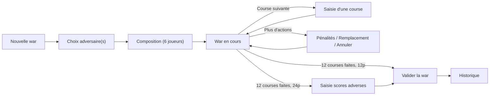

# Documentation fonctionnelle — Stats MKWorld

> Application mobile de suivi des statistiques de *wars* (matchs d'équipe) pour **Mario Kart World**.
> Ce document décrit l'application du point de vue de l'utilisateur, écran par écran, avec les règles métier encodées. Volet architecture : [TECHNICAL.md](TECHNICAL.md).

## Sommaire

1. [À qui s'adresse l'application](#1-à-qui-sadresse-lapplication)
2. [Concepts clés & vocabulaire](#2-concepts-clés--vocabulaire)
3. [Rôles & permissions](#3-rôles--permissions)
4. [Onboarding & connexion](#4-onboarding--connexion)
5. [Accueil & navigation](#5-accueil--navigation)
6. [Cycle de vie d'une war](#6-cycle-de-vie-dune-war)
7. [Historique & détails](#7-historique--détails)
8. [Statistiques](#8-statistiques)
9. [Annuaire & profils](#9-annuaire--profils)
10. [Tableau partageable (PDF)](#10-tableau-partageable-pdf)
11. [Paramètres, données & mode debug](#11-paramètres-données--mode-debug)
12. [Récapitulatif des règles métier](#12-récapitulatif-des-règles-métier)

---

## 1. À qui s'adresse l'application

Aux **équipes compétitives de Mario Kart World** qui disputent des *wars* et veulent en conserver une trace structurée et des statistiques détaillées (par joueur, équipe, adversaire, circuit).

Prérequis utilisateur :
- Être inscrit sur **MKCentral** (registre communautaire des joueurs/équipes MK).
- Avoir un **compte Discord lié à MKCentral** (utilisé pour l'identification).

---

## 2. Concepts clés & vocabulaire

| Terme | Définition |
|---|---|
| **War** | Un match entre équipes, composé d'une série de courses (12 en général). |
| **12 joueurs** | Format 6 v 6 : l'équipe affronte **un** adversaire. |
| **24 joueurs** | Format tournoi : l'équipe affronte **trois** équipes adverses ; les scores finaux sont saisis manuellement. |
| **Course / Track** | Une course sur un circuit, avec les positions d'arrivée des joueurs. |
| **Intermission** | En 24 joueurs, segment alternatif du monde ouvert enchaîné à un circuit (un track peut alors porter 2 circuits). |
| **Position → points** | Chaque place d'arrivée rapporte des points (1ʳᵉ = 15 pts). |
| **Pénalité** | Retrait de points (−10, −15, −20) imputé à une équipe. |
| **Shock** | L'objet **éclair** récupéré en jeu, stratégiquement décisif. Compté par joueur sur une course pour produire des statistiques dédiées (n'affecte pas le calcul du score). |
| **Équipe** | Entité MKCentral complète (identifiant `teamId`), pouvant regrouper plusieurs rosters. Les joueurs y sont rattachés. |
| **Roster** | Composition inscrite sur MKCentral (identifiant `rosterId`) ; une équipe peut en avoir plusieurs. C'est à ce niveau que se rattachent les wars. |
| **Allié** | Joueur de renfort hors roster officiel (rosterId interne `-1`), pouvant participer aux wars. |
| **Multi-roster** | Option : calculer les stats sur tous les rosters de l'équipe ou seulement le sien. |
| **Mode matrix** | Mode debug permettant de simuler les données d'un autre joueur. |

**Scoring synthétique :**
- **12 joueurs** : 82 points distribués par course ; score adverse = 82 − score équipe ; total war 12 courses = 984 (équilibre à 492). L'affichage met en avant l'**écart** (`+/−`) par rapport à l'équilibre.
- **24 joueurs** : 144 points par course ; total war 12 courses = **1728** (valeur de contrôle à la saisie des scores). L'affichage montre les **scores absolus** (pas d'écart `+/−`), le classement se faisant entre 4 équipes.

Détails du barème position→points : voir [TECHNICAL.md §8](TECHNICAL.md#8-algorithmes-de-scoring).

---

## 3. Rôles & permissions

Le rôle est un entier stocké par joueur :

| Rôle (`role`) | Niveau | Peut faire |
|---|---|---|
| **2** | Leader / Manager | Tout : créer des wars, gérer rosters & alliés, changer les rôles des membres |
| **1** | Admin | Créer/gérer des wars, basculer le rôle d'un membre |
| **0** | Membre | Consulter, participer aux wars (pas de création) |

Le rôle ne dépend que de la gestion explicite des rôles (et du statut leader/manager détecté dans le roster MKCentral) : **le cycle de vie d'une war — création, validation, annulation, remplacement de joueur — ne le modifie jamais** (cf. audit B10). Un **allié** (joueur hors équipe) a toujours le rôle `0` : ne faisant pas partie de l'équipe, il ne peut pas la modérer.

Gating concret :
- Le bouton **« Nouvelle war »** n'apparaît que si `role > 0` **ou** le mode matrix est actif (et qu'aucune war n'est en cours).
- Le bouton **« Ajouter en allié »** apparaît si le joueur consulté n'est pas dans l'équipe, n'est pas soi-même, et n'est pas déjà allié.
- Le bouton **« Basculer le rôle »** apparaît si un leader consulte un membre de l'équipe qui n'est ni lui-même ni déjà leader.
- L'accès à l'**écran debug** est réservé (utilisateur de référence id `18595` ou mode matrix actif).

---

## 4. Onboarding & connexion

Écran `Signup` : un pager de 7 pages (`TutorialItem`) piloté par `SignupViewModel` (état `currentPage`, `code`).

| Page | Contenu | Action |
|---|---|---|
| **START** | Présentation de l'app et des prérequis (MKCentral + Discord lié) | Continuer |
| **OPEN_APP** | Autoriser l'ouverture des liens `statsmkworld.com` (Android 12+) | Ouvrir les réglages |
| **NOTIFICATIONS** | Autoriser les notifications (Android 13+) | Activer (déclenche la demande de permission) |
| **AUTH** | Connexion Discord (OAuth2) | Se connecter (ouvre l'autorisation Discord) |
| **FIND_PLAYER** | « Récupération de ton profil… » (fetch MKCentral) | Auto |
| **WELCOME** | Succès — redirection auto vers l'accueil | Auto (~2 s) |
| **ERROR** | Échec : Discord non lié à MKCentral / erreur serveur / réseau | Réessayer (revient à AUTH) |

**Flux technique** : au retour OAuth (deep link portant `code`), l'app échange le code contre un token, récupère l'utilisateur Discord, retrouve le joueur sur MKCentral via son `discord_id`, effectue une **connexion anonyme Firebase** (UID technique pour autoriser l'accès RTDB, transparent pour l'utilisateur ; échec réseau non bloquant), puis enchaîne `fetchData` (joueur → équipe → alliés → équipes → wars). Le joueur est enregistré en DataStore et un `User` Firebase est créé (role 0, sauf si leader détecté dans le roster). La connexion anonyme est aussi re-tentée à chaque démarrage si l'UID a été perdu (ex. après réinstallation).

---

## 5. Accueil & navigation

`HomeScreen` = conteneur à **trois onglets** (barre du bas), avec conservation d'état entre onglets.

### Onglet 1 — Accueil (`WelcomeScreen`)
État : `teamName/teamLogo`, `playerName/playerLogo`, `buttonVisible`, `currentWar`, `wars` (5 derniers), `is24PEnabled`.

- Cartes **joueur** et **équipe** (cliquables → profils).
- Sélecteur **12 joueurs / 24 joueurs** (`onWarTypeSwitch`) — filtre tout le contenu (wars affichées, point d'entrée stats).
- Bouton **« Nouvelle war »** si `buttonVisible` (role > 0 ou matrix) **et** aucune war en cours.
- Carte **war en cours** si présente (→ reprend la war).
- **Derniers résultats** : 5 wars filtrées par mode (`teamOpponent.size` = 1 pour 12p, > 1 pour 24p) ; bouton « voir plus » → historique.

### Onglet 2 — Statistiques (`StatsMenuScreen`)
Sélecteur 12/24 joueurs, puis 5 entrées :
1. **Statistiques individuelles** → `PlayerStats(currentPlayerId, is24p)`
2. **Statistiques de l'équipe** → `TeamStats(is24p)`
3. **Statistiques des joueurs** → classement `TeamStats`
4. **Statistiques des adversaires** → classement `OpponentStats`. Les wars étant rattachées au **rosterId** adverse, le classement compte **un item par roster** : une équipe à plusieurs rosters apparaît en autant de lignes (chacune avec ses propres wars), affichées avec le **nom/tag du roster** et l'avatar de l'équipe. Un clic ouvre le détail filtré sur ce roster. Les wars anciennes sans granularité roster restent regroupées sous un item de niveau équipe.
5. **Statistiques des circuits** → classement `MapStats(userId, teamId)`

### Onglet 3 — Annuaire (`RegistryScreen`)
Sélecteur **Joueurs / Équipes** :
- **Joueurs** : recherche déclenchée à partir de **3 caractères** ; pagination de toutes les pages MKCentral. Clic → profil joueur.
- **Équipes** : filtre local par nom/tag (insensible à la casse). Clic → profil équipe.

---

## 6. Cycle de vie d'une war

### Étape 1 — Choix de l'adversaire (`AddWarScreen`, page 1)
- **12 joueurs** : sélectionner **1** équipe. **24 joueurs** : sélectionner **3** équipes.
- Recherche par nom/tag ; emplacements visuels pour les équipes choisies.
- **Sélection du roster adverse** : à chaque équipe choisie, l'app récupère ses rosters MK World.
  - **Un seul roster** → il est retenu automatiquement, sans étape supplémentaire.
  - **Plusieurs rosters** → un **bottomSheet** s'ouvre : liste des rosters (nom + tag), preview du roster sélectionné, bouton « Suivant » actif une fois un roster choisi. En 24p, l'étape se répète pour chaque équipe adverse ayant plusieurs rosters.
- L'emplacement de l'adversaire sélectionné affiche le **nom du roster** (avatar de l'équipe).
- Bouton « Suivant » actif quand le bon nombre d'équipes est sélectionné (`nextButtonEnabled`). Le bouton retour ferme d'abord le bottomSheet s'il est ouvert, sinon retire la dernière équipe sélectionnée.
- Nom de war affiché avec les **tags des rosters** : `TAG_rosterHôte - TAG_rosterAdv1 - TAG_rosterAdv2 …`.

### Étape 2 — Composition (`AddWarScreen`, page 2)
- Joueurs **groupés par roster** (en-têtes collants ; en-tête vide = alliés).
- Sélection de joueurs, mise en évidence des sélectionnés.
- Bouton **« Commencer »** actif quand **exactement 6** joueurs sont sélectionnés.
- À la création : `War(id = now, teamHost = rosterId, teamOpponent = [rosterId…], scores = [WarScore(0)…])` — `teamOpponent` contient désormais le(s) **rosterId** choisi(s) à l'étape 1 (et non le teamId) ; le `currentWar` de chaque joueur est mis à jour en DB **et** Firebase (les alliés `rosterId = -1` vont dans `newAllies`, les autres dans `users`).

### Étape 3 — War en cours (`CurrentWarScreen`)
> Hôte comme adversaires sont affichés avec le **nom et le tag de leur roster** (l'**avatar** reste celui de l'équipe principale). Idem sur le résumé/détail de war et les cellules de war.

Pager :
- **Page principale** : `WarScoreView` (scores + pénalités), `WarPlayersCell` (composition), et selon l'état :
  - **« Course suivante »** si la war n'est pas finie ;
  - **« Scores adversaires »** si 24p et 12 courses faites ;
  - **« Valider la war »** si 12p et 12 courses faites ;
  - **« Plus d'actions »**.
  - Grille des courses jouées (bordure verte si `+`, rouge si `−` en 12p ; transparente en 24p). Clic → détail de la course.
- **Page scores adversaires (24p)** : un champ par équipe adverse ; le **total doit valoir 1728** (12 × 144), pénalités exclues ; toast d'erreur indiquant les points manquants/en trop. À la validation, les pénalités sont déduites avant écriture.

`isOver` = `tracks.size == 12`. `buttonsVisible` = une war en cours existe en DataStore.

### Étape 4 — Saisie d'une course (`AddTrackScreen`, pager 4 pages)
1. **Circuit** : grille des 30 circuits, recherche par nom/label.
2. **Intermission (24p)** : choisir un circuit alternatif parmi `Maps.intermissionsTo(...)` ; resélectionner le même circuit l'annule.
3. **Positions** : pour chaque joueur (cycle auto), sa place (1–12 ou 1–24) ; les positions déjà prises sont masquées. Cellules plus petites en 24p.
4. **Récapitulatif** : positions + score de la course. En 12p : `score - adverse` (sur 2 chiffres) et `+/−diff`. En 24p : progression `score actuel -> nouveau score`. Possibilité d'**ajouter/retirer des shocks** par joueur. « Confirmer » écrit le `WarTrack` (indices du/des circuit(s), positions, shocks) dans Firebase et met à jour les scores.

### Étape 5 — Plus d'actions (`CurrentWarActionsScreen`, 3 onglets)
- **Pénalités** : grille `−10 / −15 / −20` par équipe ; **une seule pénalité par équipe** à la fois ; « Valider » applique et déduit du score de l'équipe visée.
- **Remplacement** : sélectionner 1 joueur sortant (composition actuelle) + 1 entrant (banc) ; « Remplacer » met à jour `currentWar` des deux joueurs (DB + Firebase).
- **Annuler la war** : abandon complet (réinitialise `currentWar` de tous les joueurs, supprime `currentWars/{rosterId}`, vide le DataStore) ; confirmation requise.

### Étape 6 — Validation finale
`onValidateWar()` : écrit la war dans l'historique Firebase (`wars/{rosterId}/{id}`), réinitialise les `currentWar`, supprime la war en cours, revient à l'accueil. En 24p, la validation des scores (`onValidateScore`) précède.

---

## 7. Historique & détails

### Liste des wars (`WarListScreen`)
- Wars **groupées par mois** (`Pair("Mois AAAA", [WarDetails])`), triées du plus récent au plus ancien, en-tête collant avec compte.
- Filtrées par mode (12/24) **et** par multi-roster (si désactivé : seulement `teamHost == rosterId`).
- Clic → détail.

### Détail d'une war (`WarDetailsScreen`)
- `WarScoreView` (scores finaux), `WarPlayersCell` (composition, scores par joueur), `roster`.
- Bouton **« Tab »** (12p uniquement) → génération du tableau partageable.
- Grille des courses (bordure colorée 12p / transparente 24p) ; clic → détail de la course.

### Détail d'une course (`TrackDetailsScreen`)
- Circuit, score (`points - adverse` en 12p, `trackScore` en 24p), `+/−diff` (12p), positions de chaque joueur + shocks.
- Bouton **« Éditer »** si la course appartient à la war en cours (`editing` et war en cours existante).

### Édition d'une course (`EditTrackScreen`, 3 onglets)
- **Circuit** / **Positions** / **Shocks**. Le bouton de validation s'active si le circuit, les positions ou les shocks ont changé. Logique conditionnelle : mise à jour du circuit seul, des positions (exactement 6 saisies), des shocks seuls, ou combinaison ; le score de la war est recalculé sur l'ensemble des courses puis réécrit.
- Onglet **Positions** : ré-attribution joueur par joueur (nom du joueur courant + grille de positions cliquables). Une fois **toutes les positions ré-attribuées** (autant de positions saisies que de joueurs, dernier joueur inclus), la grille est remplacée par un **récapitulatif** en lecture seule (`VerticalGrid` de `PlayerCell` : joueur, position, shocks existants), réutilisant les mêmes composants que la page « Résumé » de l'ajout d'une course. La `MapCell` n'y est pas affichée (le circuit se modifie dans l'onglet dédié) et les shocks restent en lecture seule (édités dans l'onglet Shocks). Les boutons Confirmer / Annuler, communs aux onglets, restent en bas.

---

## 8. Statistiques

Les stats se déclinent par **format** (12/24) et souvent par **Individuel / Équipe**. Type porté par la classe scellée `StatsType` : `PlayerStats`, `TeamStats`, `OpponentStats`, `MapStats`.

### Écran de stats (`StatsScreen`)
Sections affichées selon le type :
- Cellule joueur / équipe / circuit en tête.
- `MKWarStatsView` : bilan global de wars.
- `MKWarDetailsStatsView` : détails (extrêmes, moyennes…).
- `MKPlayerScoreCell` : répartition des points par joueur (masqué pour `MapStats`).
- Historique des 5 dernières wars (pour `OpponentStats`).
- `MKTeamStatsView` (pour `PlayerStats` et `TeamStats`).
- `MKMapsStatsCell` (masqué pour `MapStats`).
- `MKTopBottomCell` : tops/bottoms d'équipe et positions individuelles.

### Statistiques individuelles (joueur)
Bilan V/N/D, taux de victoire, score moyen/circuit, position moyenne, circuit le plus joué, meilleur/pire circuit, plus grosse victoire, meilleur/pire score, pire défaite, nombre de wars et de circuits, meilleurs/pires résultats face aux adversaires, tableau par circuit, historique.

### Statistiques d'équipe
Mêmes agrégats au niveau équipe + détail par joueur.

### Classements (`StatsRankingScreen`)
- **Adversaires / Circuits** : sélecteur **Individuel / Équipe**, recherche (nom d'équipe ou de circuit), tri. Grille de `TeamCell`/`MapCell`. Clic → écran de stats détaillé correspondant.
- **Joueurs** : liste pré-calculée groupée par roster (en-têtes collants), grille de cellules joueur. Clic → stats individuelles.
- **Tri** (`SortType`) : `OCCURENCES` (wars jouées, desc), `NAME` (nom, asc), `WINRATE` (taux, desc), `AVERAGE` (points/position moyens, desc).

Sources : les classements sont pré-calculés par `InitStatsWorker` et lus depuis le cache (`opponentRankList`/`playerOpponentRankList`, `trackRankList`/`playerTrackRankList`, `playersRankList`).

---

## 9. Annuaire & profils

### Profil joueur (`PlayerProfileScreen`)
- Avatar, drapeau pays, nom, bio (MKCentral) ; date d'inscription, friend code, tag Discord, équipe + date d'arrivée, **badge de rôle**.
- **Bouton « Ajouter en allié »** (selon gating §3) ; message « Allié » si déjà allié ; **bouton « Basculer le rôle »** (leader uniquement).
- **Menu visible uniquement sur son propre profil** (`id == "me"`) :
  - **Rafraîchir** (relance `fetchData`, met à jour `lastUpdate` affiché `dd/MM/yyyy - HH:mm`).
  - **Notifications** (interrupteur ; demande la permission au besoin).
  - **Multi-roster** (interrupteur ; **nécessite un redémarrage** pour s'appliquer).
  - **Déconnexion** (confirmation → vide DB/DataStore, révoque le token Discord, retour à `Signup`).
  - **Debug** (visible si id `18595` ou matrix).

### Profil équipe (`TeamProfileScreen`)
Si c'est **sa** propre équipe (`id == "me"`), 3 contenus :
- **Membres** : groupés par roster (en-têtes si plusieurs), clic → profil joueur.
- **Alliés** : bouton « Ajouter un allié » (si role > 0) ouvrant une bottom sheet de recherche (≥ 3 caractères, pagination MKCentral, exclut les alliés déjà présents).
- **Stats** d'équipe.

Pour une autre équipe : vue simple (rosters + joueurs), sans gestion d'alliés.

---

## 10. Tableau partageable (PDF)

Écran `EditTabScreen` (depuis le détail d'une war 12p, bouton « Tab ») : génère une **image de tableau récapitulatif**.

- Texte d'explication ; **+/−** pour ajuster le nombre de lignes adverses (**6 à 9**, défaut 6) ; pour chaque ligne, un champ nom + un champ score.
- **« Tab classique »** : valide que la somme des scores adverses saisis = `scoreOpponent` calculé (sinon toast d'écart), puis génère le PDF (détails de war, scores équipe/joueur/adversaire, pénalités incluses) et émet l'`Uri` pour partage.
- **« Tab détaillé »** (ajoute courses, shocks, courbe de progression) — **commenté dans le code** (`EditTabScreen`), donc **absent de l'UI** actuelle.

Le rendu et l'enregistrement (galerie / partage) sont décrits dans [TECHNICAL.md §15](TECHNICAL.md#15-génération-pdf).

---

## 11. Paramètres, données & mode debug

- **Notifications** : informent de la fin des traitements (ex. « Données mises à jour »). Activables depuis le profil.
- **Multi-roster** : périmètre de calcul des stats (tous les rosters vs le sien).
- **Synchronisation** : tâche de fond quotidienne (~4 h) rafraîchissant les données ; rafraîchissement manuel depuis le profil.
- **Fonctionnement hors-ligne** : données en cache local (Room/DataStore), wars synchronisées via Firebase (la war en cours est écoutée en temps réel).

### Écran debug (`DebugScreen`) — réservé
1. **Update Tags** — pousse les tags d'équipes vers Firebase.
2. **Update LariisBot Data** — rafraîchit pour chaque utilisateur d'équipe ses infos Discord/nom depuis MKCentral.
3. **Update Transferts** — réconcilie les rosters (entrées/sorties de joueurs, alliés).
4. **Migrer les adversaires (teamId → roster)** — action manuelle et idempotente : réécrit dans l'historique Firebase le `teamId` d'un adversaire en `rosterId`, **uniquement** pour les équipes possédant un seul roster mkworld (cas non ambigu). Fusionne le doublon « équipe legacy + roster » d'une même équipe mono-roster dans le classement adverse. Les équipes multi-rosters et la war en cours ne sont pas touchées.
5. **Test MKWR** — charge les records du monde (scraping `mkwrs.com`).
6. **Test Notif** — envoie une notification de test (si activées).
7. **Mode Matrix** — simule un autre joueur : entrée par id (charge ses données et passe `matrixMode = true`), sortie (recharge le joueur de référence `18595`, `matrixMode = false`).

---

## 12. Récapitulatif des règles métier

| Domaine | Règle |
|---|---|
| **Format** | `teamOpponent.size == 1` ⇒ 12 joueurs ; `> 1` (3) ⇒ 24 joueurs. Sélecteur sur l'accueil et le menu stats. |
| **Composition** | Exactement **6 joueurs** sélectionnés pour démarrer ; substitutions possibles en cours de war. |
| **Adversaires** | 1 équipe (12p) ou 3 équipes (24p) à sélectionner. |
| **Scoring 12p** | Position→points (1ʳᵉ = 15) ; score adverse = 82 − score équipe ; pénalités déduites des totaux. |
| **Scoring 24p** | 144 pts/course ; scores finaux **saisis manuellement**, total de contrôle **1728** ; victoire = top 2 des scores. |
| **Pénalités** | −10, −15, −20 ; une par équipe ; déduites avant l'écriture finale. |
| **Shocks** | Objet éclair obtenu en jeu (item stratégique majeur) ; compté par joueur/course pour des statistiques dédiées, sans impact sur le calcul du score. |
| **Alliés** | `rosterId = -1` ; stockés dans `newAllies` Firebase ; ajoutables depuis l'annuaire ou le profil d'équipe. |
| **Rôles** | 2 = leader/manager, 1 = admin, 0 = membre ; gating des actions (cf. §3). |
| **Multi-roster** | Active/désactive l'agrégation des stats sur tous les rosters ; redémarrage requis. |
| **War en cours** | Une seule à la fois, écoutée en temps réel ; terminée à 12 courses. |
| **Équipe « 6v6 Squad »** | Équipe synthétique (`SQ`, id `123456789`) injectée localement pour les matchs amicaux. |

---

*Détails techniques (modèles, algorithmes, intégrations) : [TECHNICAL.md](TECHNICAL.md).*
