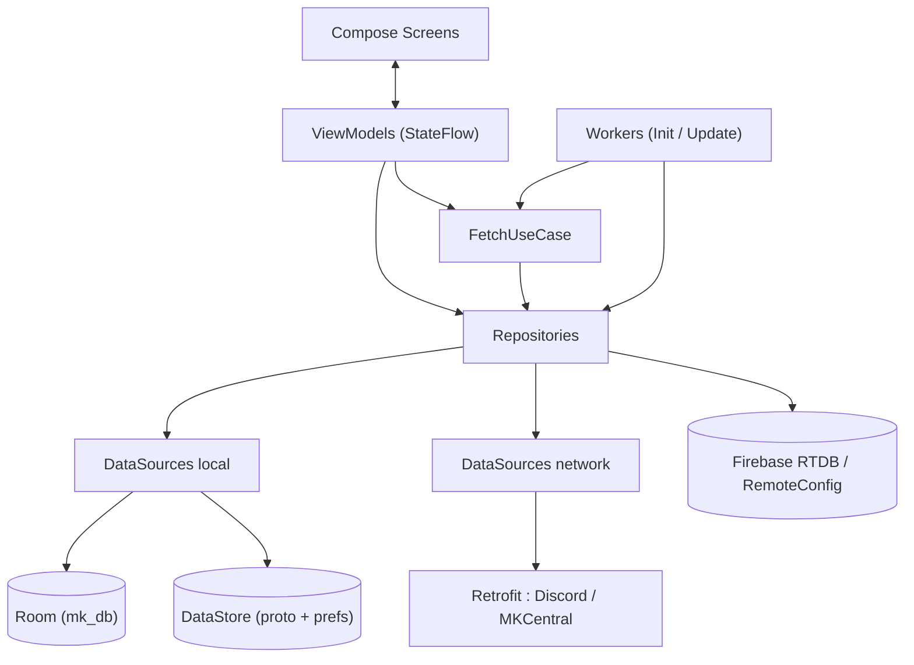

# Documentation technique — Stats MKWorld

> Application Android de suivi statistique des *wars* (matchs d'équipe) Mario Kart World.
> Version 3.0.0 — `versionCode` 23 — package `fr.harmoniamk.statsmkworld`.
> Document de référence pour l'architecture, les modèles, les algorithmes et les intégrations. Volet utilisateur : [FUNCTIONAL.md](FUNCTIONAL.md).

## Sommaire

1. [Vue d'ensemble](#1-vue-densemble)
2. [Stack & dépendances](#2-stack--dépendances)
3. [Architecture générale](#3-architecture-générale)
4. [Injection de dépendances (Hilt)](#4-injection-de-dépendances-hilt)
5. [Démarrage & navigation](#5-démarrage--navigation)
6. [Modèle de données : les trois couches](#6-modèle-de-données--les-trois-couches)
7. [Le domaine « War » en détail](#7-le-domaine-war-en-détail)
8. [Algorithmes de scoring](#8-algorithmes-de-scoring)
9. [Moteur de statistiques](#9-moteur-de-statistiques)
10. [Persistance](#10-persistance)
11. [Repositories](#11-repositories)
12. [Data sources & APIs](#12-data-sources--apis)
13. [Le UseCase de synchronisation](#13-le-usecase-de-synchronisation)
14. [Tâches de fond (WorkManager)](#14-tâches-de-fond-workmanager)
15. [Génération PDF](#15-génération-pdf)
16. [Notifications](#16-notifications)
17. [Records du monde (scraping)](#17-records-du-monde-scraping)
18. [Build, signature & configuration](#18-build-signature--configuration)
19. [Sécurité & secrets](#19-sécurité--secrets)
20. [Annexe : circuits (enum Maps)](#20-annexe--circuits-enum-maps)

---

## 1. Vue d'ensemble

Stats MKWorld permet à des équipes compétitives de Mario Kart World d'enregistrer leurs *wars* course par course et d'en dériver des statistiques riches. L'app est *offline-first* (cache Room + DataStore) mais synchronise les wars en temps réel via Firebase.

Trois systèmes externes alimentent l'app :

- **MKCentral** (`mkcentral.com`) — registre communautaire : identité du joueur, équipes, rosters. Aucune authentification.
- **Discord OAuth2** — authentification de l'utilisateur (le `discord_id` sert à retrouver le joueur sur MKCentral).
- **Firebase Realtime Database** — source de vérité des wars (live + historique), des utilisateurs d'équipe et des alliés.

Un quatrième, **`mkwrs.com`**, est scrapé (Jsoup) pour les records du monde (fonction debug).

| Paramètre | Valeur |
|---|---|
| `applicationId` | `fr.harmoniamk.statsmkworld` (suffixe `.debug` en debug) |
| `minSdk` / `targetSdk` / `compileSdk` | 28 / 35 / 35 |
| Langage / JVM | Kotlin 2.2.20 / Java 17 |
| Projet Firebase | `stats-mkworld` — RTDB région `europe-west1` |
| Base de données Room | `mk_db`, version 5, `fallbackToDestructiveMigration()` |
| MultiDex | activé |

---

## 2. Stack & dépendances

Versions centralisées dans `gradle/libs.versions.toml` (version catalog).

| Domaine | Bibliothèques |
|---|---|
| UI Compose | BOM 2025.06.01, Material3, Navigation Compose 2.9, Accompanist Pager 0.28, Coil 2.1, Lottie 4.0, MPAndroidChart 3.1, `lifecycle-runtime-compose` (`collectAsStateWithLifecycle`) |
| Vues XML | ViewBinding + DataBinding (uniquement pour le rendu PDF via `tab_pdf.xml` / `detailed_tab_pdf.xml`) |
| DI | Hilt/Dagger 2.57, `hilt-navigation-compose`, `hilt-work` (compiler 1.3) |
| Async | Coroutines + Flow (opt-in `@ExperimentalCoroutinesApi`, `@FlowPreview`) |
| Réseau | Retrofit 2.11, OkHttp 4.12, Moshi 1.15 (codegen KSP) |
| Scraping | Jsoup 1.21.2 |
| Persistance | Room 2.8.4 (KSP), Proto DataStore + Preferences DataStore 1.1.7, Protobuf Lite 3.25 |
| Firebase | BOM 34.15 : Realtime Database, Auth (anonyme), Remote Config, Crashlytics, Analytics |
| Background | WorkManager 2.10 |
| Divers | core-splashscreen, kotlinx-serialization-json |

Plugins Gradle : `com.android.application`, `kotlin.android`, `ksp`, `dagger.hilt`, `kotlin.compose.compiler`, `google-services` 4.4.3, `protobuf` 0.9.4, `firebase.crashlytics`, `kotlin.parcelize`.

---

## 3. Architecture générale

Pattern **MVVM en couches**, flux unidirectionnel, entièrement réactif (Flow), câblé par Hilt.



Règles transverses :

- **Distinction réactif vs one-shot** (depuis la migration Flow→suspend) :
  - Restent en `Flow` les flux réellement **réactifs** : lectures Room streaming (`getPlayers/getPlayer/getTeams/getTeam/getWars/getWar`), le listener temps réel `FirebaseRepository.listenToCurrentWar`, et les `Flow` DataStore.
  - Sont des **`suspend fun`** les opérations **one-shot** : data sources réseau (MKCentral/Discord → `NetworkResponse<T>`, cf. §12), écritures/mutations de `DatabaseRepository` (sous `withContext(Dispatchers.IO)`) et lectures `.get()` + écritures de `FirebaseRepository`.
- Un écran = un dossier `screen/<feature>/` avec `<Feature>Screen.kt` (Composable) + `<Feature>ViewModel.kt`.
- Composants UI maison préfixés `MK` (`ui/MKButton.kt`, `MKText`, `MKDialog`, `MKTextField`, `MKSegmentedSelector`, `MKLoaderDialog`, `MKBottomSheet`…). Cellules de liste dans `ui/cells/`, widgets de stats dans `ui/stats/`.
- `ui/MKBottomSheet.kt` : wrapper à slots autour du `ModalBottomSheetLayout` de **Material2** (pas de migration Material3). Paramètres : `sheetState`, `sheetContent` (contenu personnalisé du sheet), `content` (corps de l'écran englobé) et `onBack` optionnel (gère le `BackHandler` : ferme le sheet si visible, sinon délègue). Le pilotage de la fermeture par un flux `onDismiss` côté ViewModel reste à la charge de l'appelant. Utilisé par `TeamProfileScreen` (ajout d'un ally) et par `AddWarScreen` (sélection du roster adverse quand l'équipe en compte plusieurs ; `onBack = null`, la fermeture étant pilotée par le `BackHandler` de l'écran et les flux `openRosterSheet`/`dismissRosterSheet` du ViewModel).

### Performance Compose — passe « fluidité »

Une passe transverse d'optimisation des recompositions (B1→B6, complétée par le découpage D20) a établi des conventions à respecter pour tout nouvel écran ou composant. Les points d'audit détaillés vivent dans `docs/AUDIT.md` (D20, « Passe fluidité Compose »).

- **Clés de liste** : sur tout `items(...)`/`itemsIndexed(...)` de `LazyColumn`/`LazyRow`/`LazyGrid`, utiliser un identifiant **primitif stable** (`key = { it.war.id }`, `{ it.id }`, `it.name` pour un enum). Les listes non réordonnables et les grilles de positions saisie (`items(count)`) **conservent l'index par défaut** (pas de `key`). Une clé ne doit jamais être un objet métier / `data class` (crash `Bundle`) ni recalculée à chaque frame (`UUID.randomUUID()`). Cf. rule `.claude/rules/10-ui-compose.md`.
- **Sortir les calculs lourds de la composition** : tris/filtres/sommes mémoïsés via `remember(clés)` (ex. `WarScoreView` : shocks, pénalités groupées par équipe, scores triés) et état dérivé via `derivedStateOf` (ex. `Set` de positions sélectionnées dans `AddTrackScreen`/`EditTrackScreen`).
- **Choix du type de `State`** : `mutableStateOf` (état local possédé, `rememberSaveable` s'il doit survivre à la rotation) vs `derivedStateOf` (dérivation d'un `State` **qui change vite**, sortie rare) vs `val` calculé (dérivation simple, entrée ≈ sortie en fréquence). `derivedStateOf` n'apporte rien s'il enveloppe une valeur dérivée de `state.value` dans un bloc qui lit déjà `state.value` largement → préférer un `val` ou extraire un sous-composable. Cf. rule `.claude/rules/11-compose-state.md`.
- **Découpage en sous-composables privés à paramètres stables** : les gros composables monolithiques sont scindés en sections privées recevant des **valeurs déjà calculées** (pas de `filter`/`sortedBy`/`sumOf` à l'intérieur), pour scoper les recompositions à la section dont l'état change. Exemples : `WarScoreView` → `WarScore24pView`/`WarScore12pView` + `PenaltiesSection`/`ShocksSection` ; `CurrentWarScreen`, `TeamProfileScreen`, `AddWarScreen` → header/listes/sections d'action extraits. Extraction **iso-fonctionnelle stricte** (aucun changement de rendu).
- **Collecte de flux liée au cycle de vie** : `collectAsStateWithLifecycle()` (dépendance `androidx.lifecycle:lifecycle-runtime-compose`) plutôt que `collectAsState()`. Regrouper les `LaunchedEffect(Unit)` multiples en un seul effet clé sur le `viewModel`, avec un `launch` par flux.

---

## 4. Injection de dépendances (Hilt)

**Convention récurrente** (à reproduire pour toute nouvelle dépendance) : interface + impl `@Inject constructor` + module imbriqué `@Binds` en `@Singleton`.

```kotlin
interface FooRepositoryInterface { fun bar(): Flow<…> }

class FooRepository @Inject constructor(/* deps */) : FooRepositoryInterface { /* … */ }

@Module
@InstallIn(SingletonComponent::class)
interface FooModule {
    @Singleton @Binds
    fun bind(impl: FooRepository): FooRepositoryInterface
}
```

- Tout est `@Singleton` (repositories, data sources, APIs, `FetchUseCase`).
- **Workers** : `@HiltWorker` + `@AssistedInject constructor(... @Assisted context, @Assisted params)`.
- **ViewModels** : `@HiltViewModel`. Ceux qui ont besoin de paramètres runtime exposent une `@AssistedInject Factory`, consommée via `hiltViewModel(creationCallback = { f -> f.create(...) })` dans `RootScreen.kt`.
- `MainApplication` est `@HiltAndroidApp` et implémente `Configuration.Provider` pour fournir la `HiltWorkerFactory` à WorkManager (l'initializer par défaut est désactivé dans le `AndroidManifest`).

---

## 5. Démarrage & navigation

### `MainViewModel` — choix du `startDestination`

```kotlin
val player = dataStoreRepository.mkcPlayer.firstOrNull()
when {
    remoteConfigRepository.minimumVersion() > BuildConfig.VERSION_CODE -> needUpdate = true
    player?.id != 0L  -> startDestination = "Home"
    else              -> startDestination = "Signup"
}
```

`processIntent` extrait le `code` OAuth d'un deep link `statsmkworld.com?...=code` (split sur `?` puis `=`) et force `Signup`. `initStats()` lance `InitStatsWorker` (one-time, tag `"InitStats"`).

### Graphe `RootScreen.kt`

`NavHost` avec transitions slide (700 ms). Les objets complexes (`WarDetails`, `WarTrackDetails`, `StatsType`) transitent par `savedStateHandle` plutôt que par la route (ils sont `Parcelable`/`Serializable`). `RootScreen` enregistre aussi la tâche périodique `UpdateDataWorker` dans un `LaunchedEffect`.

| Route | Écran | Argument(s) |
|---|---|---|
| `Signup` | Onboarding + Discord OAuth | `code` (clé VM) |
| `Home` | Conteneur 3 onglets (Welcome / Stats / Registry) | — |
| `Home/AddWar/{is24p}` | Choix adversaire(s) + composition | `Bool` |
| `Home/CurrentWar` | War en cours (live) | — |
| `Home/CurrentWar/AddTrack/{is24p}` | Saisie d'une course | `Bool` |
| `Home/CurrentWar/Actions` | Pénalités / remplacements / annulation | — |
| `Home/WarList` | Historique | — |
| `Home/WarDetails` | Détail d'une war | `war` (savedState) |
| `Home/WarDetails/Tab` | Génération du tableau (PDF) | `details` (savedState) |
| `Home/TrackDetails/{editing}` | Détail d'une course | `track` + `Bool` |
| `Home/EditTrack/{is24p}` | Édition d'une course | `track` + `Bool` |
| `Stats` | Stats d'une catégorie | `type: StatsType` |
| `Stats/Ranking` | Classements | `type: StatsType` |
| `Player/Profile/{id}` | Profil joueur (`me` ou id) | `String` |
| `Player/Profile/Debug` | Écran debug | — |
| `Team/Profile/{id}` | Profil équipe | `String` |

`HomeScreen` contient son **propre** `NavHost` à 3 onglets (`BottomNavItem` : WELCOME, STATS, REGISTRY) avec `saveState`/`restoreState`.

**Conventions de performance Compose** (à respecter pour tout nouvel écran/cellule) :

- **Clés de liste** : chaque `items(...)` (colonne/grille) sur données métier reçoit une clé stable — `key = { it.war.id }`, `{ it.id }` (joueurs/équipes), `it.name` pour l'enum `Maps`. La clé doit être un type **stockable dans un `Bundle`** (String/Int/Long/…), **jamais un objet ou une `sealed class`** (sinon crash `Type of the key … is not supported`). Les listes sans id primitif stable ou non réordonnables (pénalités `WarPenalty`, lignes du tab) et les **grilles `items(count)` à plage fixe** (positions de saisie 1..12 / 1..24) conservent l'index par défaut (**pas de `key`** — une clé `it + 1` n'apporte rien et peut régresser la sélection). Ne jamais utiliser une clé recalculée à chaque frame (ex. `UUID.randomUUID()`).
- **Calculs hors composition** : tris, filtres et sommes coûteux sont enveloppés dans `remember(clés)` (ou remontés au ViewModel), pas exécutés en pleine composition. Les valeurs dérivées d'un état qui change plus souvent qu'elles utilisent `derivedStateOf` (ex. `Set` des positions sélectionnées).
- **Cycle de vie** : la collecte d'un `StateFlow` d'écran se fait via `collectAsStateWithLifecycle()` (dépendance `androidx.lifecycle:lifecycle-runtime-compose`), pas `collectAsState()`, pour suspendre la collecte hors écran visible.
- **Effets** : regrouper les collectes de plusieurs `SharedFlow` d'événements dans **un seul** `LaunchedEffect(viewModel)` avec un `launch { … }` par flux, plutôt que plusieurs `LaunchedEffect(Unit)`.

---

## 6. Modèle de données : les trois couches

Un même domaine est représenté **trois fois** ; les conversions se font par constructeurs dédiés. Ne pas les confondre.

| Couche | Localisation | Rôle | Sérialisation |
|---|---|---|---|
| **Firebase** | `model/firebase/` | Source de vérité (RTDB) & objet métier en mémoire | parsing Map manuel (Moshi helpers) |
| **DataStore** | `model/local/Datastore*` | Miroir de la war « en cours » sur disque | Protobuf (`*.pb`) |
| **Présentation** | `model/local/` (`WarDetails`, `Stats`, `TrackStats`…) | Calculs & affichage | — (dérivé) |
| **Room** | `database/entities/` | Cache local des historiques | colonnes + TypeConverters Moshi |
| **Réseau** | `model/network/` | DTO MKCentral & Discord | Moshi (`@Json`) |

### Carte simplifiée des modèles

```
NETWORK (DTO Moshi)            LOCAL / app                  FIREBASE (RTDB · vérité)
model/network/                 model/local/                 model/firebase/

[MKCentral]
  MKCTeam ───────────┐
   └ MKCTeamRoster   ├── conv ──► TeamEntity (Room)
      └ MKCTeamPlayer┘
  MKCPlayer ───────────── conv ──► PlayerEntity (Room) ── conv ──► User
   ├ MKCPlayerRoster                                                ▲
   ├ MKCDiscordInfo              MKCPlayer ───────── conv ──────────┘
   ├ MKCFriendCode
   └ MKCUserSettings
  (chaque MKC* porte son propre .proto ; pas de classe Datastore* intermédiaire)

[Discord / OAuth]  DiscordUser · TokenResponse        (aucun miroir local)

[War — cœur]
  War ◄──── conv ────► DatastoreWar ◄──── .proto ────► WarProto (.pb)   ← war « en cours »
   ├ WarTrack             (miroir DataStore)
   │  ├ WarPosition
   │  └ Shock          War ── wrap ──► WarDetails ──► WarStats ──► Stats
   ├ WarScore                          (présentation / calcul — jamais persisté)
   └ WarPenalty        War ── conv ──► WarEntity (Room · historique)
```

### Chaînes de conversion

- **War** : `Firebase JSON ──parse──► War` ↔ `DatastoreWar` ↔ `WarProto` (war en cours uniquement) ; `War ──► WarEntity` (Room, via TypeConverters) ; `War ──wrap──► WarDetails` (scores calculés).
- **Joueur** : `MKCPlayer`/`MKCTeamPlayer ──► PlayerEntity` (Room) ; `MKCPlayer`/`PlayerEntity ──► User` (Firebase).
- **Équipe** : `MKCTeam`/`MKCTeamRoster ──► TeamEntity` (Room).

Les modèles firebase (`War`, `WarTrack`, `WarPosition`, `WarPenalty`, `WarScore`, `Shock`) sont `@Parcelize`/`Serializable` et possèdent chacun un `constructor(datastore…)`. Les `Datastore*` possèdent un `constructor(firebase…)`, un `constructor(proto…)` et un getter `proto`. À noter : `DatastoreWar` **réutilise directement** les types firebase `WarTrack`/`WarScore`/`WarPenalty` dans ses champs (seuls `DatastoreWarTrack`/`DatastoreWarPosition` sont des classes distinctes). Les DTO `MKCPlayer`/`MKCTeam` portent quant à eux leur sérialisation Protobuf **en interne** (getter `proto` + `constructor(proto…)`, via les `serializers/`), sans classe `Datastore*` dédiée.

### Identité MKCentral : équipe, roster, joueur

Distinction structurante (source de confusion fréquente) :

| Modèle | Identifiant | Représente |
|---|---|---|
| `MKCTeam` | `id` = **teamId** | L'**équipe entière**, qui peut regrouper plusieurs rosters |
| `MKCTeamRoster` | `id` = **rosterId**, `teamId` → `MKCTeam.id` | Un **roster** d'une équipe (vue « équipe »), filtrable par `game`/`mode` |
| `MKCPlayerRoster` | `rosterID`, `teamID` | Le même roster vu **côté joueur** (proto `MKCRosterProto`) |
| `MKCTeamPlayer` | `playerId` | Un joueur listé dans un roster |

- Un roster MK World se filtre par `game == "mkworld"` (filtre répété, cf. audit D28).
- Dans l'app, **les joueurs sont rattachés à leur `teamId`** (consultation de tous les rosters), tandis que **les wars sont rattachées au `rosterId`** (hôte comme adversaire) pour différencier les rosters d'une équipe en multi-roster.
- **Création de war** : l'hôte est enregistré via son `rosterId` (`PlayerEntity.rosterId` mkworld) et, depuis la sélection de roster adverse (`AddWarViewModel`), l'adversaire aussi. À la sélection d'un adversaire, `AddWarViewModel.onTeamSelected()` appelle `mkCentralDataSource.getTeam(teamId)` et filtre `game == "mkworld"` : **un seul roster** → le `rosterId` est retenu directement ; **plusieurs rosters** → un `MKBottomSheet` intermédiaire (`RosterSelectionSheet`) propose la liste des rosters + preview, validée par « Suivant ». Le `rosterId` retenu par adversaire est mémorisé dans `selectedRosterIds` (index aligné sur `teamSelected`, idempotent en 24p) puis écrit dans `War.teamOpponent` par `createWar()`.
- ⚠️ **Résolution downstream** : `War.teamOpponent` contient désormais des `rosterId`, mais les consommateurs (`CurrentWarViewModel`, `WarDetailsViewModel`, `StatsViewModel`, `WarCellViewModel`…) résolvent encore l'adversaire via `databaseRepository.getTeam(it)`, or `TeamEntity` (Room) n'est clé que par `teamId`. La résolution `rosterId → équipe/roster` pour l'affichage et les statistiques reste **à traiter** (tickets de suivi). Voir [AUDIT.md §2 B11](AUDIT.md#2-bugs--correctness).

### ⚠️ Homonyme `WarScore`

Deux classes distinctes portent le nom `WarScore` :
- `model/firebase/WarScore(teamId, score)` — score d'une équipe en mode 24p (source de vérité) ;
- `model/local/Stats.kt → WarScore(war: WarDetails, score: Int)` — score associé à une war pour les **classements** (présentation).

Elles ne sont **pas** interchangeables : vérifier l'`import` lors de toute manipulation de scores (cf. [AUDIT.md §7 G5](AUDIT.md#7-dette-technique--constantes-magiques)).

---

## 7. Le domaine « War » en détail

### Structure

```kotlin
data class War(
    val id: Long,                  // = timestamp de création (Date(id) donne la date)
    val teamHost: String,          // rosterId de l'équipe hôte
    val teamOpponent: List<String>,// 1 adversaire (12p) ou 3 (24p)
    val tracks: List<WarTrack>,
    val penalties: List<WarPenalty>,
    val scores: List<WarScore>     // renseigné en 24p (saisie manuelle)
)
data class WarTrack(val id: Long, val index: List<String>, val positions: List<WarPosition>, var shocks: List<Shock>? = null)
data class WarPosition(val id: Long, val playerId: String, val position: Int)
data class WarPenalty(val teamId: String, val amount: Int)   // amount ∈ {10,15,20}
data class WarScore(val teamId: String, val score: Int)      // 24p — immuable (val)
data class Shock(val playerId: String, val count: Int)       // immuable (val)
```

> Les modèles « source de vérité » sont **immuables** (`val` + `copy`) ; seul `WarTrack.shocks` reste `var` (champ optionnel renseigné après coup). `WarScore`/`Shock` ont été figés en `val` (audit B8).

**`Shock`** : représente l'objet **éclair** récupéré en jeu (item stratégiquement décisif en Mario Kart). Le compteur (`count` par joueur sur une course) sert uniquement à produire des statistiques dédiées — il **n'entre pas** dans le calcul du score d'une course ou d'une war.

**Détermination du mode** : `is24p = teamOpponent.size > 1`. Aucune autre source de vérité — le nombre d'adversaires définit le format partout.

**`WarTrack.index`** : liste d'indices de circuit (`String` → ordinal de l'enum `Maps`). Un seul élément = course « classique » 3 tours ; deux éléments = combo avec **intermission** (mode 24p). `Maps.entries[index.toInt()]` reconstitue le circuit.

**Helpers** :
- `War.hasPlayer(playerId)` : vrai si le joueur a une position sur **toutes** les courses (`tracks.size == tracks.filter{…}.size`).
- `War.hasTeam(teamId)` : `teamHost == teamId || teamOpponent.contains(teamId)`.

### Équipe synthétique « 6v6 Squad »

`FetchUseCase.fetchTeams()` injecte systématiquement une équipe locale `TeamEntity(id="123456789", name="6v6 Squad", tag="SQ", color=null, logo=null)` pour permettre des wars amicales sans adversaire MKCentral réel.

---

## 8. Algorithmes de scoring

Tout est dans `extension/IntegerExtension.kt` (`positionToPoints`, `pointsToPosition`, `*ScoreToDiff`) et appliqué dans `WarDetails`/`WarTrackDetails` (`model/local/WarDetails.kt`). **Les constantes magiques sont centralisées dans `model/ScoringConstants.kt`**, avec une déclinaison par mode (suffixe `_24P`) pour celles dont la valeur diffère entre 12p et 24p — voir le tableau ci-dessous.

### Constantes (`ScoringConstants`)

| Constante | 12p | 24p | Sens |
|---|---|---|---|
| `MAX_POINTS_PER_TRACK_*` | `_12P` = 82 | `_24P` = 144 | total de points d'une course |
| `MID_WAR_SCORE` / `MID_WAR_SCORE_24P` | 492 | 864 | milieu (équilibre) d'une war de 12 courses |
| `MID_TRACK_SCORE` / `MID_TRACK_SCORE_24P` | 41 | 72 | milieu d'une course |
| `TOTAL_24P_SCORE` | — | 1728 | total d'une war 24p (12 × 144) — contrôle de saisie |
| `DEBUG_PLAYER_ID` | `"18595"` | — | joueur de référence (mode matrix) |

La sélection se fait via `when (is24p)` partout où la valeur dépend du mode (`WarTrack.diffScore`, `WarTrackDetails.opponentScore`, `Int.warScoreToDiff/trackScoreToDiff`, `AddTrackViewModel`, `TrackDetailsViewModel`).

### Position → points

| Position | 12 joueurs | 24 joueurs |
|---|---|---|
| 1 | 15 | 15 |
| 2 | 12 | 12 |
| 3 | 10 | 10 |
| 4 | 9 | 9 |
| 5 | 8 | 9 |
| 6 | 7 | 8 |
| 7 | 6 | 8 |
| 8 | 5 | 7 |
| 9 | 4 | 7 |
| 10 | 3 | 6 |
| 11 | 2 | 6 |
| 12 | 1 | 6 |
| 13–15 | — | 5 |
| 16–18 | — | 4 |
| 19–21 | — | 3 |
| 22–23 | — | 2 |
| 24 | — | 1 |

`pointsToPosition` est la fonction inverse (sert aux moyennes ; en 24p plusieurs positions partagent un score donc elle renvoie une **liste**, ex. 9 pts → `[4,5]`).

### Totaux et points d'équilibre

- **12 joueurs** : la somme des 12 places = **82 points** par course (réparti entre les 2 équipes de 6). Donc `scoreOpponent = 82 − scoreHost` par course. Une war de 12 courses totalise **984** points, point d'équilibre **492** (`MID_WAR_SCORE`) ; milieu d'une course **41** (`MID_TRACK_SCORE`).
- **24 joueurs** : la somme des 24 places = **144 points** par course (4 équipes de 6). Une war de 12 courses totalise **1728** points (`TOTAL_24P_SCORE`, valeur utilisée pour la validation de la saisie manuelle des scores) ; équilibre **864** (`MID_WAR_SCORE_24P`), milieu d'une course **72** (`MID_TRACK_SCORE_24P`).

### Calculs dans `WarDetails` (12p)

```kotlin
val scoreHost = warTracks.sumOf { it.teamScore }                       // Σ points de l'hôte
val scoreOpponent = (82 * warTracks.size) - scoreHost
val scoreHostWithPenalties     = scoreHost     - Σ penalties(teamHost)
val scoreOpponentWithPenalties = scoreOpponent - Σ penalties(opponent)
val displayedDiff = (scoreHostWithPenalties - scoreOpponentWithPenalties).let { if (it>0) "+$it" else "$it" }
```

`WarTrackDetails` calcule par course : `teamScore = Σ positionToPoints(is24p)`, `opponentScore = maxPointsPerTrack − teamScore` (si ≠ 0, où `maxPointsPerTrack` vaut 82 en 12p / 144 en 24p), `diffScore = teamScore − opponentScore`, `displayedResult = "$teamScore - $opponentScore"`.

Côté modèle firebase, `WarTrack.diffScore(is24p)` est désormais une **fonction** (et non plus une propriété) appliquant la même logique mode-aware ; les appelants (`LineChartExtension`, `withTrackStats`) propagent `is24p` (audit B5).

### Calculs en 24p

Les scores ne sont pas dérivés des positions mais **saisis manuellement** (`War.scores`). `WarDetails.scores` les trie par score décroissant ; `diffs` calcule les écarts successifs (`"+${current − next}"`). En l'absence de scores, défaut `[0,0,0]`.

### Conversion écart ↔ affichage

```kotlin
fun Int.warScoreToDiff(is24p: Boolean = false): String   // milieu 492 (12p) / 864 (24p) : "+X" / "-X" / "0", X = |score-milieu|*2
fun Int.trackScoreToDiff(is24p: Boolean = false): String // milieu 41  (12p) / 72  (24p) : idem
```

> Ces affichages « écart » ne sont en pratique utilisés qu'en **12p** (en 24p l'UI montre les scores absolus) ; le paramètre `is24p` est propagé par cohérence/robustesse — voir [AUDIT.md G2](AUDIT.md).

### Couleurs

`Int?.toTeamColor()` mappe un index d'équipe (1–39) vers une couleur hex. `Int?.positionColor(is24p)` colore les positions (or/argent/bronze puis dégradé orange).

---

## 9. Moteur de statistiques

Cœur dans `extension/ListExtension.kt` (`withFullStats`, `withTrackStats`, `withFullTeamStats`, `topOpponentByCount`, `sizeOrOne`), `extension/WarExtension.kt` (`War.withPlayersList`), `extension/IntegerExtension.kt` (barème `positionToPoints` / inverse `pointsToPosition`, `*ScoreToDiff`) et les classes de `model/local/` (`Stats.kt`, `WarDetails.kt`). Les résultats des classements globaux sont mis en cache en mémoire par `InitStatsWorker` dans `StatsRepository`.

### 9.0 Données sources et chaîne de transformation

Toutes les stats dérivent en dernier ressort des modèles firebase (source de vérité) :

- **`War`** `(id, teamHost, teamOpponent: List<String>, tracks: List<WarTrack>, penalties: List<WarPenalty>, scores: List<WarScore>)`. `teamOpponent.size == 1` → **war 12p** ; `> 1` (typiquement 3) → **war 24p**.
- **`WarTrack`** `(id, index: List<String>, positions: List<WarPosition>, shocks: List<Shock>?)`. `index` = index(s) de circuit (une valeur pour une course simple, deux pour un combo intermission). En 12p, `positions` ne contient que les **6 joueurs de l'équipe hôte**.
- **`WarPosition`** `(id, playerId, position: Int)` : la place d'arrivée d'un joueur sur la course.
- **`WarScore`** (firebase) `(teamId, score: Int)` : score **saisi manuellement** par équipe, utilisé uniquement en 24p.
- **`WarPenalty`** `(teamId, amount: Int)` : pénalité de points appliquée à une équipe.
- **`Shock`** `(playerId, count: Int)` : nombre d'objets éclair pris par un joueur (métier ; sans impact sur le score).

Les modèles de **présentation/calcul** (`WarDetails`, `WarTrackDetails`, `Stats`, `WarStats`, `MapStats`, `TrackStats`, `TeamStats`, `WarScore` local, `PlayerScore`) se construisent depuis ces objets via les constructeurs et les extensions ci-dessous. La conversion **position → points** est le socle de presque tout calcul (barème §8).

### 9.1 `WarTrackDetails` — statistiques d'une course

`WarTrackDetails(track: WarTrack, is24p: Boolean)`. Depuis l'optimisation A3, les champs de score (`teamScore`, `opponentScore`, `diffScore`, `displayedResult`, `displayedDiff`) sont des **`val` figés** à la construction (dérivés d'attributs immuables) au lieu de getters recalculés à chaque lecture ; seul `index` reste un getter (simple délégation à `track.index`).

| Stat | Comment elle est calculée | Donnée(s) source | Où on la trouve dans l'appli |
|---|---|---|---|
| `index` | `track.index` | `WarTrack.index` | Sert au libellé de circuit dans `ui/cells/MapCell.kt` (cellule circuit, écrans Détail de war et Statistiques de circuit) |
| `teamScore` | `track.positions.sumOf { it.position.positionToPoints(is24p) }` | `WarPosition.position` + barème | Écran Statistiques de circuit / cellule circuit `MapCell.kt` (score par course, ligne 182) ; brique de `WarDetails.scoreHost` |
| `opponentScore` *(privé)* | `maxPointsPerTrack − teamScore` si `teamScore ≠ 0`, sinon `0`. `maxPointsPerTrack` = **82** (12p) / **144** (24p) | `teamScore`, `ScoringConstants.MAX_POINTS_PER_TRACK_*` | Non affiché directement (privé) ; alimente `displayedResult`/`diffScore` |
| `diffScore` *(privé)* | `teamScore − opponentScore` si `opponentScore ≠ 0`, sinon `0` | `teamScore`, `opponentScore` | Non affiché directement (privé) ; alimente `displayedDiff` |
| `displayedResult` | `"$teamScore - $opponentScore"` | ci-dessus | Cellule circuit `MapCell.kt` (ligne 183, score de la course affiché sur l'écran Détail de war) |
| `displayedDiff` | `if (diffScore > 0) "+$diffScore" else "$diffScore"` | `diffScore` | Cellule circuit `MapCell.kt` (ligne 191) ; `WarCellViewModel` (compte des courses gagnées d'une war, ligne 48) ; critère V/N/D par course dans `MapStats` |

> `WarTrack.diffScore(is24p)` (modèle firebase) applique la même logique et sert de critère de victoire par course dans `withTrackStats` (voir 9.5).

### 9.2 `WarDetails` — statistiques d'une war entière

`WarDetails(war: War)`. `warTracks = war.tracks.map { WarTrackDetails(it, war.teamOpponent.size > 1) }`.

**Champs 12 joueurs** (dérivés des positions) :

| Stat | Comment elle est calculée | Donnée(s) source | Où on la trouve dans l'appli |
|---|---|---|---|
| `date` | `Date(war.id).displayedString("dd/MM/yyyy")` | `War.id` (timestamp) | Ligne de la liste des wars (`WarCell`), en-tête écran Détail de war |
| `scoreHost` | `warTracks.sumOf { it.teamScore }` | `WarTrackDetails.teamScore` | Alimente `displayedScore`/`displayedDiff` ; `WarStats.highestVictory`/`loudestDefeat` (fallback 24p → `MKPlayerScoreCell` de l'écran Statistiques) |
| `scoreOpponent` | `82 × warTracks.size − scoreHost` | `scoreHost`, `MAX_POINTS_PER_TRACK_12P` | Alimente `displayedScore` (via version « with penalties ») |
| `scoreHostWithPenalties` | `scoreHost − Σ war.penalties.filter { teamId == teamHost }.amount` | `scoreHost`, `WarPenalty` | `displayedScore` / `displayedDiff` |
| `scoreOpponentWithPenalties` | `scoreOpponent − Σ war.penalties.filter { teamId ∈ teamOpponent }.amount` | `scoreOpponent`, `WarPenalty` | `displayedScore` / `displayedDiff` |
| `displayedScore` | `"$scoreHostWithPenalties - $scoreOpponentWithPenalties"` (val figé, A3) | ci-dessus | `WarScoreView` (score de la war — écrans Détail de war et War en cours, lignes 332) ; ligne de liste `WarCell` (via `WarCellViewModel`, ligne 56) |
| `displayedDiff` | `(scoreHostWithPenalties − scoreOpponentWithPenalties)` → `"+X"` si > 0, sinon `"X"` (`"0"` = nul, préfixe `'-'` = défaite) — val figé, A3 | ci-dessus | `WarScoreView` (écart affiché, ligne 338) ; `WarCell` (ligne 57) ; **critère V/D/N réutilisé partout** (`WarStats`, `MapStats`, `withFullStats`) |

**Champs 24 joueurs** (dérivés des scores saisis) :

| Stat | Comment elle est calculée | Donnée(s) source | Où on la trouve dans l'appli |
|---|---|---|---|
| `scores` | Si `war.scores` vide → `[teamHost] + teamOpponent` avec score `0` ; sinon `war.scores.sortedByDescending { it.score }` | `War.scores`, `teamHost`, `teamOpponent` | `WarScoreView` (tableau des scores des 3 équipes en 24p — écrans Détail de war / War en cours, lignes 77, 130) |
| `diffs` | Si vide → `["0","0","0"]` ; sinon pour chaque rang `i`, `"+${scores[i].score − scores[i+1].score}"` (dernier rang exclu) | `scores` | `WarScoreView` (écarts entre équipes classées, ligne 166) |

### 9.3 `WarStats` — agrégats sur une liste de wars

`WarStats(list: List<WarDetails>, is24p: Boolean)`.

| Stat | Calcul 12p | Calcul 24p | Donnée(s) source | Où on la trouve dans l'appli |
|---|---|---|---|---|
| `warsPlayed` | `list.count()` | idem | `list` | Écran Statistiques (joueur/équipe/adversaire) : `MKWarStatsView` (« Wars played », ligne 35) ; dénominateur du win rate (`MKWinTieLossCell`) |
| `warsWon` | `count { displayedDiff.contains('+') }` | `count { teamHost ∈ top 2 des scores triés desc }` (via `safeSubList(0,2)`) | `WarDetails.displayedDiff` / `War.scores` + `teamHost` | Écran Statistiques : `MKWinTieLossCell` (colonne « V » + win rate + `MKLineChart`) — uniquement en 12p |
| `warsTied` | `count { displayedDiff == "0" }` | idem (même critère 12p) | `displayedDiff` | Écran Statistiques : `MKWinTieLossCell` (colonne « N », `MKLineChart`) |
| `warsLoss` | `count { displayedDiff.contains('-') }` | `count { teamHost ∈ bottom 2 des scores triés croissant }` | `displayedDiff` / `War.scores` + `teamHost` | Écran Statistiques : `MKWinTieLossCell` (colonne « D », `MKLineChart`) |
| `highestVictory` | `maxByOrNull { scoreHost }`, retenu si `displayedDiff` contient `'+'` (sinon `null`) | `maxByOrNull { score de teamHost }` | `scoreHost` / `War.scores` | Écran Statistiques (équipe/adversaire) : `MKPlayerScoreCell` colonne gauche « Plus large victoire » (score + date, lignes 33-42) |
| `loudestDefeat` | `minByOrNull { scoreHost }`, retenu si `displayedDiff` contient `'-'` | `minByOrNull { score de teamHost }` | `scoreHost` / `War.scores` | Écran Statistiques : `MKPlayerScoreCell` colonne droite « Plus lourde défaite » (lignes 57-66) |

### 9.4 `List<WarDetails>.withFullStats(databaseRepository, userId?, teamId?, is24p)` → `Flow<Stats>`

Point d'entrée du calcul d'un bloc `Stats` (stats joueur, équipe, adversaire ou circuit selon les filtres). Déroulé :

1. **Filtrage** : `warList` = wars filtrées par `userId` (`war.hasPlayer`) et/ou `teamId` (`war.hasTeam`) quand fournis.
2. **Passe par course** sur chaque war (`warIs24p = war.teamOpponent.size > 1`) :
   - `playerScoreForTrack` = points du joueur `userId` sur la course (position unique du joueur → `positionToPoints`), ou `0` si absent ;
   - `teamScoreForTrack` = `positions.sumOf { positionToPoints(warIs24p) }` (mémoïsé, A6) ;
   - `currentPoints` cumule, par war, `playerScoreForTrack` si `userId != null`, sinon `teamScoreForTrack` ;
   - `shockCount` = somme des `count` des `shocks` de la course (filtrés sur `userId` si présent, `sumOf` direct, A6) ;
   - un `TrackStats(trackIndex, teamScore, playerScore, shockCount)` par course est ajouté à **`averageForMaps`**.
   - En fin de war : `warScores += WarScore(war, currentPoints)` (`WarScore` local = *(war, points cumulés)*).
3. **`maps`** = `withTrackStats(...)` (agrégation par circuit, voir 9.5), filtrée par user/team.
4. **Classements d'adversaires** (`mostPlayedTeams` / `mostDefeatedTeams` / `lessDefeatedTeams`) via `topOpponentByCount()` (voir 9.6) :
   - **base « jouées »** = `warList` ;
   - **base « battues »** = `warsWon` : 12p → `filterNot { displayedDiff.contains('-') }` ; 24p → wars où `teamHost ∈ top 2 des scores` ;
   - **base « moins battues »** = `warsLost` : 12p → `filter { displayedDiff.contains('-') }` ; 24p → wars où `teamHost ∈ bottom 2 des scores`.
5. **Émission** : un `Stats` (avec `WarStats(this, is24p)`), puis `.map` charge **une seule** `Map<id, TeamEntity>` (`getTeams().firstOrNull().associateBy { it.id }`, optimisation A2) et résout les trois `TeamStats` par indexation en mémoire (helper local `toTeamStats()`).

### 9.5 `List<WarEntity>.withTrackStats(userId?, teamId?)` → `List<TrackStats>`

Agrège **par index de circuit** (`groupBy { it.index }`, tri décroissant par nombre de courses). `is24p` est déduit du dernier `teamOpponent.size` rencontré. Pour chaque groupe (une seule passe, A6) :

Chaque `TrackStats` est encapsulé dans un `RankingItem.TrackRanking` et affiché via `ui/cells/MapCell.kt`. Ces `TrackStats` alimentent l'onglet **Classement des circuits** (`screen/stats/ranking/`, `trackRankList`/`playerTrackRankList`) et les cartes « meilleur/pire/plus joué circuit » de l'écran Statistiques (`MKMapsStatsCell`).

| Stat (`TrackStats`) | Comment elle est calculée | Donnée(s) source | Où on la trouve dans l'appli |
|---|---|---|---|
| `map` | index simple → `[Maps.entries[idx]]` ; combo (`size == 2`) → chaque index mappé sur `Maps.entries` | `WarTrack.index`, `Maps` | `MapCell` (image + nom du circuit) — onglet Classement des circuits et cartes `MKMapsStatsCell` |
| `trackIndex` | `index.toInt()` | `WarTrack.index` | Clé de navigation vers l'écran Statistiques de circuit ; non affiché en tant que tel |
| `totalPlayed` | `groupe.size` | `groupBy` | `MapCell` (nombre de fois joué) ; seuil `>= 2` des `bestMap`/`worstMap`/`mostPlayedMap` |
| `winRate` | `(count { diffScore(is24p) > 0 } × 100) / totalPlayed` | `WarTrack.diffScore` | `MapCell` (taux de victoire du circuit dans l'onglet Classement des circuits) |
| `teamScore` | course simple : **moyenne** `Σ / totalPlayed` ; combo : **somme** brute | `WarPosition` + barème | `MapCell` (score moyen, ligne 237) ; critère de tri `bestMap`/`worstMap` |
| `playerScore` | `Σ (position du joueur → points) / totalPlayed` | `WarPosition` du `userId` | `MapCell` en mode individuel ; critère de tri `bestPlayerMap`/`worstPlayerMap` |
| `shockCount` | `Σ track.shocks.count` | `Shock` | `MapCell` (nombre d'objets éclair du circuit) |

### 9.6 `topOpponentByCount()` (privé) — adversaire dominant d'une catégorie

Depuis A1, remplace l'ancien `O(n²)` (un `filter` réévalué par adversaire) : `flatMap { war.teamOpponent }.groupingBy { it }.eachCount()` puis tri décroissant par occurrences et `safeSubList(0, 1)`. Renvoie `List<Pair<idAdversaire, nbWars>>` (top 1). Alimente `mostPlayedTeam` (base « jouées »), `mostDefeatedTeam` (base « battues ») et `lessDefeatedTeam` (base « moins battues »).

### 9.7 `Stats` — objet de présentation agrégé

`Stats(warStats, mostPlayedTeam?, mostDefeatedTeam?, lessDefeatedTeam?, warScores, maps, averageForMaps)`. Base commune optimisée (A4) : `private val mapsAboveThreshold = maps.filter { it.totalPlayed >= 2 }` (calculée une fois) et helper `List<*>.sizeOrOne()` (taille, ou `1` si vide, pour éviter la division par zéro).

| Stat | Comment elle est calculée | Donnée(s) source | Où on la trouve dans l'appli |
|---|---|---|---|
| `highestScore` | `warScores.maxByOrNull { it.score }` | `warScores` (`WarScore` local) | Écran Statistiques joueur : `MKPlayerScoreCell` « Meilleur score » (score + date de la war, lignes 60, 67) |
| `lowestScore` | `warScores.minByOrNull { it.score }` | `warScores` | Écran Statistiques joueur : `MKPlayerScoreCell` « Pire score » (lignes 36, 44) |
| `bestMap` | `mapsAboveThreshold.maxByOrNull { it.teamScore ?: 0 }` | `maps` (`TrackStats.teamScore`) | Écran Statistiques (équipe/adversaire) : `MKMapsStatsCell` carte « Meilleur circuit » (lignes 24, 52) |
| `worstMap` | `mapsAboveThreshold.minByOrNull { it.teamScore ?: 0 }` | idem | Écran Statistiques : `MKMapsStatsCell` carte « Pire circuit » (lignes 28, 66) |
| `bestPlayerMap` | `mapsAboveThreshold.maxByOrNull { it.playerScore ?: 0 }` | `TrackStats.playerScore` | Écran Statistiques joueur : `MKMapsStatsCell` « Meilleur circuit » (variante `userId != null`, ligne 26) |
| `worstPlayerMap` | `mapsAboveThreshold.minByOrNull { it.playerScore ?: 0 }` | idem | Écran Statistiques joueur : `MKMapsStatsCell` « Pire circuit » (variante `userId != null`, ligne 30) |
| `mostPlayedMap` | `mapsAboveThreshold.maxByOrNull { it.totalPlayed }` | `TrackStats.totalPlayed` | Écran Statistiques : `MKMapsStatsCell` carte « Circuit le plus joué » (lignes 39-48) |
| `averagePoints` | `warScores.sumOf { it.score } / warScores.sizeOrOne()` | `warScores` | Écran Statistiques : `MKWarDetailsStatsView` « Score moyen » (valeur brute en 24p / individuel, ligne 61) |
| `averagePointsLabel` | `averagePoints.warScoreToDiff(warStats.is24p)` (milieu 492/864 selon mode) | `averagePoints`, `is24p` | Écran Statistiques : `MKWarDetailsStatsView` « Score moyen » (label « écart » affiché en 12p équipe, ligne 60) |
| `averageMapPoints` | `Σ averageForMaps.teamScore / averageForMaps.sizeOrOne()` | `averageForMaps` | Écran Statistiques (équipe/adversaire, `userId == null`) : `MKWarDetailsStatsView` « Moyenne map » (ligne 89) |
| `averagePlayerPosition` | `(Σ averageForMaps.playerScore / sizeOrOne()).pointsToPosition(is24p)` (inverse du barème ; plusieurs positions possibles en 24p) | `averageForMaps`, `pointsToPosition` | Alimente `averagePlayerPosLabel` |
| `averagePlayerPosLabel` | position unique → `"N"` ; sinon `"first - last"` | `averagePlayerPosition` | Écran Statistiques joueur : `MKWarDetailsStatsView` « Position moyenne » (ligne 90) |
| `mapsWon` | `averageForMaps.filter { (teamScore ?: 0) > 41 }.size × 100 / size` (ou `null` si vide) | `averageForMaps` | Écran Statistiques (12p) : `MKWarDetailsStatsView` « Maps gagnées » (lignes 67-70) |
| `shockCount` | `Σ averageForMaps.shockCount` | `averageForMaps` | Écran Statistiques : `MKWarDetailsStatsView` « Shocks/War » = `shockCount / warsPlayed` (lignes 100-102) |
| `highestPlayerScore` / `lowestPlayerScore` | `var … = null` jamais assignés | — | **Nulle part** : lus dans `MKPlayerScoreCell` (lignes 36, 60) mais toujours `null` → l'UI retombe systématiquement sur `lowestScore`/`highestScore`. **Feature morte à trancher (AUDIT C2 / Lot 3)** |

`mostPlayedTeam` / `mostDefeatedTeam` / `lessDefeatedTeam` : `List<TeamStats>` (souvent 1 élément), chaque `TeamStats(team: TeamEntity?, totalPlayed: Int?)` où `totalPlayed` = nombre de wars de la catégorie contre cette équipe (voir 9.4/9.6). **Affichage** : écran Statistiques (types joueur/équipe) via `MKTeamStatsView` — « Adversaire le plus joué » (`mostPlayedTeam`, lignes 26-45), « Le plus vaincu » (`mostDefeatedTeam`, lignes 48-69), « Le moins vaincu » (`lessDefeatedTeam`, lignes 71-92), chaque équipe dans une `TeamCell` avec le compteur en libellé. Les mêmes données forment l'onglet **Classement des adversaires** (`opponentRankList`/`playerOpponentRankList`).

### 9.8 `MapStats` — détail statistique d'un circuit

`MapStats(list: List<MapDetails>, userId?, is24p)` où `MapDetails(war, warTrack, position?)`. `isIndiv = userId != null`. `playerScoreList` = points du joueur sur chaque course où il figure. Toutes les tables sont calculées **en une seule passe** avec `count { }` (optimisation A5).

`MapStats` alimente l'**écran Statistiques de circuit** (`StatsType.MapStats`, `screen/stats/StatsScreen.kt`).

| Stat | Comment elle est calculée | Donnée(s) source | Où on la trouve dans l'appli |
|---|---|---|---|
| `trackPlayed` | `list.filter { !isIndiv \|\| war contient userId }.size` | `list`, `WarTrackDetails.track` | Écran Statistiques de circuit : `MKWarStatsView` (« Maps played », ligne 25) |
| `trackWon` | `filter { warTrack.displayedDiff.contains('+') }` puis filtre indiv, `.size` | `WarTrackDetails.displayedDiff` | Écran Statistiques de circuit : `MKWinTieLossCell` (colonne « V » + win rate + `MKLineChart`) |
| `trackTie` | `filter { displayedDiff == "0" }` puis `count { indiv }` | idem | Écran Statistiques de circuit : `MKWinTieLossCell` (colonne « N ») |
| `trackLoss` | `filter { displayedDiff.contains('-') }` puis `count { indiv }` | idem | Écran Statistiques de circuit : `MKWinTieLossCell` (colonne « D ») |
| `teamScore` | `Σ warTrack.teamScore / list.sizeOrOne()` | `WarTrackDetails.teamScore` | Écran Statistiques de circuit : `MKWarDetailsStatsView` « Moyenne map » (fallback quand `stats == null`, ligne 89) |
| `playerPosition` | `(Σ playerScoreList / sizeOrOne()).pointsToPosition(is24p)` | `playerScoreList` | Alimente `averagePlayerPosLabel` |
| `averagePlayerPosLabel` | unique → `"N"` ; sinon `"first - last"` | `playerPosition` | Écran Statistiques de circuit (mode joueur) : `MKWarDetailsStatsView` « Position moyenne » (fallback `mapStats`, ligne 90) |
| `topsTable` | équipe : `count { positions.count { pos ≤ N } == N }` pour N=6..2 ; indiv : `0` | `WarPosition.position` | Écran Statistiques de circuit : `MKTopBottomCell(indiv=false)` colonne « Tops » (affiché seulement si au moins une valeur > 0) |
| `bottomsTable` | équipe : `count { positions.count { pos ≥ 13−N } == N }` pour N=6..2 (Bot 6 → ≥ 7 … Bot 2 → ≥ 11) ; indiv : `0` | `WarPosition.position` | Écran Statistiques de circuit : `MKTopBottomCell(indiv=false)` colonne « Bottoms » |
| `indivTopsTable` | indiv : `count { positions.singleOrNull { pos == N }?.playerId == userId }` pour N=1..6 ; équipe : `0` | `WarPosition` du `userId` | Écran Statistiques de circuit (mode joueur) : `MKTopBottomCell(indiv=true)` colonne « Tops » (positions 1→6) |
| `indivBottomsTable` | idem pour N=7..12 | `WarPosition` du `userId` | Écran Statistiques de circuit (mode joueur) : `MKTopBottomCell(indiv=true)` colonne « Bottoms » (positions 7→12) |
| `shockCount` | `Σ warTrack.track.shocks.filter { !isIndiv \|\| playerId == userId }.count` | `Shock` | Écran Statistiques de circuit : `MKWarDetailsStatsView` « Shocks » (fallback `mapStats`, ligne 101) |

> Les tables d'équipe (`topsTable`/`bottomsTable`) ne comptent que quand `!isIndiv` (sinon `0`), et inversement pour les tables individuelles : un `MapStats` est soit « équipe », soit « joueur », jamais les deux. Côté UI, `StatsScreen` n'affiche `MKTopBottomCell` que si la table concernée contient au moins une valeur > 0 (lignes 83-90).

### 9.9 `War.withPlayersList(...)` → `List<PlayerScore>`

Classement des joueurs **d'une seule war** (utilisé pour l'affichage course par course, pas mis en cache) :

1. Reconstitue la liste des joueurs concernés : joueurs locaux dont l'`id` a une `WarPosition` sur la war **ou** dont `currentWar == war.id` ; à défaut, `getUsers` Firebase filtrés pareillement. L'ensemble des ids présents est hissé en `HashSet` (`playerIdsInWar`, A6).
2. Par course, associe chaque `WarPosition` à son `PlayerEntity`, regroupe par joueur et somme `position.positionToPoints(is24p)`.
3. Regroupe sur toute la war, somme les points par joueur, trie **décroissant**.
4. Chaque `PlayerScore(player, score, trackPlayed, shockCount)` : `trackPlayed` = nb de courses où le joueur a une position ; `shockCount` = somme de ses `Shock`.
5. Les joueurs présents sans score sont ajoutés en fin (comparaison via `HashSet` `scoredPlayerIds`, A6).

Le résultat est affiché par `ui/cells/WarPlayersCell.kt` (grille des joueurs, répartie en deux colonnes) sur les écrans **Détail de war** (`WarDetailsScreen`) et **War en cours** (`CurrentWarScreen`).

| Stat (`PlayerScore`) | Comment elle est calculée | Donnée(s) source | Où on la trouve dans l'appli |
|---|---|---|---|
| `player` | `PlayerEntity` associé à l'`id` (DB locale ou `getUsers` Firebase) | `PlayerEntity` | `WarPlayersCell` : nom du joueur (ligne 52) |
| `score` | Σ `position.positionToPoints(is24p)` du joueur sur toutes les courses | `WarPosition.position` + barème | `WarPlayersCell` : points du joueur (ligne 64) |
| `trackPlayed` | Nb de courses où le joueur a une `WarPosition` | `WarTrack.positions` | `WarPlayersCell` : suffixe `"(n)"` du nom si `trackPlayed < trackCount` (lignes 51-53) |
| `shockCount` | `Σ shocks.filter { playerId == id }.count` | `Shock` | `WarPlayersCell` : icône éclair + compteur si > 0 (ligne 68) |

### 9.10 Rôle de `InitStatsWorker` et cache `StatsRepository`

`InitStatsWorker` (WorkManager, `@HiltWorker`) précalcule les **classements globaux** et les stocke dans `StatsRepository` (cache mémoire, non persistant). Déroulé (`doWork`) :

- filtre les wars selon `multiRosterEnabled` / `rosterId` (équipe hôte) et le mode `is24PEnabled` (`teamOpponent.size` 1 vs > 1) ;
- **circuits** : `trackRankList = withTrackStats().map { TrackRanking(it) }` ; `playerTrackRankList = withTrackStats(currentPlayerId)…` ;
- **joueurs** : pour chaque joueur, `withFullStats(userId)` → `PlayerRanking(player, stats)` ; ne garde que `warsPlayed > 0` ; groupe par `Pair(ordre, nom de roster)` (`(1,"Allies")` si roster inconnu) → `playersRankList` ;
- **adversaires** : sur les équipes (hors équipe courante) via `withFullTeamStats(...)` (qui appelle `withFullStats` par équipe), trié par `warsPlayed` décroissant → `opponentRankList` (équipe) et `playerOpponentRankList` (avec `userId`).

### Cache : `StatsRepository`

Cinq champs mutables en mémoire (pas de persistance) :

```kotlin
var playersRankList: Map<Pair<Int, String>, List<RankingItem.PlayerRanking>>  // groupés par (ordre, nom de roster)
var opponentRankList: List<RankingItem>
var playerOpponentRankList: List<RankingItem>
var trackRankList: List<RankingItem>
var playerTrackRankList: List<RankingItem>
```

`RankingItem` (interface scellée) : `PlayerRanking(player, stats)`, `OpponentRanking(team, stats)` (expose `winrate`, labels), `TrackRanking(stats: TrackStats)`.

---

## 10. Persistance

### Room — `MKDatabase` (nom `mk_db`, version 5)

```kotlin
@TypeConverters([WarTrackConverter, WarPositionConverter, WarPenaltyConverter, StringConverter, WarScoreConverter])
@Database(entities = [WarEntity, PlayerEntity, TeamEntity], version = 5)
```

- **`fallbackToDestructiveMigration()`** — **aucune migration** : toute montée de version efface les données locales (ré-hydratées depuis Firebase/MKCentral au prochain fetch). Schémas exportés dans `app/schemas/`.

**Entités** :

| Entité | Colonnes (PK = `id`) |
|---|---|
| `PlayerEntity` | id, name, country, **role** (Int — 2 = leader/manager, 1 = admin, 0 = membre), currentWar, **rosterId** (`-1` = allié), discordId |
| `TeamEntity` | id, name, tag, color?, logo? |
| `WarEntity` | id, teamHost?, teamOpponent (List<String>), createdDate (`dd/MM/yyyy`), warTracks?, penalties?, scores? |

`PlayerEntity` est une **`data class`** (audit B6 : `equals`/`hashCode` par valeur, indispensable au `groupBy { it.player }` de `WarExtension.withPlayersList` qui regroupait sinon par référence). Elle a deux constructeurs (`MKCPlayer` avec flag `isAlly`, et `MKCTeamPlayer` où `leader || manager → role = 2`).

**DAO** (requêtes verbatim notables) :

```sql
-- PlayerDao
SELECT * FROM PlayerEntity
SELECT * FROM PlayerEntity WHERE id=(:id) LIMIT 1
UPDATE PlayerEntity SET currentWar=(:currentWar) WHERE id=(:id)
UPDATE PlayerEntity SET role=(:role)         WHERE id=(:id)
UPDATE PlayerEntity SET rosterId=(:rosterId) WHERE id=(:id)
DELETE FROM PlayerEntity
-- + @Insert(REPLACE), @Upsert, @Delete
```

`TeamDao` et `WarDao` : `getAll()`/`getById()` (Flow), `@Insert(REPLACE)` simple + `bulkInsert`, `@Delete`, `clear()`. Les requêtes `SELECT` renvoient des `Flow` (réactives) ; les mutations sont `suspend`.

**TypeConverters** (Moshi) : chacun construit un `adapter<List<T>>(Types.newParameterizedType(List::class.java, T::class.java))` avec `KotlinJsonAdapterFactory`. `toJson` pour écrire, `fromJson` pour lire (try/catch → `arrayListOf()` en cas d'échec). `WarTrackConverter` ajoute un **`NumberToIntAdapterFactory`** custom (force tous les nombres JSON en `Int`, robustesse vis-à-vis des types Firebase).

### Proto DataStore (war en cours + profil/équipe)

Trois fichiers `.pb`, sérialiseurs dans `serializers/` (pattern `Serializer<T>` : `parseFrom`/`writeTo`, `CorruptionException` sur corruption) :

| Délégué Context | Fichier | Proto (schéma `proto/`) | Modèle exposé |
|---|---|---|---|
| `mkcPlayerDataStore` | `mkc_player.pb` | `MKCPlayerProto` | `MKCPlayer` |
| `mkcTeamDataStore` | `mkc_team.pb` | `MKCTeamProto` | `MKCTeam` |
| `warDataStore` | `war.pb` | `WarProto` | `War?` (filtré `id != 0L`) |

Schémas `.proto` en `proto3`, option lite. `WarProto` → `WarTrackProto`(index `repeated int32`) → `WarPositionProto` / `WarPenaltyProto` / `WarScoreProto` / `ShockProto`.

### Preferences DataStore (`name = "datastore"`)

| Clé | Type | Accès | Défaut |
|---|---|---|---|
| `access_token` | String | `accessToken` / `setAccessToken` | — |
| `lastUpdate` | Long | `lastUpdate` / `setLastUpdate` | 0 |
| `matrixMode` | Boolean | `matrixMode` / `setMatrixMode` | false |
| `notificationsEnabled` | Boolean | `notifEnabled` / `setNotificationsEnabled` | **true** |
| `multiRosterEnabled` | Boolean | `multiRosterEnabled` / `setMultiRosterEnabled` | **true** |
| `firstTimeAskingNotifications` | Boolean | `notifAlreadyRequested` / `setNotifAlreadyRequested` | — |
| `is24PEnabled` | Boolean | `is24PEnabled` / `set24PEnabled` | false |

`set24PEnabled` déclenche `InitStatsWorker` (recalcul du cache stats pour le nouveau mode).

---

## 11. Repositories

### DataStoreRepository
Façade des deux DataStore (cf. §10). Setters `suspend`, getters `Flow`. Méthodes notables : `setCurrentWar(War)` (écrit `DatastoreWar(war).proto`), `deleteCurrentWar()`, `clearPlayer()`/`clearTeam()` (réinitialisent le proto). Seul écrivain qui déclenche un worker (`set24PEnabled`).

### FirebaseRepository
Accès RTDB **+ authentification anonyme**. `suspend fun signInAnonymously(): Boolean` (opération one-shot, `suspendCancellableCoroutine` sur le `Task` Firebase — cohérent avec `awaitSnapshot()` ; `true` sur succès, `false` sur échec, jamais d'exception propagée) déclenche `Firebase.auth.signInAnonymously()` pour obtenir un **UID Firebase** persistant sur l'appareil, référençable dans la variable `auth` des règles de sécurité RTDB. `isUserConnected(): Boolean` = `Firebase.auth.currentUser != null`. L'auth anonyme **ne remplace pas** Discord OAuth (identité métier MKCentral) ; elle ne sert qu'à autoriser l'accès RTDB. Appelée à chaque login (`SignupViewModel`) et au démarrage si `!isUserConnected()` (`MainViewModel`) — l'UID est perdu après une réinstallation, on ne le suppose donc jamais stable. Un échec (réseau) est logué dans Crashlytics mais **ne bloque pas** la navigation.

**Toutes les autres méthodes sont `suspend` sauf `listenToCurrentWar`** (seul flux réactif, en `Flow`). Les lectures `.get()` sont attendues via un helper `Task<DataSnapshot>.awaitSnapshot()` (`suspendCancellableCoroutine`, `null` si échec → pas de crash) ; les écritures restent fire-and-forget (`setValue`/`removeValue` non attendus). Chemins exacts :

| Méthode | Chemin RTDB | Accès |
|---|---|---|
| `getUsers(teamId)` | `users/{teamId}` | `.get()` (suspend) |
| `getUser(teamId, id)` | `users/{teamId}/{id}` | `.get()` |
| `writeUser` / `deleteUser` | `users/{teamId}/{id}` | `setValue` / `removeValue` |
| `updateUserCurrentWar` | `users/{teamId}/{id}` | `updateChildren({currentWar})` (fallback `setValue` si absent) |
| `getWars(teamId)` | `wars/{teamId}` | `.get()` |
| `writeWar(war)` | `wars/{rosterId}/{war.id}` | `setValue` (rosterId via `mkcPlayer`) |
| `getCurrentWar(teamId)` | `currentWars/{teamId}` | `.get()` |
| `listenToCurrentWar(teamId)` | `currentWars/{teamId}` | **`ValueEventListener` (temps réel)** |
| `writeCurrentWar(war)` | `currentWars/{rosterId}` | `setValue` |
| `deleteCurrentWar(teamId)` | `currentWars/{teamId}` | `removeValue` |
| `getAllies(teamId)` | `newAllies/{teamId}` | `.get()` |
| `writeAlly` / `deleteAlly` | `newAllies/{teamId}/{id}` | `setValue` / `removeValue` |
| `updateAllyCurrentWar` | `newAllies/{teamId}/{id}` | `updateChildren({currentWar})` (fallback `setValue` si absent) |
| `log(message, type)` | `debug/{dd-MM-yyyy}/{type}/{Date().time}` | `setValue` |
| `writeTags(tags)` | `tags` | `setValue` |

`updateUserCurrentWar` / `updateAllyCurrentWar` (audit B10) servent au **cycle de vie d'une war** (création, validation, annulation, remplacement de joueur) : elles ne touchent **que** le champ `currentWar` via `updateChildren`, laissant `role` / `name` / `discordId` intacts. C'est volontaire — un `setValue(user)` complet réécrivait tout l'objet et écrasait le `role` d'un membre à `0` dès que la `PlayerEntity` locale était périmée. Si le nœud n'existe pas encore (membre jamais synchronisé), elles retombent sur un `setValue` complet pour ne pas créer de nœud partiel.

Les lectures désérialisent le `DataSnapshot.value` (Map) via les helpers privés `Map.toUser()` / `Map.toWar()` (eux-mêmes basés sur `extension/ListExtension.kt` : `toMapList()`, `parseTracks()`, `parsePenalties()`, `parseScores()`). `getWars` renvoie `emptyList` si le nœud est absent (cas normal ⇒ `fetchWars` vide alors le cache local).

### StatsRepository
Cache mémoire (cf. §9).

### RemoteConfigRepository
`minimumVersion(): Int` — `setMinimumFetchIntervalInSeconds(0)` (toujours frais), `fetch(0)` puis `activate()`, lit la clé string `minimumVersion` (défaut 0). Défauts dans `res/xml/remote_config_defaults.xml` (`minimumVersion = 16`). Utilisé au démarrage pour le gating de version.

### NotificationRepository
- `notificationsEnabled: Boolean` = `areNotificationsEnabled()` ET (SDK < 33 OU permission `POST_NOTIFICATIONS` accordée).
- `requestAuthorization(): Boolean` : sur Android 13+, si `permissionCheck() == CanAsk`, mémorise la demande puis lance le launcher de `MainActivity`. `PermissionStatus` = `Granted` / `CanAsk` / `Denied` (selon `shouldShowRequestPermissionRationale` et le flag `notifAlreadyRequested`).

### WorkerRepository
- `launchBackgroundTask(workerClass, tag, data?)` : `OneTimeWorkRequest` ; **annule d'abord** `cancelAllWorkByTag(tag)` puis `enqueue` (anti-doublon).
- `cancelAllTask()`.

### PDFRepository, WorldRecordsRepository
Détaillés en §15 et §17.

---

## 12. Data sources & APIs

Les datasources réseau exposent des **`suspend fun … : NetworkResponse<T>`** (migration Flow→suspend) et délèguent à des interfaces Retrofit `suspend`. Plus de `callbackFlow`/`enqueue` manuel.

`RetrofitUtils.createRetrofit(apiClass, url, factory = Moshi, timeout?)` :
- `baseClient` OkHttp, `MoshiConverterFactory` et `NetworkResponseCallAdapterFactory` sont **construits une seule fois** (`by lazy`) — pool de connexions/DNS/threads partagés (audit P1).
- Le `timeout` (s, appliqué à call/connect/write/read) est dérivé via `baseClient.newBuilder()` (réutilise les ressources du client de base).
- Les `Retrofit` sont **mis en cache** par clé `url|timeout|factory`.

**`NetworkResponseCallAdapter`** (`api/NetworkResponseCallAdapterFactory.kt`) : adaptateur Retrofit qui transforme un `Call<T>` en `Call<NetworkResponse<T>>`. Il centralise (un seul endroit pour tous les appels) :
- la conversion **succès → `Success(body)`** / **erreur HTTP → `Error(errorBody ?: message)`** / **exception → `Error(t.message)`** ;
- la **journalisation Crashlytics** : `log("HTTP <code> error: …")` sur erreur HTTP, `recordException(t)` sur exception (audit B7).
- `enqueue` (utilisé par les `suspend`) et `execute` (synchrone) partagent la même logique.

### MKCentral — `MKCentralApi` (base `https://mkcentral.com/api/`)

| Fonction | Annotation | Query/Path |
|---|---|---|
| `findPlayer` | `@GET registry/players` | `discord_id` |
| `searchPlayers` | `@GET registry/players?detailed=true&is_banned=false&is_hidden=false&matching_fcs_only=true&is_shadow=false` | `page`, `name_or_fc` |
| `getPlayer` | `@GET registry/players/{playerId}` | path |
| `getTeam` | `@GET registry/teams/{teamId}` | path |
| `getTeams` | `@GET registry/teams?game=mkworld&mode=150cc&is_historical=false&is_active=true` | `page` |
| `getMK8Teams` | `@GET registry/teams?game=mk8dx&mode=150cc&is_historical=false&is_active=true` | `page` |

`MKCentralDataSource` : chaque méthode est un `suspend fun … : NetworkResponse<T>` délégant à l'API Retrofit `suspend`. Timeouts : **5 s** pour `findPlayer`/`getPlayer`, **60 s** pour les équipes/recherches. Les appelants déballent via `.successResponse` (`null` ⇒ erreur ou aucun résultat) ; les erreurs sont journalisées en amont par le `NetworkResponseCallAdapter` (B7).

DTO (`model/network/mkcentral/`, Moshi `@JsonClass(generateAdapter=true)`, mapping `@Json(name=…)` snake_case) :
- `MKCPlayer` : id, name, country_code, join_date, discord (`MKCDiscordInfo`), friend_codes, **rosters** (`MKCPlayerRoster` : roster_id, team_id, game, mode…), user_settings.
- `MKCTeam` : id, name, tag, description, creation_date, language, color (Long), logo?, approval_status, **rosters** (`MKCTeamRoster` : id, team_id, game, mode, players → `MKCTeamPlayer` : player_id, name, country_code, is_manager, is_leader).
- Réponses paginées : `MKCPlayerResponse(player_list, page_count)`, `MKCTeamResponse(teams, page_count)`.

### Discord — `DiscordApi` (base `https://discord.com/`)

| Fonction | Annotation | Détails |
|---|---|---|
| `getToken` | `@FormUrlEncoded @POST api/oauth2/token` | header `Authorization` (Basic), `redirect_uri=https://statsmkworld.com`, `grant_type=authorization_code`, `code` |
| `revokeToken` | `@FormUrlEncoded @POST api/oauth2/token/revoke` | `token`, `token_type_hint=access_token` |
| `getCurrentUser` | `@GET api/users/@me` | header `Authorization: Bearer …` |

`DiscordDataSource` : Basic = `Credentials.basic(BuildConfig.DISCORD_API_CLIENT, BuildConfig.DISCORD_API_SECRET)`, timeout 60 s. Les trois méthodes sont des `suspend fun … : NetworkResponse<…>` (`getToken`/`revokeToken` → `TokenResponse`, `getUser` → `DiscordUser`) ; mêmes garde-fous Crashlytics via l'adapter. DTO : `TokenResponse(access_token, token_type, expires_in, refresh_token, scope)`, `DiscordUser` (id, username, avatar, email, …, `avatar_decoration_data`).

### `NetworkResponse<T>`
Sealed : `Success(response)` / `Error(message)`, avec accesseurs `successResponse: T?` et `errorResponse: String?`.

### Data sources locales
`PlayerLocalDataSource` / `TeamLocalDataSource` / `WarLocalDataSource` : wrappers fins des DAO. `getAll/getById` délèguent le `Flow` du DAO ; les **mutations sont des `suspend fun`** déléguant directement aux DAO suspend (plus de wrapper `flow { emit(dao.…) }` — cf. audit D3).

---

## 13. Le UseCase de synchronisation

`FetchUseCase` (sur `Dispatchers.IO`) orchestre la synchro complète. Depuis la migration Flow→suspend des datasources réseau, `fetchData` et ses étapes (`fetchPlayer`, `fetchTeam`, `fetchAllies`, `fetchTeams`, `fetchWars`) sont des **`suspend fun`** enchaînées **séquentiellement** (plus de `flatMapLatest`/`merge`) ; seul `manageTransferts()` reste un `Flow` (appels suspend dans `.map`/`.zip`).

```kotlin
suspend fun fetchData(playerId) {
    fetchPlayer(playerId)                                  // MKCentral getPlayer → setMKCPlayer
      ?.rosters?.firstOrNull { game == "mkworld" }
      ?.let {
          val team = fetchTeam(it.teamID)                  // setMKCTeam ; clearPlayers ; écrit chaque joueur (fusion User Firebase)
          fetchAllies(team?.id)                            // newAllies → DB (alliés rosterId=-1)
          fetchTeams()                                     // équipes mkworld + mk8dx (paginé) + "6v6 Squad"
          team?.rosters?.filter { game == "mkworld" }?.map { it.id }
              ?.forEach { fetchWars(it) }                  // wars/{rosterId} → clearWars + writeWars
          setLastUpdate(now)
      }
}
```

Les étapes réseau lisent `mkCentralDataSource.getX(...).successResponse` (`null` ⇒ étape ignorée).

Méthodes annexes :
- `fetchTeam` : pour chaque joueur du roster mkworld, fusionne le `User` Firebase (role, currentWar, discordId) et écrit un `PlayerEntity`.
- `fetchTeams` : itère les pages MKCentral (`page_count`) pour `mkworld` ET `mk8dx`, plus l'équipe synthétique « 6v6 Squad ».
- `fetchWars(teamId)` : `clearWars()` puis `writeWars` (mapping `War → WarEntity`).
- `fetchTags` : pousse les tags d'équipes locaux vers `tags`.
- `manageTransferts` : réconcilie roster MKCentral ↔ DB locale (déplace les joueurs entrés/sortis entre `users` et `newAllies`, ajuste `rosterId`).

---

## 14. Tâches de fond (WorkManager)

Base `worker/MKCoroutineWorker` : abstrait `task()`, `doWork()` l'appelle puis renvoie `Result.success()`. Builder `MKWorkerBuilder.enqueueUniquePeriodicWork<W>()`.

| Worker | Type | Rôle |
|---|---|---|
| **InitStatsWorker** | one-time (tag `InitStats`) | Recalcule et met en cache les 5 classements de `StatsRepository` |
| **UpdateDataWorker** | périodique | `fetchUseCase.fetchData(playerId)` puis notification « Données mises à jour » si `notifEnabled` |

**InitStatsWorker** (`doWork`) : lit `mkcPlayer`, `multiRosterEnabled`, `is24PEnabled`, `rosterId`. Filtre les wars :
- multi-roster : si désactivé, ne garde que `teamHost == rosterId` ;
- mode : `is24PEnabled ? teamOpponent.size > 1 : teamOpponent.size == 1`.

Puis :
1. `trackRankList` = `warList.withTrackStats()` → `TrackRanking`.
2. `playerTrackRankList` = idem filtré par joueur courant.
3. `playersRankList` = pour chaque joueur, `withFullStats(userId=…)`, conservés si `warsPlayed > 0`, groupés par nom de roster (`Pair(0, rosterName)`, sinon `Pair(1, "Allies")`).
4. `opponentRankList` / `playerOpponentRankList` = toutes les équipes (hors la sienne) via `withFullTeamStats`, triées par `warsPlayed` desc → `OpponentRanking`.

**Planification périodique** : intervalle **24 h**, `setInitialDelay(24 + 4 − HOUR_OF_DAY)` h (vise **~4 h du matin**), contraintes `NetworkType.CONNECTED` + `requiresBatteryNotLow = true` (pas de charge requise), politique `CANCEL_AND_REENQUEUE`, nom unique = `simpleName` du worker. Enregistrée par `RootScreen` (`LaunchedEffect`).

---

## 15. Génération PDF

`PDFRepository` produit un récap visuel partageable d'une war (12p) :

```kotlin
fun generatePdf(details: WarDetails, teamWin: TeamEntity?, teamLose: TeamEntity?,
                hostScores: List<PlayerScoreForTab>, opponentScores: List<PlayerScoreForTab>): PdfDocument
fun write(pdfDocument: PdfDocument, fileName: String): Flow<Uri?>
```

`PlayerScoreForTab(player: String, score: Int, shockCount: Int)`. Pipeline :
1. Fusionne et trie les scores des deux équipes (desc).
2. Calcule la hauteur de page selon le nombre de joueurs (table de paliers 970→1390 px ; +70/+140 px si pénalités).
3. Mise à l'échelle DPI : `scale(v) = (v * densityDpi / 440f).roundToInt()` (référence 440 dpi). Largeur = `scale(1630)`.
4. Inflate `R.layout.tab_pdf`, `setPdfData` (tags, noms, scores avec/sans pénalités, badges de rang : 1 = couronne, 2 = argent, 3 = bronze, 4+ = ordinal), `measure`+`layout`+`draw` sur le canvas.
5. Conversion PDF→JPEG (`PdfRenderer`, qualité 100) puis écriture : **`MediaStore`** (Android 10+, `RELATIVE_PATH = DIRECTORY_PICTURES`) ou filesystem + `FileProvider` (`${applicationId}.provider`) avant Q. `write` émet l'`Uri` (partage via `Intent.ACTION_SEND`).

---

## 16. Notifications

`POST_NOTIFICATIONS` (Android 13+) déclaré dans le manifeste, demandé à l'exécution via le launcher de `MainActivity` (cf. NotificationRepository §11). Le flag « déjà demandé » est en DataStore. Déclencheur principal : fin de `UpdateDataWorker` (« Données mises à jour ») ; aussi le bouton de test de l'écran debug. Extension `Context.sendDebugNotification(message)`.

---

## 17. Records du monde (scraping)

`WorldRecordsRepository.getCurrentWRs(): List<RecordDto>` (Jsoup) — fonctionnalité de l'écran debug.

- Base `https://mkwrs.com/mkworld/`, User-Agent `Mozilla/5.0 (Android) MKWorldFetcher/1.0`.
- Page d'index : lignes `tr:has(a[href*='display.php?track='])` → nom du circuit, temps (lien `a[href*='youtu']` ou cellule), joueur, nation (alt de l'`img`), durée, perso, véhicule.
- Page circuit (`display.php?track=…`) : **détection d'en-têtes par regex** (`.*date.*`, `.*time.*`, `.*player.*`, `.*nation.*`, `.*duration.*`, `.*lap.*`, `.*coin(s)?.*`, `.*shroom(s)?.*`) avec index par défaut de repli. Matching par date + temps (normalisés en chiffres).
- `RecordDto(date, track, time, player, nation, durationDays?, character, vehicle, splits?)` ; `SplitsDto(laps, coinsPerLap, shroomsPerLap)`.
- Cache `ConcurrentHashMap<String, HeaderInfo>` (détection d'en-têtes mémorisée par URL).
- **Fragile** : dépend de la structure HTML de `mkwrs.com`.

---

## 18. Build, signature & configuration

| Variante | minify (R8) | debuggable | suffixe appId | label |
|---|---|---|---|---|
| `release` | oui (`proguard-android-optimize` + `proguard-rules.pro`) | non | — | Stats MKWorld |
| `debug` | non | oui | `.debug` | Stats MKWorld (Dev) |

- **`buildConfigField`** : `IS_DEBUG` (Boolean), `DISCORD_API_CLIENT`, `DISCORD_API_SECRET` (depuis `local.properties`).
- **Signature release** : `signingConfigs.release` pointe un keystore en **chemin absolu**, mot de passe **en clair** dans `build.gradle.kts` → à externaliser.
- **ProGuard** (`app/proguard-rules.pro`) : conserve `model.firebase.*` / `model.network.*` / `model.local.*`, Room, signatures génériques Retrofit, adaptateurs Moshi, sous-classes `GeneratedMessageLite` (Protobuf), Crashlytics ; `-dontoptimize`.
- **Manifest** : permissions `POST_NOTIFICATIONS`, `READ/WRITE_EXTERNAL_STORAGE` (maxSdk 32) ; App Links `statsmkworld.com` (`autoVerify`) ; `FileProvider` ; init `WorkManagerInitializer` retirée (gérée par Hilt).
- **Protobuf** : `protoc` sélectionné selon l'OS (osx x86_64/aarch_64) dans `build.gradle.kts`.

### Prérequis de build
1. `local.properties` (racine) : `sdk.dir`, `DISCORD_API_SECRET`, `DISCORD_API_CLIENT` — **lu dès la configuration Gradle, build impossible sinon**.
2. `app/google-services.json` (+ `app/src/debug/google-services.json`).
3. Keystore au chemin attendu pour `assembleRelease`.

### Commandes
```bash
./gradlew assembleDebug        # APK debug
./gradlew assembleRelease      # APK release signé/minifié
./gradlew installDebug         # installe sur device
./gradlew compileDebugKotlin   # compile sans packager
./gradlew test                 # tests JVM (squelettiques)
./gradlew clean

maestro test .maestro/flows    # suite E2E Maestro (device/émulateur requis, app déjà connectée)
```

> **Tests E2E (Maestro).** `.maestro/` contient les `flows/` (cas automatisés), `subflows/` (briques réutilisables : `start_war_12p/24p`, `cancel_current_war`), `manual/` (non idempotents, à lancer explicitement) et `scripts/pick.js` (tirages aléatoires + résultats attendus calculés en JS → tests *property-based*). Détail des cas et pièges Maestro dans [TESTS_FUNCTIONAL.md](TESTS_FUNCTIONAL.md). Build **debug** = env. Firebase séparé (écritures sans risque).

---

## 19. Sécurité & secrets

Emplacements de secrets — **ne jamais exposer**, idéalement externaliser :

- `BuildConfig.DISCORD_API_SECRET` / `DISCORD_API_CLIENT` ← `local.properties`.
- Mot de passe / alias keystore ← `app/build.gradle.kts` (en clair aujourd'hui).
- Clés Firebase ← `app/google-services.json`.
- Token d'accès Discord ← Preferences DataStore (sur l'appareil).

Le `.claude/settings.json` du dépôt verrouille en lecture `local.properties`, les `google-services.json` et les keystores.

---

## 20. Annexe : circuits (enum Maps)

`model/local/Maps.kt` — 30 entrées, **l'ordinal de l'enum = l'index stocké dans `WarTrack.index`**. Chaque entrée porte `label` (`@StringRes`), `picture`, `cup`, `background` (`@DrawableRes`).

| # | Code | Coupe |
|---|---|---|
| 0–3 | MBC, CC, WS, DKS | Champignon |
| 4–7 | rDH, rSGB, rWS, rAF | Fleur |
| 8–11 | rDKP, SP, rSHS, rWSh | Étoile |
| 12–15 | rKTB, FO, PS, rPB | Carapace |
| 16–19 | SSS, rDDJ, GBR, CCF | Banane |
| 20–23 | DD, BCi, DBB, rMMM | Feuille |
| 24–27 | rCM, rTF, BC, AH | Éclair |
| 28–29 | MC, RR | Spéciale |

> Attention : la coupe associée dans l'enum suit l'ordre déclaratif, qui ne correspond pas exactement à un découpage de 4 — certaines entrées « éclair »/« feuille » se chevauchent (ex. `rMMM` est en coupe Éclair). Se référer au champ `cup` de chaque entrée pour la vérité.

Le companion `Maps.intermissionsFrom(map)` donne les circuits pouvant suivre un circuit donné (segments « intermission » du monde ouvert, mode 24p) ; `intermissionsTo(map)` est l'inverse calculé. `RR` (Rainbow Road) n'a aucune intermission sortante.

---

*Documentation générée par analyse statique du code. Détails écran par écran : [FUNCTIONAL.md](FUNCTIONAL.md).*
