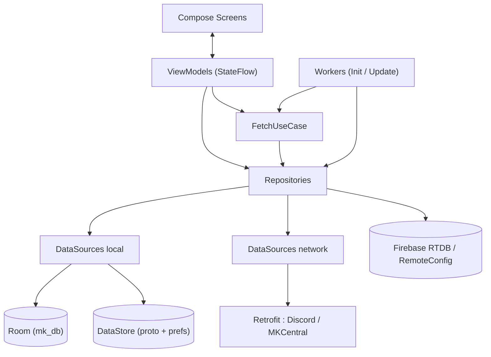

# Documentation technique — Stats MKWorld

> Application Android de suivi statistique des *wars* (matchs d'équipe) Mario Kart World.
> Version 3.0.0 — `versionCode` 23 — package `fr.harmoniamk.statsmkworld`.
> Document de référence pour l'architecture, les modèles, les algorithmes et les intégrations. Volet utilisateur : [FUNCTIONAL.md](FUNCTIONAL.md).

## Sommaire

1. [Vue d'ensemble](#1-vue-densemble)
2. [Stack & dépendances](#2-stack--dépendances)
3. [Architecture générale](#3-architecture-générale)
4. [Injection de dépendances (Hilt)](#4-injection-de-dépendances-hilt)
5. [Démarrage & navigation](#5-démarrage--navigation)
6. [Modèle de données : les trois couches](#6-modèle-de-données--les-trois-couches)
7. [Le domaine « War » en détail](#7-le-domaine-war-en-détail)
8. [Algorithmes de scoring](#8-algorithmes-de-scoring)
9. [Moteur de statistiques](#9-moteur-de-statistiques)
10. [Persistance](#10-persistance)
11. [Repositories](#11-repositories)
12. [Data sources & APIs](#12-data-sources--apis)
13. [Le UseCase de synchronisation](#13-le-usecase-de-synchronisation)
14. [Tâches de fond (WorkManager)](#14-tâches-de-fond-workmanager)
15. [Génération PDF](#15-génération-pdf)
16. [Notifications](#16-notifications)
17. [Records du monde (scraping)](#17-records-du-monde-scraping)
18. [Build, signature & configuration](#18-build-signature--configuration)
19. [Sécurité & secrets](#19-sécurité--secrets)
20. [Annexe : circuits (enum Maps)](#20-annexe--circuits-enum-maps)

---

## 1. Vue d'ensemble

Stats MKWorld permet à des équipes compétitives de Mario Kart World d'enregistrer leurs *wars* course par course et d'en dériver des statistiques riches. L'app est *offline-first* (cache Room + DataStore) mais synchronise les wars en temps réel via Firebase.

Trois systèmes externes alimentent l'app :

- **MKCentral** (`mkcentral.com`) — registre communautaire : identité du joueur, équipes, rosters. Aucune authentification.
- **Discord OAuth2** — authentification de l'utilisateur (le `discord_id` sert à retrouver le joueur sur MKCentral).
- **Firebase Realtime Database** — source de vérité des wars (live + historique), des utilisateurs d'équipe et des alliés.

Un quatrième, **`mkwrs.com`**, est scrapé (Jsoup) pour les records du monde (fonction debug).

| Paramètre | Valeur |
|---|---|
| `applicationId` | `fr.harmoniamk.statsmkworld` (suffixe `.debug` en debug) |
| `minSdk` / `targetSdk` / `compileSdk` | 28 / 35 / 35 |
| Langage / JVM | Kotlin 2.2.20 / Java 17 |
| Projet Firebase | `stats-mkworld` — RTDB région `europe-west1` |
| Base de données Room | `mk_db`, version 6, `fallbackToDestructiveMigration()` |
| MultiDex | activé |

---

## 2. Stack & dépendances

Versions centralisées dans `gradle/libs.versions.toml` (version catalog).

| Domaine | Bibliothèques |
|---|---|
| UI Compose | BOM 2025.06.01, Material3, Navigation Compose 2.9, Accompanist Pager 0.28, Coil 2.1, Lottie 4.0, MPAndroidChart 3.1, `lifecycle-runtime-compose` (`collectAsStateWithLifecycle`) |
| Vues XML | ViewBinding + DataBinding (uniquement pour le rendu PDF via `tab_pdf.xml` / `detailed_tab_pdf.xml`) |
| DI | Hilt/Dagger 2.57, `hilt-navigation-compose`, `hilt-work` (compiler 1.3) |
| Async | Coroutines + Flow (opt-in `@ExperimentalCoroutinesApi`, `@FlowPreview`) |
| Réseau | Retrofit 2.11, OkHttp 4.12, Moshi 1.15 (codegen KSP) |
| Scraping | Jsoup 1.21.2 |
| Persistance | Room 2.8.4 (KSP), Proto DataStore + Preferences DataStore 1.1.7, Protobuf Lite 3.25 |
| Firebase | BOM 34.15 : Realtime Database, Auth (anonyme), Remote Config, Crashlytics, Analytics |
| Background | WorkManager 2.10 |
| Divers | core-splashscreen, kotlinx-serialization-json |

Plugins Gradle : `com.android.application`, `kotlin.android`, `ksp`, `dagger.hilt`, `kotlin.compose.compiler`, `google-services` 4.4.3, `protobuf` 0.9.4, `firebase.crashlytics`, `kotlin.parcelize`.

---

## 3. Architecture générale

Pattern **MVVM en couches**, flux unidirectionnel, entièrement réactif (Flow), câblé par Hilt.



Règles transverses :

- **Distinction réactif vs one-shot** (depuis la migration Flow→suspend) :
  - Restent en `Flow` les flux réellement **réactifs** : lectures Room streaming (`getPlayers/getPlayer/getTeams/getTeam/getWars/getWar`), le listener temps réel `FirebaseRepository.listenToCurrentWar`, et les `Flow` DataStore.
  - Sont des **`suspend fun`** les opérations **one-shot** : data sources réseau (MKCentral/Discord → `NetworkResponse<T>`, cf. §12), écritures/mutations de `DatabaseRepository` (sous `withContext(Dispatchers.IO)`) et lectures `.get()` + écritures de `FirebaseRepository`.
- Un écran = un dossier `screen/<feature>/` avec `<Feature>Screen.kt` (Composable) + `<Feature>ViewModel.kt`.
- Composants UI maison préfixés `MK` (`ui/MKButton.kt`, `MKText`, `MKDialog`, `MKTextField`, `MKSegmentedSelector`, `MKLoaderDialog`, `MKBottomSheet`…). Cellules de liste dans `ui/cells/`, widgets de stats dans `ui/stats/`. **`MKSegmentedSelector`** est le **segmented unique** de l'app (style « pill » de la maquette) : composant **stateless** (`page` = index sélectionné, `onClick` remonte l'index) avec un paramètre **`onDark`** adaptant les couleurs au fond hôte (`true` = carte sombre `blackAlphaed` → texte inactif blanc ; `false` défaut = fond clair du dégradé `BaseScreen` → texte inactif sombre, lisible). Consommé par Accueil (segmentés Moi/Équipe et 5/10 dans les cartes sombres, `onDark = true`), AddWar (12/24), Annuaire (joueurs/équipes), Stats (individuel/équipe, tri des podiums) et Classements (sous-onglets Joueurs/Adversaires/Circuits **et** chips de tri Winrate/Score/compteur). Ne pas recréer de segmented local (cf. rule `.claude/rules/15-ui-prototype-reference.md`).
- `ui/MKBottomSheet.kt` : wrapper à slots autour du `ModalBottomSheetLayout` de **Material2** (pas de migration Material3). Paramètres : `sheetState`, `sheetContent` (contenu personnalisé du sheet), `content` (corps de l'écran englobé) et `onBack` optionnel (gère le `BackHandler` : ferme le sheet si visible, sinon délègue). Le pilotage de la fermeture par un flux `onDismiss` côté ViewModel reste à la charge de l'appelant. Utilisé par `TeamProfileScreen` (ajout d'un ally). (`AddWarScreen` n'utilise **plus** de bottomSheet depuis la refonte #42 : le choix du roster adverse se fait par un **sélecteur inline** déplié sous la ligne d'équipe.)
- `ui/MKStepper.kt` : **stepper de wizard** unique de l'app (style `.stepper`/`.stp` de la maquette : rangée d'étapes de poids égal, étape active = pastille blanche/texte sombre, autres = texte atténué sur fond translucide). **Stateless** (`step` = index courant, `onStepClick` remonte l'index, `enabled` conditionne la cliquabilité par étape). Consommé par `AddWarScreen` (`1 · Adversaire` → `2 · Joueurs` → `3 · Récap`) ; à réutiliser pour le futur wizard de course. Ne pas recréer de stepper local (rules 15/16).
- `ui/cells/MKListRow.kt` : **ligne de liste `.lrow`** partagée (pastille avatar MKCentral ou initiales sur fond couleur, titre + slot `titleTrailing`, sous-texte, slot de fin `trailing`). Généralisée par paramètres (rule 16) et consommée par `ProfileMemberRow` (→ chevron `MKListRowChevron`) et `AddWarScreen` (équipes → chevron ; joueurs → pastille de sélection `MKListRowCheck` ✓ verte). `ProfileMemberRow` délègue désormais à ce composant (un seul exemplaire de la `.lrow`).

### Performance Compose — passe « fluidité »

Une passe transverse d'optimisation des recompositions (B1→B6, complétée par le découpage D20) a établi des conventions à respecter pour tout nouvel écran ou composant. Les points d'audit détaillés vivent dans `docs/AUDIT.md` (D20, « Passe fluidité Compose »).

- **Clés de liste** : sur tout `items(...)`/`itemsIndexed(...)` de `LazyColumn`/`LazyRow`/`LazyGrid`, utiliser un identifiant **primitif stable** (`key = { it.war.id }`, `{ it.id }`, `it.name` pour un enum). Les listes non réordonnables et les grilles de positions saisie (`items(count)`) **conservent l'index par défaut** (pas de `key`). Une clé ne doit jamais être un objet métier / `data class` (crash `Bundle`) ni recalculée à chaque frame (`UUID.randomUUID()`). Cf. rule `.claude/rules/10-ui-compose.md`.
- **Sortir les calculs lourds de la composition** : tris/filtres/sommes mémoïsés via `remember(clés)` (ex. `WarScoreView` : shocks, pénalités groupées par équipe, scores triés) et état dérivé via `derivedStateOf` (ex. `Set` de positions sélectionnées dans `EditTrackScreen`). Dans `AddTrackScreen` (refonte wizard, ticket #44), le `Set` des positions prises est un simple `val` en composition — le `when(step)` lit déjà largement le `state`, donc `derivedStateOf` n'y filtrerait aucune recomposition (rule 11, anti-pattern).
- **Choix du type de `State`** : `mutableStateOf` (état local possédé, `rememberSaveable` s'il doit survivre à la rotation) vs `derivedStateOf` (dérivation d'un `State` **qui change vite**, sortie rare) vs `val` calculé (dérivation simple, entrée ≈ sortie en fréquence). `derivedStateOf` n'apporte rien s'il enveloppe une valeur dérivée de `state.value` dans un bloc qui lit déjà `state.value` largement → préférer un `val` ou extraire un sous-composable. Cf. rule `.claude/rules/11-compose-state.md`.
- **Découpage en sous-composables privés à paramètres stables** : les gros composables monolithiques sont scindés en sections privées recevant des **valeurs déjà calculées** (pas de `filter`/`sortedBy`/`sumOf` à l'intérieur), pour scoper les recompositions à la section dont l'état change. Exemples : `WarScoreView` → `WarScore24pView`/`WarScore12pView` + `PenaltiesSection`/`ShocksSection` ; `TeamProfileScreen`, `AddWarScreen` → header/listes/sections d'action extraits. `CurrentWarScreen` (refonte #43) est un écran unique scrollable (`LazyColumn`, plus de `HorizontalPager`) découpé en cartes privées `ScoreCard`/`PlayersCard`/`TracksGrid` + blocs de validation 12/24. `CurrentWarActionsScreen` (refonte #45, **pixel-perfect** `waractions`) : `MKSegmentedSelector` (rules 15/16) bascule les 3 onglets **Pénalités / Remplacement / Annuler** en état local (`rememberSaveable`, rule 11 — plus de `MKSelectorViewPager`, supprimé), contenu scrollable découpé en panels privés `PenaltiesPanel` (**une colonne par équipe** via `groupBy { it.penalty.teamId }` — en-tête nom de roster + tuiles `.penb` empilées ; sélection unique toutes équipes confondues, tuile active en `blackAlphaed` texte blanc), `SubPanel` (lignes joueur `MKListRow` + `MKListRowCheck`) et `CancelPanel` (carte de confirmation `StatCard` + **bouton danger plein** rouge/texte sombre — le fond translucide `.btn2.danger` paraissait désactivé sur Android). ViewModel inchangé (logique pénalité/remplacement/annulation déjà en place). Extraction **iso-fonctionnelle stricte** (aucun changement de rendu) sauf refontes explicitement pixel-perfect.
- **Collecte de flux liée au cycle de vie** : `collectAsStateWithLifecycle()` (dépendance `androidx.lifecycle:lifecycle-runtime-compose`) plutôt que `collectAsState()`. Regrouper les `LaunchedEffect(Unit)` multiples en un seul effet clé sur le `viewModel`, avec un `launch` par flux.

---

## 4. Injection de dépendances (Hilt)

**Convention récurrente** (à reproduire pour toute nouvelle dépendance) : interface + impl `@Inject constructor` + module imbriqué `@Binds` en `@Singleton`.

```kotlin
interface FooRepositoryInterface { fun bar(): Flow<…> }

class FooRepository @Inject constructor(/* deps */) : FooRepositoryInterface { /* … */ }

@Module
@InstallIn(SingletonComponent::class)
interface FooModule {
    @Singleton @Binds
    fun bind(impl: FooRepository): FooRepositoryInterface
}
```

- Tout est `@Singleton` (repositories, data sources, APIs, `FetchUseCase`).
- **Workers** : `@HiltWorker` + `@AssistedInject constructor(... @Assisted context, @Assisted params)`.
- **ViewModels** : `@HiltViewModel`. Ceux qui ont besoin de paramètres runtime exposent une `@AssistedInject Factory`, consommée via `hiltViewModel(creationCallback = { f -> f.create(...) })` dans `RootScreen.kt`.
- `MainApplication` est `@HiltAndroidApp` et implémente `Configuration.Provider` pour fournir la `HiltWorkerFactory` à WorkManager (l'initializer par défaut est désactivé dans le `AndroidManifest`).

---

## 5. Démarrage & navigation

### `MainViewModel` — choix du `startDestination`

```kotlin
val player = dataStoreRepository.mkcPlayer.firstOrNull()
when {
    remoteConfigRepository.minimumVersion() > BuildConfig.VERSION_CODE -> needUpdate = true
    player?.id != 0L  -> startDestination = "Home"
    else              -> startDestination = "Signup"
}
```

`processIntent` extrait le `code` OAuth d'un deep link `statsmkworld.com?...=code` (split sur `?` puis `=`) et force `Signup`. `initStats()` lance `InitStatsWorker` (one-time, tag `"InitStats"`).

### Graphe `RootScreen.kt`

`NavHost` avec transitions slide (700 ms). Les objets complexes (`WarDetails`, `WarTrackDetails`, `StatsType`) transitent par `savedStateHandle` plutôt que par la route (ils sont `Parcelable`/`Serializable`). `RootScreen` enregistre aussi la tâche périodique `UpdateDataWorker` dans un `LaunchedEffect`.

| Route | Écran | Argument(s) |
|---|---|---|
| `Signup` | Onboarding + Discord OAuth | `code` (clé VM) |
| `Home` | Conteneur 5 pôles (Welcome / WarList / Stats / Rankings / Profil) | — |
| `Home/Registry` | Annuaire joueurs/équipes (via icône recherche) | — |
| `Home/AddWar/{is24p}` | Segmenté 12/24 + choix adversaire(s) + composition | `Bool` |
| `Home/CurrentWar` | War en cours (live) | — |
| `Home/CurrentWar/AddTrack/{is24p}` | Saisie d'une course | `Bool` |
| `Home/CurrentWar/Actions` | Pénalités / remplacements / annulation | — |
| `Home/WarDetails` | Détail d'une war | `war` (savedState) |
| `Home/WarDetails/Tab` | Génération du tableau (PDF) | `details` (savedState) |
| `Home/TrackDetails/{editing}` | Détail d'une course | `track` + `Bool` |
| `Home/EditTrack/{is24p}` | Édition d'une course | `track` + `Bool` |
| `Stats` | Stats d'une catégorie (détail adversaire/circuit, via classements) | `type: StatsType` |
| `Statsfull/{userId}` | Stats détaillées d'un joueur donné (vue Individuelles paramétrée) | `String` |
| `Player/Profile/{id}` | Profil joueur (`me` ou id) | `String` |
| `Player/Profile/Debug` | Écran debug | — |
| `Team/Profile/{id}` | Profil équipe | `String` |

**Pôle Wars & sélecteur de mode.** Le CTA « Nouvelle war » et le segmenté 12/24 vivent dans le pôle Wars (plus sur l'Accueil). `WarListScreen` reçoit `onAddWar` (câblé au callback `Home/AddWar/{is24p}` du graphe racine, via `HomeScreen`) et `onCurrentWar`. Le segmenté 12/24 est **sur `AddWarScreen`** et bascule le mode **dynamiquement sur le même écran, sans re-navigation** : l'argument de route `{is24p}` ne sert qu'à **semer la valeur initiale** passée à la factory `@AssistedInject` (`initialIs24p`) ; le mode est ensuite un **état interne réactif** du VM (`private var is24p`, exposé dans `State.is24p`). Le segmenté appelle `viewModel.onModeChange(is24p)`, qui met à jour l'état, **revient à l'étape 1** et **réinitialise la sélection d'adversaires** (le nombre attendu change, 1 vs 3) ; l'écran reste monté et se recompose (pas de transition slide). Tout ce qui dépend du mode (`State.opponentCount`, `nextButtonEnabled` dans `commitTeam`/`onRemoveTeam`, `createWar`) lit `is24p`/`State.is24p`. Cf. rule `.claude/rules/11-compose-state.md` (« un switch met à jour l'affichage dynamiquement, jamais par re-navigation »). `WelcomeScreen` a perdu son paramètre `onAddWar` (plus utilisé).

**`AddWarScreen` — wizard 3 étapes (refonte #42).** Écran unique, **pixel-perfect** vs la maquette `addwar` (rules 13/15). En tête, `MKSegmentedSelector` (12/24) + `MKStepper` (`1 · Adversaire` → `2 · Joueurs` → `3 · Récap`) pilotent l'état réactif du VM ; l'étape courante est `State.step` (0/1/2), la bascule est **dynamique** (pas de `HorizontalPager` ni de re-navigation ; l'ancien pager et le bottomSheet de roster ont été supprimés). Étape 1 : `LazyColumn` de `MKListRow` (équipes) avec **sélecteur de roster inline** (`RosterPicker`) déplié sous la ligne d'une équipe multi-rosters (`State.expandedRosterTeamId`/`expandedRosters`). Étape 2 (`PlayersStep`) : carte de progression (`selectedPlayerCount / 6`), joueurs groupés par roster en `MKListRow` + `MKListRowCheck`, liste indicative du roster adverse (`State.opponentPreviews` — nom/tag du roster, avatar équipe, joueurs issus du détail MKCentral via `OpponentPlayerRow`) ; **aucun CTA** — `onPlayerSelected` pose `step = 2` dès que la composition atteint **exactement 6** joueurs (et `step = 1` sinon), la bascule vers le Récap est donc **automatique**. Étape 3 (`RecapStep`) : rappel des adversaire(s) (`MKListRow`, nom/tag roster + avatar équipe, rule 12) et de la line-up (`State.selectedPlayers`, `MKListRow` + `MKListRowCheck`), pied `Précédent` (`MKButtonStyle.Minor`, → étape 2) + **unique CTA de lancement** `Démarrer la war` (`Gradient`) → `createWar()`. **Gating du stepper** : l'index Joueurs exige `nextButtonEnabled` (adversaire complet), l'index Récap exige `nextButtonEnabled && buttonEnabled` (adversaire complet **et** 6 joueurs). Le `BackHandler` recule d'une étape (3→2→1) avant de retirer l'équipe / quitter. **Retour arrière = reset de l'étape rejointe** (rule 11, section wizard/stepper) : `onStepChange(step)` distingue le sens (`step >= current` → simple changement d'étape ; `step < current` → reset). Le retour à l'Adversaire (1ʳᵉ étape) appelle `resetOpponentSelection()` = **remise à zéro complète** (step=0, `teamSelected=null`, rosters/previews/`selectedRosterIds` vidés, `teamList=teams`, sélecteur inline replié, **ET line-up remise à zéro** — `playerList` tous `isSelected=false`, `buttonEnabled=false`) — **mutualisé avec `onModeChange`** (≥ 2 appelants, rules 30/61 ; le switch 12/24 repasse par `step=0` donc « restart » complet lui aussi) ; le retour aux Joueurs appelle `resetPlayerSelection()` (step=1, **seulement** la line-up : tous les `PlayerSelector.isSelected=false`, `buttonEnabled=false`). « Précédent », `BackHandler` et clic stepper passent tous par `onStepChange` → reset automatique. **Divergence assumée vs maquette** (demande utilisateur, cf. B23) : la maquette ne décrit que 2 étapes avec le CTA en pied d'étape Joueurs ; la 3ᵉ étape Récap a été ajoutée à la demande de l'utilisateur, le CTA de lancement y étant déplacé. `AddWarScreen` étant sur le **graphe racine** (poussé par-dessus le pôle Wars, sans bottombar), aucune marge basse bottombar n'est requise (rule 17).

**Photos de profil des joueurs (AddWar).** `AddWarViewModel.resolvePlayerAvatars(players)` résout **une seule fois** (garde `avatarsRequested`), en **parallèle** (`coroutineScope { players.map { async { getPlayer(id) } }.awaitAll() }`, même pattern que `TeamProfileViewModel.resolveMembers`), la photo `MKCPlayer.userSettings.avatar` (préfixée `https://mkcentral.com`) de chaque joueur de **ton roster** (y compris alliés), et pousse la `Map<playerId, url>` dans `State.playerAvatars`. La map est portée par le `@Volatile private var playerAvatars` réinjecté dans le `State` construit par le `zip` (survit à ses ré-émissions) puis dans `_state` à la fin de la résolution — rendu **réactif** : les cellules `MKListRow` (étape 2 **et** line-up du Récap) passent des initiales colorées à la photo (`avatarUrl = state.playerAvatars[id]`, repli initiales si absent, rule 12). **Rule 20 respectée** : `_state` puis `state` déclarés avant toute souscription ; `resolvePlayerAvatars` ne fait que `launch` une coroutine (lecture différée de `state.value`, aucune lecture synchrone pendant la construction). **Écart mineur assumé** : les joueurs **adverses indicatifs** (`OpponentPlayerRow`, basés sur `MKCTeamPlayer` sans avatar) restent en **initiales** — les résoudre imposerait jusqu'à 18 appels `getPlayer` en 24p pour une info seulement indicative.

`HomeScreen` contient son **propre** `NavHost` à 5 pôles (`BottomNavItem` : WELCOME, WARS, STATS, RANKINGS, PROFILE → routes `Home/Welcome`, `Home/WarList`, `Home/Stats`, `Home/Rankings`, `Home/Profile`) avec `saveState`/`restoreState`. Le pôle **Stats** héberge `StatsFullScreen` (écran riche à onglets Individuelles/Équipe pour le joueur courant, `showTabs = true`, cf. §Stats ci-dessous) ; le pôle **Classements** héberge directement `StatsRankingScreen` (écran unique à sous-onglets Joueurs/Adversaires/Circuits — l'ancien menu intermédiaire `StatsMenuScreen` a été **supprimé**, tout comme la route racine `Stats/Ranking`). Le pôle Profil héberge `ProfileScreen` (#28) : **profil unique à onglets fusionnés Joueur / Équipe**, **pixel-perfect** vs la maquette, réutilisant `PlayerProfileContent` (extrait de `PlayerProfileScreen`) et `TeamProfileContent` (extrait de `TeamProfileScreen`) — mêmes composables `ColumnScope` que les fiches autonomes du graphe racine, un seul exemplaire (rule 16). Un `MKSegmentedSelector` bascule l'onglet en état interne (`rememberSaveable`, sans re-navigation, rule 11) ; le sheet « Ajouter un ally » y est hébergé. Le style maquette est porté par des composants profil mutualisés dans **`ui/cells/ProfileCells.kt`** (`ProfilePersonCard` = carte identité centrée ; `ProfileInfoCard` = grille 2 colonnes clé/valeur ; `ProfileMemberRow` = ligne `lrow` avec **photo MKCentral** ou initiales + pastille de rôle + chevron ; `ProfileSettingRow` = ligne `setrow` **icône `.si` + titre/sous-titre/toggle** ; `RolePill`/`MkcBadge`), sur les cartes translucides existantes (`StatCard`/`Eyebrow` de `ui/stats/`). Sous-onglets Membres / Alliés = `MKSegmentedSelector` (style pill maquette ; l'ancien `MKSelectorViewPager` a depuis été **entièrement supprimé** — plus aucun consommateur, #45). Nouvelle couleur `Colors.gold` (pastille de rôle Leader) ; drawables vectoriels `ic_chevron_right`, `ic_refresh`, `ic_bell`, `ic_cog`, `ic_logout` (icônes des lignes Réglages). **Rôles & avatars réels des membres** calculés par `TeamProfileViewModel` (`State.members: List<MemberInfo>`, chaque membre portant son `rosterId`/`rosterName`) : rôle = valeur du nœud Firebase `users` (`getUsers`, Leader=2/Admin=1/Membre=0 ; repli MKCentral leader/manager pour une équipe publique), avatar = `MKCentralDataSource.getPlayer(id).userSettings.avatar` récupéré en parallèle (`coroutineScope { async }`/`awaitAll`). **Membres regroupés par roster** si l'équipe a **≥ 2 rosters** mkworld (un en-tête `Eyebrow` par roster via le helper `LazyListScope.memberRows`), sinon liste plate. Les boutons « Ajouter un ally » (équipe) et « Ajouter en ally »/« Changer le rôle » (fiche joueur) sont en **largeur intrinsèque, centrés** (via un `Row` centré — solution d'attente avant le ticket UI boutons). Dates de création/inscription affichées **complètes** (`dd/MM/yyyy` / `dd MMMM yyyy`). Le contenu scrollable réserve une marge basse (≈ 90 dp) pour la bottombar (rule `.claude/rules/17-ui-bottombar-inset.md`). **Aucun CTA vers le pôle Stats** ni « Voir nos confrontations » dans le Profil (décisions utilisateur). Ses actions déconnexion/debug et le clic sur un membre remontent au graphe racine via callbacks (`onDisconnect`, `onDebug`, `onPlayerProfile` → `Player/Profile/{id}`). L'**Annuaire** (`RegistryScreen`) n'est plus un pôle : il est ouvert via une **icône recherche** ajoutée à `BaseScreen` (paramètre optionnel `onSearch`), présente sur Accueil et Classements, et navigue vers la route racine `Home/Registry`. Le bouton système ← revient à l'écran d'origine (fiche ouverte depuis Classements → retour Classements) car les fiches profils/détails sont poussées sur le graphe racine par-dessus le pôle courant. Au niveau des pôles eux-mêmes, le `BackHandler` de `HomeScreen` applique le pattern bottom-nav standard : ← depuis un pôle autre qu'Accueil ramène au **pôle Accueil** ; ← depuis Accueil **quitte** l'app. Le pôle Profil (`ProfileScreen`, dont le sheet `MKBottomSheet` gère le `BackHandler`) reçoit la même navigation « retour Accueil » en `onBack`. (Cf. rule `.claude/rules/14-ui-back-onglets.md`.)

**Conventions de performance Compose** (à respecter pour tout nouvel écran/cellule) :

- **Clés de liste** : chaque `items(...)` (colonne/grille) sur données métier reçoit une clé stable — `key = { it.war.id }`, `{ it.id }` (joueurs/équipes), `it.name` pour l'enum `Maps`. La clé doit être un type **stockable dans un `Bundle`** (String/Int/Long/…), **jamais un objet ou une `sealed class`** (sinon crash `Type of the key … is not supported`). Les listes sans id primitif stable ou non réordonnables (pénalités `WarPenalty`, lignes du tab) et les **grilles `items(count)` à plage fixe** (positions de saisie 1..12 / 1..24) conservent l'index par défaut (**pas de `key`** — une clé `it + 1` n'apporte rien et peut régresser la sélection). Ne jamais utiliser une clé recalculée à chaque frame (ex. `UUID.randomUUID()`).
- **Calculs hors composition** : tris, filtres et sommes coûteux sont enveloppés dans `remember(clés)` (ou remontés au ViewModel), pas exécutés en pleine composition. Les valeurs dérivées d'un état qui change plus souvent qu'elles utilisent `derivedStateOf` (ex. `Set` des positions sélectionnées).
- **Cycle de vie** : la collecte d'un `StateFlow` d'écran se fait via `collectAsStateWithLifecycle()` (dépendance `androidx.lifecycle:lifecycle-runtime-compose`), pas `collectAsState()`, pour suspendre la collecte hors écran visible.
- **Effets** : regrouper les collectes de plusieurs `SharedFlow` d'événements dans **un seul** `LaunchedEffect(viewModel)` avec un `launch { … }` par flux, plutôt que plusieurs `LaunchedEffect(Unit)`.

---

## 6. Modèle de données : les trois couches

Un même domaine est représenté **trois fois** ; les conversions se font par constructeurs dédiés. Ne pas les confondre.

| Couche | Localisation | Rôle | Sérialisation |
|---|---|---|---|
| **Firebase** | `model/firebase/` | Source de vérité (RTDB) & objet métier en mémoire | parsing Map manuel (Moshi helpers) |
| **DataStore** | `model/local/Datastore*` | Miroir de la war « en cours » sur disque | Protobuf (`*.pb`) |
| **Présentation** | `model/local/` (`WarDetails`, `Stats`, `TrackStats`…) | Calculs & affichage | — (dérivé) |
| **Room** | `database/entities/` | Cache local des historiques | colonnes + TypeConverters Moshi |
| **Réseau** | `model/network/` | DTO MKCentral & Discord | Moshi (`@Json`) |

### Carte simplifiée des modèles

```
NETWORK (DTO Moshi)            LOCAL / app                  FIREBASE (RTDB · vérité)
model/network/                 model/local/                 model/firebase/

[MKCentral]
  MKCTeam ───────────┐
   └ MKCTeamRoster   ├── conv ──► TeamEntity (Room)
      └ MKCTeamPlayer┘
  MKCPlayer ───────────── conv ──► PlayerEntity (Room) ── conv ──► User
   ├ MKCPlayerRoster                                                ▲
   ├ MKCDiscordInfo              MKCPlayer ───────── conv ──────────┘
   ├ MKCFriendCode
   └ MKCUserSettings
  (chaque MKC* porte son propre .proto ; pas de classe Datastore* intermédiaire)

[Discord / OAuth]  DiscordUser · TokenResponse        (aucun miroir local)

[War — cœur]
  War ◄──── conv ────► DatastoreWar ◄──── .proto ────► WarProto (.pb)   ← war « en cours »
   ├ WarTrack             (miroir DataStore)
   │  ├ WarPosition
   │  └ Shock          War ── wrap ──► WarDetails ──► WarStats ──► Stats
   ├ WarScore                          (présentation / calcul — jamais persisté)
   └ WarPenalty        War ── conv ──► WarEntity (Room · historique)
```

### Chaînes de conversion

- **War** : `Firebase JSON ──parse──► War` ↔ `DatastoreWar` ↔ `WarProto` (war en cours uniquement) ; `War ──► WarEntity` (Room, via TypeConverters) ; `War ──wrap──► WarDetails` (scores calculés).
- **Joueur** : `MKCPlayer`/`MKCTeamPlayer ──► PlayerEntity` (Room) ; `MKCPlayer`/`PlayerEntity ──► User` (Firebase).
- **Équipe** : `MKCTeam`/`MKCTeamRoster ──► TeamEntity` (Room).

Les modèles firebase (`War`, `WarTrack`, `WarPosition`, `WarPenalty`, `WarScore`, `Shock`) sont `@Parcelize`/`Serializable` et possèdent chacun un `constructor(datastore…)`. Les `Datastore*` possèdent un `constructor(firebase…)`, un `constructor(proto…)` et un getter `proto`. À noter : `DatastoreWar` **réutilise directement** les types firebase `WarTrack`/`WarScore`/`WarPenalty` dans ses champs (seuls `DatastoreWarTrack`/`DatastoreWarPosition` sont des classes distinctes). Les DTO `MKCPlayer`/`MKCTeam` portent quant à eux leur sérialisation Protobuf **en interne** (getter `proto` + `constructor(proto…)`, via les `serializers/`), sans classe `Datastore*` dédiée.

### Identité MKCentral : équipe, roster, joueur

Distinction structurante (source de confusion fréquente) :

| Modèle | Identifiant | Représente |
|---|---|---|
| `MKCTeam` | `id` = **teamId** | L'**équipe entière**, qui peut regrouper plusieurs rosters |
| `MKCTeamRoster` | `id` = **rosterId**, `teamId` → `MKCTeam.id` | Un **roster** d'une équipe (vue « équipe »), filtrable par `game`/`mode` |
| `MKCPlayerRoster` | `rosterID`, `teamID` | Le même roster vu **côté joueur** (proto `MKCRosterProto`) |
| `MKCTeamPlayer` | `playerId` | Un joueur listé dans un roster |

- Un roster MK World se filtre par `game == "mkworld"` (filtre répété, cf. audit D28).
- Dans l'app, **les joueurs sont rattachés à leur `teamId`** (consultation de tous les rosters), tandis que **les wars sont rattachées au `rosterId`** (hôte comme adversaire) pour différencier les rosters d'une équipe en multi-roster.
- **Création de war** : l'hôte est enregistré via son `rosterId` (`PlayerEntity.rosterId` mkworld) et, depuis la sélection de roster adverse (`AddWarViewModel`), l'adversaire aussi. À la sélection d'un adversaire, `AddWarViewModel.onTeamSelected()` appelle `mkCentralDataSource.getTeam(teamId)` et filtre `game == "mkworld"` : **un seul roster** → le `rosterId` est retenu directement (`commitTeam`, passage à l'étape 2) ; **plusieurs rosters** → un **sélecteur inline** se déplie sous la ligne (`State.expandedRosterTeamId`), et `onRosterSelected(team, roster)` retient le roster choisi. Le `rosterId` retenu par adversaire est mémorisé dans `selectedRosterIds` (index aligné sur `teamSelected`, idempotent en 24p) puis écrit dans `War.teamOpponent` par `createWar()`.
- **Résolution `rosterId → équipe/roster`** (affichage & stats adverses) : `War.teamOpponent` contient des `rosterId`, alors que `TeamEntity` reste **clé par teamId**. Pour éviter toute restructuration de la table équipes / de la chaîne de fetch, `TeamEntity` porte une colonne **`rosters: List<RosterInfo>`** (Room **v6**, `RosterInfoConverter` Moshi) = métadonnées `{id, nom, tag}` des rosters mkworld de l'équipe, renseignée par `TeamEntity(MKCTeam)` (les rosters sont déjà dans la réponse liste `getTeams`, **aucun appel réseau supplémentaire**). `FetchUseCase.fetchTeams()` **ne persiste pas** une équipe sans roster mkworld (`rosters` vide) — sauf l'équipe spéciale « 6v6 Squad », conservée volontairement hors filtre. Deux mécanismes distincts en découlent :
  - **Affichage (nom/tag du roster, avatar de l'équipe)** : `databaseRepository.getTeam(id)` matche d'abord par teamId (clé primaire), à défaut par l'équipe dont l'un des `rosters` porte l'`id` → on remonte l'équipe parente. L'extension `War.opponentTeams(databaseRepository)` **remplace alors nom/tag par ceux du roster** (avatar/couleur de l'équipe conservés) **en gardant le rosterId comme `TeamEntity.id`** (indispensable pour apparier adversaire ↔ score/pénalité dans `WarScoreView`). Côté **hôte**, les VMs (`WarCell`, `CurrentWarCell`, `WarDetails`, `CurrentWar`, `AddTrack`, `CurrentWarActions`) posent `teamHost = TeamEntity(host).copy(name = rosterName, tag = rosterTag)` (avatar équipe, nom/tag roster). **Résolution non destructive** : si `getTeam(id)` renvoie `null` (équipe/roster disparu du cache, war legacy jamais synchronisée), `opponentTeams` ne **supprime plus** l'adversaire (fin du `mapNotNull` silencieux) — il retombe sur une `TeamEntity` **dégradée** (`name = "Équipe inconnue"`, `tag = "???"`, `logo = null`) conservant l'id, pour ne jamais faire disparaître l'adversaire (nom + logo absents). Principe général : cf. rule `.claude/rules/12-ui-roster-display.md`.
  - **Classement adverse — un item PAR ROSTER** (`InitStatsWorker` → `withFullTeamStats`) : pour chaque `RosterInfo` de chaque `TeamEntity`, un `OpponentRanking` distinct est produit, clé par le **rosterId**, agrégeant les wars dont l'opposant = ce rosterId (`hasTeam(rosterId)`), affiché avec le **nom/tag du roster** et l'avatar de l'équipe (`team.copy(id = rosterId, name = roster.name, tag = roster.tag)`). Les rosters d'une même équipe ne sont **pas** fusionnés (ex. équipe à 2 rosters, 4 wars → 2 items de 2 wars). Un **item de niveau équipe** (clé teamId) capte en plus les **wars legacy** (opposant = teamId, avant la granularité roster) pour ne pas les perdre. `toTeamStats` (sous-stat « adversaire le plus joué ») résout un id par teamId **ou** rosterId → équipe parente. Le worker n'applique **aucune** normalisation préalable.
  - **Détail d'un adversaire** (`StatsViewModel`, `OpponentStats`) : le classement fournit désormais un **rosterId** (ou un teamId pour l'item legacy) ; les wars sont filtrées **directement** par cet id (`hasTeam(id)`), **sans** normalisation rosterId→teamId (sinon les rosters seraient re-fusionnés). L'en-tête du détail affiche le nom/tag du roster (avatar de l'équipe).
  - **Migration teamId → rosterId de l'historique (Ticket 4)** : action **manuelle** de l'écran Debug (« Migrer les adversaires (teamId → roster) » → `DebugViewModel.onMigrateOpponents()` → `FetchUseCase.migrateOpponentsToRoster()`), sur le patron de « Gérer les transferts ». Objectif : fusionner le doublon d'une équipe **mono-roster** affrontée avant ET après le passage rosterId (item équipe legacy + item roster) en réécrivant le `teamId` en `rosterId` dans les wars **historiques**. Mécanisme : à partir du cache local des équipes, on construit la map `teamId → rosterId` **uniquement pour les équipes à exactement un roster mkworld** (`TeamEntity.rosters.size == 1`) **dont le rosterId cible est résolvable localement** (`getTeam(rosterId) != null`) — garde-fou évitant d'écrire un rosterId qui ne se résoudrait plus au nom/logo à l'affichage ; pour chaque nœud hôte (`wars/{rosterId}` des rosters mkworld de l'équipe courante), on lit `getWars(host)`, on remappe chaque entrée de `War.teamOpponent` (24p : les 3 opposants indépendamment), et on réécrit via `writeWar(host, war)` **seulement si `teamOpponent` a changé**. **Idempotent** : une valeur déjà rosterId ne matche aucun teamId connu, une équipe multi-rosters est ignorée (roster joué à l'époque inconnu — limite assumée) → 2ᵉ exécution sans écriture. `currentWars` **volontairement exclu**. Aucun appel réseau MKCentral (s'appuie sur les équipes déjà synchronisées). Après migration, une équipe mono-roster ne produit plus qu'un seul `OpponentRanking` (roster), legacy et nouvelles wars réunies.
- ⚠️ **Limite (Ticket 4)** : les équipes **multi-rosters** restent en `teamId` dans l'historique (migration impossible sans connaître le roster joué à l'époque). Un adversaire dont l'équipe n'est pas (encore) en cache local (`rosters` vide/absent) n'est pas résolu tant que l'historique n'est pas migré. Voir [AUDIT.md §2 B11](AUDIT.md#2-bugs--correctness).
  - **Diagnostic des adversaires « Équipe inconnue »** : action **manuelle non destructive** de l'écran Debug (« Diagnostiquer les adversaires inconnus » → `DebugViewModel.onDiagnoseUnknownOpponents()` → `DiagnosticRepository.diagnoseUnknownOpponents()`). Toute la logique de diagnostic debug (adversaires + joueurs manquants) vit dans `repository/DiagnosticRepository.kt` — interface + module `@Binds @Singleton` injectant Firebase/MKCentral/Room/DataStore — et **non** dans `FetchUseCase`, car consommée par le **seul** `DebugViewModel` (cf. rule `.claude/rules/32-usecase-vs-repository.md`). Étape 0 du ticket : lister les wars dont un id de `War.teamOpponent` ne se résout à **aucune** `TeamEntity` locale (même échec que `War.opponentTeams`), puis tenter pour chaque id une résolution MKCentral dédiée. Le diagnostic réutilise l'**unique endpoint liste** `MKCentralApi.getTeams(page)` = `registry/teams?game=mkworld&mode=150cc&is_historical=false&is_active=true&min_player_count=6` — le **même** que la synchro registre (l'endpoint `getAllTeams` distinct a été supprimé après convergence du filtre), **miroir du filtre par défaut du site MKCentral « Équipes actives avec plus de 6 joueurs »**. Il charge **une seule fois** la liste des équipes mkworld actives, non historiques et à effectif ≥ 6 (toutes pages, via `fetchAllMkworldTeams`), réutilisée en mémoire pour résoudre chaque id distinct (pas de balayage réseau par id). **Domaine exclusivement mkworld** (cf. rule `.claude/rules/31-mkworld-only.md`) : aucun accès mk8dx. **Conséquence assumée** : les équipes dissoutes/historiques/à faible effectif ne sont **pas** candidates — seules les équipes actives mkworld ≥ 6 joueurs (celles visibles sur le site) le sont ; les cas hors périmètre passent par l'**override manuel** ou la suppression. **Résolution en deux temps** : (1) l'id brut est résolu en une **équipe source** mkworld (`rawId == roster.id` ou `== teamId`) ; (2) à partir du **nom/tag** de cette source, on cherche des **candidats mkworld** : les équipes mkworld (ayant au moins un `roster.game == "mkworld"`) dont le `tag` **ou** le `name` matche en sous-chaîne insensible à la casse **dans les deux sens** (même style que `AddWarViewModel.onSearchTeam` ; le tag est le signal le plus fiable, le nom en complément). L'adversaire ayant souvent **recréé une équipe mkworld** avec un nom/tag proche, ce rebond retrouve la cible réattribuable. Résultat par id : `Found(teamId, teamName, teamTag, mkworldCandidates)` où chaque `MkworldCandidate` porte ses `rosters` mkworld (`CandidateRoster{rosterId, name, tag}`) — 0, 1 ou plusieurs, **jamais choisi automatiquement** ; `NotFound` (id source introuvable dans la liste mkworld actives 6+ — équipe dissoute/historique/à faible effectif, ou d'origine mk8dx pure, non couverte par l'override → à traiter par override ou suppression) ; `Error` (réseau). **Override manuel expert prioritaire** : une table `DiagnosticRepository.opponentOverrides: Map<rawId, teamId cible>` (correspondances relevées à la main dans les données historiques de l'équipe) **prend le pas** sur l'heuristique nom/tag ; si `rawId` y figure, l'équipe cible est cherchée par son `teamId` dans `mkworldTeams` et **tous ses rosters mkworld** sont listés comme candidats (toujours sans choix automatique). Si le teamId cible est absent de la liste (équipe hors périmètre actives 6+), on retombe proprement sur l'heuristique. Modèle : `model/local/UnknownOpponentDiagnostic.kt`. **Aucune écriture** : produit uniquement le rapport d'arbitrage affiché dans `DebugScreen` (`UnknownOpponentCell` : liste des candidats + un bouton « Réattribuer » **par roster mkworld candidat**).
    - **Réattribution (paquet A)** — `DiagnosticRepository.reattributeOpponent(hostRosterId, warId, rawId, newId)` réécrit `War.teamOpponent` en remplaçant `rawId` par `newId` (= le **rosterId** d'un roster mkworld candidat choisi par l'humain), **uniquement si `getTeam(newId) != null`** (rule 12 — ne jamais écrire un id non résolvable). Un candidat mkworld **actif** est normalement déjà dans le cache local → la réattribution aboutit. ⚠️ **Limite** : un candidat mkworld absent du cache local (roster mkworld non synchronisé) est **listé quand même** (informatif), mais la réattribution vers son id **s'abstient** proprement (`getTeam == null`). Rendre durablement résolvable un adversaire dont aucun candidat n'est en cache demanderait de persister ces équipes hors du filtre de synchro — décision produit hors périmètre de l'Étape 0.
    - **Suppression (paquet B)** — `DiagnosticRepository.deleteWar(hostRosterId, warId)` → `FirebaseRepository.deleteWar(teamId, warId)` retire la war du nœud `wars/{hostRosterId}/{warId}`. Déclenchée après **confirmation** (`MKDialog`) dans l'écran. Stats réhydratées au prochain fetch / `InitStatsWorker`. `currentWars` non concerné.
  - **Diagnostic des joueurs manquants** (miroir du diagnostic adversaires) : action **manuelle non destructive** de l'écran Debug (« Diagnostiquer les joueurs manquants » → `DebugViewModel.onDiagnoseMissingPlayers()` → `DiagnosticRepository.diagnoseMissingPlayers()`). Collecte les `playerId` de toutes les wars des rosters hôtes (`war.tracks.flatMap { it.positions }.map { it.playerId }`), retient ceux absents du cache local (`databaseRepository.getPlayer(id).firstOrNull() == null` — membres + alliés), dédoublonne, compte les wars par joueur, puis résout nom/pays via `mkCentralDataSource.getPlayer(id)` (un appel par id distinct ; id non résolu → `MissingPlayer(name = "Joueur inconnu", country = "")`, entrée conservée). Modèle : `model/local/MissingPlayerDiagnostic.kt` (`MissingPlayer{playerId, name, country, warCount}`). Rendu `DebugScreen` (`MissingPlayerCell`, clé `playerId`) : nom, pays, nb de wars + bouton **« Ajouter en ally »**. `DiagnosticRepository.addMissingPlayerAsAlly(playerId)` écrit l'allié **en local** (`databaseRepository.addAlly(PlayerEntity(player, isAlly = true))`, rosterId `-1`, role 0) **ET sur Firebase** (`firebaseRepository.writeAlly(teamId, User(player))`, nœud `newAllies/{teamId}/{userId}`) — les deux pour la durabilité (sinon `fetchAllies` effacerait l'allié local à la resynchro). Le VM re-diagnostique après ajout pour retirer le joueur de la liste. **Aucune** suppression/écriture de war.

### ⚠️ Homonyme `WarScore`

Deux classes distinctes portent le nom `WarScore` :
- `model/firebase/WarScore(teamId, score)` — score d'une équipe en mode 24p (source de vérité) ;
- `model/local/Stats.kt → WarScore(war: WarDetails, score: Int)` — score associé à une war pour les **classements** (présentation).

Elles ne sont **pas** interchangeables : vérifier l'`import` lors de toute manipulation de scores (cf. [AUDIT.md §7 G5](AUDIT.md#7-dette-technique--constantes-magiques)).

---

## 7. Le domaine « War » en détail

### Structure

```kotlin
data class War(
    val id: Long,                  // = timestamp de création (Date(id) donne la date)
    val teamHost: String,          // rosterId de l'équipe hôte
    val teamOpponent: List<String>,// 1 adversaire (12p) ou 3 (24p)
    val tracks: List<WarTrack>,
    val penalties: List<WarPenalty>,
    val scores: List<WarScore>     // renseigné en 24p (saisie manuelle)
)
data class WarTrack(val id: Long, val index: List<String>, val positions: List<WarPosition>, var shocks: List<Shock>? = null)
data class WarPosition(val id: Long, val playerId: String, val position: Int)
data class WarPenalty(val teamId: String, val amount: Int)   // amount ∈ {10,15,20}
data class WarScore(val teamId: String, val score: Int)      // 24p — immuable (val)
data class Shock(val playerId: String, val count: Int)       // immuable (val)
```

> Les modèles « source de vérité » sont **immuables** (`val` + `copy`) ; seul `WarTrack.shocks` reste `var` (champ optionnel renseigné après coup). `WarScore`/`Shock` ont été figés en `val` (audit B8).

**`Shock`** : représente l'objet **éclair** récupéré en jeu (item stratégiquement décisif en Mario Kart). Le compteur (`count` par joueur sur une course) sert uniquement à produire des statistiques dédiées — il **n'entre pas** dans le calcul du score d'une course ou d'une war.

**Détermination du mode** : `is24p = teamOpponent.size > 1`. Aucune autre source de vérité — le nombre d'adversaires définit le format partout.

**`WarTrack.index`** : liste d'indices de circuit (`String` → ordinal de l'enum `Maps`). Un seul élément = course « classique » 3 tours ; deux éléments = combo avec **intermission** (mode 24p). `Maps.entries[index.toInt()]` reconstitue le circuit.

**Helpers** :
- `War.hasPlayer(playerId)` : vrai si le joueur a une position sur **toutes** les courses (`tracks.size == tracks.filter{…}.size`).
- `War.hasTeam(teamId)` : `teamHost == teamId || teamOpponent.contains(teamId)`.

### Équipe synthétique « 6v6 Squad »

`FetchUseCase.fetchTeams()` injecte systématiquement une équipe locale `TeamEntity(id="123456789", name="6v6 Squad", tag="SQ", color=null, logo=null)` pour permettre des wars amicales sans adversaire MKCentral réel. Elle n'a **aucun roster mkworld** (`rosters` vide) : elle est donc écrite **hors du filtre** qui, depuis Ticket 2, exclut de la persistance les équipes sans roster mkworld — c'est le seul cas sans roster volontairement conservé.

---

## 8. Algorithmes de scoring

Tout est dans `extension/IntegerExtension.kt` (`positionToPoints`, `pointsToPosition`, `*ScoreToDiff`) et appliqué dans `WarDetails`/`WarTrackDetails` (`model/local/WarDetails.kt`). **Les constantes magiques sont centralisées dans `model/ScoringConstants.kt`**, avec une déclinaison par mode (suffixe `_24P`) pour celles dont la valeur diffère entre 12p et 24p — voir le tableau ci-dessous.

### Constantes (`ScoringConstants`)

| Constante | 12p | 24p | Sens |
|---|---|---|---|
| `MAX_POINTS_PER_TRACK_*` | `_12P` = 82 | `_24P` = 144 | total de points d'une course |
| `MID_WAR_SCORE` / `MID_WAR_SCORE_24P` | 492 | 864 | milieu (équilibre) d'une war de 12 courses |
| `MID_TRACK_SCORE` / `MID_TRACK_SCORE_24P` | 41 | 72 | milieu d'une course |
| `TOTAL_24P_SCORE` | — | 1728 | total d'une war 24p (12 × 144) — contrôle de saisie |
| `DEBUG_PLAYER_ID` | `"18595"` | — | joueur de référence (mode matrix) |

La sélection se fait via `when (is24p)` partout où la valeur dépend du mode (`WarTrack.diffScore`, `WarTrackDetails.opponentScore`, `Int.warScoreToDiff/trackScoreToDiff`, `AddTrackViewModel`, `TrackDetailsViewModel`).

### Position → points

| Position | 12 joueurs | 24 joueurs |
|---|---|---|
| 1 | 15 | 15 |
| 2 | 12 | 12 |
| 3 | 10 | 10 |
| 4 | 9 | 9 |
| 5 | 8 | 9 |
| 6 | 7 | 8 |
| 7 | 6 | 8 |
| 8 | 5 | 7 |
| 9 | 4 | 7 |
| 10 | 3 | 6 |
| 11 | 2 | 6 |
| 12 | 1 | 6 |
| 13–15 | — | 5 |
| 16–18 | — | 4 |
| 19–21 | — | 3 |
| 22–23 | — | 2 |
| 24 | — | 1 |

`pointsToPosition` est la fonction inverse (sert aux moyennes ; en 24p plusieurs positions partagent un score donc elle renvoie une **liste**, ex. 9 pts → `[4,5]`).

### Totaux et points d'équilibre

- **12 joueurs** : la somme des 12 places = **82 points** par course (réparti entre les 2 équipes de 6). Donc `scoreOpponent = 82 − scoreHost` par course. Une war de 12 courses totalise **984** points, point d'équilibre **492** (`MID_WAR_SCORE`) ; milieu d'une course **41** (`MID_TRACK_SCORE`).
- **24 joueurs** : la somme des 24 places = **144 points** par course (4 équipes de 6). Une war de 12 courses totalise **1728** points (`TOTAL_24P_SCORE`, valeur utilisée pour la validation de la saisie manuelle des scores) ; équilibre **864** (`MID_WAR_SCORE_24P`), milieu d'une course **72** (`MID_TRACK_SCORE_24P`).

### Calculs dans `WarDetails` (12p)

```kotlin
val scoreHost = warTracks.sumOf { it.teamScore }                       // Σ points de l'hôte
val scoreOpponent = (82 * warTracks.size) - scoreHost
val scoreHostWithPenalties     = scoreHost     - Σ penalties(teamHost)
val scoreOpponentWithPenalties = scoreOpponent - Σ penalties(opponent)
val displayedDiff = (scoreHostWithPenalties - scoreOpponentWithPenalties).let { if (it>0) "+$it" else "$it" }
```

`WarTrackDetails` calcule par course : `teamScore = Σ positionToPoints(is24p)`, `opponentScore = maxPointsPerTrack − teamScore` (si ≠ 0, où `maxPointsPerTrack` vaut 82 en 12p / 144 en 24p), `diffScore = teamScore − opponentScore`, `displayedResult = "$teamScore - $opponentScore"`.

Côté modèle firebase, `WarTrack.diffScore(is24p)` est désormais une **fonction** (et non plus une propriété) appliquant la même logique mode-aware ; les appelants (`LineChartExtension`, `withTrackStats`) propagent `is24p` (audit B5).

### Calculs en 24p

Les scores ne sont pas dérivés des positions mais **saisis manuellement** (`War.scores`). `WarDetails.scores` les trie par score décroissant ; `diffs` calcule les écarts successifs (`"+${current − next}"`). En l'absence de scores, défaut `[0,0,0]`.

### Conversion écart ↔ affichage

```kotlin
fun Int.warScoreToDiff(is24p: Boolean = false): String   // milieu 492 (12p) / 864 (24p) : "+X" / "-X" / "0", X = |score-milieu|*2
fun Int.trackScoreToDiff(is24p: Boolean = false): String // milieu 41  (12p) / 72  (24p) : idem
```

> Ces affichages « écart » ne sont en pratique utilisés qu'en **12p** (en 24p l'UI montre les scores absolus) ; le paramètre `is24p` est propagé par cohérence/robustesse — voir [AUDIT.md G2](AUDIT.md).

### Couleurs

`Int?.toTeamColor()` mappe un index d'équipe (1–39) vers une couleur hex. `Int?.positionColor(is24p)` colore les positions (or/argent/bronze puis dégradé orange).

---

## 9. Moteur de statistiques

Cœur dans `extension/ListExtension.kt` (`withFullStats`, `withTrackStats`, `withFullTeamStats`, `sizeOrOne`), `extension/WarExtension.kt` (`War.withPlayersList`), `extension/IntegerExtension.kt` (barème `positionToPoints` / inverse `pointsToPosition`, `*ScoreToDiff`) et les classes de `model/local/` (`Stats.kt`, `WarDetails.kt`). Les résultats des classements globaux sont mis en cache en mémoire par `InitStatsWorker` dans `StatsRepository`.

### 9.0 Données sources et chaîne de transformation

Toutes les stats dérivent en dernier ressort des modèles firebase (source de vérité) :

- **`War`** `(id, teamHost, teamOpponent: List<String>, tracks: List<WarTrack>, penalties: List<WarPenalty>, scores: List<WarScore>, playerHostId: Long = 0L)`. `teamOpponent.size == 1` → **war 12p** ; `> 1` (typiquement 3) → **war 24p**. `playerHostId` = id MKCentral du joueur **créateur** ; il vit **uniquement** sur Firebase (nœud `currentWars`) et en mémoire — **volontairement absent** de `war.proto` (Proto DataStore) et de `WarEntity` (Room), donc `War(DatastoreWar)`/`War(WarEntity)` le laissent à `0L`. Sert à réhydrater le DataStore du créateur si celui-ci est vide (cf. §Firebase, `restoreCurrentWarIfHost`). Parsing null-safe : war legacy sans `playerHostId` → `0L`.
- **`WarTrack`** `(id, index: List<String>, positions: List<WarPosition>, shocks: List<Shock>?)`. `index` = index(s) de circuit (une valeur pour une course simple, deux pour un combo intermission). En 12p, `positions` ne contient que les **6 joueurs de l'équipe hôte**.
- **`WarPosition`** `(id, playerId, position: Int)` : la place d'arrivée d'un joueur sur la course.
- **`WarScore`** (firebase) `(teamId, score: Int)` : score **saisi manuellement** par équipe, utilisé uniquement en 24p.
- **`WarPenalty`** `(teamId, amount: Int)` : pénalité de points appliquée à une équipe.
- **`Shock`** `(playerId, count: Int)` : nombre d'objets éclair pris par un joueur (métier ; sans impact sur le score).

Les modèles de **présentation/calcul** (`WarDetails`, `WarTrackDetails`, `Stats`, `WarStats`, `MapStats`, `TrackStats`, `TeamStats`, `WarScore` local, `PlayerScore`) se construisent depuis ces objets via les constructeurs et les extensions ci-dessous. La conversion **position → points** est le socle de presque tout calcul (barème §8).

### 9.1 `WarTrackDetails` — statistiques d'une course

`WarTrackDetails(track: WarTrack, is24p: Boolean)`. Depuis l'optimisation A3, les champs de score (`teamScore`, `opponentScore`, `diffScore`, `displayedResult`, `displayedDiff`) sont des **`val` figés** à la construction (dérivés d'attributs immuables) au lieu de getters recalculés à chaque lecture ; seul `index` reste un getter (simple délégation à `track.index`).

| Stat | Comment elle est calculée | Donnée(s) source | Où on la trouve dans l'appli |
|---|---|---|---|
| `index` | `track.index` | `WarTrack.index` | Sert au libellé de circuit dans `ui/cells/MapCell.kt` (cellule circuit, écrans Détail de war et Statistiques de circuit) |
| `teamScore` | `track.positions.sumOf { it.position.positionToPoints(is24p) }` | `WarPosition.position` + barème | Écran Statistiques de circuit / cellule circuit `MapCell.kt` (score par course, ligne 182) ; brique de `WarDetails.scoreHost` |
| `opponentScore` *(privé)* | `maxPointsPerTrack − teamScore` si `teamScore ≠ 0`, sinon `0`. `maxPointsPerTrack` = **82** (12p) / **144** (24p) | `teamScore`, `ScoringConstants.MAX_POINTS_PER_TRACK_*` | Non affiché directement (privé) ; alimente `displayedResult`/`diffScore` |
| `diffScore` *(privé)* | `teamScore − opponentScore` si `opponentScore ≠ 0`, sinon `0` | `teamScore`, `opponentScore` | Non affiché directement (privé) ; alimente `displayedDiff` |
| `displayedResult` | `"$teamScore - $opponentScore"` | ci-dessus | Cellule circuit `MapCell.kt` (ligne 183, score de la course affiché sur l'écran Détail de war) |
| `displayedDiff` | `if (diffScore > 0) "+$diffScore" else "$diffScore"` | `diffScore` | Cellule circuit `MapCell.kt` (ligne 191) ; `WarCellViewModel` (compte des courses gagnées d'une war, ligne 48) ; critère V/N/D par course dans `MapStats` |

> `WarTrack.diffScore(is24p)` (modèle firebase) applique la même logique et sert de critère de victoire par course dans `withTrackStats` (voir 9.5).

### 9.2 `WarDetails` — statistiques d'une war entière

`WarDetails(war: War)`. `warTracks = war.tracks.map { WarTrackDetails(it, war.teamOpponent.size > 1) }`.

**Champs 12 joueurs** (dérivés des positions) :

| Stat | Comment elle est calculée | Donnée(s) source | Où on la trouve dans l'appli |
|---|---|---|---|
| `date` | `Date(war.id).displayedString("dd/MM/yyyy")` | `War.id` (timestamp) | Ligne de la liste des wars (`WarCell`), en-tête écran Détail de war |
| `scoreHost` | `warTracks.sumOf { it.teamScore }` | `WarTrackDetails.teamScore` | Alimente `displayedScore`/`displayedDiff` |
| `scoreOpponent` | `82 × warTracks.size − scoreHost` | `scoreHost`, `MAX_POINTS_PER_TRACK_12P` | Alimente `displayedScore` (via version « with penalties ») |
| `scoreHostWithPenalties` | `scoreHost − Σ war.penalties.filter { teamId == teamHost }.amount` | `scoreHost`, `WarPenalty` | `displayedScore` / `displayedDiff` |
| `scoreOpponentWithPenalties` | `scoreOpponent − Σ war.penalties.filter { teamId ∈ teamOpponent }.amount` | `scoreOpponent`, `WarPenalty` | `displayedScore` / `displayedDiff` |
| `displayedScore` | `"$scoreHostWithPenalties - $scoreOpponentWithPenalties"` (val figé, A3) | ci-dessus | `WarScoreView` (score de la war — écrans Détail de war et War en cours, lignes 332) ; ligne de liste `WarCell` (via `WarCellViewModel`, ligne 56) |
| `displayedDiff` | `(scoreHostWithPenalties − scoreOpponentWithPenalties)` → `"+X"` si > 0, sinon `"X"` (`"0"` = nul, préfixe `'-'` = défaite) — val figé, A3 | ci-dessus | `WarScoreView` (écart affiché, ligne 338) ; `WarCell` (ligne 57) ; **critère V/D/N réutilisé partout** (`WarStats`, `MapStats`, `withFullStats`) |

**Champs 24 joueurs** (dérivés des scores saisis) :

| Stat | Comment elle est calculée | Donnée(s) source | Où on la trouve dans l'appli |
|---|---|---|---|
| `scores` | Si `war.scores` vide → `[teamHost] + teamOpponent` avec score `0` ; sinon `war.scores.sortedByDescending { it.score }` | `War.scores`, `teamHost`, `teamOpponent` | `WarScoreView` (tableau des scores des 3 équipes en 24p — écrans Détail de war / War en cours, lignes 77, 130) |
| `diffs` | Si vide → `["0","0","0"]` ; sinon pour chaque rang `i`, `"+${scores[i].score − scores[i+1].score}"` (dernier rang exclu) | `scores` | `WarScoreView` (écarts entre équipes classées, ligne 166) |

### 9.3 `WarStats` — agrégats sur une liste de wars

`WarStats(list: List<WarDetails>, is24p: Boolean)`.

| Stat | Calcul 12p | Calcul 24p | Donnée(s) source | Où on la trouve dans l'appli |
|---|---|---|---|---|
| `warsPlayed` | `list.count()` | idem | `list` | Écran Statistiques (joueur/équipe/adversaire) : `MKWarStatsView` (« Wars played », ligne 35) ; dénominateur du win rate (`MKWinTieLossCell`) |
| `warsWon` | `count { displayedDiff.contains('+') }` | `count { teamHost ∈ top 2 des scores triés desc }` (via `safeSubList(0,2)`) | `WarDetails.displayedDiff` / `War.scores` + `teamHost` | Écran Statistiques : `MKWinTieLossCell` (colonne « V » + win rate + `MKLineChart`) — uniquement en 12p |
| `warsTied` | `count { displayedDiff == "0" }` | idem (même critère 12p) | `displayedDiff` | Écran Statistiques : `MKWinTieLossCell` (colonne « N », `MKLineChart`) |
| `warsLoss` | `count { displayedDiff.contains('-') }` | `count { teamHost ∈ bottom 2 des scores triés croissant }` | `displayedDiff` / `War.scores` + `teamHost` | Écran Statistiques : `MKWinTieLossCell` (colonne « D », `MKLineChart`) |

### 9.4 `List<WarDetails>.withFullStats(databaseRepository, userId?, teamId?, is24p)` → `Flow<Stats>`

Point d'entrée du calcul d'un bloc `Stats` (stats joueur, équipe, adversaire ou circuit selon les filtres). Déroulé :

1. **Filtrage** : `warList` = wars filtrées par `userId` (`war.hasPlayer`) et/ou `teamId` (`war.hasTeam`) quand fournis.
2. **Passe par course** sur chaque war (`warIs24p = war.teamOpponent.size > 1`) :
   - `playerScoreForTrack` = points du joueur `userId` sur la course (position unique du joueur → `positionToPoints`), ou `0` si absent ;
   - `teamScoreForTrack` = `positions.sumOf { positionToPoints(warIs24p) }` (mémoïsé, A6) ;
   - `currentPoints` cumule, par war, `playerScoreForTrack` si `userId != null`, sinon `teamScoreForTrack` ;
   - `shockCount` = somme des `count` des `shocks` de la course (filtrés sur `userId` si présent, `sumOf` direct, A6) ;
   - un `TrackStats(trackIndex, teamScore, playerScore, shockCount)` par course est ajouté à **`averageForMaps`**.
   - En fin de war : `warScores += WarScore(war, currentPoints)` (`WarScore` local = *(war, points cumulés)*).
3. **`maps`** = `withTrackStats(...)` (agrégation par circuit, voir 9.5), filtrée par user/team.
4. **Émission** : `flowOf(Stats(WarStats(warList, is24p), warScores, maps, averageForMaps, userId))`. **`WarStats` porte la liste FILTRÉE (`warList`)**, pas `this` : en vue joueur, `warsPlayed`/`warsWon`/`warsTied`/`warsLoss` (et donc le V/N/D + le nombre de wars affichés) ne comptent **que** les wars où le joueur a joué (idem vue adversaire). `warList == this` quand `userId`/`teamId` sont nuls (vue équipe) → comportement équipe inchangé. *(Correction ticket #36 : avant, `WarStats(this)` comptait toutes les wars de la liste même en vue joueur → V/N/D et compteur de wars faux.)*

> **Retour utilisateur (nettoyage) :** l'ancien calcul des classements d'adversaires
> « top 1 » (`mostPlayedTeams`/`mostDefeatedTeams`/`lessDefeatedTeams` via
> `topOpponentByCount()`, ainsi que `warsWon`/`warsLost` locaux et l'étape `.map`
> de résolution `TeamStats`) a été **supprimé** de `withFullStats` : il alimentait
> l'ancien bloc « adversaires » à une valeur (retiré), en doublon avec la nouvelle
> section top3/flop3 par winrate+score. `withFullStats` renvoie donc désormais
> directement `flowOf(Stats(...))`.

### 9.5 `List<WarEntity>.withTrackStats(userId?, teamId?)` → `List<TrackStats>`

Agrège **par index de circuit** (`groupBy { it.index }`, tri décroissant par nombre de courses). `is24p` est déduit du dernier `teamOpponent.size` rencontré. Pour chaque groupe (une seule passe, A6) :

Chaque `TrackStats` est encapsulé dans un `RankingItem.TrackRanking` et affiché via `ui/cells/MapCell.kt`. Ces `TrackStats` alimentent l'onglet **Classement des circuits** (`screen/stats/ranking/`, `trackRankList`/`playerTrackRankList`) et la section top3/flop3 par winrate+score de l'écran Statistiques (`MKMapsRankingCell`).

| Stat (`TrackStats`) | Comment elle est calculée | Donnée(s) source | Où on la trouve dans l'appli |
|---|---|---|---|
| `map` | index simple → `[Maps.entries[idx]]` ; combo (`size == 2`) → chaque index mappé sur `Maps.entries` | `WarTrack.index`, `Maps` | `MapCell` (image + nom du circuit) — onglet Classement des circuits et section `MKMapsRankingCell` |
| `trackIndex` | `index.toInt()` | `WarTrack.index` | Clé de navigation vers l'écran Statistiques de circuit ; non affiché en tant que tel |
| `totalPlayed` | `groupe.size` | `groupBy` | `MapCell` (nombre de fois joué) ; seuil `>= MIN_RANKING_SAMPLE` (3) des classements top3/flop3 circuits |
| `winRate` | `(count { diffScore(is24p) > 0 } × 100) / totalPlayed` | `WarTrack.diffScore` | `MapCell` (taux de victoire) ; critère du classement circuits par winrate (`MKMapsRankingCell`) |
| `teamScore` | course simple : **moyenne** `Σ / totalPlayed` ; combo : **somme** brute | `WarPosition` + barème | `MapCell` (score moyen, ligne 237) ; critère du classement circuits par score |
| `playerScore` | `Σ (position du joueur → points) / totalPlayed` | `WarPosition` du `userId` | `MapCell` en mode individuel |
| `shockCount` | `Σ track.shocks.count` | `Shock` | `MapCell` (nombre d'objets éclair du circuit) |

### 9.6 Classement des adversaires (top3/flop3 par winrate & score)

Les classements « meilleurs/pires adversaires » (top3/flop3 par winrate ET score
moyen) sont calculés **dans `StatsViewModel.computeOpponentRankings(userId?)`** au
périmètre de la vue courante (les wars déjà filtrées) : pour chaque équipe locale
(hors équipe courante), `List<TeamEntity>.withFullTeamStats(wars, …, userId)`
produit un `OpponentRanking` (nom/tag du roster, avatar équipe, stats), puis on
filtre `warsPlayed >= Stats.MIN_RANKING_SAMPLE` (3 matchs) et on trie par winrate
puis par `averagePoints` (top3/flop3). `userId != null` ⇒ point de vue du joueur
affiché : `withFullStats(userId)` renseigne alors `WarScore.score` avec le **score
du joueur** (et non le score d'équipe), si bien que `averagePoints` est la moyenne
par war des points du joueur. Côté affichage, `MKOpponentsRankingCell` reçoit ce
`userId` et le transmet à `TeamCell` — exactement comme l'écran StatsRankings —
pour que la colonne « score moyen » utilise `stats.averagePoints` (score joueur)
en vue joueur, et `stats.averagePointsLabel` (écart d'équipe) en vue équipe.
Calcul dans le VM (mono-consommateur, périmètre dépendant de la vue) et non dans
le cache worker (rule 32).

> L'ancien `topOpponentByCount()` (adversaire dominant « top 1 » par catégorie) a
> été supprimé avec l'ancien bloc adversaires.

### 9.7 `Stats` — objet de présentation agrégé

`Stats(warStats, warScores, maps, averageForMaps, userId?)`. Helper `List<*>.sizeOrOne()` (taille, ou `1` si vide, pour éviter la division par zéro).

> **Retours utilisateur (nettoyage) :** ont été **supprimés** de `Stats` car en
> doublon avec les nouvelles sections top3/flop3 (à une valeur) :
> - **ancien bloc « circuits »** — `bestMap`/`worstMap`/`bestPlayerMap`/
>   `worstPlayerMap`/`mostPlayedMap` + `mapsAboveThreshold` + composant
>   `MKMapsStatsCell`/`MKMapsStatsView` ;
> - **ancien bloc « adversaires »** — `mostPlayedTeam`/`mostDefeatedTeam`/
>   `lessDefeatedTeam` + la data class `TeamStats` + composant
>   `MKTeamStatsCell`/`MKTeamStatsView` ;
> - `bestPlayerPosition`/`worstPlayerPosition` (info peu utile : quasi toujours 1 et 12).

| Stat | Comment elle est calculée | Donnée(s) source | Où on la trouve dans l'appli |
|---|---|---|---|
| `averagePoints` | `warScores.sumOf { it.score } / warScores.sizeOrOne()` — `WarScore.score` = points **du joueur** si `userId != null` (score joueur), sinon total équipe | `warScores` | `MKWarDetailsStatsView` « Score moyen » (vue circuit + détail adversaire ; player-based en vue individuelle) ; base du score moyen des classements adversaires |
| `averagePointsLabel` | `averagePoints.warScoreToDiff(warStats.is24p)` (milieu 492/864 selon mode) | `averagePoints`, `is24p` | Classements adversaires (vue équipe) ; `MKWarDetailsStatsView` « Score moyen » en vue équipe (label écart) |
| `averageMapPoints` | `Σ averageForMaps.teamScore / averageForMaps.sizeOrOne()` | `averageForMaps` | `MKWarDetailsStatsView` « Moyenne map » (vue **équipe** — circuit/détail adversaire) |
| `averagePlayerPosition` | `(Σ averageForMaps.playerScore / sizeOrOne()).pointsToPosition(is24p)` (inverse du barème ; plusieurs positions possibles en 24p) | `averageForMaps`, `pointsToPosition` | Alimente `averagePlayerPosLabel` |
| `averagePlayerPosLabel` | position unique → `"N"` ; sinon `"first - last"` | `averagePlayerPosition` | `MKWarDetailsStatsView` « Position moyenne » (vue **joueur** — circuit/détail adversaire en vue individuelle) |
| `mapsWon` | `averageForMaps.filter { (teamScore ?: 0) > 41 }.size × 100 / size` (ou `null` si vide) | `averageForMaps` | `MKWarDetailsStatsView` « Maps gagnées » (vue circuit + détail adversaire) |
| `shockCount` | `Σ averageForMaps.shockCount` (shocks filtrés joueur si `userId != null`) | `averageForMaps` | `MKWarDetailsStatsView` « Shocks/War » (vue circuit + détail adversaire) |
| `currentStreak` | parcours chronologique inversé des wars (`warScores` triés par `war.war.id` croissant) ; signé (>0 victoires, <0 défaites, 0 aucune) | `warScores`, `WarDetails.outcome()` (12p : `displayedDiff` ; **24p : signe de `scoreMargin(is24p=true)`**) | `MKRecordsCell` « Série en cours » |
| `bestWinStreak` / `worstLossStreak` | plus longue série consécutive de victoires / de défaites (parcours chronologique) | idem | `MKRecordsCell` « Record de victoires / de défaites » |
| `streaksByOpponent` | `Map<opponentId, StreakStats>` : séries (courante + records) par adversaire, wars groupées par `teamOpponent` puis triées | `chronologicalWars` | Calculé (base API stats) — surfacé selon besoin |
| `streaksByTrack` | `Map<trackIndex, StreakStats>` : séries de manches par circuit, via `WarTrackDetails.trackOutcome()` (12p) | `chronologicalWars` warTracks | Calculé (base API stats) |
| `top6Count` / `bot6Count` | compte brut de manches 12p Top6 (`teamScore == 61`, les 6 joueurs en positions 1..6) resp. Bot6 (`teamScore == 21`, positions 7..12) — égalité EXACTE, même définition que `MapStats.topsTable["Top 6"]` / `bottomsTable["Bot 6"]` | `chronologicalWars` warTracks | `MKRecordsCell` « Nombre de Top6 / Bot6 », lignes conditionnelles (affichées si `> 0`) |
| `bestMapByWinrate` / `worstMapByWinrate` | max / min `winRate` sur `mapsRankable` (maps ≥ `MIN_RANKING_SAMPLE` = 3 matchs) | `maps` (`TrackStats.winRate`) | `MKMapsRankingCell` |
| `bestMapByScore` / `worstMapByScore` | max / min `rankingScore` sur `mapsRankable` — `rankingScore` = `playerScore` en **vue joueur** (score du joueur sur le circuit), `teamScore` en vue équipe | `maps` (`TrackStats.playerScore`/`teamScore`) | `MKMapsRankingCell` |
| `topMapsByWinrate` / `flopMapsByWinrate` / `topMapsByScore` / `flopMapsByScore` | top 3 / flop 3 des maps triées par winrate ou score (seuil ≥ 3). Le tri « par score » utilise `rankingScore` (score joueur en vue joueur, sinon score d'équipe) pour rester cohérent avec la valeur affichée par `MapCell` (position moyenne du joueur en vue joueur) | `mapsRankable` | `MKMapsRankingCell` (double critère, par lignes) |
| `allTimeForm` | `FormStats` sur **toutes** les wars (`formStats(chronologicalScores, null)`) : base des deltas des fenêtres récentes | `chronologicalScores`, `chronologicalWars` warTracks | `MKRecentFormCell` (colonne « All-time ») |
| `recentForm5` / `recentForm10` | `FormStats` sur les 5 / 10 **dernières** wars (`chronologicalScores.takeLast(n)`), produites par le même `formStats(...)`. Champs : `winrate`, `averageScore` (points/war), `averagePosition` (vue joueur, position brute moyenne), `averageMapScore` (vue équipe, points/manche), `mapsWonPercent` (teamScore manche > 41), `shocksPerWar` (Σ shocks filtrés joueur / nb wars), `sampleSize`, `requestedSize`, + deltas vs `allTimeForm`. Deltas null pour l'all-time et si un terme manque. `averageScore`/`averageMapScore` restent en **points bruts** ; la conversion en écart (`warScoreToDiff`/`trackScoreToDiff`) et le doublement du delta correspondant en vue équipe se font **à l'affichage** (`MKRecentFormCell`). Sens des deltas géré à l'affichage : winrate/%maps/score → hausse=vert ; position → baisse=vert (inversé) ; shocks → neutre (pas de couleur) | `chronologicalScores`, `chronologicalWars` warTracks | `MKRecentFormCell` (une ligne par indicateur, 3 fenêtres ; icône éclair pour shocks) |
| `playerContribution` | **vue joueur** : moyenne war par war de `playerScore / scoreHost` (%, 12p) | `chronologicalScores`, `WarDetails.scoreHost` | `MKAdvancedStatsCell` (vue joueur) |
| `scoreStdDev` | écart-type (population) des scores par war ; null si < 2 wars | `chronologicalScores.score` | `MKAdvancedStatsCell` |
| `scoreMin` / `scoreMax` | amplitude min/max des scores par war | idem | `MKAdvancedStatsCell` |
| `positionDistribution` | **vue joueur** : `List<Pair<pos, count>>` sur **1..12 en 12p, 1..24 en 24p** (étendue mode-aware via `Stats.is24p`, ne tronque plus les positions 13..24 en 24p) depuis les `WarPosition` du joueur | `chronologicalWars.tracks` | `MKPositionDistributionCell` (histogramme, vue joueur — rendu couleurs P1→P24 : ticket UI dédié) |
| `averageWinMargin` / `averageLossMargin` | marge moyenne (écart de score) des victoires / défaites, séparées ; **mode-aware** : `scoreMargin(is24p)` (12p = hôte − adversaire unique ; 24p = hôte − meilleur score adverse depuis `War.scores`, pénalités nettées par équipe) | `chronologicalWars`, `WarDetails.scoreMargin(is24p)` | `MKAdvancedStatsCell` |
| `firstHalfAvgPosition` / `secondHalfAvgPosition` | **vue joueur** : position moyenne du joueur sur les tracks de la 1ʳᵉ / 2ᵉ moitié de war. Coupure à `tracks.size / 2` par war (war 12 manches → 6/6) | `chronologicalWars.tracks` | `MKAdvancedStatsCell` (vue joueur) |
| `unbeatenStreak` | série W+T en cours (outcome ≥ 0), variante de `currentStreak` | `chronologicalWars` | `MKAdvancedStatsCell` (« Invaincu depuis ») |
| `penaltyPointsLost` | Σ des `WarPenalty` de l'équipe hôte sur l'historique | `War.penalties` | `MKAdvancedStatsCell` |

> **Périmètre 24p (prérequis de calcul, #29) :** le **moteur** de ces nouvelles
> stats prend désormais en charge le mode 24p là où le calcul l'exige — `outcome`
> (V/N/D dérivé du signe de `scoreMargin(is24p=true)`, aligné sur la règle podium de
> `WarStats`), `scoreMargin` 24p (hôte − meilleur score adverse depuis `War.scores`),
> distribution des positions **1..24**. Le rythme 1ʳᵉ/2ᵉ moitié utilise la position
> brute → déjà correct en 24p. **Restent différés (ticket UI dédié)** : le **rendu**
> 24p (histogramme/couleurs P1→P24 dans `MKPositionDistributionCell`), le comparatif
> de mode 12p vs 24p, et les indicateurs encore 12p (Top6/Bot6 `teamScore == 61/21`,
> `trackOutcome`, `playerContribution` basé sur `scoreHost` 12p, `mapsWon`/manches
> gagnées par `teamScore` de manche). Le support 24p **préexistant** de l'app (hors
> ces nouvelles stats) est intact.

Le classement des adversaires (top3/flop3 par winrate & score) est désormais porté
par `StatsViewModel.computeOpponentRankings` (voir 9.6) et affiché par
`MKOpponentsRankingCell` (vues équipe ET joueur). L'onglet **Classement des
adversaires** dédié reste alimenté par `opponentRankList`/`playerOpponentRankList`.

### 9.8 `MapStats` — détail statistique d'un circuit

`MapStats(list: List<MapDetails>, userId?, is24p)` où `MapDetails(war, warTrack, position?)`. `isIndiv = userId != null`. `playerScoreList` = points du joueur sur chaque course où il figure. Toutes les tables sont calculées **en une seule passe** avec `count { }` (optimisation A5).

`MapStats` alimente l'**écran Statistiques de circuit** (`StatsType.MapStats`, `screen/stats/StatsScreen.kt`).

| Stat | Comment elle est calculée | Donnée(s) source | Où on la trouve dans l'appli |
|---|---|---|---|
| `trackPlayed` | `list.filter { !isIndiv \|\| war contient userId }.size` | `list`, `WarTrackDetails.track` | Écran Statistiques de circuit : `MKWarStatsView` (« Maps played », ligne 25) |
| `trackWon` | `filter { warTrack.displayedDiff.contains('+') }` puis filtre indiv, `.size` | `WarTrackDetails.displayedDiff` | Écran Statistiques de circuit : `MKWinTieLossCell` (colonne « V » + win rate + `MKLineChart`) |
| `trackTie` | `filter { displayedDiff == "0" }` puis `count { indiv }` | idem | Écran Statistiques de circuit : `MKWinTieLossCell` (colonne « N ») |
| `trackLoss` | `filter { displayedDiff.contains('-') }` puis `count { indiv }` | idem | Écran Statistiques de circuit : `MKWinTieLossCell` (colonne « D ») |
| `teamScore` | `Σ warTrack.teamScore / list.sizeOrOne()` | `WarTrackDetails.teamScore` | Écran Statistiques de circuit : `MKWarDetailsStatsView` « Moyenne map » (fallback quand `stats == null`, ligne 89) |
| `playerPosition` | `(Σ playerScoreList / sizeOrOne()).pointsToPosition(is24p)` | `playerScoreList` | Alimente `averagePlayerPosLabel` |
| `averagePlayerPosLabel` | unique → `"N"` ; sinon `"first - last"` | `playerPosition` | Écran Statistiques de circuit (mode joueur) : `MKWarDetailsStatsView` « Position moyenne » (fallback `mapStats`, ligne 90) |
| `topsTable` | équipe : `count { positions.count { pos ≤ N } == N }` pour N=6..2 ; indiv : `0` | `WarPosition.position` | Écran Statistiques de circuit : `MKTopBottomCell(indiv=false)` colonne « Tops » (affiché seulement si au moins une valeur > 0) |
| `bottomsTable` | équipe : `count { positions.count { pos ≥ 13−N } == N }` pour N=6..2 (Bot 6 → ≥ 7 … Bot 2 → ≥ 11) ; indiv : `0` | `WarPosition.position` | Écran Statistiques de circuit : `MKTopBottomCell(indiv=false)` colonne « Bottoms » |
| `indivTopsTable` | indiv : `count { positions.singleOrNull { pos == N }?.playerId == userId }` pour N=1..6 ; équipe : `0` | `WarPosition` du `userId` | Écran Statistiques de circuit (mode joueur) : `MKTopBottomCell(indiv=true)` colonne « Tops » (positions 1→6) |
| `indivBottomsTable` | idem pour N=7..12 | `WarPosition` du `userId` | Écran Statistiques de circuit (mode joueur) : `MKTopBottomCell(indiv=true)` colonne « Bottoms » (positions 7→12) |
| `shockCount` | `Σ warTrack.track.shocks.filter { !isIndiv \|\| playerId == userId }.count` | `Shock` | Écran Statistiques de circuit : `MKWarDetailsStatsView` « Shocks » (fallback `mapStats`, ligne 101) |

> Les tables d'équipe (`topsTable`/`bottomsTable`) ne comptent que quand `!isIndiv` (sinon `0`), et inversement pour les tables individuelles : un `MapStats` est soit « équipe », soit « joueur », jamais les deux. Côté UI, `StatsScreen` n'affiche `MKTopBottomCell` que si la table concernée contient au moins une valeur > 0 (lignes 83-90).

### 9.9 `War.withPlayersList(...)` → `List<PlayerScore>`

Classement des joueurs **d'une seule war** (utilisé pour l'affichage course par course, pas mis en cache) :

1. Reconstitue la liste des joueurs concernés : joueurs locaux dont l'`id` a une `WarPosition` sur la war **ou** dont `currentWar == war.id` ; à défaut, `getUsers` Firebase filtrés pareillement. L'ensemble des ids présents est hissé en `HashSet` (`playerIdsInWar`, A6).
2. Par course, associe chaque `WarPosition` à son `PlayerEntity`, regroupe par joueur et somme `position.positionToPoints(is24p)`.
3. Regroupe sur toute la war, somme les points par joueur, trie **décroissant**.
4. Chaque `PlayerScore(player, score, trackPlayed, shockCount)` : `trackPlayed` = nb de courses où le joueur a une position ; `shockCount` = somme de ses `Shock`.
5. Les joueurs présents sans score sont ajoutés en fin (comparaison via `HashSet` `scoredPlayerIds`, A6).

Le résultat est affiché par `ui/cells/WarPlayersCell.kt` (grille des joueurs, répartie en deux colonnes) sur l'écran **Détail de war** (`WarDetailsScreen`). Sur **War en cours** (`CurrentWarScreen`, refonte #43), la liste des `PlayerScore` est rendue par le composable local `PlayersCard` (tuiles nom + points en deux colonnes, style carte dashboard de la maquette).

**Cellule de course/circuit partagée `ui/cells/MKTrackCell.kt`** (extraite du `TrackCard` privé de `CurrentWarScreen`, mutualisée avec `AddTrackScreen` — ticket #44, rule 16) : bande colorée d'accent + image circuit + nom (`Maps.label`) + zone shocks réservée + score/diff. Deux modes selon les données : **course jouée** (`track: WarTrackDetails` → score `hôte-adverse` ou score de manche 24p + diff colorisée) ou **sélection de circuit** (`map: Maps` seul → image + nom, accent vert si `selected`). `CurrentWarScreen.TrackCard` délègue désormais à ce composant ; dans `AddTrackScreen` la MÊME cellule sert à la **sélection Circuit**, aux cellules d'**Intermission** et à l'**aperçu du circuit en tête de l'étape Positions**. La colorisation de diff est centralisée dans l'extension **`Int.diffColor()`** (`extension/IntegerExtension.kt` : vert > 0, rouge < 0, blanc = 0 ; couleurs `--win`/`--loss`/`--tie`), mutualisée entre la carte score de `CurrentWar` et le résumé d'`AddTrack`.

**Cellule joueur du Résumé AddTrack** (`SummaryPlayerCell`, privée à `AddTrackScreen` — consommateur unique, rule 61) : carte translucide `white30`/radius 6/padding 11, en **colonne verticale centrée** (`horizontalAlignment = CenterHorizontally`) — **nom** (Nunito bold) en haut, **position** au milieu dans un **carré blanc semi-transparent** (`Box` 48 dp fond `white85`, numéro `MKPosition` + couleur `position.positionColor(is24p)` repris de l'ancienne `PlayerCell`), **compteur de shocks** en bas (**illustration `R.drawable.shock` + contrôle `− N +`**, boutons carrés 22 dp `.shk`). Édite les shocks **hors calcul du score**. La grille de ces cellules est **englobée dans un conteneur `blackAlphaed`** (même style que la grille de circuits) pour le contraste ; l'aperçu circuit en tête de l'étape Positions est en **pleine largeur** (`MKTrackCell`). La grande cellule `PlayerCell` n'est plus utilisée ici. **`ui/cells/PositionCell.kt`** expose désormais un paramètre optionnel **`fontSize`** (défaut = rendu historique 70/50 conservé pour `EditTrack` ; `AddTrack` passe une valeur réduite 48/34 pour un rendu plus harmonieux dans sa grille). **Épuration (round 4)** : tous les hints/eyebrows décoratifs (petit texte blanc) de l'écran AddTrack ont été supprimés (divergence assumée vs maquette, demande utilisateur) ; les chaînes `addtrack_*_hint` / `addtrack_summary_positions` / `addtrack_skip_summary` correspondantes ont été retirées.

#### Sections enrichies (records/séries, classements winrate/score)

`StatsScreen` affiche, sous les stats de base, des **sections accordéon**
(`MKExpandableSection` : en-tête cliquable + `AnimatedVisibility`/`animateContentSize`,
état d'ouverture en `rememberSaveable`) :

- **`MKRecentFormCell`** — **vue de référence** des stats : compare 3 fenêtres
  (all-time / 5 / 10 dernières wars) sur les mêmes indicateurs (winrate, score
  moyen/war, position moyenne [vue joueur] ou score moyen/manche [vue équipe], %
  manches gagnées, shocks/war avec icône éclair), une ligne par indicateur. Delta
  des fenêtres récentes vs all-time (**chiffre + flèche + couleur**), sens dépendant
  de l'indicateur (position → baisse=vert ; shocks → neutre). Petit échantillon
  signalé (`sampleSize < requestedSize`). Alimenté par `Stats.allTimeForm`/
  `recentForm5`/`recentForm10`. Reprend les indicateurs de l'ancienne section
  historique (`MKPlayerScoreCell` supprimé, `MKWarDetailsStatsView` limité au circuit).
- **`MKRecordsCell`** (Lot A) — série en cours, records de séries V/D, comptes
  Top6/Bot6 (affichés si > 0).
- **`MKAdvancedStatsCell`** (bis, Vagues 1/2/3) — contribution joueur (vue joueur),
  régularité (`scoreStdDev` + amplitude), marges moyennes victoire/défaite, perf
  1ʳᵉ/2ᵉ moitié (vue joueur), invaincu depuis (`unbeatenStreak`), points perdus en
  pénalités. Lignes via le composant partagé `MKStatRow`.
- **`MKPositionDistributionCell`** (bis, Vague 2, **vue joueur**) — mini-histogramme
  P1→P12 de la distribution des positions du joueur.
- **`MKMapsRankingCell`** (Lot B/C) — top3/flop3 des circuits par **winrate ET
  score moyen** (double critère via `MapCell`), seuil ≥ 3 matchs.
- **`MKOpponentsRankingCell`** (vues **équipe ET joueur/individuelle**) — top3/flop3
  des adversaires par winrate ET score moyen (via `TeamCell`, qui affiche wars
  jouées + winrate + score moyen), wording produit « (winrate|score moyen) face à ».
  Calculé dans `StatsViewModel.computeOpponentRankings(userId?)` au périmètre de la
  vue (équipe = tous ; joueur = du point de vue du joueur affiché), filtre
  `warsPlayed ≥ Stats.MIN_RANKING_SAMPLE` (voir 9.6). Exposé via `StatsViewModel.State`.

**Périmètre 12p** : ces sections enrichies sont **12p uniquement** (retour
utilisateur). Le comparatif 12p vs 24p (`MKModeComparisonCell`, `computeModeStats`)
et les branches 24p de ces nouvelles stats ont été retirés — ticket dédié à venir.

**Tri chronologique (garanti en amont + factorisé)** : `war.id` est un timestamp
(`WarDetails.date = Date(war.id)`). L'ordre chronologique est **garanti à la source**
par `WarDao.getAll()` — `SELECT * FROM WarEntity ORDER BY CAST(id AS INTEGER) ASC`
(`id` stocké en TEXT ; `CAST` en INTEGER pour un tri **numérique** et non
lexicographique) — donc tous les consommateurs (`InitStatsWorker`, `StatsViewModel`)
reçoivent les wars déjà triées. `Stats.chronologicalWars` (et le miroir
`chronologicalScores`) re-trie `warScores` par `war.war.id` croissant par sécurité
(idempotent) : c'est la **source unique de tri** partagée par les séries et la forme
récente (`takeLast(n)`) — aucun tri parallèle. Résultat de war via
`WarDetails.outcome()` (12p : `displayedDiff` ; 24p : signe de `scoreMargin(is24p)`) ;
marges via `scoreMargin(is24p)` (mode-aware, cf. 9.7).

| Stat (`PlayerScore`) | Comment elle est calculée | Donnée(s) source | Où on la trouve dans l'appli |
|---|---|---|---|
| `player` | `PlayerEntity` associé à l'`id` (DB locale ou `getUsers` Firebase) | `PlayerEntity` | `WarPlayersCell` : nom du joueur (ligne 52) |
| `score` | Σ `position.positionToPoints(is24p)` du joueur sur toutes les courses | `WarPosition.position` + barème | `WarPlayersCell` : points du joueur (ligne 64) |
| `trackPlayed` | Nb de courses où le joueur a une `WarPosition` | `WarTrack.positions` | `WarPlayersCell` : suffixe `"(n)"` du nom si `trackPlayed < trackCount` (lignes 51-53) |
| `shockCount` | `Σ shocks.filter { playerId == id }.count` | `Shock` | `WarPlayersCell` : icône éclair + compteur si > 0 (ligne 68) |

### 9.10 Rôle de `InitStatsWorker` et cache `StatsRepository`

`InitStatsWorker` (WorkManager, `@HiltWorker`) précalcule les **classements globaux** et les stocke dans `StatsRepository` (cache mémoire, non persistant). Déroulé (`doWork`) :

- filtre les wars selon `multiRosterEnabled` / `rosterId` (équipe hôte) et le mode `is24PEnabled` (`teamOpponent.size` 1 vs > 1) ;
- **circuits** : `trackRankList = withTrackStats().map { TrackRanking(it) }` ; `playerTrackRankList = withTrackStats(currentPlayerId)…` ;
- **perf (#29)** : `WarDetails(War(WarEntity))` (reparse des manches + calcul des scores dérivés) est **calculé une seule fois** (`warDetailsList = warList.map { WarDetails(War(it)) }`) puis filtré par joueur, au lieu d'être reconstruit pour chaque couple (joueur × war) dans la boucle joueurs — redondance amplifiée par les tables croisées de la refonte. L'ordre chronologique est préservé (garanti par `getWars`) ;
- **joueurs** : pour chaque joueur, `warDetailsList.filter { it.war.hasPlayer(userId) }.withFullStats(userId)` → `PlayerRanking(player, stats)` ; ne garde que `warsPlayed > 0` ; groupe par `Pair(ordre, nom de roster)` (`(1,"Allies")` si roster inconnu) → `playersRankList` ;
- **adversaires** : sur les équipes (hors équipe courante) via `withFullTeamStats(...)` (qui appelle `withFullStats` par équipe), trié par `warsPlayed` décroissant → `opponentRankList` (équipe) et `playerOpponentRankList` (avec `userId`).

### Cache : `StatsRepository`

Cinq champs mutables en mémoire (pas de persistance) :

```kotlin
var playersRankList: Map<Pair<Int, String>, List<RankingItem.PlayerRanking>>  // groupés par (ordre, nom de roster)
var opponentRankList: List<RankingItem>
var playerOpponentRankList: List<RankingItem>
var trackRankList: List<RankingItem>
var playerTrackRankList: List<RankingItem>
```

`RankingItem` (interface scellée) : `PlayerRanking(player, stats)`, `OpponentRanking(team, stats)` (expose `winrate`, labels), `TrackRanking(stats: TrackStats)`.

### 9.11 Écran Statistiques (`screen/stats/full/`, tickets #25 & #36)

`StatsFullScreen` + `StatsFullViewModel` portent le **pôle Stats** (onglets Individuelles/Équipe) **et** la vue `statsfull` d'un joueur donné, mutualisées. **12p uniquement** : le support 24p (toggle + comparatif) est **retiré temporairement** (ticket #37) — `is24p` est figé à `false` dans le VM ; l'écran ne filtre que les wars à un seul adversaire.

- **`StatsFullViewModel`** (`@AssistedInject`, `Factory.create(userId: String?, showTabs: Boolean)`) : `userId` null ⇒ joueur courant (résolu via `dataStoreRepository.mkcPlayer`). Il **réutilise `withFullStats`** (aucun recalcul UI) et calcule, par émission (flux `getWars()`, plus de `flatMapLatest(is24PEnabled)`) :
  - `playerStats` / `teamStats` (12p) ;
  - `playerLogo` (avatar MKCentral du joueur COURANT via `mkcPlayer.userSettings.avatar` ; null → fallback initiales pour un autre joueur) et `teamLogo` (`mkcTeam.logo`), préfixés `https://mkcentral.com` ;
  - `contributors` : chaque **membre du roster** (`getPlayers()` filtré par `rosterId` du roster mkworld courant) avec sa **part de points** (points du joueur ÷ total cumulé des membres) et son winrate, trié décroissant ;
  - `topOpponentsByWinrate`/`flop…`/`…ByScore` **et** `playerTop…`/`playerFlop…` : top3/flop3 adversaires (équipe ET joueur) via `withFullTeamStats` (comme `StatsViewModel`, seuil `MIN_RANKING_SAMPLE`, rule 32) — alimentent les podiums adversaires.
- **Correction V/N/D & compteur de wars** : le décompte vient de `Stats.warStats` calculé sur la liste **filtrée** (cf. §9.4) → en Individuelles il ne compte que les wars du joueur, en Équipe toutes celles de l'équipe. Distinction stricte indiv/équipe pour chaque indicateur.
- **Sélecteurs de section** — état UI hissé dans `StatsFullScreen` (`rememberSaveable`, rule 11) et passé aux sections via `SectionSelectors` (les sections sont des extensions `LazyListScope`). **Chaque section a sa PROPRE fenêtre** (Indicateurs, Records, Distribution, Contributeurs) + deux tris podium :
  - **Fenêtre Indicateurs** : lit `Stats.windowForm(index)` (`allTimeForm`/`recentForm5`/`recentForm10`) et affiche valeur + **delta % vs all-time** (flèche ↗/↘ colorée, uniquement sur le delta ; valeurs en blanc). `FormStats` a été **étendu** pour porter par fenêtre `scoreStdDev`, `scoreMin`/`scoreMax`, `winMargin`/`lossMargin`, `bestWinStreak`/`worstLossStreak`/`top6Count`/`bot6Count`, **`penaltyPointsLost`** (les tuiles Position moyenne = `averagePosition` et Pénalités = `penaltyPointsLost` se mettent donc à jour à la fenêtre) en plus de winrate/score/mapsWon/shocks. En vue **Équipe**, « Score moyen » = **écart** (`averageScore.warScoreToDiff(false)`) ; **Individuelles** = points/war bruts.
  - **Fenêtre Records** : `recordsWindowIndex` recalcule amplitude min/max, records V/D, Top6/Bot6 sur `windowForm`.
  - **Fenêtre Distribution** : `DistributionCard` lit `Stats.positionDistributionFor(windowLastN(index))` (histogramme + pied Top6/Bot6 recalculés sur les N dernières wars).
  - **Fenêtre Contributeurs** : `ContributorsCard` lit `State.contributorsByWindow[index]` — le VM calcule les 3 fenêtres (`computeContributorsByWindow`) : part de points + winrate de chaque membre sur les **N dernières wars de l'équipe** (fenêtre commune, triée chrono).
  - **Tri podiums** : `Occurrences` (défaut) / `Winrate` / `Score` (cf. ci-dessous).
- **Grilles régulières + hauteur totalement figée** : `MetricTiles` (Indicateurs & Records) dispose `columns` colonnes à poids égal ; chaque tuile réserve **la ligne de progression** (`Box(height(DeltaSlotHeight))`) **ET le libellé sur 2 lignes** (`Box(height(LabelSlotHeight))`), occupés même vides → toutes les tuiles ont exactement la même hauteur, qu'un libellé passe sur 1 ou 2 lignes et qu'un delta soit présent ou non ; **aucun redimensionnement** au changement de fenêtre.
- **Podiums (tri 3 dimensions, Occurrences par défaut)** : « Meilleurs / pires circuits » et « adversaires » en **Top 3 / Flop 3, chacun sur UNE ligne** (`PodiumRow`). Sélecteur `Occurrences | Winrate | Score` (défaut Occurrences) :
  - **Occurrences** : circuits → `Stats.topMapsByCount`/`flopMapsByCount` (tri `TrackStats.totalPlayed`, sans seuil MIN_RANKING_SAMPLE) ; adversaires → tri `warStats.warsPlayed` sur **tous** les adversaires. Top3 = les plus joués, Flop3 = les moins joués.
  - **Winrate / Score** : classements existants (seuil `MIN_RANKING_SAMPLE` appliqué). Score : `userId` ⇒ score/position joueur, sinon score/écart d'équipe.
  - **`PodiumCell` (partagée circuit/adversaire/joueur)** — extraite dans **`ui/stats/MKPodiumCell.kt`** (`PodiumEntry`/`PodiumRow`/`PodiumCell`/`initialsOf`), **mutualisée** entre les podiums du pôle Stats (#25/#36) et les **grilles du pôle Classements (#26)**. Image en haut : illustration `Maps.picture` arrondie (circuit) > logo `AsyncImage` cercle (adversaire) > **pastille d'initiales** (joueur) > `default_logo` ; nom (2 lignes), puis **lignes de stats empilées** (libellé → valeur). `PodiumRow(entries, columns, contentColor, onClick)` : `onClick` optionnel (Classements → fiche stats) et **`contentColor`** (couleur du nom + valeurs, **défaut blanc** = carte sombre du pôle Stats ; les Classements passent **noir** sur leur fond clair — pas de fork, cf. rule 16 ; les initiales restent blanches sur leur pastille colorée). Les `MapCell`/`TeamCell` historiques (trop larges à 3-par-ligne) ne sont plus utilisées ici ni dans les Classements.
- **Records & séries** : `RecordsTilesCard` — sélecteur de fenêtre + **grille 3 lignes × 2 colonnes** (ligne 1 amplitude `min`|`max`, ligne 2 record V | record D, ligne 3 Top6 | Bot6). La « série en cours » n'y est **plus** (déjà dans « Forme & séries »).
- **Pénalités** : dans les Indicateurs, la tuile Amplitude a été remplacée par « Points perdus en pénalités » (par fenêtre via `FormStats.penaltyPointsLost`) ; l'amplitude est passée dans Records.
- **Distribution des positions** : sélecteur de fenêtre ; barres dans une **zone à hauteur fixe** ancrées `BottomCenter` (ligne de base commune) → labels de position **alignés horizontalement**.
- **Sections retirées (#36)** : « Rythme de war », « Comparatif 12/24 » et l'accordéon `MKAdvancedStatsCell`. Report des indicateurs : contribution → carte dédiée ; régularité, marges V/D, **pénalités** → Indicateurs ; amplitude, invaincu → Records ; **position 1ʳᵉ/2ᵉ moitié → supprimée avec le rythme** (choix produit assumé). La distribution reste le graphe maquette (`DistributionChart`), pas `MKPositionDistributionCell`.
- **Rendu pixel-perfect** (rules 13/15) : cartes translucides, eyebrows, tuiles (grilles régulières), barre V/N/D proportionnelle, flamme de séries, histogramme P1→P12 + pied Top6/Bot6, contributeurs, podiums 3-par-ligne. En-tête : vignette photo joueur / logo équipe via `AsyncImage` (fallback initiales/`default_logo`). **Pas de pastille « Nouveau »** (rule 15). **Saisons masquées** (#30). Nombre de courses retiré de l'en-tête.
- **Navigation** : pôle Stats → `StatsFullScreen(showTabs = true)` (route `Home/Stats`) ; route racine `Statsfull/{userId}` → `StatsFullScreen(showTabs = false)`. Points d'entrée Classements/#26 & fiche joueur à câbler par leurs tickets.

### 9.12 Fiches détail Adversaire & Circuit (`screen/stats/opponent/`, `screen/stats/map/`, ticket #27)

Fiches profil pixel-perfect (écrans `opp`/`map` du prototype), atteintes depuis le pôle Classements. **12p uniquement**. **Sélecteur Indiv/Équipe** réactif (rule 11) sur chaque fiche.

- **Mode Indiv/Équipe** : chaque VM porte un `MutableStateFlow<Boolean> isIndiv` semé par `initialUserId` (assisté) ; le sélecteur (`MKSegmentedSelector` partagé, rule 15 ; libellés courts **« Joueur »/« Équipe »**) appelle `onModeChange(indiv)`, qui bascule le flow. Le flow des wars est **`combine`** avec `isIndiv` → recalcul du `Stats`/`MapStats` scopé au joueur courant (userId = `dataStoreRepository.mkcPlayer.id` en Indiv, `null` en Équipe) sans re-navigation. Le `userId` initial transite par la **route** (`…/{userId}`, arg **`nullable = true`** — `StringType` mappe le littéral « null » → `null` ⇒ Équipe ; l'argument non-nullable crashait `addInDefaultArgs`).
- **Cartes partagées** : primitives de carte translucide **extraites** dans **`ui/stats/MKStatCard.kt`** (rule 16) — `StatCard` (+ `titleTrailing`), `Eyebrow`, `StatHeaderCard`, `BalanceCard`, `WinTieLossBar`, `StatTiles`/`StatTile`, `StatCardRadius`, **`winrateColor(Int)`** (rouge < 50 / blanc = 50 / vert > 50, appliqué au winrate de `BalanceCard` → « Bilan » et « Performance »). `StatsFullScreen` importe ces versions publiques. `StatHeaderCard` attend un **logo déjà préfixé**.
- **`OpponentDetailScreen` + `OpponentDetailViewModel`** (route `Opponent/{teamId}/{userId}`, `Factory(teamId, initialUserId)`) : `getWars()` × `isIndiv` × `tracksSort`, filtre 12p face à l'opposant (+ wars du joueur en Indiv), `withFullStats(teamId, userId)`. **Séries & scores** = grille **3×2** (`StreaksScoresCard` local) : L1 *Score* (Équipe = `avg(scoreHostWithPenalties − scoreOpponentWithPenalties)` signée ; Indiv = `stats.averagePoints` = score du joueur car `withFullStats(userId)` met `warScores` = points joueur) · *Série en cours* ; L2 `bestWinStreak` · `worstLossStreak` ; L3 *Shocks joués* · *Shocks/War* (`shocksPerWar = shockCount / warsPlayed`), les deux cellules L3 avec l'illustration `R.drawable.shock` à gauche. **Circuits contre eux** : `MutableStateFlow<SortType> tracksSort` (réutilise l'enum `SortType` de `StatsRankingViewModel`), `onTracksSortSelected` bascule ; `trackComparator(sort, isIndiv)` trie `stats.maps` (Occurrences=`totalPlayed`, Winrate=`winRate`, Score=`playerScore`/`teamScore`) → `topTracks`=take(3), `flopTracks`=takeLast(3).reversed(), `allTracks`=liste triée. Nom/tag = roster, avatar = équipe (rule 12).
- **`MapDetailScreen` + `MapDetailViewModel`** (route `Map/{trackIndex}/{userId}`, `Factory(trackIndex, initialUserId)`) : `getWars()` × `isIndiv`. **Scores moyens** = *score d'ÉQUIPE* + *position du JOUEUR courant* **FIXES** (via un `MapStats(userId = currentUserId)` indépendant du mode) + *shocks joués* **DYNAMIQUE** (`mapStats.shockCount` scopé mode). Plus de carte/label **coupe**. **Classement des pilotes** (`computePilots`, **membres uniquement** — alliés `rosterId == "-1"` exclus —, **seuil `Stats.MIN_RANKING_SAMPLE`** de manches, tri par **score perso moyen décroissant** = critère **affiché** en stat principale de la `PodiumCell` ; `averagePosition` + `played` en infos secondaires) → podium Top3/Flop3 + liste complète, **mode Équipe uniquement** (masqué en Indiv). Sections détaillées mode-scopées.
- **Sections détaillées mutualisées** (`ui/stats/MapStatsSections.kt`, `LazyListScope.mapStatsDetailSections(MapStats)`, aux deux fiches) : **Répartition des positions** (`ui/stats/MKDistributionCard.kt` : `DistributionChart`/`DistributionFooter` **extraits** de `StatsFullScreen`) et **Top/Bot 2→6** (`ui/stats/MKTopBottomStatsCard.kt` : `TopBottomColumns`). Les **shocks** ne sont plus une section autonome (intégrés à « Séries & scores » / « Scores moyens »). Alimentées par `MapStats.positionDistribution` (positions du joueur en Indiv, de l'ÉQUIPE hôte sinon) et `topsTable`/`bottomsTable`. `MapStats.teamAveragePosition` porte la position moyenne d'équipe.
- **Classements complets** (`OpponentTracksRankingScreen` et `MapPilotsRankingScreen`, **texte des cellules en noir** sur les deux) : réutilisent le **même VM** que la fiche (même clé de nav → mêmes données/mode/tri) et la grille **`ui/stats/PodiumGrid.kt` `podiumRows`** (extraite de `StatsRankingScreen`, rule 16). `OpponentTracksRankingScreen` affiche le **même sélecteur de tri** (`TracksSortSelector` interne au package, `onDark=false`). Cartes podium Top3/Flop3 des fiches via **`ui/stats/MKPodiumSectionCard.kt` `PodiumSectionCard`** (mutualisée, param `selector` optionnel pour héberger le sélecteur de tri sur la fiche adversaire).
- **Routage** : `RootScreen.onStats` dispatche `OpponentStats`→`Opponent/{teamId}/{userId}`, `MapStats`→`Map/{trackIndex}/{userId}` ; sous-routes `…/Tracks` et `…/Pilots` (arg `userId` **nullable**). Retour par `BackHandler`.
- **Écarts documentés** : pas de flèche `←` dans l'app bar (`BaseScreen` n'en propose pas).

---

## 10. Persistance

### Room — `MKDatabase` (nom `mk_db`, version 6)

```kotlin
@TypeConverters([WarTrackConverter, WarPositionConverter, WarPenaltyConverter, StringConverter, WarScoreConverter, RosterInfoConverter])
@Database(entities = [WarEntity, PlayerEntity, TeamEntity], version = 6)
```

- **`fallbackToDestructiveMigration()`** — **aucune migration** : toute montée de version efface les données locales (ré-hydratées depuis Firebase/MKCentral au prochain fetch). Schémas exportés dans `app/schemas/`. **v6** ajoute la colonne `TeamEntity.rosters` (`List<RosterInfo>`, `RosterInfoConverter` ; résolution `rosterId → équipe/roster`, cf. §6) ; la clé primaire (`teamId`) et le reste du schéma sont inchangés.

**Entités** :

| Entité | Colonnes (PK = `id`) |
|---|---|
| `PlayerEntity` | id, name, country, **role** (Int — 2 = leader/manager, 1 = admin, 0 = membre), currentWar, **rosterId** (`-1` = allié), discordId |
| `TeamEntity` | id (= **teamId**), name, tag, color?, logo?, **rosters** (`List<RosterInfo>` = `{id, nom, tag}` des rosters mkworld — résolution `rosterId → équipe/roster`) |
| `WarEntity` | id, teamHost?, teamOpponent (List<String>), createdDate (`dd/MM/yyyy`), warTracks?, penalties?, scores? |

`PlayerEntity` est une **`data class`** (audit B6 : `equals`/`hashCode` par valeur, indispensable au `groupBy { it.player }` de `WarExtension.withPlayersList` qui regroupait sinon par référence). Elle a deux constructeurs (`MKCPlayer` avec flag `isAlly`, et `MKCTeamPlayer` où `leader || manager → role = 2`).

**DAO** (requêtes verbatim notables) :

```sql
-- PlayerDao
SELECT * FROM PlayerEntity
SELECT * FROM PlayerEntity WHERE id=(:id) LIMIT 1
UPDATE PlayerEntity SET currentWar=(:currentWar) WHERE id=(:id)
UPDATE PlayerEntity SET role=(:role)         WHERE id=(:id)
UPDATE PlayerEntity SET rosterId=(:rosterId) WHERE id=(:id)
DELETE FROM PlayerEntity
-- + @Insert(REPLACE), @Upsert, @Delete
```

`TeamDao` et `WarDao` : `getAll()`/`getById()` (Flow), `@Insert(REPLACE)` simple + `bulkInsert`, `@Delete`, `clear()`. Les requêtes `SELECT` renvoient des `Flow` (réactives) ; les mutations sont `suspend`.

**TypeConverters** (Moshi) : chacun construit un `adapter<List<T>>(Types.newParameterizedType(List::class.java, T::class.java))` avec `KotlinJsonAdapterFactory`. `toJson` pour écrire, `fromJson` pour lire (try/catch → `arrayListOf()` en cas d'échec). `WarTrackConverter` ajoute un **`NumberToIntAdapterFactory`** custom (force tous les nombres JSON en `Int`, robustesse vis-à-vis des types Firebase).

### Proto DataStore (war en cours + profil/équipe)

Trois fichiers `.pb`, sérialiseurs dans `serializers/` (pattern `Serializer<T>` : `parseFrom`/`writeTo`, `CorruptionException` sur corruption) :

| Délégué Context | Fichier | Proto (schéma `proto/`) | Modèle exposé |
|---|---|---|---|
| `mkcPlayerDataStore` | `mkc_player.pb` | `MKCPlayerProto` | `MKCPlayer` |
| `mkcTeamDataStore` | `mkc_team.pb` | `MKCTeamProto` | `MKCTeam` |
| `warDataStore` | `war.pb` | `WarProto` | `War?` (filtré `id != 0L`) |

Schémas `.proto` en `proto3`, option lite. `WarProto` → `WarTrackProto`(index `repeated int32`) → `WarPositionProto` / `WarPenaltyProto` / `WarScoreProto` / `ShockProto`.

### Preferences DataStore (`name = "datastore"`)

| Clé | Type | Accès | Défaut |
|---|---|---|---|
| `access_token` | String | `accessToken` / `setAccessToken` | — |
| `lastUpdate` | Long | `lastUpdate` / `setLastUpdate` | 0 |
| `matrixMode` | Boolean | `matrixMode` / `setMatrixMode` | false |
| `notificationsEnabled` | Boolean | `notifEnabled` / `setNotificationsEnabled` | **true** |
| `multiRosterEnabled` | Boolean | `multiRosterEnabled` / `setMultiRosterEnabled` | **true** |
| `firstTimeAskingNotifications` | Boolean | `notifAlreadyRequested` / `setNotifAlreadyRequested` | — |
| `is24PEnabled` | Boolean | `is24PEnabled` / `set24PEnabled` | false |

`set24PEnabled` déclenche `InitStatsWorker` (recalcul du cache stats pour le nouveau mode).

---

## 11. Repositories

### DataStoreRepository
Façade des deux DataStore (cf. §10). Setters `suspend`, getters `Flow`. Méthodes notables : `setCurrentWar(War)` (écrit `DatastoreWar(war).proto`), `deleteCurrentWar()`, `clearPlayer()`/`clearTeam()` (réinitialisent le proto). Seul écrivain qui déclenche un worker (`set24PEnabled`).

### FirebaseRepository
Accès RTDB **+ authentification anonyme**. `suspend fun signInAnonymously(): Boolean` (opération one-shot, `suspendCancellableCoroutine` sur le `Task` Firebase — cohérent avec `awaitSnapshot()` ; `true` sur succès, `false` sur échec, jamais d'exception propagée) déclenche `Firebase.auth.signInAnonymously()` pour obtenir un **UID Firebase** persistant sur l'appareil, référençable dans la variable `auth` des règles de sécurité RTDB. `isUserConnected(): Boolean` = `Firebase.auth.currentUser != null`. L'auth anonyme **ne remplace pas** Discord OAuth (identité métier MKCentral) ; elle ne sert qu'à autoriser l'accès RTDB. Appelée à chaque login (`SignupViewModel`) et au démarrage si `!isUserConnected()` (`MainViewModel`) — l'UID est perdu après une réinstallation, on ne le suppose donc jamais stable. Un échec (réseau) est logué dans Crashlytics mais **ne bloque pas** la navigation.

**Toutes les autres méthodes sont `suspend` sauf `listenToCurrentWar`** (seul flux réactif, en `Flow`). Les lectures `.get()` sont attendues via un helper `Task<DataSnapshot>.awaitSnapshot()` (`suspendCancellableCoroutine`, `null` si échec → pas de crash) ; les écritures restent fire-and-forget (`setValue`/`removeValue` non attendus). Chemins exacts :

| Méthode | Chemin RTDB | Accès |
|---|---|---|
| `getUsers(teamId)` | `users/{teamId}` | `.get()` (suspend) |
| `getUser(teamId, id)` | `users/{teamId}/{id}` | `.get()` |
| `writeUser` / `deleteUser` | `users/{teamId}/{id}` | `setValue` / `removeValue` |
| `updateUserCurrentWar` | `users/{teamId}/{id}` | `updateChildren({currentWar})` (fallback `setValue` si absent) |
| `getWars(teamId)` | `wars/{teamId}` | `.get()` |
| `writeWar(war)` | `wars/{rosterId}/{war.id}` | `setValue` (rosterId via `mkcPlayer`) |
| `writeWar(teamId, war)` | `wars/{teamId}/{war.id}` | `setValue` (nœud hôte **explicite** — migration Debug, indépendant du roster courant) |
| `getCurrentWar(teamId)` | `currentWars/{teamId}` | `.get()` |
| `listenToCurrentWar(teamId)` | `currentWars/{teamId}` | **`ValueEventListener` (temps réel)** |
| `writeCurrentWar(war)` | `currentWars/{rosterId}` | `setValue` (estampille `playerHostId = mkcPlayer.id` au premier écrit si `0L`, préservé ensuite) |
| `deleteCurrentWar(teamId)` | `currentWars/{teamId}` | `removeValue` |
| `restoreCurrentWarIfHost(war)` | (lecture DataStore + `setCurrentWar`) | Réhydrate le DataStore war du **créateur** si vide et `war.playerHostId == mkcPlayer.id` (≠ créateur ou `id == 0L` → no-op). Appelé par `WelcomeViewModel` / `CurrentWarViewModel` sur chaque émission de `listenToCurrentWar`. |
| `getAllies(teamId)` | `newAllies/{teamId}` | `.get()` |
| `writeAlly` / `deleteAlly` | `newAllies/{teamId}/{id}` | `setValue` / `removeValue` |
| `updateAllyCurrentWar` | `newAllies/{teamId}/{id}` | `updateChildren({currentWar})` (fallback `setValue` si absent) |
| `log(message, type)` | `debug/{dd-MM-yyyy}/{type}/{Date().time}` | `setValue` |
| `writeTags(tags)` | `tags` | `setValue` |

`updateUserCurrentWar` / `updateAllyCurrentWar` (audit B10) servent au **cycle de vie d'une war** (création, validation, annulation, remplacement de joueur) : elles ne touchent **que** le champ `currentWar` via `updateChildren`, laissant `role` / `name` / `discordId` intacts. C'est volontaire — un `setValue(user)` complet réécrivait tout l'objet et écrasait le `role` d'un membre à `0` dès que la `PlayerEntity` locale était périmée. Si le nœud n'existe pas encore (membre jamais synchronisé), elles retombent sur un `setValue` complet pour ne pas créer de nœud partiel.

Les lectures désérialisent le `DataSnapshot.value` (Map) via les helpers privés `Map.toUser()` / `Map.toWar()` (eux-mêmes basés sur `extension/ListExtension.kt` : `toMapList()`, `parseTracks()`, `parsePenalties()`, `parseScores()`). `getWars` renvoie `emptyList` si le nœud est absent (cas normal ⇒ `fetchWars` vide alors le cache local).

### StatsRepository
Cache mémoire (cf. §9).

### RemoteConfigRepository
`minimumVersion(): Int` — `setMinimumFetchIntervalInSeconds(0)` (toujours frais), `fetch(0)` puis `activate()`, lit la clé string `minimumVersion` (défaut 0). Défauts dans `res/xml/remote_config_defaults.xml` (`minimumVersion = 16`). Utilisé au démarrage pour le gating de version.

### NotificationRepository
- `notificationsEnabled: Boolean` = `areNotificationsEnabled()` ET (SDK < 33 OU permission `POST_NOTIFICATIONS` accordée).
- `requestAuthorization(): Boolean` : sur Android 13+, si `permissionCheck() == CanAsk`, mémorise la demande puis lance le launcher de `MainActivity`. `PermissionStatus` = `Granted` / `CanAsk` / `Denied` (selon `shouldShowRequestPermissionRationale` et le flag `notifAlreadyRequested`).

### WorkerRepository
- `launchBackgroundTask(workerClass, tag, data?)` : `OneTimeWorkRequest` ; **annule d'abord** `cancelAllWorkByTag(tag)` puis `enqueue` (anti-doublon).
- `cancelAllTask()`.

### PDFRepository, WorldRecordsRepository
Détaillés en §15 et §17.

---

## 12. Data sources & APIs

Les datasources réseau exposent des **`suspend fun … : NetworkResponse<T>`** (migration Flow→suspend) et délèguent à des interfaces Retrofit `suspend`. Plus de `callbackFlow`/`enqueue` manuel.

`RetrofitUtils.createRetrofit(apiClass, url, factory = Moshi, timeout?)` :
- `baseClient` OkHttp, `MoshiConverterFactory` et `NetworkResponseCallAdapterFactory` sont **construits une seule fois** (`by lazy`) — pool de connexions/DNS/threads partagés (audit P1).
- Le `timeout` (s, appliqué à call/connect/write/read) est dérivé via `baseClient.newBuilder()` (réutilise les ressources du client de base).
- Les `Retrofit` sont **mis en cache** par clé `url|timeout|factory`.

**`NetworkResponseCallAdapter`** (`api/NetworkResponseCallAdapterFactory.kt`) : adaptateur Retrofit qui transforme un `Call<T>` en `Call<NetworkResponse<T>>`. Il centralise (un seul endroit pour tous les appels) :
- la conversion **succès → `Success(body)`** / **erreur HTTP → `Error(errorBody ?: message)`** / **exception → `Error(t.message)`** ;
- la **journalisation Crashlytics** : `log("HTTP <code> error: …")` sur erreur HTTP, `recordException(t)` sur exception (audit B7).
- `enqueue` (utilisé par les `suspend`) et `execute` (synchrone) partagent la même logique.

### MKCentral — `MKCentralApi` (base `https://mkcentral.com/api/`)

| Fonction | Annotation | Query/Path |
|---|---|---|
| `findPlayer` | `@GET registry/players` | `discord_id` |
| `searchPlayers` | `@GET registry/players?detailed=true&is_banned=false&is_hidden=false&matching_fcs_only=true&is_shadow=false` | `page`, `name_or_fc` |
| `getPlayer` | `@GET registry/players/{playerId}` | path |
| `getTeam` | `@GET registry/teams/{teamId}` | path |
| `getTeams` | `@GET registry/teams?game=mkworld&mode=150cc&is_historical=false&is_active=true&min_player_count=6` (équipes actives 6+ joueurs — miroir du filtre par défaut du site MKCentral ; synchro registre + diagnostic) | `page` |

`MKCentralDataSource` : chaque méthode est un `suspend fun … : NetworkResponse<T>` délégant à l'API Retrofit `suspend`. Timeouts : **5 s** pour `findPlayer`/`getPlayer`, **60 s** pour les équipes/recherches. Les appelants déballent via `.successResponse` (`null` ⇒ erreur ou aucun résultat) ; les erreurs sont journalisées en amont par le `NetworkResponseCallAdapter` (B7).

DTO (`model/network/mkcentral/`, Moshi `@JsonClass(generateAdapter=true)`, mapping `@Json(name=…)` snake_case) :
- `MKCPlayer` : id, name, country_code, join_date, discord (`MKCDiscordInfo`), friend_codes, **rosters** (`MKCPlayerRoster` : roster_id, team_id, game, mode…), user_settings.
- `MKCTeam` : id, name, tag, description, creation_date, language, color (Long), logo?, approval_status, **rosters** (`MKCTeamRoster` : id, team_id, game, mode, players → `MKCTeamPlayer` : player_id, name, country_code, is_manager, is_leader).
- Réponses paginées : `MKCPlayerResponse(player_list, page_count)`, `MKCTeamResponse(teams, page_count)`.

### Discord — `DiscordApi` (base `https://discord.com/`)

| Fonction | Annotation | Détails |
|---|---|---|
| `getToken` | `@FormUrlEncoded @POST api/oauth2/token` | header `Authorization` (Basic), `redirect_uri=https://statsmkworld.com`, `grant_type=authorization_code`, `code` |
| `revokeToken` | `@FormUrlEncoded @POST api/oauth2/token/revoke` | `token`, `token_type_hint=access_token` |
| `getCurrentUser` | `@GET api/users/@me` | header `Authorization: Bearer …` |

`DiscordDataSource` : Basic = `Credentials.basic(BuildConfig.DISCORD_API_CLIENT, BuildConfig.DISCORD_API_SECRET)`, timeout 60 s. Les trois méthodes sont des `suspend fun … : NetworkResponse<…>` (`getToken`/`revokeToken` → `TokenResponse`, `getUser` → `DiscordUser`) ; mêmes garde-fous Crashlytics via l'adapter. DTO : `TokenResponse(access_token, token_type, expires_in, refresh_token, scope)`, `DiscordUser` (id, username, avatar, email, …, `avatar_decoration_data`).

### `NetworkResponse<T>`
Sealed : `Success(response)` / `Error(message)`, avec accesseurs `successResponse: T?` et `errorResponse: String?`.

### Data sources locales
`PlayerLocalDataSource` / `TeamLocalDataSource` / `WarLocalDataSource` : wrappers fins des DAO. `getAll/getById` délèguent le `Flow` du DAO ; les **mutations sont des `suspend fun`** déléguant directement aux DAO suspend (plus de wrapper `flow { emit(dao.…) }` — cf. audit D3).

---

## 13. Le UseCase de synchronisation

`FetchUseCase` (sur `Dispatchers.IO`) orchestre la synchro complète. Depuis la migration Flow→suspend des datasources réseau, `fetchData` et ses étapes (`fetchPlayer`, `fetchTeam`, `fetchAllies`, `fetchTeams`, `fetchWars`) sont des **`suspend fun`** enchaînées **séquentiellement** (plus de `flatMapLatest`/`merge`) ; seul `manageTransferts()` reste un `Flow` (appels suspend dans `.map`/`.zip`).

```kotlin
suspend fun fetchData(playerId) {
    fetchPlayer(playerId)                                  // MKCentral getPlayer → setMKCPlayer
      ?.rosters?.firstOrNull { game == "mkworld" }
      ?.let {
          val team = fetchTeam(it.teamID)                  // setMKCTeam ; clearPlayers ; écrit chaque joueur (fusion User Firebase)
          fetchAllies(team?.id)                            // newAllies → DB (alliés rosterId=-1)
          fetchTeams()                                     // équipes mkworld (paginé) + "6v6 Squad"
          team?.rosters?.filter { game == "mkworld" }?.map { it.id }
              ?.forEach { fetchWars(it) }                  // wars/{rosterId} → clearWars + writeWars
          setLastUpdate(now)
      }
}
```

Les étapes réseau lisent `mkCentralDataSource.getX(...).successResponse` (`null` ⇒ étape ignorée).

Méthodes annexes :
- `fetchTeam` : pour chaque joueur du roster mkworld, fusionne le `User` Firebase (role, currentWar, discordId) et écrit un `PlayerEntity`.
- `fetchTeams` : itère les pages MKCentral (`page_count`) via `getTeams` — équipes `mkworld` **uniquement** (domaine exclusivement mkworld, cf. rule `.claude/rules/31-mkworld-only.md` ; l'accès mk8dx a été supprimé), filtrées **actives, non historiques et à effectif ≥ 6 joueurs** (`min_player_count=6`, miroir du filtre par défaut du site MKCentral) — plus l'équipe synthétique « 6v6 Squad ». Chaque `TeamEntity` porte ses `rosters` mkworld ; les équipes **sans** roster mkworld ne sont **pas persistées** (hors « 6v6 Squad »). ⚠️ **Conséquence assumée** du filtre ≥ 6 joueurs : une équipe dont **tous** les rosters mkworld ont < 6 joueurs (ex. quasi-doublon inactif « Rozando la Katastrofe » id 3182, 0 joueur) n'entre plus dans le cache — donc absente du registre, de la sélection d'adversaire et de la résolution `opponentTeams`. **Synchro = purge + réécriture** : la table est vidée (`clearTeams()`) puis réécrite, afin que le cache reflète **exactement** l'état MKCentral mkworld courant et flushe tout reliquat périmé keyé par un ancien id (rosterId d'un schéma antérieur, reliquat mk8dx d'avant la purge) — sinon deux entrées de la même équipe cohabitent sous des ids différents et le registre affiche un **doublon** (bug « deux Rozando la Katástrofe »). **Garde-fou anti-wipe** : la purge n'a lieu **que si la récupération réseau a réussi** (page 1 non nulle) ; sur erreur/réponse vide, on n'écrit rien et le cache existant est préservé. La « 6v6 Squad » est réinjectée après la purge.
- `fetchWars(teamId)` : `clearWars()` puis `writeWars` (mapping `War → WarEntity`).
- `fetchTags` : pousse les tags d'équipes locaux vers `tags`.
- `manageTransferts` : réconcilie roster MKCentral ↔ DB locale (déplace les joueurs entrés/sortis entre `users` et `newAllies`, ajuste `rosterId`).

---

## 14. Tâches de fond (WorkManager)

Base `worker/MKCoroutineWorker` : abstrait `task()`, `doWork()` l'appelle puis renvoie `Result.success()`. Builder `MKWorkerBuilder.enqueueUniquePeriodicWork<W>()`.

| Worker | Type | Rôle |
|---|---|---|
| **InitStatsWorker** | one-time (tag `InitStats`) | Recalcule et met en cache les 5 classements de `StatsRepository` |
| **UpdateDataWorker** | périodique | `fetchUseCase.fetchData(playerId)` puis notification « Données mises à jour » si `notifEnabled` |

**InitStatsWorker** (`doWork`) : lit `mkcPlayer`, `multiRosterEnabled`, `is24PEnabled`, `rosterId`. Filtre les wars :
- multi-roster : si désactivé, ne garde que `teamHost == rosterId` ;
- mode : `is24PEnabled ? teamOpponent.size > 1 : teamOpponent.size == 1`.

Puis :
1. `trackRankList` = `warList.withTrackStats()` → `TrackRanking`.
2. `playerTrackRankList` = idem filtré par joueur courant.
3. `playersRankList` = pour chaque joueur, `withFullStats(userId=…)`, conservés si `warsPlayed > 0`, groupés par nom de roster (`Pair(0, rosterName)`, sinon `Pair(1, "Allies")`).
4. `opponentRankList` / `playerOpponentRankList` = toutes les équipes (hors la sienne) via `withFullTeamStats`, triées par `warsPlayed` desc → `OpponentRanking`.

**Planification périodique** : intervalle **24 h**, `setInitialDelay(24 + 4 − HOUR_OF_DAY)` h (vise **~4 h du matin**), contraintes `NetworkType.CONNECTED` + `requiresBatteryNotLow = true` (pas de charge requise), politique `CANCEL_AND_REENQUEUE`, nom unique = `simpleName` du worker. Enregistrée par `RootScreen` (`LaunchedEffect`).

---

## 15. Génération PDF

`PDFRepository` produit un récap visuel partageable d'une war (12p) :

```kotlin
fun generatePdf(details: WarDetails, teamWin: TeamEntity?, teamLose: TeamEntity?,
                hostScores: List<PlayerScoreForTab>, opponentScores: List<PlayerScoreForTab>): PdfDocument
fun write(pdfDocument: PdfDocument, fileName: String): Flow<Uri?>
```

`PlayerScoreForTab(player: String, score: Int, shockCount: Int)`. Pipeline :
1. Fusionne et trie les scores des deux équipes (desc).
2. Calcule la hauteur de page selon le nombre de joueurs (table de paliers 970→1390 px ; +70/+140 px si pénalités).
3. Mise à l'échelle DPI : `scale(v) = (v * densityDpi / 440f).roundToInt()` (référence 440 dpi). Largeur = `scale(1630)`.
4. Inflate `R.layout.tab_pdf`, `setPdfData` (tags, noms, scores avec/sans pénalités, badges de rang : 1 = couronne, 2 = argent, 3 = bronze, 4+ = ordinal), `measure`+`layout`+`draw` sur le canvas.
5. Conversion PDF→JPEG (`PdfRenderer`, qualité 100) puis écriture : **`MediaStore`** (Android 10+, `RELATIVE_PATH = DIRECTORY_PICTURES`) ou filesystem + `FileProvider` (`${applicationId}.provider`) avant Q. `write` émet l'`Uri` (partage via `Intent.ACTION_SEND`).

---

## 16. Notifications

`POST_NOTIFICATIONS` (Android 13+) déclaré dans le manifeste, demandé à l'exécution via le launcher de `MainActivity` (cf. NotificationRepository §11). Le flag « déjà demandé » est en DataStore. Déclencheur principal : fin de `UpdateDataWorker` (« Données mises à jour ») ; aussi le bouton de test de l'écran debug. Extension `Context.sendDebugNotification(message)`.

---

## 17. Records du monde (scraping)

`WorldRecordsRepository.getCurrentWRs(): List<RecordDto>` (Jsoup) — fonctionnalité de l'écran debug.

- Base `https://mkwrs.com/mkworld/`, User-Agent `Mozilla/5.0 (Android) MKWorldFetcher/1.0`.
- Page d'index : lignes `tr:has(a[href*='display.php?track='])` → nom du circuit, temps (lien `a[href*='youtu']` ou cellule), joueur, nation (alt de l'`img`), durée, perso, véhicule.
- Page circuit (`display.php?track=…`) : **détection d'en-têtes par regex** (`.*date.*`, `.*time.*`, `.*player.*`, `.*nation.*`, `.*duration.*`, `.*lap.*`, `.*coin(s)?.*`, `.*shroom(s)?.*`) avec index par défaut de repli. Matching par date + temps (normalisés en chiffres).
- `RecordDto(date, track, time, player, nation, durationDays?, character, vehicle, splits?)` ; `SplitsDto(laps, coinsPerLap, shroomsPerLap)`.
- Cache `ConcurrentHashMap<String, HeaderInfo>` (détection d'en-têtes mémorisée par URL).
- **Fragile** : dépend de la structure HTML de `mkwrs.com`.

---

## 18. Build, signature & configuration

| Variante | minify (R8) | debuggable | suffixe appId | label |
|---|---|---|---|---|
| `release` | oui (`proguard-android-optimize` + `proguard-rules.pro`) | non | — | Stats MKWorld |
| `debug` | non | oui | `.debug` | Stats MKWorld (Dev) |

- **`buildConfigField`** : `IS_DEBUG` (Boolean), `DISCORD_API_CLIENT`, `DISCORD_API_SECRET` (depuis `local.properties`).
- **Signature release** : `signingConfigs.release` pointe un keystore en **chemin absolu**, mot de passe **en clair** dans `build.gradle.kts` → à externaliser.
- **ProGuard** (`app/proguard-rules.pro`) : conserve `model.firebase.*` / `model.network.*` / `model.local.*`, Room, signatures génériques Retrofit, adaptateurs Moshi, sous-classes `GeneratedMessageLite` (Protobuf), Crashlytics ; `-dontoptimize`.
- **Manifest** : permissions `POST_NOTIFICATIONS`, `READ/WRITE_EXTERNAL_STORAGE` (maxSdk 32) ; App Links `statsmkworld.com` (`autoVerify`) ; `FileProvider` ; init `WorkManagerInitializer` retirée (gérée par Hilt).
- **Protobuf** : `protoc` sélectionné selon l'OS (osx x86_64/aarch_64) dans `build.gradle.kts`.

### Prérequis de build
1. `local.properties` (racine) : `sdk.dir`, `DISCORD_API_SECRET`, `DISCORD_API_CLIENT` — **lu dès la configuration Gradle, build impossible sinon**.
2. `app/google-services.json` (+ `app/src/debug/google-services.json`).
3. Keystore au chemin attendu pour `assembleRelease`.

### Commandes
```bash
./gradlew assembleDebug        # APK debug
./gradlew assembleRelease      # APK release signé/minifié
./gradlew installDebug         # installe sur device
./gradlew compileDebugKotlin   # compile sans packager
./gradlew test                 # tests JVM (squelettiques)
./gradlew clean

maestro test .maestro/flows    # suite E2E Maestro (device/émulateur requis, app déjà connectée)
```

> **Tests E2E (Maestro).** `.maestro/` contient les `flows/` (cas automatisés), `subflows/` (briques réutilisables : `start_war_12p/24p`, `cancel_current_war`), `manual/` (non idempotents, à lancer explicitement) et `scripts/pick.js` (tirages aléatoires + résultats attendus calculés en JS → tests *property-based*). Détail des cas et pièges Maestro dans [TESTS_FUNCTIONAL.md](TESTS_FUNCTIONAL.md). Build **debug** = env. Firebase séparé (écritures sans risque).

---

## 19. Sécurité & secrets

Emplacements de secrets — **ne jamais exposer**, idéalement externaliser :

- `BuildConfig.DISCORD_API_SECRET` / `DISCORD_API_CLIENT` ← `local.properties`.
- Mot de passe / alias keystore ← `app/build.gradle.kts` (en clair aujourd'hui).
- Clés Firebase ← `app/google-services.json`.
- Token d'accès Discord ← Preferences DataStore (sur l'appareil).

Le `.claude/settings.json` du dépôt verrouille en lecture `local.properties`, les `google-services.json` et les keystores.

---

## 20. Annexe : circuits (enum Maps)

`model/local/Maps.kt` — 30 entrées, **l'ordinal de l'enum = l'index stocké dans `WarTrack.index`**. Chaque entrée porte `label` (`@StringRes`), `picture`, `cup`, `background` (`@DrawableRes`).

| # | Code | Coupe |
|---|---|---|
| 0–3 | MBC, CC, WS, DKS | Champignon |
| 4–7 | rDH, rSGB, rWS, rAF | Fleur |
| 8–11 | rDKP, SP, rSHS, rWSh | Étoile |
| 12–15 | rKTB, FO, PS, rPB | Carapace |
| 16–19 | SSS, rDDJ, GBR, CCF | Banane |
| 20–23 | DD, BCi, DBB, rMMM | Feuille |
| 24–27 | rCM, rTF, BC, AH | Éclair |
| 28–29 | MC, RR | Spéciale |

> Attention : la coupe associée dans l'enum suit l'ordre déclaratif, qui ne correspond pas exactement à un découpage de 4 — certaines entrées « éclair »/« feuille » se chevauchent (ex. `rMMM` est en coupe Éclair). Se référer au champ `cup` de chaque entrée pour la vérité.

Le companion `Maps.intermissionsFrom(map)` donne les circuits pouvant suivre un circuit donné (segments « intermission » du monde ouvert, mode 24p) ; `intermissionsTo(map)` est l'inverse calculé. `RR` (Rainbow Road) n'a aucune intermission sortante.

---

*Documentation générée par analyse statique du code. Détails écran par écran : [FUNCTIONAL.md](FUNCTIONAL.md).*
