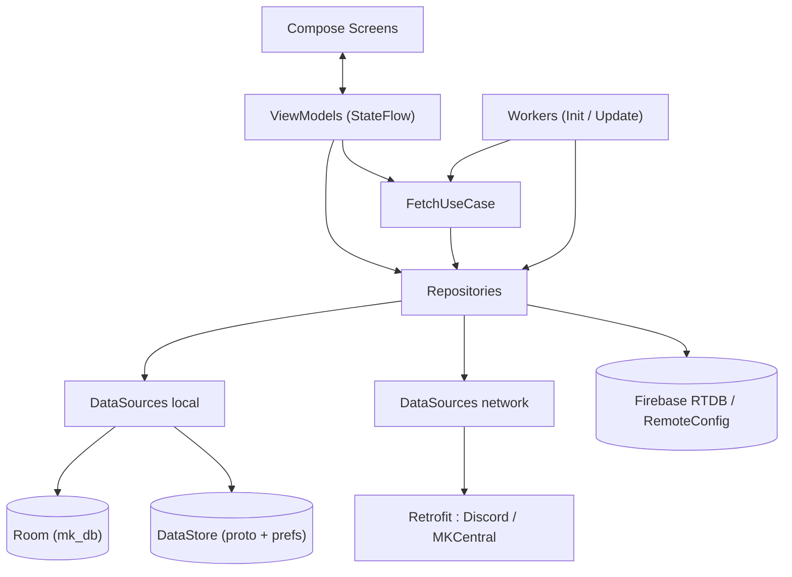

# Documentation technique — Stats MKWorld

> Application Android de suivi statistique des *wars* (matchs d'équipe) Mario Kart World.
> Version 3.0.0 — `versionCode` 23 — package `fr.harmoniamk.statsmkworld`.
> Document de référence pour l'architecture, les modèles, les algorithmes et les intégrations. Volet utilisateur : [FUNCTIONAL.md](FUNCTIONAL.md).

## Sommaire

1. [Vue d'ensemble](#1-vue-densemble)
2. [Stack & dépendances](#2-stack--dépendances)
3. [Architecture générale](#3-architecture-générale)
4. [Injection de dépendances (Hilt)](#4-injection-de-dépendances-hilt)
5. [Démarrage & navigation](#5-démarrage--navigation)
6. [Modèle de données : les trois couches](#6-modèle-de-données--les-trois-couches)
7. [Le domaine « War » en détail](#7-le-domaine-war-en-détail)
8. [Algorithmes de scoring](#8-algorithmes-de-scoring)
9. [Moteur de statistiques](#9-moteur-de-statistiques)
10. [Persistance](#10-persistance)
11. [Repositories](#11-repositories)
12. [Data sources & APIs](#12-data-sources--apis)
13. [Le UseCase de synchronisation](#13-le-usecase-de-synchronisation)
14. [Tâches de fond (WorkManager)](#14-tâches-de-fond-workmanager)
15. [Génération PDF](#15-génération-pdf)
16. [Notifications](#16-notifications)
17. [Records du monde (scraping)](#17-records-du-monde-scraping)
18. [Build, signature & configuration](#18-build-signature--configuration)
19. [Sécurité & secrets](#19-sécurité--secrets)
20. [Annexe : circuits (enum Maps)](#20-annexe--circuits-enum-maps)

---

## 1. Vue d'ensemble

Stats MKWorld permet à des équipes compétitives de Mario Kart World d'enregistrer leurs *wars* course par course et d'en dériver des statistiques riches. L'app est *offline-first* (cache Room + DataStore) mais synchronise les wars en temps réel via Firebase.

Trois systèmes externes alimentent l'app :

- **MKCentral** (`mkcentral.com`) — registre communautaire : identité du joueur, équipes, rosters. Aucune authentification.
- **Discord OAuth2** — authentification de l'utilisateur (le `discord_id` sert à retrouver le joueur sur MKCentral).
- **Firebase Realtime Database** — source de vérité des wars (live + historique), des utilisateurs d'équipe et des alliés.

Un quatrième, **`mkwrs.com`**, est scrapé (Jsoup) pour les records du monde (fonction debug).

| Paramètre | Valeur |
|---|---|
| `applicationId` | `fr.harmoniamk.statsmkworld` (suffixe `.debug` en debug) |
| `minSdk` / `targetSdk` / `compileSdk` | 28 / 35 / 35 |
| Langage / JVM | Kotlin 2.2.20 / Java 17 |
| Projet Firebase | `stats-mkworld` — RTDB région `europe-west1` |
| Base de données Room | `mk_db`, version 8, `fallbackToDestructiveMigration()` |
| MultiDex | activé |

---

## 2. Stack & dépendances

Versions centralisées dans `gradle/libs.versions.toml` (version catalog).

| Domaine | Bibliothèques |
|---|---|
| UI Compose | BOM 2025.06.01, Material3, Navigation Compose 2.9, Accompanist Pager 0.28, Coil 2.1, Lottie 4.0, MPAndroidChart 3.1, `lifecycle-runtime-compose` (`collectAsStateWithLifecycle`) |
| Vues XML | ViewBinding + DataBinding (uniquement pour le rendu PDF via `tab_pdf.xml` / `detailed_tab_pdf.xml`) |
| DI | Hilt/Dagger 2.57, `hilt-navigation-compose`, `hilt-work` (compiler 1.3) |
| Async | Coroutines + Flow (opt-in `@ExperimentalCoroutinesApi`, `@FlowPreview`) |
| Réseau | Retrofit 2.11, OkHttp 4.12, Moshi 1.15 (codegen KSP) |
| Scraping | Jsoup 1.21.2 |
| Persistance | Room 2.8.4 (KSP), Proto DataStore + Preferences DataStore 1.1.7, Protobuf Lite 3.25 |
| Firebase | BOM 34.15 : Realtime Database, Auth (anonyme), Remote Config, Crashlytics, Analytics |
| Background | WorkManager 2.10 |
| Divers | core-splashscreen, kotlinx-serialization-json, ML Kit Translate 17.0.3 (traduction sur l'appareil des textes de tournoi, #152) |

Plugins Gradle : `com.android.application`, `kotlin.android`, `ksp`, `dagger.hilt`, `kotlin.compose.compiler`, `google-services` 4.4.3, `protobuf` 0.9.4, `firebase.crashlytics`, `kotlin.parcelize`.

---

## 3. Architecture générale

Pattern **MVVM en couches**, flux unidirectionnel, entièrement réactif (Flow), câblé par Hilt.


```mermaid
flowchart TD
    UI["Compose Screens"] <--> VM["ViewModels (StateFlow)"]
    VM --> UC["FetchUseCase"]
    VM --> REPO["Repositories"]
    UC --> REPO
    REPO --> DSL["DataSources local"]
    REPO --> DSN["DataSources network"]
    REPO --> FB[("Firebase RTDB / RemoteConfig")]
    DSL --> ROOM[("Room (mk_db)")]
    DSL --> DS[("DataStore (proto + prefs)")]
    DSN --> RETRO["Retrofit : Discord / MKCentral"]
    WK["Workers (Init / Update)"] --> REPO
    WK --> UC
```

Règles transverses :

- **Distinction réactif vs one-shot** :
  - Restent en `Flow` les flux réellement **réactifs** : lectures Room streaming (`getPlayers/getPlayer/getTeams/getTeam/getWars`), le listener temps réel `FirebaseRepository.listenToCurrentWar`, et les `Flow` DataStore.
  - Sont des **`suspend fun`** les opérations **one-shot** : data sources réseau (MKCentral/Discord → `NetworkResponse<T>`, cf. §12), écritures/mutations de `DatabaseRepository` (sous `withContext(Dispatchers.IO)`) et lectures `.get()` + écritures de `FirebaseRepository`.
- Un écran = un dossier `screen/<feature>/` avec `<Feature>Screen.kt` (Composable) + `<Feature>ViewModel.kt`.
- Composants UI maison préfixés `MK` (`ui/MKButton.kt`, `MKText`, `MKDialog`, `MKTextField`, `MKSegmentedSelector`, `MKLoaderDialog`, `MKBottomSheet`…). Cellules de liste dans `ui/cells/`, widgets de stats dans `ui/stats/`. **`MKButton`** est le bouton **unique** de l'app (#50) : fond **blanc translucide** (`Colors.white30`), **SANS bordure**, libellé **et icône blancs** en majuscules (Urbanist), coins 10 dp. **Un seul style, aucune variante** et aucun second composant bouton (`ui/components.md`). Params variables (non des variantes de style) : `textColor` (blanc par défaut sur le dégradé/cartes sombres ; **`Colors.black` sur surface claire** — les 2 boutons de `MKDialog`, fond blanc, où le blanc serait illisible) et **`icon: Int?`** (drawable de tête optionnel 16 dp ; avec icône : hauteur 46 dp, padding horizontal 12 dp, libellé fontSize 12 + espace 8 dp ; sans icône, libellé centré fontSize 14). État désactivé : fond `whiteAlphaed` + texte atténué (`textColor.copy(alpha = 0.4f)`). Sur demande utilisateur, l'app retient **un unique bouton translucide sans bordure** (ni dégradé, ni bordé) — pas de hiérarchie primaire/secondaire. **`MKSegmentedSelector`** est le **segmented unique** de l'app (style « pill ») : composant **stateless** (`page` = index sélectionné, `onClick` remonte l'index) avec un paramètre **`onDark`** adaptant les couleurs au fond hôte (`true` = carte sombre `blackAlphaed` → texte inactif blanc ; `false` défaut = fond clair du dégradé `BaseScreen` → texte inactif sombre, lisible). Consommé par Accueil (segmentés Moi/Équipe et 5/10 dans les cartes sombres, `onDark = true`), AddWar (12/24), Annuaire (joueurs/équipes), Stats (individuel/équipe, tri des podiums) et Classements (sous-onglets Joueurs/Adversaires/Circuits **et** chips de tri Winrate/Score/compteur). Ne pas recréer de segmented local (`ui/components.md`).
- `ui/MKBottomSheet.kt` : wrapper à slots autour du `ModalBottomSheetLayout` de **Material2** (pas de migration Material3). Paramètres : `sheetState`, `sheetContent` (contenu personnalisé du sheet), `content` (corps de l'écran englobé) et `onBack` optionnel (gère le `BackHandler` : ferme le sheet si visible, sinon délègue). Le pilotage de la fermeture par un flux `onDismiss` côté ViewModel reste à la charge de l'appelant. Utilisé par `TeamProfileScreen` (ajout d'un ally).
- `ui/MKStepper.kt` : **stepper de wizard** unique de l'app (rangée d'étapes de poids égal, étape active = pastille blanche/texte sombre, autres = texte atténué sur fond translucide). **Stateless** (`step` = index courant, `onStepClick` remonte l'index, `enabled` conditionne la cliquabilité par étape). Consommé par `AddWarScreen` (`1 · Adversaire` → `2 · Joueurs` → `3 · Récap`) ; à réutiliser pour le futur wizard de course. Ne pas recréer de stepper local (`ui/components.md`).
- `ui/cells/MKListRow.kt` : **ligne de liste `.lrow`** partagée (pastille avatar MKCentral ou initiales sur fond couleur, titre + slot `titleTrailing`, sous-texte, slot de fin `trailing`). Généralisée par paramètres (`ui/components.md`) et consommée par `ProfileMemberRow` (→ chevron `MKListRowChevron`) et `AddWarScreen` (équipes → chevron ; joueurs → pastille de sélection `MKListRowCheck` ✓ verte).
- `ui/MKChip.kt` : **pilule `.chip`** partagée (coins 20 dp ; actif = fond blanc/texte sombre, inactif = fond blanc translucide/texte blanc ; `enabled = false` grise le libellé et coupe le clic ; `onClick` optionnel = chip purement indicative). Partagée (`ui/components.md`) par les **filtres de résultat** de l'historique des wars et le **compteur de lignes** `− ligne`/`N lignes`/`+ ligne` de l'écran Tab (`EditTabScreen`).

### Performance Compose — passe « fluidité »

Conventions de recomposition à respecter pour tout nouvel écran ou composant :

- **Clés de liste** : sur tout `items(...)`/`itemsIndexed(...)` de `LazyColumn`/`LazyRow`/`LazyGrid`, utiliser un identifiant **primitif stable** (`key = { it.war.id }`, `{ it.id }`, `it.name` pour un enum). Les listes non réordonnables et les grilles de positions saisie (`items(count)`) **conservent l'index par défaut** (pas de `key`). Une clé ne doit jamais être un objet métier / `data class` (crash `Bundle`) ni recalculée à chaque frame (`UUID.randomUUID()`). Cf. rule `.claude/rules/ui/compose.md`.
- **Sortir les calculs lourds de la composition** : tris/filtres/sommes mémoïsés via `remember(clés)` (ex. `WarScoreView` : shocks, pénalités groupées par équipe, scores triés). Dans `AddTrackScreen` (#44) le `Set` des positions prises est un simple `val` en composition — le `when(step)` lit déjà largement le `state`, donc `derivedStateOf` n'y filtrerait aucune recomposition (`ui/compose.md`, anti-pattern). Dans `EditTrackScreen` (#46), l'édition de position/shock est portée par l'état du VM (`selectedPositions`, `shocks`) ; le prédicat « toutes positions distinctes » qui active « Confirmer » (`State.positionsAllDistinct`) est calculé dans le VM, pas en composition.
- **Choix du type de `State`** : `mutableStateOf` (état local possédé, `rememberSaveable` s'il doit survivre à la rotation) vs `derivedStateOf` (dérivation d'un `State` **qui change vite**, sortie rare) vs `val` calculé (dérivation simple, entrée ≈ sortie en fréquence). `derivedStateOf` n'apporte rien s'il enveloppe une valeur dérivée de `state.value` dans un bloc qui lit déjà `state.value` largement → préférer un `val` ou extraire un sous-composable. Cf. rule `.claude/rules/ui/compose.md`.
- **Découpage en sous-composables privés à paramètres stables** : les gros composables monolithiques sont scindés en sections privées recevant des **valeurs déjà calculées** (pas de `filter`/`sortedBy`/`sumOf` à l'intérieur), pour scoper les recompositions à la section dont l'état change. Exemples : `WarScoreView` → `WarScore24pView`/`WarScore12pView` + `PenaltiesSection`/`ShocksSection` ; `TeamProfileScreen`, `AddWarScreen` → header/listes/sections d'action extraits. `CurrentWarScreen` (#43) est un écran unique scrollable (`LazyColumn`) découpé en cartes privées `ScoreCard`/`PlayersCard`/`TracksGrid` + blocs de validation 12/24. `CurrentWarActionsScreen` (#45) : `MKSegmentedSelector` (`ui/components.md`) bascule les 3 onglets **Pénalités / Remplacement / Annuler** en état local (`rememberSaveable`, `ui/compose.md`), contenu scrollable découpé en panels privés `PenaltiesPanel` (**une colonne par équipe** via `groupBy { it.penalty.teamId }` — en-tête nom de roster + tuiles `.penb` empilées ; sélection unique toutes équipes confondues, tuile active en `blackAlphaed` texte blanc), `SubPanel` (lignes joueur `MKListRow` + `MKListRowCheck`) et `CancelPanel` (carte de confirmation `StatCard` + deux `MKButton` de largeurs égales « Supprimer la war » / « Annuler », style unique `MKButton`, #67).
- **Collecte de flux liée au cycle de vie** : `collectAsStateWithLifecycle()` (dépendance `androidx.lifecycle:lifecycle-runtime-compose`) plutôt que `collectAsState()`. Regrouper les `LaunchedEffect(Unit)` multiples en un seul effet clé sur le `viewModel`, avec un `launch` par flux.
- **Calcul de stats hors du thread UI, annulable (#73)** : par défaut, la chaîne d'un `StateFlow` de VM s'exécute sur le thread UI (`viewModelScope` = `Main.immediate`). Les ViewModels qui agrègent des wars (`StatsFullViewModel`, `StatsRankingViewModel`, `MapDetailViewModel`, `OpponentDetailViewModel`, `WelcomeViewModel`, `WarListViewModel`, `PeriodViewModel`) suivent le même schéma : (1) les sources sont combinées en valeur légère (`combine(…, ::Sources)` — data class privée — ou `Pair`/`Triple`) ; (2) la branche de calcul est un **`mapLatest`** (ou `flatMapLatest`) : une nouvelle émission (saison, filtre Amicaux/Officiels, mode Indiv/Équipe, tri) **annule** le calcul devenu obsolète, et à la sortie du `withContext` un résultat obsolète n'est pas émis ; (3) dans ce `mapLatest`, lectures Room / DataStore / Firebase et champs légers du `State` (`seasons`, `selectedSeasonNumber`) restent sur le collecteur, tandis que **toute** la portion CPU — construction des `WarDetails`/`War` (`map { WarDetails(War(it)) }`), `withFullStats`, `computeState`/`computeRankings`, podiums, groupages et tris — est dans `withContext(Dispatchers.Default)`. `MapDetailViewModel` et `OpponentDetailViewModel` séparent deux étages `mapLatest` : construction des `WarDetails` (sources wars + saisons), puis calcul de la vue (mode Indiv/Équipe, tri), pour ne pas reconstruire les `WarDetails` à chaque bascule. **`withContext` ciblé préféré à `.flowOn(Dispatchers.Default)`** (qui relocaliserait les lectures et, via `mergeWith` = `flowOf(this, flow).flattenMerge()` non ordonné, réordonnerait les émissions) — cf. `.claude/rules/viewmodel/viewmodels.md`. Aucune valeur affichée ne change (`stats/calculs.md`). `PlayerMapsRankingScreen`/`PlayerOpponentsRankingScreen` mémoïsent le tri **et** la conversion vers `PodiumEntry` via `remember(sortIndex, source, …)` (`ui/compose.md`). ⚠️ **Écart (audit P8)** : dans `PeriodViewModel`, l'agrégation par joueur (`withPlayersList` par war, qui relit `getPlayers()` Room à chaque war) reste sur le collecteur.
  - **État de chargement au changement de saison** : le compute étant off-main mais non instantané, un `State.loading` est posé **immédiatement à `true`** par `onSeasonSelected` (via `_state`, mergé dans `state`) sur `StatsFullViewModel`, `WelcomeViewModel` et `StatsRankingViewModel` ; le compute émet ensuite `loading = false`. Le chargement est **circonscrit à la zone de données** (spinner à la place de la `LazyColumn`), les **sélecteurs de header restent visibles** : dropdown de saison (slot `headerTrailing` de `BaseScreen`, toujours hors du bloc en chargement → ne disparaît jamais), + segmenteds scope/période (`StatsFullScreen`), onglets/recherche/tri/curseur (`StatsRankingScreen`), carte de salutation + segmenté Moi/Équipe (`WelcomeScreen`). Sur Classements, `onSeasonSelected` pose `loading` via `recompute()` (conserve seasons/listes) et les interactions légères (onglet/tri/recherche/curseur) ne touchent pas `loading`. **Sur `StatsFullViewModel` (#91)** : le VM **mémorise le dernier state complet** (`private var lastComputedState`, mis à jour via `.also` sur la branche `compute`) et `onSeasonSelected` pose `lastComputedState.copy(loading = true)` — le spinner s'affiche **sans vider le header ni les données** (aligné sur `StatsRankingViewModel.recompute()`). `WarListViewModel` non concerné (calcul léger).
  - **Dédup des lectures Room invariantes (accélération réelle, iso-résultat `stats/calculs.md`)** : toute lecture Room/DataStore **invariante** (indépendante de la fenêtre/scope) doit être lue **une fois** en amont et passée en paramètre, jamais répétée dans une boucle par fenêtre/vue. Dans `StatsFullViewModel.computeState`, la liste des équipes adverses (`opponentTeams`) est lue une fois et passée à `computeOpponentRankings` ; le tri chronologique des contributeurs réutilise `chronologicalWars` ; `computeContributorsByWindow` lit `mkcTeam`/`getPlayers` une seule fois. **Coût unitaire (#90)** : `withFullStats`/`withFullTeamStats` sont des calculs purs **sans lecture Room** ; `withFullStats` agrège ses circuits directement sur ses `WarDetails` ; `withFullTeamStats` reçoit les `WarDetails` déjà construits et indexe les wars par id d'équipe en une passe. Le nombre d'appels reste **N membres × 3 fenêtres** (contributeurs), **2 × 3** (player/team) et **6×** `withFullTeamStats` : le calcul paresseux « fenêtre/vue visible » n'est pas engagé tant que la mesure device ne le justifie pas (audit P7).

---

## 4. Injection de dépendances (Hilt)

**Convention récurrente** (à reproduire pour toute nouvelle dépendance) : interface + impl `@Inject constructor` + module imbriqué `@Binds` en `@Singleton`.

```kotlin
interface FooRepositoryInterface { fun bar(): Flow<…> }

class FooRepository @Inject constructor(/* deps */) : FooRepositoryInterface { /* … */ }

@Module
@InstallIn(SingletonComponent::class)
interface FooModule {
    @Singleton @Binds
    fun bind(impl: FooRepository): FooRepositoryInterface
}
```

- Tout est `@Singleton` (repositories, data sources, APIs, `FetchUseCase`).
- **Workers** : `@HiltWorker` + `@AssistedInject constructor(... @Assisted context, @Assisted params)`.
- **ViewModels** : `@HiltViewModel`. Ceux qui ont besoin de paramètres runtime exposent une `@AssistedInject Factory`, consommée via `hiltViewModel(creationCallback = { f -> f.create(...) })` dans `RootScreen.kt`.
- `MainApplication` est `@HiltAndroidApp` et implémente `Configuration.Provider` pour fournir la `HiltWorkerFactory` à WorkManager (l'initializer par défaut est désactivé dans le `AndroidManifest`).

---

## 5. Démarrage & navigation

### `MainViewModel` — choix du `startDestination`

```kotlin
val player = dataStoreRepository.mkcPlayer.firstOrNull()
when {
    remoteConfigRepository.minimumVersion() > BuildConfig.VERSION_CODE -> needUpdate = true
    player?.id != 0L  -> startDestination = "Home"
    else              -> startDestination = "Signup"
}
```

`processIntent` extrait le `code` OAuth d'un deep link `statsmkworld.com?...=code` (split sur `?` puis `=`) et force `Signup`. `initStats()` lance `InitStatsWorker` (one-time, tag `"InitStats"`).

### Graphe `RootScreen.kt`

`NavHost` avec transitions slide (700 ms). Les objets complexes (`WarDetails`, `WarTrackDetails`) transitent par `savedStateHandle` plutôt que par la route (ils sont `Parcelable`/`Serializable`). `StatsType` (`screen/stats/StatsType.kt`), émis par `StatsRankingScreen`, est **dispatché en segments de route** par `RootScreen.onStats` vers les fiches dédiées Joueur/Adversaire/Circuit. `RootScreen` enregistre aussi la tâche périodique `UpdateDataWorker` dans un `LaunchedEffect`.

| Route | Écran | Argument(s) |
|---|---|---|
| `Signup` | Onboarding + Discord OAuth | `code` (clé VM) |
| `Home` | Conteneur 5 pôles (Welcome / WarList / Stats / Rankings / Profil) | — |
| `Home/Registry` | Annuaire joueurs/équipes (via icône recherche) | — |
| `Home/AddWar/{is24p}` | Segmenté 12/24 + choix adversaire(s) + composition | `Bool` |
| `Home/CurrentWar` | War en cours (live) | — |
| `Home/CurrentWar/AddTrack/{is24p}` | Saisie d'une course | `Bool` |
| `Home/CurrentWar/Actions` | Pénalités / remplacements / annulation | — |
| `Home/WarDetails` | Détail d'une war | `war` (savedState) |
| `Home/WarDetails/Tab` | Génération du tableau (PDF) | `details` (savedState) |
| `Home/TrackDetails/{editing}` | Relecture d'une course (lecture seule) | `track` + `courseNumber` (Int), savedState ; `editing` (Bool) en route |
| `Home/EditTrack/{is24p}` | Édition d'une course | `track` + `Bool` |
| `Statsfull/{userId}/{kind}` | Stats détaillées d'un joueur donné (vue Individuelles paramétrée) ; « voir tout » : `Statsfull/{userId}/{kind}/Maps|Opponents/{isTeam}` | `String` + filtre (#103) |
| `Home/WarList/{userId}/{kind}` | Historique des wars **filtré sur un joueur** (#65 ; `userId` = id du joueur ou `me`) | `String` + filtre (#103) |
| `Home/Period/{kind}` | « Voir par période » (#80 ; historique + classement joueurs sur une plage de dates) | filtre (#103) |
| `Opponent/{teamId}/{userId}/{season}/{kind}`, `Map/{trackIndex}/{userId}/{season}/{kind}` (+ sous-routes « voir tout ») | Fiches détail Adversaire / Circuit (#27) | saison (#91) + filtre (#103) |

**Segment `{kind}` (#103)** : filtre Amicaux/Officiels hérité de l'écran parent, encodé par `WarKindFilter.routeSegment` (`all` / `friendly` / `official`) et relu par `WarKindFilter.fromRouteSegment` (inconnu → les deux cochés). Les pôles créent leur VM avec `WarKindFilter()` (filtre non mémorisé) ; les callbacks vers un enfant (`onResults`, `onMapsRanking`/`onOpponentsRanking`, `onPeriodView`, `StatsType.kindFilter`) portent le filtre courant.
| `Player/Profile/{id}` | Profil joueur (`me` ou id) | `String` |
| `Player/Profile/Debug` | Écran debug | — |
| `Team/Profile/{id}` | Profil équipe | `String` |
| `Tournament/{id}` | Fiche tournoi officiel (#152), ouverte au clic sur le badge de la carte score (détail de war, war en cours) | `Tournament.name` |

**Pôle Wars & sélecteur de mode.** Le bouton « Créer une war » et le segmenté 12/24 vivent dans le pôle Wars. `WarListScreen` reçoit `onAddWar` (câblé au callback `Home/AddWar/{is24p}` du graphe racine, via `HomeScreen`) et `onCurrentWar`. **Le bouton « Créer une war » est l'action DROITE de l'appbar** (`BaseScreen(onSearch=…, actionIcon=ic_add, actionContentDescription=…)`, #50) : il n'est **affiché que si aucune war n'est en cours** (`state.currentWar == null`, via `.takeIf`). Le slot d'action droit de `BaseScreen` est paramétrable (icône/description, défaut = loupe→registre, `ui/components.md`). L'écran Wars étant une racine de pôle (pas de bouton retour), le slot gauche est libre et le droit porte l'action. Le segmenté 12/24 est **sur `AddWarScreen`** mais **masqué pour la MEP (#91)** : son `MKSegmentedSelector` est **commenté** (pas supprimé) — la création se fait donc uniquement en **12p** (`is24p = false`, semé par la route). L'argument de route `{is24p}` sert toujours à **semer la valeur initiale** passée à la factory `@AssistedInject` (`initialIs24p`) ; le mode reste un **état interne réactif** du VM (`private var is24p`, exposé dans `State.is24p`) et `viewModel.onModeChange(is24p)` est **conservé mais non appelable depuis l'UI** (revient à l'étape 1 et réinitialise la sélection d'adversaires, 1 vs 3, quand il sera réactivé). Tout ce qui dépend du mode (`State.opponentCount`, `nextButtonEnabled` dans `commitTeam`/`onRemoveTeam`, `createWar`) lit `is24p`/`State.is24p`. Cf. rule `.claude/rules/ui/compose.md` (« un switch met à jour l'affichage dynamiquement, jamais par re-navigation »).

**`AddWarScreen` — wizard 3 étapes (#42).** Écran unique (`ui/components.md`). En tête, le `MKSegmentedSelector` (12/24) est **commenté/masqué pour la MEP (#91)** ; seul le `MKStepper` (`1 · Adversaire` → `2 · Joueurs` → `3 · Récap`) pilote l'état réactif du VM. L'étape courante est `State.step` (0/1/2), la bascule est **dynamique** (sans pager ni re-navigation). Étape 1 : `LazyColumn` de `MKListRow` (équipes) avec **sélecteur de roster inline** (`RosterPicker`) déplié sous la ligne d'une équipe multi-rosters (`State.expandedRosterTeamId`/`expandedRosters`). Étape 2 (`PlayersStep`) : carte de progression (`selectedPlayerCount / 6`) + joueurs groupés par roster en `MKListRow` + `MKListRowCheck`. `State.opponentPreviews` (nom/tag roster + avatar équipe) sert au **Récap** (adversaires). **Aucun CTA** — `onPlayerSelected` pose `step = 2` dès que la composition atteint **exactement 6** joueurs (et `step = 1` sinon), la bascule vers le Récap est donc **automatique**. Étape 3 (`RecapStep`) : rappel des adversaire(s) (`MKListRow`, nom/tag roster + avatar équipe, `ui/roster-player-display.md`), **sélecteur de tournoi** (#103 : « Aucun (amical) » + une `MKListRow` par `Tournament`, slot `leading` = `TournamentBadge`, choix unique `MKListRowCheck`, `State.tournament`, passé en `War.tournamentId` par `createWar`) et de la line-up (`State.selectedPlayers`, `MKListRow` + `MKListRowCheck`), pied `Précédent` (→ étape 2) + **unique bouton de lancement** `Démarrer la war` (`MKButton`, style unique de l'app) → `createWar()`. **Gating du stepper** : l'index Joueurs exige `nextButtonEnabled` (adversaire complet), l'index Récap exige `nextButtonEnabled && buttonEnabled` (adversaire complet **et** 6 joueurs). Le `BackHandler` recule d'une étape (3→2→1) avant de retirer l'équipe / quitter. **Retour arrière = reset de l'étape rejointe** (`ui/compose.md`, section wizard/stepper) : `onStepChange(step)` distingue le sens (`step >= current` → simple changement d'étape ; `step < current` → reset). Le retour à l'Adversaire (1ʳᵉ étape) appelle `resetOpponentSelection()` = **remise à zéro complète** (step=0, `teamSelected=null`, rosters/previews vidés, `teamList=teams`, sélecteur inline replié, **ET line-up remise à zéro** — `playerList` tous `isSelected=false`, `buttonEnabled=false`) — **mutualisé avec `onModeChange`** (≥ 2 appelants, `data/repositories.md`, `kotlin/constantes-extensions.md`) ; le retour aux Joueurs appelle `resetPlayerSelection()` (step=1, la line-up : tous les `PlayerSelector.isSelected=false`, `buttonEnabled=false`, **et le tournoi du Récap**, #103). Les deux resets remettent `State.tournament = null`. « Précédent », `BackHandler` et clic stepper passent tous par `onStepChange` → reset automatique. **Stabilité sélection adversaire → joueurs (#91)** : `commitTeam` repart de `state.value` (source de vérité unique) avec une **garde d'unicité** (`teamSelected.any { it.id == team.id }` → `return`) → **pas de double ajout du même adversaire** au double-clic rapide ; les opponent ids sont **dérivés** de `rostersSelected`/`teamSelected` (rosterId mkworld, sinon fallback teamId) dans `createWar`. La 3ᵉ étape Récap porte le CTA de lancement (demande utilisateur). `AddWarScreen` étant sur le **graphe racine** (poussé par-dessus le pôle Wars, sans bottombar), aucune marge basse bottombar n'est requise (`ui/bottom-nav.md`).

**Écran « Voir par période » (#80) — `screen/warList/period/`.** Bouton **« Voir par période »** (`MKButton`, en tête de `WarListScreen` via le callback `onPeriodView`, **présent sur le pôle Wars seul** — non passé dans la variante `Home/WarList/{userId}`) → route racine `Home/Period` (poussée par-dessus le pôle Wars, sans bottombar → pas de marge basse, `ui/bottom-nav.md`). `PeriodViewModel` (`@AssistedInject`, filtre Amicaux/Officiels hérité du pôle Wars via `{kind}`, #103 ; **logique mono-consommateur → dans le VM, pas dans `FetchUseCase`**, `data/repositories.md`) combine `databaseRepository.getWars()` (Flow Room streaming) avec un `MutableStateFlow<Pair<Long,Long>?>` de plage ; à la première émission la plage est **semée sur la saison en cours** (`getSeasons().lastOrNull { end == null }` → `start` .. `min(end?, now)`), ensuite pilotée par `onRangeSelected(dateA, dateB)` (bornes ré-ordonnées `min`/`max`). Filtre : **12p** (`teamOpponent.size == 1`), roster hôte, et `war.id` (epoch ms **brut**, pas la string formatée) `in [dateA, dateB]`. Onglet **Wars** = `WarDetails` → `WarCell` (`ui/components.md`) ; onglet **Joueurs** = agrégats par joueur calculés en **une passe par war via `War.withPlayersList`** (source de vérité score/shocks/présence) : un joueur avec `trackPlayed > 0` compte pour « a joué cette war » (cohérent avec la somme de points). `% participation = warsJouées.percentOf(nb wars équipe période)` (formule #78, dénominateur nul → 0 %), `score moyen = somme points / warsJouées` (moyenne PAR WAR), `shocks = Σ shockCount`, tri par `warsPlayed` décroissant. Rendu par `PodiumRow`/`MKPodiumCell` (3 par ligne, médaillon + 3 stats, `ui/components.md`). **`viewmodel/viewmodels.md`** : `_state`/`state` déclarés avant toute logique ; **`data/repositories.md`** : lectures one-shot en `firstOrNull`, seule la liste des wars est un `Flow`. Sélecteurs de dates via `DatePickerDialog` Material3 (pas de composant date maison, `ui/components.md`).

**Photos de profil des joueurs (AddWar).** `AddWarViewModel.resolvePlayerAvatars(players)` résout **une seule fois** (garde `avatarsRequested`), en **parallèle** (`coroutineScope { players.map { async { getPlayer(id) } }.awaitAll() }`, même pattern que `TeamProfileViewModel.resolveMembers`), la photo `MKCPlayer.userSettings.avatar` (préfixée `https://mkcentral.com`) de chaque joueur de **ton roster** (y compris alliés), et pousse la `Map<playerId, url>` dans `State.playerAvatars`. La map est portée par le `@Volatile private var playerAvatars` réinjecté dans le `State` construit par le `zip` (survit à ses ré-émissions) puis dans `_state` à la fin de la résolution — rendu **réactif** : les cellules `MKListRow` (étape 2 **et** line-up du Récap) passent des initiales colorées à la photo (`avatarUrl = state.playerAvatars[id]`, repli initiales si absent, `ui/roster-player-display.md`). **`viewmodel/viewmodels.md` respectée** : `_state` puis `state` déclarés avant toute souscription ; `resolvePlayerAvatars` ne fait que `launch` une coroutine (lecture différée de `state.value`, aucune lecture synchrone pendant la construction).

**Header commun (`BaseScreen`) — appbar + retour + edge-to-edge (#50).** L'en-tête de `BaseScreen` est une **bande pleine largeur** (fond `Colors.appbar` = rgba(48,51,54,.5)), **titre Bungee blanc aligné à gauche** + sous-titre `white66`, **bouton retour** optionnel (`onBack`) à gauche et **action loupe→registre** (`onSearch`) à droite, tous deux rendus par le bouton d'icône `.ic-btn` (carré 32 dp, coins 10 dp, fond `white30`, bordure `whiteBorderSoft`, icône blanche 17 dp ; drawable `ic_arrow_back` créé). **Edge-to-edge** : `MainActivity.enableEdgeToEdge()` étend le contenu derrière les barres système ; le fond de la bande d'appbar (et le dégradé) **couvre la zone status bar jusqu'au bord haut physique**, tandis que le CONTENU de la bande (titre/boutons) est repoussé sous la status bar via un top padding = `WindowInsets.statusBars` (les écrans sans titre compensent eux-mêmes l'inset). La bottombar du pôle (`NavigationBar` Material3) gère seule l'inset `navigationBars`. `BaseScreen` prend donc un nouveau paramètre `onBack: (() -> Unit)?`. **Tous les écrans poussés** du graphe racine le câblent (MapDetail, OpponentDetail, StatsFull en fiche, Player/TeamProfile, WarDetails, TrackDetails, CurrentWar/Actions, EditTrack, EditTab, Debug, Registry, Stats, AddWar/AddTrack). Pour les wizards (`AddWar`/`AddTrack`), le bouton retour de l'appbar partage **le même** `handleBack` étape-conscient que le `BackHandler` système. Cas onglet (`ui/bottom-nav.md`) : `StatsFullScreen` n'affiche le retour d'appbar **qu'en fiche poussée** (`showTabs=false`) ; en onglet du pôle Stats, pas de retour d'appbar. Les racines de pôle (`WelcomeScreen`, `WarListScreen`, `ProfileScreen`, `StatsRankingScreen`, `StatsFullScreen` en onglet) n'ont **pas** de retour d'appbar.

**Photos de profil des joueurs — médaillon partagé + `PlayerEntity.avatar` (#50).** Un composant **unique** `ui/cells/PlayerMedallion.kt` (`ui/components.md`) rend le médaillon joueur : pastille circulaire colorée portant les initiales, **surmontée de la photo** (`AsyncImage` Coil) si un chemin d'avatar est fourni. La photo étant dessinée **au-dessus** de la couche d'initiales, celles-ci servent de fallback **naturel** pendant le chargement asynchrone **et** en cas d'échec/absence (Coil ne dessine rien tant qu'il n'a pas chargé, ni en erreur → les initiales transparaissent). Le composant préfixe les chemins **relatifs** via `String.mkcentralUrl` (`extension/StringExtension.kt`, laisse passer les URL absolues). Il remplace toutes les pastilles d'initiales dupliquées : `MKPodiumCell` (podiums Stats + Classements), `MKListRow` (et ses appelants : membres/alliés du Profil, AddWar, CurrentWar/Actions), contributeurs et en-tête de `StatsFullScreen`, pilotes (`MapDetail`/`MapPilotsRanking`), joueurs des Classements, `ProfileHeaderCard`. Côté données, **`PlayerEntity` porte un champ `avatar: String?`** (chemin relatif MKCentral) — **Room v7** (`fallbackToDestructiveMigration` : perte locale acceptée, re-synchro). **Peuplement (endpoints, vérifié sur l'API live)** : ni l'endpoint **liste** (`registry/teams?…`) ni l'endpoint **détail** d'équipe (`registry/teams/{id}` → `MKCTeamPlayer`) ne portent l'avatar des membres de roster (les `players` du détail n'ont ni `user_settings` ni `avatar` ; le champ `discord` y est `null`). **Seul** `registry/players/{id}` (`MKCPlayer.userSettings.avatar`) le fournit → `fetchTeam` le résout **par membre, de façon SÉQUENTIELLE** (`forEach` par roster puis par joueur, **aligné sur `fetchAllies`**), et **PAS en rafale parallèle** : une rafale de `getPlayer` simultanés se fait **throttler** par MKCentral (réponses `successResponse == null` **sans exception**), si bien qu'**aucun** membre n'obtient sa photo alors que les alliés — résolus un par un — l'obtiennent (bug observé sur l'écran Classements, seul consommateur de la colonne `avatar` en base, les autres écrans résolvant l'avatar à chaud). Chaque appel (`getUser` + `getPlayer`) est **tolérant aux échecs** (`runCatching`/`getOrNull`) : un membre en échec → `avatar` null (initiales), sans casser les autres. Tous les membres traités **à l'identique**, **sans cas spécial** pour le joueur courant (cohérence des listings). Les **alliés** (fetchés en `MKCPlayer` dans `fetchAllies`) récupèrent aussi le leur. `AddWarViewModel.resolvePlayerAvatars`/`TeamProfileViewModel.resolveMembers` conservent en plus leur propre résolution locale (à l'affichage).

`HomeScreen` contient son **propre** `NavHost` à 5 pôles (`BottomNavItem` : WELCOME, WARS, STATS, RANKINGS, PROFILE → routes `Home/Welcome`, `Home/WarList`, `Home/Stats`, `Home/Rankings`, `Home/Profile`) avec `saveState`/`restoreState`. Le `Scaffold` ne propage pas son `innerPadding` : les contenus scrollables de pôle (`WelcomeScreen`, `StatsFullScreen` en `showTabs`, `StatsRankingScreen`, `PlayerProfileContent` / `TeamProfileContent`) réservent la constante partagée **`BottomBarInset`** (`ui/Resources.kt`, 90 dp, #107) ; les écrans du graphe racine (fiches circuit/adversaire et leurs classements) n'ont pas de marge basse. Le pôle **Stats** héberge `StatsFullScreen` (écran riche à onglets Individuelles/Équipe pour le joueur courant, `showTabs = true`, cf. §Stats ci-dessous) ; le pôle **Classements** héberge directement `StatsRankingScreen` (écran unique à sous-onglets Joueurs/Adversaires/Circuits). Le pôle Profil héberge `ProfileScreen` (#28) : **profil unique à onglets fusionnés Joueur / Équipe**, réutilisant `PlayerProfileContent` (de `PlayerProfileScreen`) et `TeamProfileContent` (de `TeamProfileScreen`) — mêmes composables `ColumnScope` que les fiches autonomes du graphe racine, un seul exemplaire (`ui/components.md`). Un `MKSegmentedSelector` bascule l'onglet en état interne (`rememberSaveable`, sans re-navigation, `ui/compose.md`) ; le sheet « Ajouter un ally » y est hébergé. Le style est porté par des composants profil mutualisés dans **`ui/cells/ProfileCells.kt`** (`ProfilePersonCard` = carte identité centrée ; `ProfileInfoCard` = grille 2 colonnes clé/valeur ; `ProfileMemberRow` = ligne `lrow` avec **photo MKCentral** ou initiales + pastille de rôle + chevron ; `ProfileSettingRow` = ligne `setrow` **icône `.si` + titre/sous-titre/toggle** ; `RolePill`/`MkcBadge`), sur les cartes translucides existantes (`StatCard`/`Eyebrow` de `ui/stats/`). Sous-onglets Membres / Alliés = `MKSegmentedSelector` (style pill). Couleur `Colors.gold` (pastille de rôle Leader) ; drawables vectoriels `ic_chevron_right`, `ic_refresh`, `ic_bell`, `ic_cog`, `ic_logout` (icônes des lignes Réglages). **Rôles & avatars réels des membres** calculés par `TeamProfileViewModel` (`State.members: List<MemberInfo>`, chaque membre portant son `rosterId`/`rosterName`) : rôle = valeur du nœud Firebase `users` (`getUsers`, Leader=2/Admin=1/Membre=0 ; repli MKCentral leader/manager pour une équipe publique), avatar = `MKCentralDataSource.getPlayer(id).userSettings.avatar` récupéré en parallèle (`coroutineScope { async }`/`awaitAll`). **Membres regroupés par roster** si l'équipe a **≥ 2 rosters** mkworld (un en-tête `Eyebrow` par roster via le helper `LazyListScope.memberRows`), sinon liste plate. Les boutons « Ajouter un ally » (équipe) et « Ajouter en ally »/« Changer le rôle » (fiche joueur) sont en **largeur intrinsèque, centrés** (via un `Row` centré — solution d'attente avant le ticket UI boutons). Dates de création/inscription affichées **complètes** (`dd/MM/yyyy` / `dd MMMM yyyy`). Le contenu scrollable réserve `BottomBarInset` pour la bottombar (`.claude/rules/ui/bottom-nav.md`). **Aucun CTA vers le pôle Stats** ni « Voir nos confrontations » dans le Profil (décisions utilisateur). Ses actions déconnexion/debug et le clic sur un membre remontent au graphe racine via callbacks (`onDisconnect`, `onDebug`, `onPlayerProfile` → `Player/Profile/{id}`). L'**Annuaire** (`RegistryScreen`) n'est pas un pôle : il est ouvert via une **icône recherche** de `BaseScreen` (paramètre optionnel `onSearch`), présente sur Accueil et Classements, et navigue vers la route racine `Home/Registry`. Le bouton système ← revient à l'écran d'origine (fiche ouverte depuis Classements → retour Classements) car les fiches profils/détails sont poussées sur le graphe racine par-dessus le pôle courant. Au niveau des pôles eux-mêmes, le `BackHandler` de `HomeScreen` applique le pattern bottom-nav standard : ← depuis un pôle autre qu'Accueil ramène au **pôle Accueil** ; ← depuis Accueil **quitte** l'app. Le pôle Profil (`ProfileScreen`, dont le sheet `MKBottomSheet` gère le `BackHandler`) reçoit la même navigation « retour Accueil » en `onBack`. (Cf. rule `.claude/rules/ui/bottom-nav.md`.)

**Conventions de performance Compose** (à respecter pour tout nouvel écran/cellule) :

- **Clés de liste** : chaque `items(...)` (colonne/grille) sur données métier reçoit une clé stable — `key = { it.war.id }`, `{ it.id }` (joueurs/équipes), `it.name` pour l'enum `Maps`. La clé doit être un type **stockable dans un `Bundle`** (String/Int/Long/…), **jamais un objet ou une `sealed class`** (sinon crash `Type of the key … is not supported`). Les listes sans id primitif stable ou non réordonnables (pénalités `WarPenalty`, lignes du tab) et les **grilles `items(count)` à plage fixe** (positions de saisie 1..12 / 1..24) conservent l'index par défaut (**pas de `key`** — une clé `it + 1` n'apporte rien et peut régresser la sélection). Ne jamais utiliser une clé recalculée à chaque frame (ex. `UUID.randomUUID()`).
- **Calculs hors composition** : tris, filtres et sommes coûteux sont enveloppés dans `remember(clés)` (ou remontés au ViewModel), pas exécutés en pleine composition. Les valeurs dérivées d'un état qui change plus souvent qu'elles utilisent `derivedStateOf` (ex. `Set` des positions sélectionnées).
- **Cycle de vie** : la collecte d'un `StateFlow` d'écran se fait via `collectAsStateWithLifecycle()` (dépendance `androidx.lifecycle:lifecycle-runtime-compose`), pas `collectAsState()`, pour suspendre la collecte hors écran visible.
- **Effets** : regrouper les collectes de plusieurs `SharedFlow` d'événements dans **un seul** `LaunchedEffect(viewModel)` avec un `launch { … }` par flux, plutôt que plusieurs `LaunchedEffect(Unit)`.

---

## 6. Modèle de données : les trois couches

Un même domaine est représenté **trois fois** ; les conversions se font par constructeurs dédiés. Ne pas les confondre.

| Couche | Localisation | Rôle | Sérialisation |
|---|---|---|---|
| **Firebase** | `model/firebase/` | Source de vérité (RTDB) & objet métier en mémoire | parsing Map manuel (Moshi helpers) |
| **DataStore** | `model/local/Datastore*` | Miroir de la war « en cours » sur disque | Protobuf (`*.pb`) |
| **Présentation** | `model/local/` (`WarDetails`, `Stats`, `TrackStats`…) | Calculs & affichage | — (dérivé) |
| **Room** | `database/entities/` | Cache local des historiques | colonnes + TypeConverters Moshi |
| **Réseau** | `model/network/` | DTO MKCentral & Discord | Moshi (`@Json`) |

### Carte simplifiée des modèles

```
NETWORK (DTO Moshi)            LOCAL / app                  FIREBASE (RTDB · vérité)
model/network/                 model/local/                 model/firebase/

[MKCentral]
  MKCTeam ───────────┐
   └ MKCTeamRoster   ├── conv ──► TeamEntity (Room)
      └ MKCTeamPlayer┘
  MKCPlayer ───────────── conv ──► PlayerEntity (Room) ── conv ──► User
   ├ MKCPlayerRoster                                                ▲
   ├ MKCDiscordInfo              MKCPlayer ───────── conv ──────────┘
   ├ MKCFriendCode
   └ MKCUserSettings
  (chaque MKC* porte son propre .proto ; pas de classe Datastore* intermédiaire)

[Discord / OAuth]  DiscordUser · TokenResponse        (aucun miroir local)

[War — cœur]
  War ◄──── conv ────► DatastoreWar ◄──── .proto ────► WarProto (.pb)   ← war « en cours »
   ├ WarTrack             (miroir DataStore)
   │  ├ WarPosition
   │  └ Shock          War ── wrap ──► WarDetails ──► WarStats ──► Stats
   ├ WarScore                          (présentation / calcul — jamais persisté)
   └ WarPenalty        War ── conv ──► WarEntity (Room · historique)

[Saison — #30]
  Season ◄──── conv ────► SeasonEntity (Room · cache)   ← source RTDB seasons/{teamId}
   (number, start, end?)   (PK composite teamId+number)
```

### Chaînes de conversion

- **War** : `Firebase JSON ──parse──► War` ↔ `DatastoreWar` ↔ `WarProto` (war en cours uniquement) ; `War ──► WarEntity` (Room, via TypeConverters) ; `War ──wrap──► WarDetails` (scores calculés).
- **Joueur** : `MKCPlayer`/`MKCTeamPlayer ──► PlayerEntity` (Room) ; `MKCPlayer`/`PlayerEntity ──► User` (Firebase).
- **Équipe** : `MKCTeam`/`MKCTeamRoster ──► TeamEntity` (Room).
- **Saison** (#30) : `Firebase JSON ──parse (Map.toSeason)──► Season` ↔ `SeasonEntity` (Room, PK composite `teamId+number`), via constructeurs dédiés `Season(entity)` / `SeasonEntity(teamId, season)`. `Season` est `@Parcelize`/`Serializable`. Pas de couche DataStore (la saison n'a pas d'état « en cours » local type war).

Les modèles firebase (`War`, `WarTrack`, `WarPosition`, `WarPenalty`, `WarScore`, `Shock`) sont `@Parcelize`/`Serializable` et possèdent chacun un `constructor(datastore…)`. Les `Datastore*` possèdent un `constructor(firebase…)`, un `constructor(proto…)` et un getter `proto`. À noter : `DatastoreWar` **réutilise directement** les types firebase `WarTrack`/`WarScore`/`WarPenalty` dans ses champs (seuls `DatastoreWarTrack`/`DatastoreWarPosition` sont des classes distinctes). Les DTO `MKCPlayer`/`MKCTeam` portent quant à eux leur sérialisation Protobuf **en interne** (getter `proto` + `constructor(proto…)`, via les `serializers/`), sans classe `Datastore*` dédiée.

### Identité MKCentral : équipe, roster, joueur

Distinction structurante (source de confusion fréquente) :

| Modèle | Identifiant | Représente |
|---|---|---|
| `MKCTeam` | `id` = **teamId** | L'**équipe entière**, qui peut regrouper plusieurs rosters |
| `MKCTeamRoster` | `id` = **rosterId**, `teamId` → `MKCTeam.id` | Un **roster** d'une équipe (vue « équipe »), filtrable par `game`/`mode` |
| `MKCPlayerRoster` | `rosterID`, `teamID` | Le même roster vu **côté joueur** (proto `MKCRosterProto`) |
| `MKCTeamPlayer` | `playerId` | Un joueur listé dans un roster |

- Un roster MK World se filtre par `game == "mkworld"` (filtre répété, cf. audit D28).
- Dans l'app, **les joueurs sont rattachés à leur `teamId`** (consultation de tous les rosters), tandis que **les wars sont rattachées au `rosterId`** (hôte comme adversaire) pour différencier les rosters d'une équipe en multi-roster.
- **Création de war** : l'hôte est enregistré via son `rosterId` (`PlayerEntity.rosterId` mkworld) et, depuis la sélection de roster adverse (`AddWarViewModel`), l'adversaire aussi. À la sélection d'un adversaire, `AddWarViewModel.onTeamSelected()` appelle `mkCentralDataSource.getTeam(teamId)` et filtre `game == "mkworld"` : **un seul roster** → le `rosterId` est retenu directement (`commitTeam`, passage à l'étape 2) ; **plusieurs rosters** → un **sélecteur inline** se déplie sous la ligne (`State.expandedRosterTeamId`), et `onRosterSelected(team, roster)` retient le roster choisi. `commitTeam` applique une **garde d'unicité** (pas de double ajout du même adversaire, #91). Le `rosterId` par adversaire est **dérivé** de `State.rostersSelected`/`teamSelected` (rosterId mkworld, sinon fallback teamId ; index aligné sur `teamSelected`) puis écrit dans `War.teamOpponent` par `createWar()`.
- **Résolution `rosterId → équipe/roster`** (affichage & stats adverses) : `War.teamOpponent` contient des `rosterId`, alors que `TeamEntity` reste **clé par teamId**. Pour éviter toute restructuration de la table équipes / de la chaîne de fetch, `TeamEntity` porte une colonne **`rosters: List<RosterInfo>`** (Room **v6**, `RosterInfoConverter` Moshi) = métadonnées `{id, nom, tag}` des rosters mkworld de l'équipe, renseignée par `TeamEntity(MKCTeam)` (les rosters sont déjà dans la réponse liste `getTeams`, **aucun appel réseau supplémentaire**). `FetchUseCase.fetchTeams()` **ne persiste pas** une équipe sans roster mkworld (`rosters` vide) — sauf l'équipe spéciale « 6v6 Squad », conservée volontairement hors filtre. Deux mécanismes distincts en découlent :
  - **Affichage (nom/tag du roster, avatar de l'équipe)** : `databaseRepository.getTeam(id)` matche d'abord par teamId (clé primaire), à défaut par l'équipe dont l'un des `rosters` porte l'`id` → on remonte l'équipe parente. L'extension `War.opponentTeams(databaseRepository)` **remplace alors nom/tag par ceux du roster** (avatar/couleur de l'équipe conservés) **en gardant le rosterId comme `TeamEntity.id`** (indispensable pour apparier adversaire ↔ score/pénalité dans `WarScoreView`). Côté **hôte**, les VMs (`WarCell`, `CurrentWarCell`, `WarDetails`, `CurrentWar`, `AddTrack`, `CurrentWarActions`) posent `teamHost = TeamEntity(host).copy(name = rosterName, tag = rosterTag)` (avatar équipe, nom/tag roster). **Résolution non destructive** : si `getTeam(id)` renvoie `null` (équipe/roster disparu du cache, war legacy jamais synchronisée), `opponentTeams` ne **supprime pas** l'adversaire (pas de `mapNotNull`) : il retombe sur la fabrique unique `TeamEntity.unknown(id)` (`database/entities/TeamEntity.kt` : `name = "Équipe inconnue"`, `tag = "???"`, `logo = null`, partagée avec `OpponentDetailViewModel` et `MapDetailViewModel`) conservant l'id, pour ne jamais faire disparaître l'adversaire (nom + logo absents). Principe général : cf. rule `.claude/rules/ui/roster-player-display.md`.
  - **Classement adverse — un item PAR ROSTER** (`StatsRankingViewModel` / `StatsFullViewModel` → `withFullTeamStats`) : pour chaque `RosterInfo` de chaque `TeamEntity`, un `OpponentRanking` distinct est produit, clé par le **rosterId**, agrégeant les wars dont l'opposant = ce rosterId (`hasTeam(rosterId)`), affiché avec le **nom/tag du roster** et l'avatar de l'équipe (`team.copy(id = rosterId, name = roster.name, tag = roster.tag)`). Les rosters d'une même équipe ne sont **pas** fusionnés (ex. équipe à 2 rosters, 4 wars → 2 items de 2 wars). Un **item de niveau équipe** (clé teamId) capte en plus les **wars legacy** (opposant = teamId, avant la granularité roster) pour ne pas les perdre. `toTeamStats` (sous-stat « adversaire le plus joué ») résout un id par teamId **ou** rosterId → équipe parente. Aucune normalisation préalable n'est appliquée.
  - **Détail d'un adversaire** (`OpponentDetailViewModel`, `StatsType.OpponentStats`) : le classement fournit un **rosterId** (ou un teamId pour l'item legacy) ; les wars sont filtrées **directement** par cet id (`hasTeam(id)`), **sans** normalisation rosterId→teamId (sinon les rosters seraient re-fusionnés). L'en-tête du détail affiche le nom/tag du roster (avatar de l'équipe).
  - **Migration teamId → rosterId de l'historique (Ticket 4)** : action **manuelle** de l'écran Debug (« Migrer les adversaires (teamId → roster) » → `DebugViewModel.onMigrateOpponents()` → `FetchUseCase.migrateOpponentsToRoster()`), sur le patron de « Gérer les transferts ». Objectif : fusionner le doublon d'une équipe **mono-roster** affrontée avant ET après le passage rosterId (item équipe legacy + item roster) en réécrivant le `teamId` en `rosterId` dans les wars **historiques**. Mécanisme : à partir du cache local des équipes, on construit la map `teamId → rosterId` **uniquement pour les équipes à exactement un roster mkworld** (`TeamEntity.rosters.size == 1`) **dont le rosterId cible est résolvable localement** (`getTeam(rosterId) != null`) — garde-fou évitant d'écrire un rosterId qui ne se résoudrait plus au nom/logo à l'affichage ; pour chaque nœud hôte (`wars/{rosterId}` des rosters mkworld de l'équipe courante), on lit `getWars(host)`, on remappe chaque entrée de `War.teamOpponent` (24p : les 3 opposants indépendamment), et on réécrit via `writeWar(host, war)` **seulement si `teamOpponent` a changé**. **Idempotent** : une valeur déjà rosterId ne matche aucun teamId connu, une équipe multi-rosters est ignorée (roster joué à l'époque inconnu — limite assumée) → 2ᵉ exécution sans écriture. `currentWars` **volontairement exclu**. Aucun appel réseau MKCentral (s'appuie sur les équipes déjà synchronisées). Après migration, une équipe mono-roster ne produit plus qu'un seul `OpponentRanking` (roster), legacy et nouvelles wars réunies.
- ⚠️ **Limite (Ticket 4)** : les équipes **multi-rosters** restent en `teamId` dans l'historique (migration impossible sans connaître le roster joué à l'époque). Un adversaire dont l'équipe n'est pas (encore) en cache local (`rosters` vide/absent) n'est pas résolu tant que l'historique n'est pas migré. Voir [AUDIT.md §2 B11](AUDIT.md#2-bugs--correctness).
  - **Diagnostic des adversaires « Équipe inconnue »** : action **manuelle non destructive** de l'écran Debug (« Diagnostiquer les adversaires inconnus » → `DebugViewModel.onDiagnoseUnknownOpponents()` → `DiagnosticRepository.diagnoseUnknownOpponents()`). Toute la logique de diagnostic debug (adversaires + joueurs manquants) vit dans `repository/DiagnosticRepository.kt` — interface + module `@Binds @Singleton` injectant Firebase/MKCentral/Room/DataStore — et **non** dans `FetchUseCase`, car consommée par le **seul** `DebugViewModel` (cf. rule `.claude/rules/data/repositories.md`). Étape 0 du ticket : lister les wars dont un id de `War.teamOpponent` ne se résout à **aucune** `TeamEntity` locale (même échec que `War.opponentTeams`), puis tenter pour chaque id une résolution MKCentral dédiée. Le diagnostic réutilise l'**unique endpoint liste** `MKCentralApi.getTeams(page)` = `registry/teams?game=mkworld&mode=150cc&is_historical=false&is_active=true&min_player_count=6` — le **même** que la synchro registre, **miroir du filtre par défaut du site MKCentral « Équipes actives avec plus de 6 joueurs »**. Il charge **une seule fois** la liste des équipes mkworld actives, non historiques et à effectif ≥ 6 (toutes pages, via `fetchAllMkworldTeams`), réutilisée en mémoire pour résoudre chaque id distinct (pas de balayage réseau par id). **Domaine exclusivement mkworld** (cf. rule `.claude/rules/data/mkworld-only.md`) : aucun accès mk8dx. **Conséquence assumée** : les équipes dissoutes/historiques/à faible effectif ne sont **pas** candidates — seules les équipes actives mkworld ≥ 6 joueurs (celles visibles sur le site) le sont ; les cas hors périmètre passent par l'**override manuel** ou la suppression. **Résolution en deux temps** : (1) l'id brut est résolu en une **équipe source** mkworld (`rawId == roster.id` ou `== teamId`) ; (2) à partir du **nom/tag** de cette source, on cherche des **candidats mkworld** : les équipes mkworld (ayant au moins un `roster.game == "mkworld"`) dont le `tag` **ou** le `name` matche en sous-chaîne insensible à la casse **dans les deux sens** (même style que `AddWarViewModel.onSearchTeam` ; le tag est le signal le plus fiable, le nom en complément). L'adversaire ayant souvent **recréé une équipe mkworld** avec un nom/tag proche, ce rebond retrouve la cible réattribuable. Résultat par id : `Found(teamId, teamName, teamTag, mkworldCandidates)` où chaque `MkworldCandidate` porte ses `rosters` mkworld (`CandidateRoster{rosterId, name, tag}`) — 0, 1 ou plusieurs, **jamais choisi automatiquement** ; `NotFound` (id source introuvable dans la liste mkworld actives 6+ — équipe dissoute/historique/à faible effectif, ou d'origine mk8dx pure, non couverte par l'override → à traiter par override ou suppression) ; `Error` (réseau). **Override manuel expert prioritaire** : une table `DiagnosticRepository.opponentOverrides: Map<rawId, teamId cible>` (correspondances relevées à la main dans les données historiques de l'équipe) **prend le pas** sur l'heuristique nom/tag ; si `rawId` y figure, l'équipe cible est cherchée par son `teamId` dans `mkworldTeams` et **tous ses rosters mkworld** sont listés comme candidats (toujours sans choix automatique). Si le teamId cible est absent de la liste (équipe hors périmètre actives 6+), on retombe proprement sur l'heuristique. Modèle : `model/local/UnknownOpponentDiagnostic.kt`. **Aucune écriture** : produit uniquement le rapport d'arbitrage affiché dans `DebugScreen` (`UnknownOpponentCell` : liste des candidats + un bouton « Réattribuer » **par roster mkworld candidat**).
    - **Réattribution (paquet A)** — `DiagnosticRepository.reattributeOpponent(hostRosterId, warId, rawId, newId)` réécrit `War.teamOpponent` en remplaçant `rawId` par `newId` (= le **rosterId** d'un roster mkworld candidat choisi par l'humain), **uniquement si `getTeam(newId) != null`** (`ui/roster-player-display.md` — ne jamais écrire un id non résolvable). Un candidat mkworld **actif** est normalement déjà dans le cache local → la réattribution aboutit. ⚠️ **Limite** : un candidat mkworld absent du cache local (roster mkworld non synchronisé) est **listé quand même** (informatif), mais la réattribution vers son id **s'abstient** proprement (`getTeam == null`). Rendre durablement résolvable un adversaire dont aucun candidat n'est en cache demanderait de persister ces équipes hors du filtre de synchro — décision produit hors périmètre de l'Étape 0.
    - **Suppression (paquet B)** — `DiagnosticRepository.deleteWar(hostRosterId, warId)` → `FirebaseRepository.deleteWar(teamId, warId)` retire la war du nœud `wars/{hostRosterId}/{warId}`. Déclenchée après **confirmation** (`MKDialog`) dans l'écran. Stats réhydratées au prochain fetch / `InitStatsWorker`. `currentWars` non concerné.
  - **Diagnostic des joueurs manquants** (miroir du diagnostic adversaires) : action **manuelle non destructive** de l'écran Debug (« Diagnostiquer les joueurs manquants » → `DebugViewModel.onDiagnoseMissingPlayers()` → `DiagnosticRepository.diagnoseMissingPlayers()`). Collecte les `playerId` de toutes les wars des rosters hôtes (`war.tracks.flatMap { it.positions }.map { it.playerId }`), retient ceux absents du cache local (`databaseRepository.getPlayer(id).firstOrNull() == null` — membres + alliés), dédoublonne, compte les wars par joueur, puis résout nom/pays via `mkCentralDataSource.getPlayer(id)` (un appel par id distinct ; id non résolu → `MissingPlayer(name = "Joueur inconnu", country = "")`, entrée conservée). Modèle : `model/local/MissingPlayerDiagnostic.kt` (`MissingPlayer{playerId, name, country, warCount}`). Rendu `DebugScreen` (`MissingPlayerCell`, clé `playerId`) : nom, pays, nb de wars + bouton **« Ajouter en ally »**. `DiagnosticRepository.addMissingPlayerAsAlly(playerId)` écrit l'allié **en local** (`databaseRepository.addAlly(PlayerEntity(player, isAlly = true))`, rosterId `-1`, role 0) **ET sur Firebase** (`firebaseRepository.writeAlly(teamId, User(player))`, nœud `newAllies/{teamId}/{userId}`) — les deux pour la durabilité (sinon `fetchAllies` effacerait l'allié local à la resynchro). Le VM re-diagnostique après ajout pour retirer le joueur de la liste. **Aucune** suppression/écriture de war.
  - **Migration rétroactive des wars officielles (#156)** : action **manuelle en deux temps** de l'écran Debug (« Migrer les wars officielles »), pour rattacher à un tournoi les wars jouées avant #103 (`tournamentId` n'est fixé qu'à la création). **Aperçu (dry-run)** : `DebugViewModel.onPreviewOfficialWars()` → `DiagnosticRepository.findOfficialWarCandidates()` lit `getWars(rosterId)` de chaque roster mkworld de l'équipe courante (`MKCTeam.mkWorldRosters()`, `extension/MKCTeamExtension.kt`) et retient les wars **sans** `tournamentId` dont la création (`War.id` = epoch ms → `Instant.ofEpochMilli(id).atZone(Europe/Paris)`, DST incluse) tombe à une **date du calendrier** inliné (`Map<LocalDate, Tournament>` : Atlas League S1/S2/S3, EuroLeague S1, MKCentral Frontier, Low Div Cup S18) **à partir de 19h30** (aucun match officiel avant 20h). Modèle `model/local/OfficialWarCandidate.kt` (`hostRosterId`, `war` Firebase brute, `tournament`, `createdAt` Paris, `opponents` via `War.opponentTeams` — nom/tag du roster, dégradé « Équipe inconnue », `ui/roster-player-display.md`). Rendu : récapitulatif par tournoi des wars cochées, liste groupée par date (`MKListRow` + `TournamentBadge` + `MKListRowCheck`, clés `"official-<warId>"` pour ne pas heurter les clés `warId` du diagnostic adversaires) ; chaque ligne se **décoche** (`OfficialWarsState.excludedWarIds`) pour écarter une war d'entraînement. **Confirmation** : `onConfirmOfficialWars()` → `migrateOfficialWars(candidates cochées)` **relit** les wars Firebase (le `copy(tournamentId = Tournament.name)` porte sur la war Firebase fraîche, aucun autre champ modifié), n'écrit que celles encore sans tournoi (**idempotent**), séquentiellement (`writeWar(rosterId, war)`), puis **rafraîchit Room en une passe** à partir des wars déjà lues (un seul `clearWars()` + `writeWars` pour toutes les rosters, garde-fou si aucune war lue — `data/repositories.md` / B27, sans passer par `FetchUseCase.fetchWars`). Toast récapitulatif (nb par tournoi) ; « Annuler » vide l'aperçu. Le `tournamentId` ne porte que le tournoi, pas la saison.

### Nom de joueur : affichage du premier pseudo (surcharge non destructive, #79)

MKCentral peut concaténer **plusieurs pseudonymes** d'un joueur dans l'unique champ `name` (`MKCPlayer.name`/`MKCTeamPlayer.name`, persistés dans `PlayerEntity.name` et `User.name`), séparés par des **slashs** (`"A / B / C"`). À l'affichage, on ne montre que le **premier** pseudo via l'extension `String.displayName` (`extension/StringExtension.kt`) : `substringBefore("/").trim()` si un `/` est présent, sinon la chaîne inchangée (aucun slash → comportement d'origine ; chaîne vide → vide).

- **Surcharge d'affichage uniquement** (non destructive) : la donnée brute reste stockée telle quelle en Room/DataStore/Firebase — aucune normalisation au fetch/écriture. L'extension est appliquée **à tous les sites d'affichage du nom de joueur** (médaillon `PlayerCell`, line-up `WarSummaryCells`/`CurrentWarScreen`, podiums/classements `MKPodiumCell` via les `toPodiumEntry` de `StatsRankingScreen`/`OpponentDetailScreen`/`MapDetailScreen`/`PeriodScreen`, fiche joueur `PlayerProfileScreen`, membres/alliés `TeamProfileScreen`, sélection de line-up `AddWarScreen`/`CurrentWarActionsScreen`, cartes course `AddTrackScreen`/`EditTrackScreen`/`TrackDetailsScreen`, `StatsFullScreen`, salutation `WelcomeScreen`, et le tab PDF via `PlayerScoreForTab`).
- **Cohérence intra-listing** (`ui/roster-player-display.md`) : appliquée à **tous** les joueurs d'un même listing, sans cas particulier (y compris le joueur courant).
- N'est **pas** appliquée aux noms d'**équipe/roster** (qui peuvent légitimement contenir un `/`) ni au nom saisi à l'onboarding (`Signup`, écriture de `User.name` brute — pas de format MKCentral concaténé). L'écran Debug affiche volontairement le nom brut (diagnostic).

### ⚠️ Homonyme `WarScore`

Deux classes distinctes portent le nom `WarScore` :
- `model/firebase/WarScore(teamId, score)` — score d'une équipe en mode 24p (source de vérité) ;
- `model/local/Stats.kt → WarScore(war: WarDetails, score: Int)` — score associé à une war pour les **classements** (présentation).

Elles ne sont **pas** interchangeables : vérifier l'`import` lors de toute manipulation de scores (cf. [AUDIT.md §7 G5](AUDIT.md#7-dette-technique--constantes-magiques)).

---

## 7. Le domaine « War » en détail

### Structure

```kotlin
data class War(
    val id: Long,                  // = timestamp de création (Date(id) donne la date)
    val teamHost: String,          // rosterId de l'équipe hôte
    val teamOpponent: List<String>,// 1 adversaire (12p) ou 3 (24p)
    val tracks: List<WarTrack>,
    val penalties: List<WarPenalty>,
    val scores: List<WarScore>,    // renseigné en 24p (saisie manuelle)
    val playerHostId: Long = 0L,   // créateur (currentWars uniquement)
    val tournamentId: String? = null // Tournament.name ; null = amical (#103)
)
data class WarTrack(val id: Long, val index: List<String>, val positions: List<WarPosition>, var shocks: List<Shock>? = null)
data class WarPosition(val id: Long, val playerId: String, val position: Int)
data class WarPenalty(val teamId: String, val amount: Int)   // amount ∈ {10,15,20}
data class WarScore(val teamId: String, val score: Int)      // 24p — immuable (val)
data class Shock(val playerId: String, val count: Int)       // immuable (val)
```

> Les modèles « source de vérité » sont **immuables** (`val` + `copy`) ; seul `WarTrack.shocks` reste `var` (champ optionnel renseigné après coup). `WarScore`/`Shock` sont en `val`.

**`Shock`** : représente l'objet **éclair** récupéré en jeu (item stratégiquement décisif en Mario Kart). Le compteur (`count` par joueur sur une course) sert uniquement à produire des statistiques dédiées — il **n'entre pas** dans le calcul du score d'une course ou d'une war.

**Détermination du mode** : `is24p = teamOpponent.size > 1`. Aucune autre source de vérité — le nombre d'adversaires définit le format partout.

**`WarTrack.index`** : liste d'indices de circuit (`String` → ordinal de l'enum `Maps`). Un seul élément = course « classique » 3 tours ; deux éléments = combo avec **intermission** (mode 24p). `Maps.entries[index.toInt()]` reconstitue le circuit.

**Helpers** :
- `War.hasPlayer(playerId)` : vrai si le joueur a une position sur **toutes** les courses (`tracks.size == tracks.filter{…}.size`).
- `War.hasTeam(teamId)` : `teamHost == teamId || teamOpponent.contains(teamId)`.

### Tournois officiels et filtre Amicaux / Officiels (#103)

- **Répertoire** : enum `model/local/Tournament` (`label`, `logo` = PNG embarqué dans `res/drawable-nodpi/tournament_*.png`, `seriesId`/`namePrefix` = clé de résolution MKCentral, lue par #152). La **liste** reste figée dans l'enum (ajouter un tournoi = release, aucun nœud RTDB) ; seules les données officielles de la dernière saison sont synchronisées (cf. sous-section suivante). Résolution `Tournament.fromId(war.tournamentId)` (id inconnu → `null`, traité comme sans badge).
- **Persistance du champ** `War.tournamentId` (= `Tournament.name`, stable si l'ordre de l'enum change) : Firebase par `setValue` + parsing manuel `Map.toWar()` ; Room `WarEntity.tournamentId` (v9) ; war en cours `DatastoreWar.tournamentId` / `war.proto` `string tournament_id = 7` (chaîne vide proto3 = absent → `null`). Sans le champ proto, les `copy()` + `writeCurrentWar` en cours de war l'effaceraient. Les wars existantes (champ absent) sont amicales, sans migration. Choisi **uniquement à la création** (`AddWarViewModel.createWar`), jamais modifié ensuite.
- **Badge** : composant unique `ui/TournamentBadge.kt` (hauteur fixe, largeur ≤ 3× — logos larges), utilisé par `WarCell` (12p et 24p, via `WarCellViewModel.State.tournament`), la carte de score partagée `WarScoreCard` (`ui/cells/WarSummaryCells.kt`, en 12p, colonnes alignées en haut et colonne centrale calquée sur la grille des côtés : rangée logo de `WarTeamCrestSize` (badge seul, 30 dp, centré sur les pastilles d'équipe), rangée nom vide, rangée score vide sur laquelle la diff est centrée (`WarTeamNameText`/`WarTeamScoreText` partagés avec les côtés, noms non redimensionnables) → pénalité d'un seul côté sans décalage, carte pas plus haute ; en 24p, badge 24 dp au-dessus de la diff, centrage vertical inchangé ; résolu depuis `details.war.tournamentId` — donc identique dans le détail de war et la war en cours, alimentée par `listenToCurrentWar`) et le Récap d'`AddWar`.
- **Données officielles MKCentral (#152)** : `repository/TournamentRepository.fetchTournaments()` (interface + module `@Binds @Singleton`, `data/repositories.md`) parcourt `Tournament.entries` **séquentiellement** (`data/repositories.md`, API derrière Cloudflare, 8 appels au plus) : `tournaments/list?game=mkworld` filtré par `series_id` ou `name` (LIKE, préfixe revérifié côté client), 1ʳᵉ entrée = dernière saison (tri `date_start DESC`), puis `tournaments/{id}`. Textes retenus selon `use_series_description`/`use_series_ruleset` (logique du front MKCentral). Chaque tournoi est enveloppé dans `runCatching` : un échec conserve le cache précédent. Upsert Room `TournamentEntity` (PK = `Tournament.name`, v10). **Seule la saison `game=mkworld` est lue**, y compris pour Frontier/EuroLeague dont la série est mk8dx (jamais `series/{id}`, `data/mkworld-only.md`). Appelants : `UpdateDataWorker` (synchro périodique, nouvelle saison prise en compte sans release) et `InitStatsWorker` **si le cache est incomplet** (moins d'entrées que l'enum : première installation, montée Room, échec précédent) — le périodique ne passant qu'à ~4 h.
- **Logo** (#152) : `TournamentBadge` reste sur le **logo embarqué** (`Tournament.logo`, `Image` + `painterResource`) ; le logo renvoyé par l'API n'est ni mappé ni stocké (décision utilisateur : les 4 logos sont déjà dans l'app, inutile de les charger). Fonctionne hors ligne, sans dépendance au cache.
- **Fiche tournoi** : `screen/tournament/TournamentScreen` + `TournamentViewModel` (`@AssistedInject`, id = `Tournament.name`, lecture Room seule, aucun appel réseau). `WarScoreCard` reçoit `onTournamentClick` (badge cliquable) câblé par `WarDetailsScreen` et `CurrentWarScreen`. Affiche le logo embarqué (`TournamentBadge`), nom officiel de la saison, dates (epoch s → `dd/MM/yyyy`), organisateur · mode, bouton « Voir sur MKCentral » (`/en-us/tournaments/details?id=…`), description et règles ; la section Règles est omise si vide ou identique à la description (Low Div Cup). Cache absent → carte d'état vide. Markdown rendu par `ui/MKMarkdownText.kt`, **sans dépendance** : titres, séparateurs, listes à puces/numérotées, images seules sur leur ligne (planning Frontier), gras, italique, liens `[t](url)` et URL nues (`LinkAnnotation.Url`, cliquables). Markwon a été écarté (rendu View via `AndroidView`, dépendance supplémentaire) : les 4 textes réels n'utilisent que ce sous-ensemble.
- **Traduction (#152)** : `repository/TranslationRepository` (interface + module, ML Kit Translate **sur l'appareil**, ni clé ni backend). Langue cible = `Locale.getDefault()` via `TranslateLanguage.fromLanguageTag` ; anglais ou langue non supportée → `targetLanguage == null`, aucune traduction. `TournamentRepository.translateTournaments()` traduit, avec **un seul** `Translator` (un téléchargement de modèle, ~30 Mo, `requireWifi()`, attente bornée à 60 s ; le téléchargement se poursuit en arrière-plan), les tournois en cache dont `translationLanguage` diffère de la langue courante, puis écrit `descriptionTranslated`/`rulesetTranslated`/`translationLanguage`. Modèle indisponible ou échec → originaux conservés, sans erreur ; `close()` systématique. Appelée à la fin de `fetchTournaments()` (qui **reporte** la traduction existante si les textes originaux n'ont pas changé) et par `InitStatsWorker` quand le cache est complet (rattrape un changement de langue ou un modèle absent la veille). **Markdown préservé** : traduction ligne par ligne ; lignes vides, séparateurs et images inchangés ; préfixes `#`/`-`/`1.` conservés ; liens (seul le libellé est traduit), URL nues et marqueurs `**`/`*` jamais envoyés au traducteur ; un segment sans lettre ou en échec reste en anglais. Regex communes au rendu et à la traduction dans `model/local/MarkdownSyntax`. Pont `Task` → coroutine par `suspendCancellableCoroutine` (`kotlinx-coroutines-play-services` non déclaré, `data/repositories.md`). Fiche : texte traduit par défaut si `translationLanguage` = langue courante, mention « Traduit automatiquement » et bascule « Voir l'original » / « Voir la traduction » (`rememberSaveable`) ; sinon originaux, sans bascule.
- **Filtre** : `model/local/WarKindFilter(friendly, official)` — `toggleFriendly()`/`toggleOfficial()` refusent de décocher la dernière case. `List<WarEntity>.filterByKind(kind)` (`extension/ListExtension.kt`) est appliqué **juste après `filterBySeason`** (avant tout calcul) dans `WelcomeViewModel`, `StatsFullViewModel`, `StatsRankingViewModel`, `WarListViewModel`, `PeriodViewModel` (état `MutableStateFlow<WarKindFilter>` combiné, `onKindFilterChange`) et, hérité en paramètre assisté, `MapDetailViewModel` / `OpponentDetailViewModel`. UI : `ui/MKWarKindFilterRow.kt` (deux `ui/MKCheckbox.kt`, pastille `MKListRowCheck` réutilisée) en tête du contenu, sous les sélecteurs. Filtre **non persisté**.
- **`SeasonFilter`** : `sealed interface` unique (`model/local/SeasonFilter.kt`, `resolve(seasons)` + `of(number)`). `WarFilter` désigne le filtre de résultat V/N/D de `WarListScreen`.

### Équipe synthétique « 6v6 Squad »

`FetchUseCase.fetchTeams()` injecte systématiquement une équipe locale `TeamEntity(id="123456789", name="6v6 Squad", tag="SQ", color=null, logo=null)` pour permettre des wars amicales sans adversaire MKCentral réel. Elle n'a **aucun roster mkworld** (`rosters` vide) : elle est donc écrite **hors du filtre** qui, depuis Ticket 2, exclut de la persistance les équipes sans roster mkworld — c'est le seul cas sans roster volontairement conservé.

---

## 8. Algorithmes de scoring

Tout est dans `extension/IntegerExtension.kt` (`positionToPoints`, `pointsToPosition`, `*ScoreToDiff`) et appliqué dans `WarDetails`/`WarTrackDetails` (`model/local/WarDetails.kt`). **Les constantes magiques sont centralisées dans `model/ScoringConstants.kt`**, avec une déclinaison par mode (suffixe `_24P`) pour celles dont la valeur diffère entre 12p et 24p — voir le tableau ci-dessous.

### Constantes (`ScoringConstants`)

| Constante | 12p | 24p | Sens |
|---|---|---|---|
| `MAX_POINTS_PER_TRACK_*` | `_12P` = 82 | `_24P` = 144 | total de points d'une course |
| `MID_WAR_SCORE` / `MID_WAR_SCORE_24P` | 492 | 864 | milieu (équilibre) d'une war de 12 courses |
| `MID_TRACK_SCORE` / `MID_TRACK_SCORE_24P` | 41 | 72 | milieu d'une course |
| `TOTAL_24P_SCORE` | — | 1728 | total d'une war 24p (12 × 144) — contrôle de saisie |
| `DEBUG_PLAYER_ID` | `"18595"` | — | joueur de référence (mode matrix) |

La sélection se fait via `when (is24p)` partout où la valeur dépend du mode (`WarTrack.diffScore`, `WarTrackDetails.opponentScore`, `Int.warScoreToDiff/trackScoreToDiff`, `AddTrackViewModel`, `TrackDetailsViewModel`).

### Position → points

| Position | 12 joueurs | 24 joueurs |
|---|---|---|
| 1 | 15 | 15 |
| 2 | 12 | 12 |
| 3 | 10 | 10 |
| 4 | 9 | 9 |
| 5 | 8 | 9 |
| 6 | 7 | 8 |
| 7 | 6 | 8 |
| 8 | 5 | 7 |
| 9 | 4 | 7 |
| 10 | 3 | 6 |
| 11 | 2 | 6 |
| 12 | 1 | 6 |
| 13–15 | — | 5 |
| 16–18 | — | 4 |
| 19–21 | — | 3 |
| 22–23 | — | 2 |
| 24 | — | 1 |

`pointsToPosition` est la fonction inverse (sert aux moyennes ; en 24p plusieurs positions partagent un score donc elle renvoie une **liste**, ex. 9 pts → `[4,5]`).

### Totaux et points d'équilibre

- **12 joueurs** : la somme des 12 places = **82 points** par course (réparti entre les 2 équipes de 6). Donc `scoreOpponent = 82 − scoreHost` par course. Une war de 12 courses totalise **984** points, point d'équilibre **492** (`MID_WAR_SCORE`) ; milieu d'une course **41** (`MID_TRACK_SCORE`).
- **24 joueurs** : la somme des 24 places = **144 points** par course (4 équipes de 6). Une war de 12 courses totalise **1728** points (`TOTAL_24P_SCORE`, valeur utilisée pour la validation de la saisie manuelle des scores) ; équilibre **864** (`MID_WAR_SCORE_24P`), milieu d'une course **72** (`MID_TRACK_SCORE_24P`).

### Calculs dans `WarDetails` (12p)

```kotlin
val scoreHost = warTracks.sumOf { it.teamScore }                       // Σ points de l'hôte
val scoreOpponent = (82 * warTracks.size) - scoreHost
val scoreHostWithPenalties     = scoreHost     - Σ penalties(teamHost)
val scoreOpponentWithPenalties = scoreOpponent - Σ penalties(opponent)
val displayedDiff = (scoreHostWithPenalties - scoreOpponentWithPenalties).let { if (it>0) "+$it" else "$it" }
```

`WarTrackDetails` calcule par course : `teamScore = Σ positionToPoints(is24p)`, `opponentScore = maxPointsPerTrack − teamScore` (si ≠ 0, où `maxPointsPerTrack` vaut 82 en 12p / 144 en 24p), `diffScore = teamScore − opponentScore`, `displayedResult = "$teamScore - $opponentScore"`.

Côté modèle firebase, `WarTrack.diffScore(is24p)` est une **fonction** appliquant la même logique mode-aware ; les appelants (`LineChartExtension`, `withTrackStats`) propagent `is24p`.

### Calculs en 24p

Les scores ne sont pas dérivés des positions mais **saisis manuellement** (`War.scores`). `WarDetails.scores` les trie par score décroissant ; `diffs` calcule les écarts successifs (`"+${current − next}"`). En l'absence de scores, défaut `[0,0,0]`.

### Conversion écart ↔ affichage

```kotlin
fun Int.warScoreToDiff(is24p: Boolean = false): String   // milieu 492 (12p) / 864 (24p) : "+X" / "-X" / "0", X = |score-milieu|*2
fun Int.trackScoreToDiff(is24p: Boolean = false): String // milieu 41  (12p) / 72  (24p) : idem
```

> Ces affichages « écart » ne sont en pratique utilisés qu'en **12p** (en 24p l'UI montre les scores absolus) ; le paramètre `is24p` est propagé par cohérence/robustesse — voir [AUDIT.md G2](AUDIT.md).

### Couleurs

`Int?.toTeamColor()` mappe un index d'équipe (1–39) vers une couleur hex. `Int?.positionColor(is24p)` colore les positions (or/argent/bronze puis dégradé orange).

**Contraste victoire/défaite (#50).** `Colors.red` (`#E05D51`) / `Colors.green` (`#4FA96C`) sont des teintes **assombries/saturées** : elles servent de **texte** sur le fond clair du dégradé de `BaseScreen` et restent lisibles sur carte sombre comme en texte blanc sur pastille V/D. `Colors.appbar` (rgba(48,51,54,.5)) colore la bande d'appbar.

---

## 9. Moteur de statistiques

Cœur dans `extension/ListExtension.kt` (`withFullStats`, `withTrackStats`, `withFullTeamStats`, `sizeOrOne`), `extension/WarExtension.kt` (`War.withPlayersList`), `extension/IntegerExtension.kt` (barème `positionToPoints` / inverse `pointsToPosition`, `*ScoreToDiff`) et les classes de `model/local/` (`Stats.kt`, `WarDetails.kt`). Les classements globaux sont **recalculés à la demande** par les ViewModels stats (`StatsRankingViewModel`, `StatsFullViewModel`) sur les wars filtrées par saison (aucun cache).

> **Pourcentages : calcul et format uniques (#99).** Tout pourcentage passe par trois fonctions :
> - `Int.percentOf(total): Double` (`extension/IntegerExtension.kt`) : pourcentage **isolé**,
>   `part × 100 ÷ total` **arrondi au centième**, `0.0` si
>   `total == 0` ;
> - `List<Int>.percentShares(total = sum()): List<Double>` (`extension/ListExtension.kt`) :
>   **répartition** par plus grand reste (méthode de Hamilton sur 10 000 centièmes de %). Des
>   parts qui couvrent tout le total somment **exactement à 100 %**. Si `total` dépasse la somme,
>   l'écart est une part implicite non renvoyée (prioritaire à reste égal, pour que des parts
>   visibles égales le restent) ;
> - `Double.toPercentString(signed = false)` (`extension/DoubleExtension.kt`) : `NumberFormat` de
>   la locale (0 à 2 décimales, `HALF_UP`, sans séparateur de milliers), donc un format **compact** :
>   `50 %`, `33,5 %`, `33,33 %`. Espace **insécable** avant `%` ; `signed` préfixe `+` les valeurs
>   ≥ 0 (deltas).
>
> **Classement des sites.** Passent par `percentShares` (parts affichées ensemble d'un même
> total) : Top 6 / Bot 6 de `DistributionFooter` (positions 1-6 / 7-12 sur toutes les positions,
> soit 100 % en 12p), parts de points des contributeurs (total = points des membres, 100 %), parts
> de shocks des contributeurs et des baggeurs des fiches Circuit/Adversaire (total = shocks de
> l'équipe, alliés compris : ceux-ci forment la part implicite). Restent en `percentOf`
> (pourcentages isolés) : winrates (bilan, classements, podiums, pilotes, adversaires, circuits),
> taux de participation (chaque joueur sur le nombre de wars de l'équipe, pas une répartition),
> `% maps gagnées` et leurs deltas. V/N/D et histogramme des positions : comptes, sans %.
>
> Les champs de pourcentage sont des **`Double`** dès le modèle (`FormStats.winrate`/
> `mapsWonPercent`/`winrateDelta`/`mapsWonDelta`, `TrackStats.winRate`, `RankingItem.winratePercent`,
> `PlayerRanking.participationRate`, `Contributor.*Share`/`winrate`, `Pilot/BaggerRanking`,
> `PeriodViewModel.PlayerPeriodStats.participationRate`). La valeur étant arrondie **au calcul**,
> la valeur stockée = la valeur affichée : tris, seuil de `winrateColor` (50) et deltas portent sur
> le chiffre lu. Les strings à pourcentage reçoivent la chaîne formatée (`%1$s`, plus de
> `%1$d %%`). Les cellules compactes (`KeyTile` de l'Accueil, `MetricTile`, `PodiumCell`)
> affichent la valeur sur une ligne : `MKText(maxLines = 1)` réduit la police au lieu de tronquer.

### 9.0 Données sources et chaîne de transformation

Toutes les stats dérivent en dernier ressort des modèles firebase (source de vérité) :

- **`War`** `(id, teamHost, teamOpponent: List<String>, tracks: List<WarTrack>, penalties: List<WarPenalty>, scores: List<WarScore>, playerHostId: Long = 0L)`. `teamOpponent.size == 1` → **war 12p** ; `> 1` (typiquement 3) → **war 24p**. `playerHostId` = id MKCentral du joueur **créateur** ; il vit **uniquement** sur Firebase (nœud `currentWars`) et en mémoire — **volontairement absent** de `war.proto` (Proto DataStore) et de `WarEntity` (Room), donc `War(DatastoreWar)`/`War(WarEntity)` le laissent à `0L`. Sert à réhydrater le DataStore du créateur si celui-ci est vide (cf. §Firebase, `restoreCurrentWarIfHost`). Parsing null-safe : war legacy sans `playerHostId` → `0L`.
- **`WarTrack`** `(id, index: List<String>, positions: List<WarPosition>, shocks: List<Shock>?)`. `index` = index(s) de circuit (une valeur pour une course simple, deux pour un combo intermission). En 12p, `positions` ne contient que les **6 joueurs de l'équipe hôte**.
- **`WarPosition`** `(id, playerId, position: Int)` : la place d'arrivée d'un joueur sur la course.
- **`WarScore`** (firebase) `(teamId, score: Int)` : score **saisi manuellement** par équipe, utilisé uniquement en 24p.
- **`WarPenalty`** `(teamId, amount: Int)` : pénalité de points appliquée à une équipe.
- **`Shock`** `(playerId, count: Int)` : nombre d'objets éclair pris par un joueur (métier ; sans impact sur le score).

Les modèles de **présentation/calcul** (`WarDetails`, `WarTrackDetails`, `Stats`, `WarStats`, `MapStats`, `TrackStats`, `TeamStats`, `WarScore` local, `PlayerScore`) se construisent depuis ces objets via les constructeurs et les extensions ci-dessous. La conversion **position → points** est le socle de presque tout calcul (barème §8).

### 9.1 `WarTrackDetails` — statistiques d'une course

`WarTrackDetails(track: WarTrack, is24p: Boolean)`. Les champs de score (`teamScore`, `opponentScore`, `diffScore`, `displayedResult`, `displayedDiff`) sont des **`val` figés** à la construction (dérivés d'attributs immuables) au lieu de getters recalculés à chaque lecture ; seul `index` reste un getter (simple délégation à `track.index`).

| Stat | Comment elle est calculée | Donnée(s) source | Où on la trouve dans l'appli |
|---|---|---|---|
| `index` | `track.index` | `WarTrack.index` | Sert au libellé de circuit dans `ui/cells/MapCell.kt` (cellule circuit, écrans Détail de war et Statistiques de circuit) |
| `teamScore` | `track.positions.sumOf { it.position.positionToPoints(is24p) }` | `WarPosition.position` + barème | Écran Statistiques de circuit / cellule circuit `MapCell.kt` (score par course, ligne 182) ; brique de `WarDetails.scoreHost` |
| `opponentScore` *(privé)* | `maxPointsPerTrack − teamScore` si `teamScore ≠ 0`, sinon `0`. `maxPointsPerTrack` = **82** (12p) / **144** (24p) | `teamScore`, `ScoringConstants.MAX_POINTS_PER_TRACK_*` | Non affiché directement (privé) ; alimente `displayedResult`/`diffScore` |
| `diffScore` *(privé)* | `teamScore − opponentScore` si `opponentScore ≠ 0`, sinon `0` | `teamScore`, `opponentScore` | Non affiché directement (privé) ; alimente `displayedDiff` |
| `displayedResult` | `"$teamScore - $opponentScore"` | ci-dessus | Cellule circuit `MapCell.kt` (ligne 183, score de la course affiché sur l'écran Détail de war) |
| `displayedDiff` | `if (diffScore > 0) "+$diffScore" else "$diffScore"` | `diffScore` | Cellule circuit `MapCell.kt` (ligne 191) ; `WarCellViewModel` (compte des courses gagnées d'une war, ligne 48) ; critère V/N/D par course dans `MapStats` |

> `WarTrack.diffScore(is24p)` (modèle firebase) applique la même logique et sert de critère de victoire par course dans `withTrackStats` (voir 9.5).

### 9.2 `WarDetails` — statistiques d'une war entière

`WarDetails(war: War)`. `warTracks = war.tracks.map { WarTrackDetails(it, war.teamOpponent.size > 1) }`.

**Champs 12 joueurs** (dérivés des positions) :

| Stat | Comment elle est calculée | Donnée(s) source | Où on la trouve dans l'appli |
|---|---|---|---|
| `date` | `Date(war.id).displayedString("dd/MM/yyyy")` | `War.id` (timestamp) | Ligne de la liste des wars (`WarCell`), en-tête écran Détail de war |
| `scoreHost` | `warTracks.sumOf { it.teamScore }` | `WarTrackDetails.teamScore` | Alimente `displayedScore`/`displayedDiff` |
| `scoreOpponent` | `82 × warTracks.size − scoreHost` | `scoreHost`, `MAX_POINTS_PER_TRACK_12P` | Alimente `displayedScore` (via version « with penalties ») |
| `scoreHostWithPenalties` | `scoreHost − Σ war.penalties.filter { teamId == teamHost }.amount` | `scoreHost`, `WarPenalty` | `displayedScore` / `displayedDiff` |
| `scoreOpponentWithPenalties` | `scoreOpponent − Σ war.penalties.filter { teamId ∈ teamOpponent }.amount` | `scoreOpponent`, `WarPenalty` | `displayedScore` / `displayedDiff` |
| `displayedScore` | `"$scoreHostWithPenalties - $scoreOpponentWithPenalties"` (val figé) | ci-dessus | `WarScoreView` (score de la war — écrans Détail de war et War en cours, lignes 332) ; ligne de liste `WarCell` (via `WarCellViewModel`, ligne 56) |
| `displayedDiff` | `(scoreHostWithPenalties − scoreOpponentWithPenalties)` → `"+X"` si > 0, sinon `"X"` (`"0"` = nul, préfixe `'-'` = défaite) — val figé | ci-dessus | `WarScoreView` (écart affiché, ligne 338) ; `WarCell` (ligne 57) ; **critère V/D/N réutilisé partout** (`WarStats`, `MapStats`, `withFullStats`) |

**Champs 24 joueurs** (dérivés des scores saisis) :

| Stat | Comment elle est calculée | Donnée(s) source | Où on la trouve dans l'appli |
|---|---|---|---|
| `scores` | Si `war.scores` vide → `[teamHost] + teamOpponent` avec score `0` ; sinon `war.scores.sortedByDescending { it.score }` | `War.scores`, `teamHost`, `teamOpponent` | `WarScoreView` (tableau des scores des 3 équipes en 24p — écrans Détail de war / War en cours, lignes 77, 130) |
| `diffs` | Si vide → `["0","0","0"]` ; sinon pour chaque rang `i`, `"+${scores[i].score − scores[i+1].score}"` (dernier rang exclu) | `scores` | `WarScoreView` (écarts entre équipes classées, ligne 166) |

### 9.3 `WarStats` — agrégats sur une liste de wars

`WarStats(list: List<WarDetails>, is24p: Boolean)`.

| Stat | Calcul 12p | Calcul 24p | Donnée(s) source | Où on la trouve dans l'appli |
|---|---|---|---|---|
| `warsPlayed` | `list.count()` | idem | `list` | `StatsFullScreen`, `OpponentDetailScreen`, `PlayerOpponentsRankingScreen` (wars jouées, dénominateur du winrate) |
| `warsWon` | `count { displayedDiff.contains('+') }` | `count { teamHost ∈ top 2 des scores triés desc }` (via `safeSubList(0,2)`) | `WarDetails.displayedDiff` / `War.scores` + `teamHost` | `StatsFullScreen`, `OpponentDetailScreen` (bilan V/N/D, winrate) — 12p |
| `warsTied` | `count { displayedDiff == "0" }` | idem (même critère 12p) | `displayedDiff` | `StatsFullScreen`, `OpponentDetailScreen` (bilan V/N/D) |
| `warsLoss` | `count { displayedDiff.contains('-') }` | `count { teamHost ∈ bottom 2 des scores triés croissant }` | `displayedDiff` / `War.scores` + `teamHost` | `StatsFullScreen`, `OpponentDetailScreen` (bilan V/N/D) |

### 9.4 `List<WarDetails>.withFullStats(userId?, teamId?, is24p)` → `Flow<Stats>`

Point d'entrée du calcul d'un bloc `Stats` (stats joueur, équipe, adversaire ou circuit selon les filtres). Déroulé :

1. **Filtrage** : `warList` = wars filtrées par `userId` (`war.hasPlayer`) et/ou `teamId` (`war.hasTeam`) quand fournis.
2. **Passe par course** sur chaque war (`warIs24p = war.teamOpponent.size > 1`) :
   - `playerScoreForTrack` = points du joueur `userId` sur la course (position unique du joueur → `positionToPoints`), ou `0` si absent ;
   - `teamScoreForTrack` = `positions.sumOf { positionToPoints(warIs24p) }` (mémoïsé) ;
   - `currentPoints` cumule, par war, `playerScoreForTrack` si `userId != null`, sinon `teamScoreForTrack` ;
   - `shockCount` = somme des `count` des `shocks` de la course (filtrés sur `userId` si présent, `sumOf` direct) ;
   - un `TrackStats(trackIndex, teamScore, playerScore, shockCount)` par course est ajouté à **`averageForMaps`**.
   - En fin de war : `warScores += WarScore(war, currentPoints)` (`WarScore` local = *(war, points cumulés)*).
3. **`maps`** = agrégation par circuit (`trackStatsOf`, même cœur que `withTrackStats`, voir 9.5) sur les manches de `warList` — sans repasser par `WarEntity` (#90).
4. **Émission** : `flowOf(Stats(WarStats(warList, is24p), warScores, maps, averageForMaps, userId))`. **`WarStats` porte la liste FILTRÉE (`warList`)**, pas `this` : en vue joueur, `warsPlayed`/`warsWon`/`warsTied`/`warsLoss` (et donc le V/N/D + le nombre de wars affichés) ne comptent **que** les wars où le joueur a joué (idem vue adversaire). `warList == this` quand `userId`/`teamId` sont nuls (vue équipe) → comportement équipe inchangé. (#36).

> **Part de shocks / classement des baggeurs (#69) :** deux extensions dédiées de
> `ListExtension.kt` factorisent la règle **total/total** partagée par les 4 emplacements
> « baggeurs » (contribution indiv, section Équipe, fiches adversaire/circuit) :
> - `List<WarDetails>.totalShocks(playerId? = null)` = `Σ` des `count` de tous les
>   `Shock` des manches, **filtrés sur `playerId`** si non-null (shocks du joueur), sinon
>   tous les shocks de l'équipe hôte ;
> - `List<WarDetails>.shockShare(playerId)` = `totalShocks(playerId).percentOf(totalShocks())`,
>   **`null`** si l'équipe n'a obtenu aucun shock (pas de dénominateur). **Sans appelant** à ce
>   jour (audit D37) : les VM ci-dessous calculent les parts en une passe via `percentShares`.
>
> La **part de shocks** est donc un **ratio de TOTAUX** (shocks du joueur / shocks de
> l'équipe), **jamais une moyenne par war** (≠ `FormStats.shocksPerWar`, moyenne). Les
> ViewModels consommateurs (`StatsFullViewModel.computeContributors` — points ET shocks ;
> `OpponentDetailViewModel.computeBaggers` ; `MapDetailViewModel.computeBaggers`, ce dernier
> agrégeant les `Shock` au niveau des manches du circuit) appliquent cette règle (`totalShocks` + `percentShares`, plus grand reste #99). Les
> classements baggeurs excluent les **alliés** (rosterId « -1 ») et les joueurs à 0 shock.
>
> **Cohérence indiv ↔ équipe (retour PR #75) — source de vérité UNIQUE.** La section indiv
> « Ta contribution » de `StatsFullScreen` NE recalcule plus ses parts : elle **lit la ligne
> du joueur (`isMe`) dans `contributorsByWindow`/`baggersByWindow`** (produits par
> `computeContributors`). Le % (points **et** shocks) y est donc **strictement identique** à
> celui du même joueur dans les classements équipe « Contributeurs »/« Meilleurs baggeurs ».
> Les deux vues agrègent sur **toutes les wars de la fenêtre** (même dénominateur) :
> `computeContributors` est la source unique de la contribution.
> `computeContributors` calcule `pointsShare` =
> les points des membres `.percentShares()` (somme exacte à 100 %) et `shockShare` =
> les `windowWars.totalShocks(membre)` `.percentShares(windowWars.totalShocks())` sur **la même fenêtre de
> wars d'équipe** pour tous les membres. La contribution indiv ne s'affiche que pour un
> **membre du roster** (ligne `isMe` présente).

### 9.5 `List<WarEntity>.withTrackStats(userId?, teamId?)` → `List<TrackStats>`

Agrège **par index de circuit** (`groupBy { it.index }`, tri décroissant par nombre de courses) via le helper privé `trackStatsOf(tracks, is24p, userId)`, partagé avec `withFullStats`. `is24p` est déduit du `teamOpponent.size` de la **dernière** war filtrée (audit B31). **Vue joueur 12p (`userId` non-null, #102)** : seules les manches **courues par le joueur** (`WarTrack.hasPlayer`) sont agrégées — `totalPlayed`, winrate et moyennes portent sur ses manches (une manche non courue n'est pas comptée). **24p inchangé** (toutes les manches des wars du joueur, cf. audit B35, #31). Pour chaque groupe :

Chaque `TrackStats` est encapsulé dans un `RankingItem.TrackRanking` et affiché via `ui/cells/MapCell.kt`. Ces `TrackStats` alimentent l'onglet **Classement des circuits** (`screen/stats/ranking/`, `trackRankList`/`playerTrackRankList`) et la section top3/flop3 par winrate+score de l'écran Statistiques (`MKMapsRankingCell`).

| Stat (`TrackStats`) | Comment elle est calculée | Donnée(s) source | Où on la trouve dans l'appli |
|---|---|---|---|
| `map` | index simple → `[Maps.entries[idx]]` ; combo (`size == 2`) → chaque index mappé sur `Maps.entries` | `WarTrack.index`, `Maps` | `MKTrackCell` (image + nom du circuit) — classements de circuits (`StatsFullScreen`, `StatsRankingScreen`, `PlayerMapsRankingScreen`) |
| `trackIndex` | `index.toInt()` | `WarTrack.index` | Clé de navigation vers l'écran Statistiques de circuit ; non affiché en tant que tel |
| `totalPlayed` | `groupe.size` (manches du joueur en vue joueur 12p) | `groupBy` | `MapCell` (nombre de fois joué) ; seuil `>= MIN_RANKING_SAMPLE` (3) des top3/flop3 de performance circuits |
| `winRate` | `count { diffScore(is24p) > 0 }.percentOf(totalPlayed)` (`Double`, 2 décimales) | `WarTrack.diffScore` | Classements de circuits (`StatsFullScreen`, `StatsRankingScreen`, `PlayerMapsRankingScreen`) : winrate affiché et critère de tri |
| `teamScore` | course simple : **moyenne** `Σ / totalPlayed` ; combo à intermission (24p) : **somme** brute, inchangée (audit B35, #31) | `WarPosition` + barème | `MapCell` (score moyen) ; critère du classement circuits par score (vue équipe) |
| `playerScore` | `Σ (position du joueur → points) / totalPlayed` (manches du joueur en 12p) | `WarPosition` du `userId` | `MapCell` en mode individuel (cellule héritée) |
| `averagePosition` | vraie moyenne des positions du joueur (`Double`), `null` en vue équipe (#102) | `WarPosition` du `userId` | Podiums/classements circuits vue joueur (`toCompactString()`, 1 décimale) ; critère du tri « Score » en vue joueur (`sortedByTrackScore`) |
| `shockCount` | `Σ track.shocks.count` | `Shock` | `MapCell` (nombre d'objets éclair du circuit) |

### 9.6 Classement des adversaires (top3/flop3 par winrate & score)

Les classements « meilleurs/pires adversaires » (top3/flop3 par winrate ET score
moyen) sont calculés **dans `StatsFullViewModel.computeOpponentRankings(...)`** au périmètre de la vue courante
(les wars déjà filtrées) : pour chaque équipe locale (hors équipe courante),
`List<TeamEntity>.withFullTeamStats(wars: List<WarDetails>, userId)` (wars indexées une fois par id d'équipe, #90) produit un `OpponentRanking` (nom/tag
du roster, avatar équipe, stats), puis on filtre `warsPlayed >= Stats.MIN_RANKING_SAMPLE`
(3 matchs) et on trie par winrate puis par `averagePoints` (top3/flop3). `userId != null` ⇒
point de vue du joueur affiché : `withFullStats(userId)` renseigne alors `WarScore.score`
avec le **score du joueur** (et non le score d'équipe), si bien que `averagePoints` est la
moyenne par war des points du joueur. Les podiums adversaires de `StatsFullScreen`
(`MKPodiumCell`) consomment ces classements par fenêtre. Calcul dans le VM
(mono-consommateur, périmètre dépendant de la vue) (`data/repositories.md`).

### 9.7 `Stats` — objet de présentation agrégé

`Stats(warStats, warScores, maps, averageForMaps, userId?)`. Helper `List<*>.sizeOrOne()` (taille, ou `1` si vide, pour éviter la division par zéro).

| Stat | Comment elle est calculée | Donnée(s) source | Où on la trouve dans l'appli |
|---|---|---|---|
| `averagePoints` | `warScores.sumOf { it.score } / warScores.sizeOrOne()` — `WarScore.score` = points **du joueur** si `userId != null` (score joueur), sinon total équipe | `warScores` | `StatsFullScreen`, `WelcomeScreen`, `PlayerOpponentsRankingScreen` (score moyen) |
| `averagePointsLabel` | `averagePoints.warScoreToDiff(warStats.is24p)` (milieu 492/864 selon mode) | `averagePoints`, `is24p` | `StatsFullScreen`, `WelcomeScreen`, `PlayerOpponentsRankingScreen` (score moyen en écart) |
| `averagePlayerPosition` | `(Σ averageForMaps.playerScore / sizeOrOne()).pointsToPosition(is24p)` (inverse du barème ; plusieurs positions possibles en 24p) | `averageForMaps`, `pointsToPosition` | Alimente `averagePlayerPosLabel` |
| `averagePlayerPosLabel` | position unique → `"N"` ; sinon `"first - last"` | `averagePlayerPosition` | `WelcomeScreen` (« Position moyenne », vue joueur) |
| `mapsWon` | `averageForMaps.count { (teamScore ?: 0) > 41 }.percentOf(size).toPercentString()` (ou `null` si vide) | `averageForMaps` | `WelcomeScreen` (« Maps gagnées ») |
| `currentStreak` | parcours chronologique inversé des wars (`warScores` triés par `war.war.id` croissant) ; signé (>0 victoires, <0 défaites, 0 aucune) | `warScores`, `WarDetails.outcome()` (12p : `displayedDiff` ; **24p : signe de `scoreMargin(is24p=true)`**) | `StatsFullScreen`, `OpponentDetailScreen`, `WelcomeScreen` (série en cours) |
| `bestWinStreak` / `worstLossStreak` | plus longue série consécutive de victoires / de défaites (parcours chronologique) | idem | `StatsFullScreen`, `OpponentDetailScreen`, `WelcomeScreen` (records de séries) |
| `topMapsByWinrate` / `flopMapsByWinrate` / `topMapsByScore` / `flopMapsByScore` / `topMapsByCount` / `flopMapsByCount` | top 3 / flop 3 des maps triées par winrate, score ou occurrences. Seuil ≥ `MIN_RANKING_SAMPLE` pour winrate/score, aucun pour les occurrences. Le tri « par score » (`sortedByTrackScore`) suit la valeur affichée : position moyenne croissante en vue joueur, score d'équipe moyen sinon. Flop = queue du même tri **privée du top** (`flopExcludingTop`, #102) | `mapsRankable`, `maps` | Podium circuits de `StatsFullScreen` |
| `allTimeForm` | `FormStats` sur **toutes** les wars (`formStats(chronologicalScores, null)`) : base des deltas des fenêtres récentes | `chronologicalScores`, `chronologicalWars` warTracks | `StatsFullScreen`, `WelcomeScreen` (forme, fenêtre all-time) |
| `recentForm5` / `recentForm10` | `FormStats` sur les 5 / 10 **dernières** wars (`chronologicalScores.takeLast(n)`), produites par le même `formStats(...)`. Champs : `winrate`, `averageScore` (points/war), `averagePosition` (vue joueur, position brute moyenne), `averageMapScore` (vue équipe, points/manche), `mapsWonPercent` (teamScore manche > 41), `shocksPerWar` (Σ shocks filtrés joueur / nb wars), `sampleSize`, `requestedSize`, + deltas vs `allTimeForm`. Deltas null pour l'all-time et si un terme manque. `averageScore`/`averageMapScore` restent en **points bruts** ; la conversion en écart (`warScoreToDiff`/`trackScoreToDiff`) et le doublement du delta correspondant en vue équipe se font **à l'affichage** (`MKRecentFormCell`). Sens des deltas géré à l'affichage : winrate/%maps/score → hausse=vert ; position → baisse=vert (inversé) ; shocks → neutre (pas de couleur) | `chronologicalScores`, `chronologicalWars` warTracks | `StatsFullScreen`, `WelcomeScreen` (forme, fenêtres 5 / 10) |
| `positionDistributionFor(lastN)` | **vue joueur** : `List<Pair<pos, count>>` sur **1..12 en 12p, 1..24 en 24p** (étendue mode-aware via `Stats.is24p`), fenêtrée (`lastN` = null all-time / 5 / 10) depuis les `WarPosition` du joueur | `chronologicalWars.tracks` | `MKDistributionCard` via `StatsFullScreen` (`stats.positionDistributionFor(...)`) |

> **Périmètre 24p (prérequis de calcul, #29) :** le **moteur** de ces nouvelles
> stats prend en charge le mode 24p là où le calcul l'exige — `outcome`
> (V/N/D dérivé du signe de `scoreMargin(is24p=true)`, aligné sur la règle podium de
> `WarStats`), `scoreMargin` 24p (hôte − meilleur score adverse depuis `War.scores`),
> distribution des positions **1..24**. Le rythme 1ʳᵉ/2ᵉ moitié utilise la position
> brute → déjà correct en 24p. **Restent différés (ticket UI dédié)** : le **rendu**
> 24p (histogramme/couleurs P1→P24 dans `MKDistributionCard`), le comparatif
> de mode 12p vs 24p, et les indicateurs encore 12p (Top6/Bot6 `teamScore == 61/21`,
> `trackOutcome`, `playerContribution` basé sur `scoreHost` 12p, `mapsWon`/manches
> gagnées par `teamScore` de manche). Le support 24p **préexistant** de l'app (hors
> ces nouvelles stats) est intact.

Le classement des adversaires (top3/flop3 par winrate & score) est porté
par `StatsFullViewModel.computeOpponentRankings` (voir 9.6) et affiché par les podiums
`MKPodiumCell` de `StatsFullScreen` (vues équipe ET joueur).

### 9.8 `MapStats` — détail statistique d'un circuit

`MapStats(list: List<MapDetails>, userId?, is24p)` où `MapDetails(war, warTrack, position?)`. `isIndiv = userId != null`. `playerScoreList` = points du joueur sur chaque course où il figure. Toutes les tables sont calculées **en une seule passe** avec `count { }` (optimisation A5).

`MapStats` alimente les stats de circuit (`StatsType.MapStats`), affichées par
`MapDetailScreen` / `OpponentDetailScreen` et la section `ui/stats/MapStatsSections.kt`.

| Stat | Comment elle est calculée | Donnée(s) source | Où on la trouve dans l'appli |
|---|---|---|---|
| `trackPlayed` | `list.filter { !isIndiv \|\| war contient userId }.size` | `list`, `WarTrackDetails.track` | `MapDetailScreen` (en-tête : manches jouées) |
| `trackWon` | `filter { warTrack.displayedDiff.contains('+') }` puis filtre indiv, `.size` | `WarTrackDetails.displayedDiff` | `MapDetailScreen` (bilan V/N/D, winrate) |
| `trackTie` | `filter { displayedDiff == "0" }` puis `count { indiv }` | idem | `MapDetailScreen` (bilan V/N/D) |
| `trackLoss` | `filter { displayedDiff.contains('-') }` puis `count { indiv }` | idem | `MapDetailScreen` (bilan V/N/D) |
| `teamScore` | `Σ warTrack.teamScore / list.sizeOrOne()` | `WarTrackDetails.teamScore` | `MapDetailScreen`, `MKTrackCell`, `StatsFullScreen`, `StatsRankingScreen` (score moyen de manche) |
| `playerPosition` | `(Σ playerScoreList / sizeOrOne()).pointsToPosition(is24p)` | `playerScoreList` | Alimente `averagePlayerPosLabel` |
| `averagePlayerPosLabel` | unique → `"N"` ; sinon `"first - last"` | `playerPosition` | Non affiché (aucun consommateur UI actuel) |
| `topsTable` | équipe : `count { positions.count { pos ≤ N } == N }` pour N=6..2 ; indiv : `0` | `WarPosition.position` | `ui/stats/MKTopBottomStatsCard.kt` colonne « Tops » (fiches Circuit/Adversaire + section Équipe de `StatsFullScreen` ; lignes vides masquées) |
| `bottomsTable` | équipe : `count { positions.count { pos ≥ 13−N } == N }` pour N=6..2 (Bot 6 → ≥ 7 … Bot 2 → ≥ 11) ; indiv : `0` | `WarPosition.position` | `ui/stats/MKTopBottomStatsCard.kt` colonne « Bottoms » |
| `opponentTopsTable` | équipe 12p : positions adverses = **complément** `(1..12) − teamPositions` par manche, puis `count { oppPositions.count { pos ≤ N } == N }` pour N=6..2 ; indiv **ou 24p** : `0` | `WarPosition.position` (complément) | Section **« Top/Bot adversaire »** (`ui/stats/MapStatsSections.kt`) — fiches Adversaire/Circuit ET page Stats équipe (`StatsFullScreen.teamSections`) |
| `opponentBottomsTable` | idem, `count { oppPositions.count { pos ≥ 13−N } == N }` pour N=6..2 ; indiv **ou 24p** : `0` | `WarPosition.position` (complément) | idem — colonne « Bottoms » de « Top/Bot adversaire » |
| `shockCount` | `Σ warTrack.track.shocks.filter { !isIndiv \|\| playerId == userId }.count` | `Shock` | `MapDetailScreen`, `OpponentDetailScreen` (shocks) |

> Les tables d'équipe (`topsTable`/`bottomsTable`) ne comptent que quand `!isIndiv` (sinon `0`). Côté UI, elles sont rendues par `ui/stats/MKTopBottomStatsCard.kt` (`MapDetailScreen`/`OpponentDetailScreen` et section Équipe de `StatsFullScreen`), qui masque les lignes vides (cf. §9.8 « Filtrage d'affichage »).

> **Tops/bots adversaire (#64)** : `opponentTopsTable`/`opponentBottomsTable` appliquent la même logique de comptage aux **positions adverses**, dérivées comme le **complément** `(1..12) − teamPositions` des 6 positions de l'équipe hôte sur chaque manche (12p ⇒ 6v6 se partagent 1..12). Neutralisées à `0` en vue individuelle **et** en 24p (le complément n'a de sens qu'en 12p). Rendues via le même composable `TopBottomColumns` dans une 2ᵉ carte « Top/Bot adversaire » (sous « Top/Bot équipe »). Point de contrôle : pour **N=6** l'opponent Top6 == team Bot6 et opponent Bot6 == team Top6 (strict complément) ; pour N=2..5 les tables diffèrent réellement.
>
> **Filtrage d'affichage (retour #64)** : les tables `MapStats` restent calculées sur N=6..2, mais le rendu **équipe/adversaire** masque la ligne **N=6** (redondante avec le Top6/Bot6 de « Records & séries »/`RecordsTilesCard`) et les lignes à **0**. Source unique dans `ui/stats/MKTopBottomStatsCard.kt` : `List<Pair<String,Int>>.displayableTopBottomRows()` (filtre `label != "Top 6"/"Bot 6"` puis `count > 0`), utilisée à la fois par `TopBottomColumns` (rendu) et par `hasDisplayableTopBottom(tops, bottoms)` (masquage de section), pour que le guard et le rendu ne divergent jamais (aucune carte au titre vide possible). Les **tables individuelles** (positions 1..12, `usePositionFont = true`) ne sont PAS filtrées (toutes les lignes visibles, y compris à 0).

### 9.9 `War.withPlayersList(...)` → `List<PlayerScore>`

Classement des joueurs **d'une seule war** (utilisé pour l'affichage course par course, pas mis en cache) :

1. Reconstitue la liste des joueurs concernés : joueurs locaux dont l'`id` a une `WarPosition` sur la war **ou** dont `currentWar == war.id` ; à défaut, `getUsers` Firebase filtrés pareillement. L'ensemble des ids présents est hissé en `HashSet` (`playerIdsInWar`).
2. Par course, associe chaque `WarPosition` à son `PlayerEntity`, regroupe par joueur et somme `position.positionToPoints(is24p)`.
3. Regroupe sur toute la war, somme les points par joueur, trie **décroissant**.
4. Chaque `PlayerScore(player, score, trackPlayed, shockCount)` : `trackPlayed` = nb de courses où le joueur a une position ; `shockCount` = somme de ses `Shock`.
5. Les joueurs présents sans score sont ajoutés en fin (comparaison via `HashSet` `scoredPlayerIds`).

Le résultat est affiché par `ui/cells/WarPlayerRankingCard` (grille 2 colonnes de tuiles nom + points, triées par points décroissants) sur l'écran **Détail de war** (`WarDetailsScreen`, #48). Sur **War en cours** (`CurrentWarScreen`, #43), la liste des `PlayerScore` est rendue par le composable local `PlayersCard` (tuiles nom + points en deux colonnes, style carte dashboard) — disposition volontairement distincte de `WarPlayerRankingCard`. `CurrentWarScreen` étant poussé sur le **graphe racine** (par-dessus le pôle, **sans** bottombar) : pas de marge basse (`ui/bottom-nav.md`).

**Composants de résumé de war mutualisés `ui/cells/WarSummaryCells.kt`** (#48, `ui/components.md`) : `WarDetailsScreen` (war terminée) est l'**écran-frère** de `CurrentWarScreen` (war en cours) dans le pôle Wars. Les composants de résumé partagés entre les deux ont été extraits dans ce fichier et rendus publics : `WarScoreCard` (carte « Score du match » — hôte VS adversaire(s), pastille avatar/initiales, nom de roster, score, **différence signée colorisée au centre** via `Int.diffColor`, pénalités par équipe et total de shocks ; `subtitle` optionnel = « N courses restantes » côté war en cours, absent côté war terminée), `WarTracksSection` (carte englobante « Courses jouées · N » + grille 2 colonnes de `MKTrackCell`, chaque cellule → détail de course via un numéro 1-based), plus les briques `WarDashboardCard`/`WarEyebrow`/`WarTeamSide`/`WarTeamCrest` (style carte dashboard `blackAlphaed` + bordure blanche, radius 6, `ui/components.md`) et `WarPlayerRankingCard` (spécifique à la war terminée). `CurrentWarScreen` consomme les mêmes `WarScoreCard`/`WarTracksSection`, éliminant la duplication.

**Nav — `onOpponent` (#48).** `WarDetailsScreen` expose un nouveau callback `onOpponent: (String) -> Unit`, câblé dans `RootScreen` (route `Home/WarDetails`) vers `Opponent/{opponentId}/null/all` : `opponentId` = premier `war.teamOpponent` (rosterId, ou teamId legacy), `userId = null` (portée Équipe, cf. autres appels d'`Opponent`), **segment saison `all`** (#91 : depuis « Voir l'adversaire » d'une war il n'y a pas de contexte de saison → tout l'historique). Le bouton « Voir l'adversaire » n'est affiché qu'en présence d'un opposant résoluble. Le bouton « Générer le Tab (PDF) » (`onTab`) reste **12 j / 1v1 uniquement** (`teamOpponent.size == 1`, masqué en 24 j) → route `Home/WarDetails/Tab`.

> **Code mort — `ui/WarScoreView.kt`** (audit D34) : composant 12/24 sans appelant, conservé pour le futur rendu 24p ; `WarDetailsScreen` utilise `WarScoreCard` (`WarSummaryCells.kt`) et `CurrentWarScreen` son propre `ScoreCard`.

**Cellule de course/circuit partagée `ui/cells/MKTrackCell.kt`** (extraite du `TrackCard` privé de `CurrentWarScreen`, mutualisée avec `AddTrackScreen` — ticket #44, `ui/components.md`) : bande colorée d'accent + image circuit + nom (`Maps.label`) + zone shocks réservée + score/diff. Deux modes selon les données : **course jouée** (`track: WarTrackDetails` → score `hôte-adverse` ou score de manche 24p + diff colorisée) ou **sélection de circuit** (`maps` sans `track` → image + nom, accent vert si `selected`). **Tag du circuit (#101)** : `Maps.name` (le nom de l'entrée de l'enum = le tag, ex. `rDKP`) est rendu sous le nom (`Fonts.NunitoIT` 10 sp, une ligne). **Course avec intermission** (24p) : `WarTrack.index` = `[intermission, circuit choisi]` (`AddTrackViewModel.State.trackMaps`, `Maps.intermissionsTo(circuit)` = circuits de départ) ; toute représentation d'une course affiche le **dernier** circuit (l'arrivée) **sans tag** — règle centralisée dans `List<Maps>.displayedMap()`/`displayedTag()` (`extension/ListExtension.kt`), circuits d'une course jouée via `WarTrackDetails.maps`. `MKTrackCell` prend une liste `maps` (une seule entrée dans les grilles de sélection, qui affichent donc le tag de chaque candidat) ; la hauteur uniforme **`TrackCellHeight`** (getter `@Composable`, ≈ 103 dp à l'échelle de police 1) est calculée depuis les line-heights réels de Nunito (1,364 × taille, métriques hhea) : 56 dp de paddings/image + cas max nom 2 lignes 12 sp + tag 10 sp convertis en sp → suit l'échelle de police système ; le bloc image + nom + tag prend sa hauteur naturelle et est **centré verticalement** dans la cellule (nom sur 1 ou 2 lignes, avec ou sans tag) ; elle est publique et partagée avec `IntermissionNoneChip` d'AddTrack (`kotlin/constantes-extensions.md`). Le même tag est affiché par `PodiumCell` (champ optionnel `PodiumEntry.tag`, renseigné par les seuls constructeurs d'entrées circuit), `StatHeaderCard` (param optionnel `tag`, fiche circuit) et **`ui/cells/TrackHeaderCard.kt`** — en-tête de course (image + nom Bungee + tag + sous-titre libre en slot `RowScope`) **mutualisé** entre le résumé d'AddTrack et `TrackDetailsScreen` (`ui/components.md`). Les entités joueur/adversaire n'affichent aucun tag supplémentaire. `CurrentWarScreen.TrackCard` délègue à ce composant ; dans `AddTrackScreen` la MÊME cellule sert à la **sélection Circuit**, aux cellules d'**Intermission** et à l'**aperçu du circuit en tête de l'étape Positions**. La colorisation de diff est centralisée dans l'extension **`Int.diffColor()`** (`extension/IntegerExtension.kt` : vert > 0, rouge < 0, blanc = 0 ; couleurs `--win`/`--loss`/`--tie`), mutualisée entre la carte score de `CurrentWar` et le résumé d'`AddTrack`.

**Cellule joueur avec compteur de shocks** (`PlayerShockCell`, `ui/cells/PlayerShockCell.kt`) : carte translucide `white30`/radius 6/padding 11, en **colonne verticale centrée** (`horizontalAlignment = CenterHorizontally`) — **nom** (Nunito bold) en haut, puis une **petite grille alignée en 3 colonnes centrée** : colonne des `−` | colonne centrale (**position** en haut — numéro `MKPosition` + couleur `position.positionColor(is24p)`, **sans encadré blanc** ; **[icône `R.drawable.shock` collée à gauche + compteur]** en bas) | colonne des `+`. Les rangées ont une **hauteur fixe** (`StepperSlot` : 34 dp position / 22 dp shock) → tous les `−` alignés sur une colonne, tous les `+` sur une autre, position et shock partageant la colonne centrale. Boutons carrés 22 dp `.shk` via le helper `StepperButton`. Édite les shocks **hors calcul du score**. Initialement privée à `AddTrackScreen` (`SummaryPlayerCell`), **extraite en composant partagé** (`ui/components.md`) dès son 2ᵉ consommateur : la section Positions/Shocks d'`EditTrackScreen` (ticket #46). Sur cette section (retour utilisateur), le composant porte en plus une **édition de position** optionnelle : quand `onDecreasePosition`/`onIncreasePosition` sont fournis, la ligne de position porte des boutons − / + (bornés à 1..`maxPosition`, désactivés aux extrémités) — le même helper `StepperButton` sert aux deux contrôles ±, sans duplication (`ui/components.md`) ; sinon (Résumé d'AddTrack) la place est réservée mais vide (position en lecture seule). La grille de ces cellules est **englobée dans un conteneur `blackAlphaed`** (même style que la grille de circuits) pour le contraste ; l'aperçu circuit en tête de l'étape Positions d'AddTrack est en **pleine largeur** (`MKTrackCell`). **`ui/cells/PositionCell.kt`** expose un paramètre optionnel **`fontSize`** (défaut 70/50 ; `AddTrack` passe une valeur réduite 48/34 pour un rendu plus harmonieux dans sa grille). L'écran AddTrack n'affiche aucun hint/eyebrow décoratif (demande utilisateur).

**Bouton info sur chaque indicateur (#87) — TOUJOURS actif.** Composant partagé unique
`ui/stats/MKStatInfoButton.kt` (`ui/components.md`, **conservé**) : petite icône ronde `ic_info.xml`
(ⓘ) posée à côté du libellé d'une stat ; au clic, **réutilise `MKDialog`** (aucun nouveau
dialog) avec `title` = libellé, `message` = explication, bouton **Fermer** + `onDismiss`.
État d'ouverture en `rememberSaveable` **local au bouton** (`ui/compose.md`, pur état UI éphémère,
pas de re-navigation). **Chemin de rendu réel = `screen/stats/full/StatsFullScreen.kt`** :
la data class `MetricTile` porte un champ optionnel `info: String? = null` et `MetricTileCell`
émet le bouton à côté du libellé quand il est renseigné → couvre `IndicatorsCard` (Détails
équipe / Indicateurs) **et** `RecordsTilesCard` (Records & séries) d'un seul câblage. Les 22
explications sont des string resources `info_*` (`res/values/` + `values-fr/`).

**Périmètre 12p** : les stats de l'app restent **12p uniquement** (retour utilisateur ; support
24p différé à un ticket dédié).

**Tri chronologique (garanti en amont + factorisé)** : `war.id` est un timestamp
(`WarDetails.date = Date(war.id)`). L'ordre chronologique est **garanti à la source**
par `WarDao.getAll()` — `SELECT * FROM WarEntity ORDER BY CAST(id AS INTEGER) ASC`
(`id` stocké en TEXT ; `CAST` en INTEGER pour un tri **numérique** et non
lexicographique) — donc tous les consommateurs (`InitStatsWorker`, VM stats)
reçoivent les wars déjà triées. `Stats.chronologicalWars` (et le miroir
`chronologicalScores`) re-trie `warScores` par `war.war.id` croissant par sécurité
(idempotent) : c'est la **source unique de tri** partagée par les séries et la forme
récente (`takeLast(n)`) — aucun tri parallèle. Résultat de war via
`WarDetails.outcome()` (12p : `displayedDiff` ; 24p : signe de `scoreMargin(is24p)`) ;
marges via `scoreMargin(is24p)` (mode-aware, cf. 9.7).

| Stat (`PlayerScore`) | Comment elle est calculée | Donnée(s) source | Où on la trouve dans l'appli |
|---|---|---|---|
| `player` | `PlayerEntity` associé à l'`id` (DB locale ou `getUsers` Firebase) | `PlayerEntity` | `WarPlayersCell` : nom du joueur (ligne 52) |
| `score` | Σ `position.positionToPoints(is24p)` du joueur sur toutes les courses | `WarPosition.position` + barème | `WarPlayersCell` : points du joueur (ligne 64) |
| `trackPlayed` | Nb de courses où le joueur a une `WarPosition` | `WarTrack.positions` | `WarPlayersCell` : suffixe `"(n)"` du nom si `trackPlayed < trackCount` (lignes 51-53) |
| `shockCount` | `Σ shocks.filter { playerId == id }.count` | `Shock` | `WarPlayersCell` : icône éclair + compteur si > 0 (ligne 68) |

### 9.10 Rôle de `InitStatsWorker` (hydratation des saisons et des tournois)

`InitStatsWorker` (WorkManager, `@HiltWorker`) est enfilé à chaque démarrage (`MainViewModel`) et à la connexion (`DataStoreRepository`). Son rôle est l'**hydratation eager des saisons (#73)** — et, depuis #152, des tournois officiels tant que leur cache Room est incomplet (`tournamentRepository.fetchTournaments()`, indépendant du joueur), sinon de leur traduction (`translateTournaments()`) : `dataStoreRepository.mkcTeam.firstOrNull()?.id?.let { seasonRepository.fetchSeasons(it.toString()) }` (`kotlin/style.md`). Tournant à chaque `MainActivity.onCreate`, il synchronise les saisons RTDB → Room (avec self-seed si le nœud est vide) sans attendre `UpdateDataWorker` (délai initial 18-28h) — c'est ce qui garantit l'affichage du `MKSeasonDropdown` dès le 1er lancement. `DataStoreRepositoryInterface` + `SeasonRepositoryInterface` injectés au constructeur `@AssistedInject`. Idempotent.

> **Classements recalculés à la demande** : `StatsRankingViewModel` (Classements) et `StatsFullViewModel` (Stats) calculent les classements sur les wars filtrées par saison (un item **par roster** via `withFullTeamStats`, **taux de participation** #78 = `warsPlayed.percentOf(wars équipe)` porté par `RankingItem.PlayerRanking.participationRate`, `data/repositories.md`). `RankingItem` (interface scellée : `PlayerRanking`/`OpponentRanking`/`TrackRanking`) est partagé par ces VM ; aucun cache.

### 9.11 Écran Statistiques (`screen/stats/full/`, tickets #25 & #36)

`StatsFullScreen` + `StatsFullViewModel` portent le **pôle Stats** (onglets Individuelles/Équipe) **et** la vue `statsfull` d'un joueur donné, mutualisées. **12p uniquement** : le support 24p (toggle + comparatif) est **désactivé** (#37) — `is24p` est figé à `false` dans le VM ; l'écran ne filtre que les wars à un seul adversaire.

> **Filtrage par saison (#70)** : `StatsFullViewModel` **combine** `getWars()` avec un `MutableStateFlow<SeasonFilter>` (`Default` = saison en cours résolue après chargement / `AllTime` / `Specific(number)`). À chaque changement, les wars sont **filtrées par saison** (`List<WarEntity>.filterBySeason(season)`) **avant** tout autre filtre/calcul (recalcul à la volée), puis tout le fenêtrage par période est recalculé sur ce sous-ensemble. Le rattachement war → saison est **calculé** (pas de `seasonId` dénormalisé) : `war.id` (timestamp epoch ms) ∈ `[season.start, season.end ?: now]`. La `State` expose `seasons` (cache Room) + `selectedSeasonNumber` (null = tout l'historique).
>
> **Le MÊME modèle `SeasonFilter` (`Default`/`AllTime`/`Specific`, unique dans `model/local/SeasonFilter.kt`, #103) + `_seasonFilter` combiné au flux de données est appliqué par 4 ViewModels** : `WelcomeViewModel` (agrégats du dashboard : momentum/séries/records/chiffres clés/derniers résultats — `filterBySeason` avant `withFullStats`), `WarListViewModel` (filtre la liste affichée), `StatsFullViewModel` et `StatsRankingViewModel`. **Momentum & saison** : le momentum de l'Accueil se déduit des wars **déjà filtrées par saison** passées à `withFullStats` → en vue saison, `chronologicalOutcomes`/`scoreTimeline` (et leurs `takeLast(5/10)`) portent sur cette saison ; en « Tout l'historique », sur toute l'histoire — aucune logique dédiée.
>
> **Sélecteur UI — dropdown partagé (retour utilisateur)** : le sélecteur de saison est un **menu déroulant `ui/MKSeasonDropdown.kt`** — composant **stateless partagé unique** (`ui/components.md`) réutilisé par les headers **Accueil, Wars, Stats, Classements**. Il est rendu via le slot **`headerTrailing`** de `BaseScreen` (aligné à droite dans l'app bar, avant l'icône d'action) → il reste **affiché en permanence**, indépendamment du corps scrollable et de la vacuité de la liste filtrée. Paramètres : `seasons`, `selectedSeasonNumber` (null = tout l'historique), `onSeasonSelected(Int?)` ; seul l'état d'ouverture du menu est local (`mutableStateOf`). Trigger + `DropdownMenu` sont dans un `Box(wrapContentSize(Alignment.TopEnd))` → le popup **s'ancre à droite** (bord droit aligné sur le sélecteur), ne débordant plus à gauche. L'item **sélectionné** est mis en évidence en **`Colors.green`** (accent existant, lisible sur le fond clair du menu). Style aligné sur les boutons d'app bar (fond `white30`, bordure douce, chevron texte « ▾ » faute d'asset de flèche bas).
>
> **Observation réactive des saisons (#73)** : les 4 VM headers (`WelcomeViewModel`, `WarListViewModel`, `StatsFullViewModel`, `StatsRankingViewModel`) lisent la liste des saisons via une **source `combine` réactive** `databaseRepository.getSeasons()` (Flow Room streaming — `data/repositories.md`). Ainsi, quand l'hydratation eager (InitStatsWorker / SignupViewModel) écrit les saisons, le Flow ré-émet → le `combine` re-run → le dropdown apparaît **sans redémarrage**. La liste `seasons` reste résolue **sur le collecteur, hors `withContext(Default)`** (`viewmodel/viewmodels.md` : c'est un champ léger de `State` qui doit rester peuplé même si le calcul de stats est nul/vide). Les VM détail (Map/Opponent) n'ont pas de dropdown → pas concernés.
>
> **Persistance du dropdown sur Classements** : les interactions du pôle Classements (onglet/tri/recherche/curseur) écrivent un `_state` partiel consommé via `mergeWith`, non alimenté par la branche `combine` qui charge les saisons. Le VM **mémorise** donc `loadedSeasons`/`loadedSelectedSeasonNumber` (champs privés du VM, comme `allMembers`…) et en les **ré-injectant à chaque `recompute()`**. Le filtre saison (`filterBySeason`) s'applique à `warList`, base des **quatre** classements (membres, alliés, adversaires, circuits).
>
> **Pas de libellé de saison sur les records** : les tuiles de « Records & séries » n'affichent aucun libellé de saison ; seul le **filtrage** par saison des agrégats s'applique.

- **`StatsFullViewModel`** (`@AssistedInject`, `Factory.create(userId: String?, showTabs: Boolean)`) : `userId` null ⇒ joueur courant (résolu via `dataStoreRepository.mkcPlayer`). Il **réutilise `withFullStats`** (aucun recalcul UI) et calcule, par émission (flux `getWars()` **combiné au filtre de saison**, #70) :
  - **Tout décliné PAR FENÊTRE de période (#68)** : `playerStatsByWindow` / `teamStatsByWindow` / `teamMapStatsByWindow` / `teamOpponentsByWindow` / `playerOpponentsByWindow` / `contributorsByWindow`, chacun un `Map<Int, …>` keyé par l'index de fenêtre (0 = all-time, 1 = 5 dernières, 2 = 10 dernières). La liste des fenêtres est la constante partagée `windowSizes = [(0,null),(1,5),(2,10)]`. Pour chaque fenêtre, on prend les `takeLast(N)` des wars de l'équipe **triées chrono** (`war.id` = timestamp) et on recalcule `withFullStats` (player + team), le `MapStats` (tables Top/Bot 2→6 équipe & adversaire) et les classements adversaires (`computeOpponentRankings`). Le sélecteur de période **global** de l'écran choisit l'index ; toutes les sections lisent la même fenêtre.
  - `playerStatsByWindow[i]` / `teamStatsByWindow[i]` (12p) ;
  - `playerLogo` (avatar MKCentral du joueur COURANT via `mkcPlayer.userSettings.avatar` ; null → fallback initiales pour un autre joueur) et `teamLogo` (`mkcTeam.logo`), préfixés `https://mkcentral.com` ;
  - `contributors` : chaque **membre du roster** (`getPlayers()` filtré par `rosterId` du roster mkworld courant) avec sa **part de points** (points du joueur ÷ total cumulé des membres) et son winrate, trié décroissant ;
  - `topOpponentsByWinrate`/`flop…`/`…ByScore` **et** `playerTop…`/`playerFlop…` : top3/flop3 adversaires (équipe ET joueur) via `withFullTeamStats` (seuil `MIN_RANKING_SAMPLE`, `data/repositories.md`) — alimentent les podiums adversaires.
- **Correction V/N/D & compteur de wars** : le décompte vient de `Stats.warStats` calculé sur la liste **filtrée** (cf. §9.4) → en Individuelles il ne compte que les wars du joueur, en Équipe toutes celles de l'équipe. Distinction stricte indiv/équipe pour chaque indicateur.
- **Sélecteur de période GLOBAL (#68)** — un **unique** état `windowIndex` (`rememberSaveable`, `ui/compose.md`) hissé dans `StatsFullScreen`, rendu par **un seul** `MKSegmentedSelector` (all-time / 5 / 10 ; libellé du 1er onglet selon `selectedSeasonNumber` : `period_season` « Saison » si une saison est sélectionnée, `all_time` « Historique » si `null` — #100, idem légende Momentum de l'Accueil `home_form_delta_cap_season`/`_all` via le param `isAllSeasons` de `MomentumCard` ; libellés seuls, calcul inchangé) placé **sous le sélecteur Indiv/Équipe** et au-dessus des sections, **visible même quand `showTabs == false`**. Il change l'état ⇒ recomposition de **toutes** les sections (pas de re-nav). `SectionSelectors` porte ce `windowIndex` global + les deux **tris podium** (axe indépendant).
  - **Sections FormStats (Indicateurs / Records / Forme & séries)** : reçoivent les stats **all-time** (`…ByWindow[0]`) et sélectionnent la `FormStats` de la fenêtre via `Stats.windowForm(windowIndex)` (`allTimeForm`/`recentForm5`/`recentForm10`) → valeur de la fenêtre + **delta % vs all-time** (flèche ↗/↘ colorée ; valeurs en blanc). On garde ainsi les deltas corrects (les `FormStats` d'un objet Stats déjà fenêtré perdraient toute comparaison). `FormStats` porte par fenêtre `scoreStdDev`, `scoreMin`/`scoreMax`, `winMargin`/`lossMargin`, `bestWinStreak`/`worstLossStreak`/`top6Count`/`bot6Count`, **`penaltyPointsLost`**, en plus de winrate/score/mapsWon/shocks. En vue **Équipe**, « Score moyen » = **écart** (`averageScore.warScoreToDiff(false)`) ; **Individuelles** = points/war bruts.
  - **Sections recalculées sur la fenêtre** : Bilan, Contribution (valeur + rang via `contributorsByWindow[windowIndex]`), Distribution (`positionDistributionFor(null)` sur la Stats déjà fenêtrée — pas de double `takeLast`), Tops/Bots (`teamMapStatsByWindow[windowIndex]`), Podiums circuits/adversaires (`…OpponentsByWindow[windowIndex]` + `Stats` fenêtrée), Contributeurs (`contributorsByWindow[windowIndex]`) — toutes lisent l'index global et se mettent à jour ensemble.
  - **Tri podiums** : `Occurrences` (défaut) / `Winrate` / `Score` — **axe indépendant de la période**, conservé en plus du filtre (cf. ci-dessous).
- **Grilles régulières + hauteur totalement figée** : `MetricTiles` (Indicateurs & Records) dispose `columns` colonnes à poids égal ; chaque tuile réserve **la ligne de progression** (`Box(height(DeltaSlotHeight))`) **ET le libellé sur 2 lignes** (`Box(height(LabelSlotHeight))`), occupés même vides → toutes les tuiles ont exactement la même hauteur, qu'un libellé passe sur 1 ou 2 lignes et qu'un delta soit présent ou non ; **aucun redimensionnement** au changement de fenêtre.
- **Podiums (tri 3 dimensions, Occurrences par défaut)** : « Meilleurs / pires circuits » et « adversaires » en **Top 3 / Flop 3, chacun sur UNE ligne** (`PodiumRow`). Sélecteur `Occurrences | Winrate | Score` (défaut Occurrences) :
  - **Occurrences** : circuits → `Stats.topMapsByCount`/`flopMapsByCount` (tri `TrackStats.totalPlayed`, sans seuil MIN_RANKING_SAMPLE) ; adversaires → tri `warStats.warsPlayed` sur **tous** les adversaires. Libellés **« Plus / Moins joués »** (circuits) et **« Plus / Moins affrontés »** (adversaires) au lieu de Top/Flop : ce tri n'est pas un classement de performance (#102).
  - **Winrate / Score** : classements existants (seuil `MIN_RANKING_SAMPLE` appliqué). Score : `userId` ⇒ position moyenne du joueur (circuits) / score du joueur (adversaires), sinon score/écart d'équipe.
  - **Top et flop disjoints (#102)** : le flop est la queue du même tri privée des 3 premiers (`List<T>.flopExcludingTop()`, `ListExtension.kt`) ; avec moins de 6 éléments classables, le flop compte moins de 3 entrées et affiche le message de dégradation.
  - **Dégradation propre par période (#91)** : sur une **fenêtre réduite** (5/10 dernières), le seuil `MIN_RANKING_SAMPLE` peut vider le tri Winrate/Score alors que les Occurrences restent peuplées. Traitement **purement affichage** (le seuil VM est **inchangé**, `stats/calculs.md`) dans `StatsFullScreen` : les cartes ne se masquent que si **aucune** entrée n'est classable **tous tris confondus** ; le helper `PodiumOrMessage(label, entries)` (`ui/stats/MKPodiumSectionCard.kt`) ne rend un `PodiumRow` **que si le podium est complet (3 entrées)**, sinon un **message** (`stats_podium_not_enough`) — jamais de podium partiel incohérent.
  - **`PodiumCell` (partagée circuit/adversaire/joueur)** — extraite dans **`ui/stats/MKPodiumCell.kt`** (`PodiumEntry`/`PodiumRow`/`PodiumCell`/`initialsOf`), **mutualisée** entre les podiums du pôle Stats (#25/#36) et les **grilles du pôle Classements (#26)**. Image en haut : illustration `Maps.picture` arrondie (circuit) > logo `AsyncImage` cercle (adversaire) > **pastille d'initiales** (joueur) > `default_logo` ; nom (2 lignes), tag de circuit éventuel (`PodiumEntry.tag`, #101), puis **lignes de stats empilées** (libellé → valeur). `PodiumRow(entries, columns, contentColor, onClick)` : `onClick` optionnel (Classements → fiche stats) et **`contentColor`** (couleur du nom + valeurs, **défaut blanc** = carte sombre du pôle Stats ; les Classements passent **noir** sur leur fond clair — pas de fork, cf. `ui/components.md` ; les initiales restent blanches sur leur pastille colorée). Les `MapCell`/`TeamCell` historiques (trop larges à 3-par-ligne) ne sont plus utilisées ici ni dans les Classements.
- **Records & séries** : `RecordsTilesCard` — **grille 3 lignes × 2 colonnes** sur la période globale (ligne 1 amplitude `min`|`max`, ligne 2 record V | record D, ligne 3 Top6 | Bot6). La « série en cours » n'y est **plus** (déjà dans « Forme & séries »).
- **Pénalités** : les Indicateurs affichent « Points perdus en pénalités » (par fenêtre via `FormStats.penaltyPointsLost`) ; l'amplitude est dans Records.
- **Distribution des positions** : sur la période globale ; barres dans une **zone à hauteur fixe** ancrées `BottomCenter` (ligne de base commune) → labels de position **alignés horizontalement**.
- **Répartition des indicateurs (#36)** : contribution → carte dédiée ; régularité, marges V/D, **pénalités** → Indicateurs ; amplitude, invaincu → Records. Pas de rythme de war ni de comparatif 12/24 (choix produit). La distribution est le graphe `DistributionChart`.
- **Rendu** (`ui/components.md`) : cartes translucides, eyebrows, tuiles (grilles régulières), barre V/N/D proportionnelle, flamme de séries, histogramme P1→P12 + pied Top6/Bot6, contributeurs, podiums 3-par-ligne. En-tête : vignette photo joueur / logo équipe via `AsyncImage` (fallback initiales/`default_logo`). **Pas de pastille « Nouveau »**. **Saisons masquées** (#30). Pas de nombre de courses dans l'en-tête.
- **Navigation** : pôle Stats → `StatsFullScreen(showTabs = true)` (route `Home/Stats`) ; route racine `Statsfull/{userId}` → `StatsFullScreen(showTabs = false)`. Points d'entrée Classements/#26 & fiche joueur à câbler par leurs tickets.

### 9.12 Fiches détail Adversaire & Circuit (`screen/stats/opponent/`, `screen/stats/map/`, ticket #27)

Fiches profil atteintes depuis le pôle Classements. **12p uniquement**. **Sélecteur Indiv/Équipe** réactif (`ui/compose.md`) sur chaque fiche.

- **Mode Indiv/Équipe** : chaque VM porte un `MutableStateFlow<Boolean> isIndiv` semé par `initialUserId` (assisté) ; le sélecteur (`MKSegmentedSelector` partagé ; libellés courts **« Joueur »/« Équipe »**) appelle `onModeChange(indiv)`, qui bascule le flow. Le flow des wars est **`combine`** avec `isIndiv` → recalcul du `Stats`/`MapStats` scopé au joueur courant (userId = `dataStoreRepository.mkcPlayer.id` en Indiv, `null` en Équipe) sans re-navigation. Le `userId` initial transite par la **route** (`…/{userId}`, arg **`nullable = true`** — `StringType` mappe le littéral « null » → `null` ⇒ Équipe ; l'argument non-nullable crashait `addInDefaultArgs`).
- **Cartes partagées** : primitives de carte translucide **extraites** dans **`ui/stats/MKStatCard.kt`** (`ui/components.md`) — `StatCard` (+ `titleTrailing`), `Eyebrow`, `StatHeaderCard`, `BalanceCard`, `WinTieLossBar`, `StatTiles`/`StatTile`, `StatCardRadius`, **`winrateColor(Double)`** (rouge < 50 / blanc = 50 / vert > 50, appliqué au winrate de `BalanceCard` → « Bilan » et « Performance »). `StatsFullScreen` importe ces versions publiques. `StatHeaderCard` attend un **logo déjà préfixé**. Paramètre optionnel `tag` (circuit, #101) rendu en italique sous le nom.
- **`OpponentDetailScreen` + `OpponentDetailViewModel`** (route `Opponent/{teamId}/{userId}/{season}`, `Factory(teamId, initialUserId, seasonNumber)`) : `getWars()` **combiné à `getSeasons()`** puis **`filterBySeason(season)` AVANT tout** (#91 : `seasonNumber` propagé depuis le classement d'origine, `null`/`all` = tout l'historique) × `isIndiv` × `tracksSort`, filtre 12p face à l'opposant (+ wars du joueur en Indiv), `withFullStats(teamId, userId)`. **Séries & scores** = grille **3×2** (`StreaksScoresCard` local) : L1 *Score* (Équipe = `avg(scoreHostWithPenalties − scoreOpponentWithPenalties)` signée ; Indiv = `stats.averagePoints` = score du joueur car `withFullStats(userId)` met `warScores` = points joueur) · *Série en cours* ; L2 `bestWinStreak` · `worstLossStreak` ; L3 *Shocks obtenus* · *Shocks/War* (`shocksPerWar = shockCount / warsPlayed`), les deux cellules L3 avec l'illustration `R.drawable.shock` à gauche. **Circuits contre eux** : `MutableStateFlow<SortType> tracksSort` (réutilise l'enum `SortType` de `StatsRankingViewModel`), `onTracksSortSelected` bascule ; `stats.maps` trié selon le sélecteur (Occurrences=`totalPlayed`, Winrate=`winRate`, Score=`sortedByTrackScore` : position moyenne en Indiv, `teamScore` sinon) → `allTracks` = liste triée complète ; `topTracks`/`flopTracks` = podium disjoint (`take(3)` / `flopExcludingTop()`) sur les circuits ≥ `MIN_RANKING_SAMPLE` manches pour Winrate/Score, tous pour Occurrences (libellés « Plus / Moins joués », #102). La carte reste affichée dès qu'un circuit existe (un tri sous le seuil dégrade en message). Nom/tag = roster, avatar = équipe (`ui/roster-player-display.md`).
- **`MapDetailScreen` + `MapDetailViewModel`** (route `Map/{trackIndex}/{userId}/{season}`, `Factory(trackIndex, initialUserId, seasonNumber)`) : `getWars()` **combiné à `getSeasons()`** puis **`filterBySeason(season)` AVANT tout** (#91, cf. fiche adversaire) × `isIndiv`. **Scores moyens** = *score d'ÉQUIPE* + *position du JOUEUR courant* **FIXES** (via un `MapStats(userId = currentUserId)` indépendant du mode) + *shocks obtenus* **DYNAMIQUE** (`mapStats.shockCount` scopé mode). Pas de carte/label **coupe**. **Classement des pilotes** (`computePilots`, **membres uniquement** — alliés `rosterId == "-1"` exclus —, **seuil `Stats.MIN_RANKING_SAMPLE`** de manches, tri par **score perso moyen décroissant** = critère **affiché** en stat principale de la `PodiumCell` ; `averagePosition` + `played` en infos secondaires) → podium Top3/Flop3 + liste complète, **mode Équipe uniquement** (masqué en Indiv). Sections détaillées mode-scopées.
- **Sections détaillées mutualisées** (`ui/stats/MapStatsSections.kt`, `LazyListScope.mapStatsDetailSections(MapStats)`, aux deux fiches) : **Répartition des positions** (`ui/stats/MKDistributionCard.kt` : `DistributionChart`/`DistributionFooter` **extraits** de `StatsFullScreen`) et **Top/Bot 2→6** (`ui/stats/MKTopBottomStatsCard.kt` : `TopBottomColumns`). Les **shocks** ne sont plus une section autonome (intégrés à « Séries & scores » / « Scores moyens »). Alimentées par `MapStats.positionDistribution` (positions du joueur en Indiv, de l'ÉQUIPE hôte sinon) et `topsTable`/`bottomsTable`. `MapStats.teamAveragePosition` porte la position moyenne d'équipe.
- **Classements complets** (`OpponentTracksRankingScreen` et `MapPilotsRankingScreen`, **texte des cellules en noir** sur les deux) : réutilisent le **même VM** que la fiche (même clé de nav → mêmes données/mode/tri) et la grille **`ui/stats/PodiumGrid.kt` `podiumRows`** (extraite de `StatsRankingScreen`, `ui/components.md`). `OpponentTracksRankingScreen` affiche le **même sélecteur de tri** (`TracksSortSelector` interne au package, `onDark=false`). Cartes podium Top3/Flop3 des fiches via **`ui/stats/MKPodiumSectionCard.kt` `PodiumSectionCard`** (mutualisée, param `selector` optionnel pour héberger le sélecteur de tri sur la fiche adversaire, `topLabel`/`flopLabel` optionnels). Param **`completeRowsOnly`** (#102), réservé aux classements de **circuits** et d'**adversaires** (circuits de la fiche adversaire, adversaires de la fiche circuit) : carte toujours rendue, flop disjoint du top (`flopExcludingTop`), chaque ligne via **`PodiumOrMessage`** (même fichier, partagé avec `StatsFullScreen`) — podium complet ou message `stats_podium_not_enough`. Pilotes et baggeurs gardent le rendu historique (`takeLast(3).reversed()`, podium partiel, flop masqué si vide). Sélecteur de tri circuits (`TracksSortSelector(isIndiv)`, `PlayerMapsRankingScreen`, `StatsFullScreen.SortSelector(scoreLabel)`) : 3ᵉ segment libellé **« Position »** en vue joueur (le tri y classe sur `averagePosition`), « Score » sinon ; sélecteur adversaires inchangé. `PodiumCell` : identité (image, nom, tag) **en haut**, lignes de stats **en bas** (`Spacer(weight(1f))`, cellules de même hauteur via `PodiumRow` `IntrinsicSize.Min`) → stats alignées entre cellules voisines.
- **Routage** : `RootScreen.onStats` dispatche `PlayerStats`→`Statsfull/{userId}` (#65 : `StatsFullScreen(showTabs = false)` centré sur le joueur cliqué, sélecteur Indiv/Équipe masqué ; le `is24p` de `PlayerStats` n'est pas consommé — `StatsFullViewModel` fige `is24p = false`, #37), `OpponentStats`→`Opponent/{teamId}/{userId}/{season}`, `MapStats`→`Map/{trackIndex}/{userId}/{season}` ; sous-routes `…/{season}/Tracks`, `…/{season}/Pilots`, `…/{season}/Baggers`, `…/{season}/Opponents` (arg `userId` **nullable**, `season` **`StringType`**). **Propagation de la saison (#91)** : `StatsType.OpponentStats`/`MapStats` portent `seasonNumber: Int?` (défaut `null`), rempli par `StatsRankingScreen` avec `state.selectedSeasonNumber` ; `RootScreen` l'encode en segment de route (`seasonNumber ?: "all"`) et le redécode côté factory via le helper top-level `String?.toSeasonNumber()` (`"all"`/null → `null`, sinon le numéro). Retour par `BackHandler`. Les trois `StatsType` émis par `StatsRankingScreen` (seul émetteur d'`onStats`) sont tous routés vers des fiches dédiées ; le `when(type)` de `RootScreen.onStats` est donc **exhaustif sur les 3 membres**. La sealed class `StatsType` (`PlayerStats`/`OpponentStats`/`MapStats`) vit dans `screen/stats/StatsType.kt`.
- **Lien « Résultats → » de `StatsFullScreen` (#65)** : `BalanceCard(showResultsLink = true)` → **toujours visible** (pôle Stats `showTabs=true` ET fiche `statsfull` `showTabs=false`). Son `onResults` ouvre l'**historique filtré par joueur** via la route **du graphe racine** `Home/WarList/{userId}` (`Home/WarList` n'existe que dans le NavHost interne de `HomeScreen`, introuvable depuis le graphe racine où vit `Statsfull`). Câblage : la route `Statsfull/{userId}` passe `Home/WarList/$userId` (ce joueur) ; le pôle Stats (`Home/Stats`) remonte au graphe racine via un callback `HomeScreen.onResults` → `Home/WarList/me` (joueur courant). Filtrage côté `WarListViewModel` (`@AssistedInject`, `@Assisted userId: String?`) : `userId` `null`/`me` = pas de filtre participation (ou joueur courant selon le contexte), sinon `WarEntity.hasPlayer(userId)`. **War en cours & historique** : la war en cours **n'apparaît jamais** dans `WarListScreen` — non par un filtre, mais parce qu'elle **n'est écrite dans Room qu'à la VALIDATION** (`CurrentWarViewModel.onValidateWar` → `databaseRepository.writeWar(WarEntity(war))`) ; tant qu'elle est « en cours » elle vit seulement dans `currentWars/{rosterId}` (Firebase) + DataStore, donc hors de `getWars()`. La reprise d'une war en cours se fait uniquement depuis l'Accueil (bannière `CurrentWarBanner` de `WelcomeScreen`, #65). `WarListViewModel` conserve `state.currentWar` (issu de `listenToCurrentWar(rosterId)`, combiné à `getWars()` via `flatMapLatest { combine(...) }`) **uniquement pour le gating** du bouton « Créer une war » (masqué si `currentWar != null`) — pas pour filtrer la liste.  Back = `popBackStack` → retour à `StatsFullScreen` (`ui/bottom-nav.md`). Le lien « Résultats → » est aussi présent sur l'onglet Individuelles du pôle Stats ; le pôle Wars n'a pas de bannière « Reprendre » (décisions produit).
- **Écarts documentés** : pas de flèche `←` dans l'app bar (`BaseScreen` n'en propose pas).

---

## 10. Persistance

### Room — `MKDatabase` (nom `mk_db`, version 10)

```kotlin
@TypeConverters([WarTrackConverter, WarPositionConverter, WarPenaltyConverter, StringConverter, WarScoreConverter, RosterInfoConverter])
@Database(entities = [WarEntity, PlayerEntity, TeamEntity, SeasonEntity, TournamentEntity], version = 10)
```

- **`fallbackToDestructiveMigration()`** — **aucune migration** : toute montée de version efface les données locales (ré-hydratées depuis Firebase/MKCentral au prochain fetch). Schémas exportés dans `app/schemas/`. **v6** ajoute la colonne `TeamEntity.rosters` (`List<RosterInfo>`, `RosterInfoConverter` ; résolution `rosterId → équipe/roster`, cf. §6) ; la clé primaire (`teamId`) et le reste du schéma sont inchangés. **v7** : `PlayerEntity.avatar` ; **v8** : `SeasonEntity` (#30) ; **v9** : `WarEntity.tournamentId` (#103) ; **v10** : `TournamentEntity` (#152).

**Entités** :

| Entité | Colonnes (PK = `id`) |
|---|---|
| `PlayerEntity` | id, name, country, **role** (Int — 2 = leader/manager, 1 = admin, 0 = membre), currentWar, **rosterId** (`-1` = allié), discordId |
| `TeamEntity` | id (= **teamId**), name, tag, color?, logo?, **rosters** (`List<RosterInfo>` = `{id, nom, tag}` des rosters mkworld — résolution `rosterId → équipe/roster`) |
| `WarEntity` | id, teamHost?, teamOpponent (List<String>), createdDate (`dd/MM/yyyy`), warTracks?, penalties?, scores?, tournamentId? (#103, null = amical) |
| `TournamentEntity` | id (= `Tournament.name`, pas l'id MKCentral qui change à chaque saison), mkcTournamentId, seasonName, description, ruleset (Markdown), dateStart?/dateEnd? (epoch s), organizer?, mode?, descriptionTranslated?, rulesetTranslated?, translationLanguage? (code ML Kit) (#152) |

`PlayerEntity` est une **`data class`** (`equals`/`hashCode` par valeur, indispensable au `groupBy { it.player }` de `WarExtension.withPlayersList`). Elle a deux constructeurs (`MKCPlayer` avec flag `isAlly`, et `MKCTeamPlayer` où `leader || manager → role = 2`).

**DAO** (requêtes verbatim notables) :

```sql
-- PlayerDao
SELECT * FROM PlayerEntity
SELECT * FROM PlayerEntity WHERE id=(:id) LIMIT 1
UPDATE PlayerEntity SET currentWar=(:currentWar) WHERE id=(:id)
UPDATE PlayerEntity SET role=(:role)         WHERE id=(:id)
UPDATE PlayerEntity SET rosterId=(:rosterId) WHERE id=(:id)
DELETE FROM PlayerEntity
-- + @Insert(REPLACE), @Upsert, @Delete
```

`TeamDao` : `getAll()` (Flow) + `bulkInsert` + `clear()`. `WarDao` : `getAll()` (Flow, trié `CAST(id AS INTEGER) ASC`) + `bulkInsert`/`insert` + `clear()`. Les requêtes `SELECT` renvoient des `Flow` (réactives) ; les mutations sont `suspend`. Seul `PlayerDao` expose `getById` (lu par `getPlayer`).

**TypeConverters** (Moshi) : chacun construit un `adapter<List<T>>(Types.newParameterizedType(List::class.java, T::class.java))` avec `KotlinJsonAdapterFactory`. `toJson` pour écrire, `fromJson` pour lire (try/catch → `arrayListOf()` en cas d'échec). `WarTrackConverter` ajoute un **`NumberToIntAdapterFactory`** custom (force tous les nombres JSON en `Int`, robustesse vis-à-vis des types Firebase).

### Proto DataStore (war en cours + profil/équipe)

Trois fichiers `.pb`, sérialiseurs dans `serializers/` (pattern `Serializer<T>` : `parseFrom`/`writeTo`, `CorruptionException` sur corruption) :

| Délégué Context | Fichier | Proto (schéma `proto/`) | Modèle exposé |
|---|---|---|---|
| `mkcPlayerDataStore` | `mkc_player.pb` | `MKCPlayerProto` | `MKCPlayer` |
| `mkcTeamDataStore` | `mkc_team.pb` | `MKCTeamProto` | `MKCTeam` |
| `warDataStore` | `war.pb` | `WarProto` | `War?` (filtré `id != 0L`) |

Schémas `.proto` en `proto3`, option lite. `WarProto` (dont `tournament_id = 7`, #103) → `WarTrackProto`(index `repeated int32`) → `WarPositionProto` / `WarPenaltyProto` / `WarScoreProto` / `ShockProto`.

### Preferences DataStore (`name = "datastore"`)

| Clé | Type | Accès | Défaut |
|---|---|---|---|
| `access_token` | String | `accessToken` / `setAccessToken` | — |
| `lastUpdate` | Long | `lastUpdate` / `setLastUpdate` | 0 |
| `matrixMode` | Boolean | `matrixMode` / `setMatrixMode` | false |
| `notificationsEnabled` | Boolean | `notifEnabled` / `setNotificationsEnabled` | **true** |
| `multiRosterEnabled` | Boolean | `multiRosterEnabled` / `setMultiRosterEnabled` | **true** |
| `firstTimeAskingNotifications` | Boolean | `notifAlreadyRequested` / `setNotifAlreadyRequested` | — |
| `is24PEnabled` | Boolean | `is24PEnabled` / `set24PEnabled` | false |

`set24PEnabled` déclenche `InitStatsWorker` (hydratation des saisons ; le calcul des stats du mode se fait à la demande dans les VM stats).

---

## 11. Repositories

### DataStoreRepository
Façade des deux DataStore (cf. §10). Setters `suspend`, getters `Flow`. Méthodes notables : `setCurrentWar(War)` (écrit `DatastoreWar(war).proto`), `deleteCurrentWar()`, `clearPlayer()`/`clearTeam()` (réinitialisent le proto). Seul écrivain qui déclenche un worker (`set24PEnabled`).

### FirebaseRepository
Accès RTDB **+ authentification anonyme**. `suspend fun signInAnonymously(): Boolean` (opération one-shot, `suspendCancellableCoroutine` sur le `Task` Firebase — cohérent avec `awaitSnapshot()` ; `true` sur succès, `false` sur échec, jamais d'exception propagée) déclenche `Firebase.auth.signInAnonymously()` pour obtenir un **UID Firebase** persistant sur l'appareil, référençable dans la variable `auth` des règles de sécurité RTDB. `isUserConnected(): Boolean` = `Firebase.auth.currentUser != null`. L'auth anonyme **ne remplace pas** Discord OAuth (identité métier MKCentral) ; elle ne sert qu'à autoriser l'accès RTDB. Appelée à chaque login (`SignupViewModel`) et au démarrage si `!isUserConnected()` (`MainViewModel`) — l'UID est perdu après une réinstallation, on ne le suppose donc jamais stable. Un échec (réseau) est logué dans Crashlytics mais **ne bloque pas** la navigation.

**Toutes les autres méthodes sont `suspend` sauf `listenToCurrentWar`** (seul flux réactif, en `Flow`). Les lectures `.get()` sont attendues via un helper `Task<DataSnapshot>.awaitSnapshot()` (`suspendCancellableCoroutine`, `null` si échec → pas de crash) ; les écritures restent fire-and-forget (`setValue`/`removeValue` non attendus). Chemins exacts :

| Méthode | Chemin RTDB | Accès |
|---|---|---|
| `getUsers(teamId)` | `users/{teamId}` | `.get()` (suspend) |
| `getUser(teamId, id)` | `users/{teamId}/{id}` | `.get()` |
| `writeUser` / `deleteUser` | `users/{teamId}/{id}` | `setValue` / `removeValue` |
| `updateUserCurrentWar` | `users/{teamId}/{id}` | `updateChildren({currentWar})` (fallback `setValue` si absent) |
| `getWars(teamId)` | `wars/{teamId}` | `.get()` |
| `writeWar(war)` | `wars/{rosterId}/{war.id}` | `setValue` (rosterId via `mkcPlayer`) |
| `writeWar(teamId, war)` | `wars/{teamId}/{war.id}` | `setValue` (nœud hôte **explicite** — migration Debug, indépendant du roster courant) |
| `getCurrentWar(teamId)` | `currentWars/{teamId}` | `.get()` |
| `listenToCurrentWar(teamId)` | `currentWars/{teamId}` | **`ValueEventListener` (temps réel)** |
| `writeCurrentWar(war)` | `currentWars/{rosterId}` | `setValue` (estampille `playerHostId = mkcPlayer.id` au premier écrit si `0L`, préservé ensuite) |
| `deleteCurrentWar(teamId)` | `currentWars/{teamId}` | `removeValue` |
| `restoreCurrentWarIfHost(war)` | (lecture DataStore + `setCurrentWar`) | Réhydrate le DataStore war du **créateur** si vide et `war.playerHostId == mkcPlayer.id` (≠ créateur ou `id == 0L` → no-op). Appelé par `WelcomeViewModel` / `CurrentWarViewModel` sur chaque émission de `listenToCurrentWar`. |
| `getAllies(teamId)` | `newAllies/{teamId}` | `.get()` |
| `writeAlly` / `deleteAlly` | `newAllies/{teamId}/{id}` | `setValue` / `removeValue` |
| `updateAllyCurrentWar` | `newAllies/{teamId}/{id}` | `updateChildren({currentWar})` (fallback `setValue` si absent) |
| `getSeasons(teamId)` | `seasons/{teamId}` | `.get()` — **tableau indexé** `Map.toSeason()` (#30) |
| `writeSeasons(teamId, seasons)` | `seasons/{teamId}` | `setValue(List<Season>)` (réécrit **tout** l'index : clôture + nouvelle saison) |
| `log(message, type)` | `debug/{dd-MM-yyyy}/{type}/{Date().time}` | `setValue` |
| `writeTags(tags)` | `tags` | `setValue` |

`updateUserCurrentWar` / `updateAllyCurrentWar` servent au **cycle de vie d'une war** (création, validation, annulation, remplacement de joueur) : elles ne touchent **que** le champ `currentWar` via `updateChildren`, laissant `role` / `name` / `discordId` intacts. C'est volontaire — un `setValue(user)` complet réécrivait tout l'objet et écrasait le `role` d'un membre à `0` dès que la `PlayerEntity` locale était périmée. Si le nœud n'existe pas encore (membre jamais synchronisé), elles retombent sur un `setValue` complet pour ne pas créer de nœud partiel.

Les lectures désérialisent le `DataSnapshot.value` (Map) via les helpers privés `Map.toUser()` / `Map.toWar()` (eux-mêmes basés sur `extension/ListExtension.kt` : `toMapList()`, `parseTracks()`, `parsePenalties()`, `parseScores()`). `getWars` renvoie `emptyList` si le nœud est absent (cas normal ⇒ `fetchWars` vide alors le cache local).

### SeasonRepository
Repository **dédié** à la notion de **saison** (#30). Agrège deux sources sans repository naturel unique — RTDB (`FirebaseRepository`, source de vérité `seasons/{teamId}`) et Room (`DatabaseRepository`, cache local `SeasonEntity`) — d'où un repository propre (interface + module `@Binds @Singleton`) plutôt qu'une extension d'un UseCase partagé (`data/repositories.md`). Trois responsabilités :

- **`fetchSeasons(teamId)`** — synchro RTDB → Room, **quatre appelants** : `FetchUseCase.fetchData` (synchro périodique, après les wars) ; **hydratation eager (#73)** de `InitStatsWorker.doWork` (à chaque démarrage, utilisateurs existants) et de `SignupViewModel` (dans la chaîne de fetch, nouveaux utilisateurs — `InitStatsWorker` ayant déjà tourné à l'onCreate **avant** que le player existe) ; l'écran Debug. Toujours rattachée à l'**équipe** (`team.id`, pas le roster, comme `newAllies`/`users`). **Seeding-si-vide** : si `seasons/{teamId}` est vide en RTDB, délègue à `seedInitialSeasons` (écrit l'historique réel + peuple Room) ; sinon rafraîchit simplement le cache Room depuis RTDB (`clearSeasons()` + `writeSeasons(List<SeasonEntity>)`). **Idempotent** → sûr à appeler à chaque démarrage.
- **`seedInitialSeasons(teamId)`** — écrit **inconditionnellement** l'historique réel des 3 saisons **en RTDB ET en Room** (l'app est déjà en **saison 3**, S3 laissée **ouverte** `end == null`) : S1 `1749081600000 → 1766275200000` (05/06/2025 → 21/12/2025), S2 `1766361600000 → 1777766400000` (22/12/2025 → 03/05/2026), S3 `1777852800000 → null` (04/05/2026 → en cours), timestamps 00:00 UTC (ms). Une saison commence toujours **le lendemain** de la fin de la précédente. **Deux appelants** : le seeding-si-vide de `fetchSeasons` **et** l'outil de maintenance de l'écran **Debug** (`DebugViewModel.onSeedSeasons`) — le littéral partagé des 6 dates y est donc **légitime** (un seul site de définition, empêche la divergence entre les deux usages, `kotlin/constantes-extensions.md`).
- **`startNewSeason(teamId)`** — action **leader strict** « Démarrer une nouvelle saison » : lit `getSeasons`, **clôt** la dernière saison en cours (`end == null`) et **ajoute** une nouvelle saison (`number` incrémenté, `end = null`) avec des **bornes « propres » autour de minuit** (règle des bornes) : à partir du **jour du clic** (`System.currentTimeMillis()` → `LocalDate`), `end = ce jour à 23:59` et `start = le lendemain à 00:01` (précision minute). Calcul via **`java.time`** (`Instant.ofEpochMilli(...).atZone(zone).toLocalDate()`, `.atTime(23,59)` / `.plusDays(1).atTime(0,1)` → `.atZone(zone).toInstant().toEpochMilli()`), **dans le fuseau horaire de l'appareil** (`ZoneId.systemDefault()`) — décision utilisateur : les bornes suivent l'heure locale du téléphone (le **seeding**, dates historiques figées à 00:00 UTC, reste inchangé ; seul `startNewSeason` est en local). Pas d'arithmétique brute de millisecondes. Puis écrit le tableau complet **en RTDB (`writeSeasons`) ET en Room** (`clearSeasons` + `writeSeasons`). Irréversible (d'où la confirmation `MKDialog` côté UI). Déclenchée depuis l'**onglet Équipe** du pôle Profil (`TeamProfileViewModel`).

### RemoteConfigRepository
`minimumVersion(): Int` — `setMinimumFetchIntervalInSeconds(0)` (toujours frais), `fetch(0)` puis `activate()`, lit la clé string `minimumVersion` (défaut 0). Défauts dans `res/xml/remote_config_defaults.xml` (`minimumVersion = 16`). Utilisé au démarrage pour le gating de version.

### NotificationRepository
- `notificationsEnabled: Boolean` = `areNotificationsEnabled()` ET (SDK < 33 OU permission `POST_NOTIFICATIONS` accordée).
- `requestAuthorization(): Boolean` : sur Android 13+, si `permissionCheck() == CanAsk`, mémorise la demande puis lance le launcher de `MainActivity`. `PermissionStatus` = `Granted` / `CanAsk` / `Denied` (selon `shouldShowRequestPermissionRationale` et le flag `notifAlreadyRequested`).

### WorkerRepository
- `launchBackgroundTask(workerClass, tag, data?)` : `OneTimeWorkRequest` ; **annule d'abord** `cancelAllWorkByTag(tag)` puis `enqueue` (anti-doublon).

### PDFRepository, LorenziRepository, WorldRecordsRepository
Détaillés en §15 (tab local et tab HLorenzi) et §17.

---

## 12. Data sources & APIs

Les datasources réseau exposent des **`suspend fun … : NetworkResponse<T>`** et délèguent à des interfaces Retrofit `suspend`.

`RetrofitUtils.createRetrofit(apiClass, url, factory = Moshi, timeout?)` :
- `baseClient` OkHttp, `MoshiConverterFactory` et `NetworkResponseCallAdapterFactory` sont **construits une seule fois** (`by lazy`) — pool de connexions/DNS/threads partagés.
- Le `timeout` (s, appliqué à call/connect/write/read) est dérivé via `baseClient.newBuilder()` (réutilise les ressources du client de base).
- Les `Retrofit` sont **mis en cache** par clé `url|timeout|factory`.

**`NetworkResponseCallAdapter`** (`api/NetworkResponseCallAdapterFactory.kt`) : adaptateur Retrofit qui transforme un `Call<T>` en `Call<NetworkResponse<T>>`. Il centralise (un seul endroit pour tous les appels) :
- la conversion **succès → `Success(body)`** / **erreur HTTP → `Error(errorBody ?: message)`** / **exception → `Error(t.message)`** ;
- la **journalisation Crashlytics** : `log("HTTP <code> error: …")` sur erreur HTTP, `recordException(t)` sur exception.
- `enqueue` (utilisé par les `suspend`) et `execute` (synchrone) partagent la même logique.

### MKCentral — `MKCentralApi` (base `https://mkcentral.com/api/`)

| Fonction | Annotation | Query/Path |
|---|---|---|
| `findPlayer` | `@GET registry/players` | `discord_id` |
| `searchPlayers` | `@GET registry/players?detailed=true&is_banned=false&is_hidden=false&matching_fcs_only=true&is_shadow=false` | `page`, `name_or_fc` |
| `getPlayer` | `@GET registry/players/{playerId}` | path |
| `getTeam` | `@GET registry/teams/{teamId}` | path |
| `getTeams` | `@GET registry/teams?game=mkworld&mode=150cc&is_historical=false&is_active=true&min_player_count=6` (équipes actives 6+ joueurs — miroir du filtre par défaut du site MKCentral ; synchro registre + diagnostic) | `page` |
| `getTournaments` | `@GET tournaments/list?game=mkworld` (saisons d'un tournoi officiel, triées `date_start DESC`, #152) | `series_id`, `name` (nullables, omis si `null`) |
| `getTournament` | `@GET tournaments/{tournamentId}` (détail : textes, logo, dates) | path |

`MKCentralDataSource` : chaque méthode est un `suspend fun … : NetworkResponse<T>` délégant à l'API Retrofit `suspend`. Timeouts : **5 s** pour `findPlayer`/`getPlayer`, **60 s** pour les équipes/recherches. Les appelants déballent via `.successResponse` (`null` ⇒ erreur ou aucun résultat) ; les erreurs sont journalisées en amont par le `NetworkResponseCallAdapter`.

DTO (`model/network/mkcentral/`, Moshi `@JsonClass(generateAdapter=true)`, mapping `@Json(name=…)` snake_case) :
- `MKCPlayer` : id, name, country_code, join_date, discord (`MKCDiscordInfo`), friend_codes, **rosters** (`MKCPlayerRoster` : roster_id, team_id, game, mode…), user_settings.
- `MKCTeam` : id, name, tag, description, creation_date, language, color (Long), logo?, approval_status, **rosters** (`MKCTeamRoster` : id, team_id, game, mode, players → `MKCTeamPlayer` : player_id, name, country_code, is_manager, is_leader).
- `MKCTournament` (#152) : id, name, mode, organizer, date_start/date_end, description, ruleset, series_description, series_ruleset, use_series_description, use_series_ruleset (champs textuels nullables : absents de l'endpoint liste ; `logo` volontairement non mappé, logos embarqués).
- Réponses paginées : `MKCPlayerResponse(player_list, page_count)`, `MKCTeamResponse(teams, page_count)`, `MKCTournamentList(tournaments, page_count)`.

### Discord — `DiscordApi` (base `https://discord.com/`)

| Fonction | Annotation | Détails |
|---|---|---|
| `getToken` | `@FormUrlEncoded @POST api/oauth2/token` | header `Authorization` (Basic), `redirect_uri=https://statsmkworld.com`, `grant_type=authorization_code`, `code` |
| `revokeToken` | `@FormUrlEncoded @POST api/oauth2/token/revoke` | `token`, `token_type_hint=access_token` |
| `getCurrentUser` | `@GET api/users/@me` | header `Authorization: Bearer …` |

`DiscordDataSource` : Basic = `Credentials.basic(BuildConfig.DISCORD_API_CLIENT, BuildConfig.DISCORD_API_SECRET)`, timeout 60 s. Les trois méthodes sont des `suspend fun … : NetworkResponse<…>` (`getToken`/`revokeToken` → `TokenResponse`, `getUser` → `DiscordUser`) ; mêmes garde-fous Crashlytics via l'adapter. DTO : `TokenResponse(access_token, token_type, expires_in, refresh_token, scope)`, `DiscordUser` (id, username, avatar, email, …, `avatar_decoration_data`).

### HLorenzi — `LorenziApi` (base `https://gb2.hlorenzi.com/`, service tiers, #105)

| Fonction | Annotation | Détails |
|---|---|---|
| `getTable` | `@POST table.png` | `@Body LorenziTableRequest(data, style, resolutionScale = 2)` → `NetworkResponse<ResponseBody>` (PNG) |

Pas d'authentification. Réponse binaire : `ResponseBody` passe par le `NetworkResponseCallAdapterFactory` existant (convertisseur intégré de Retrofit, aucun DTO de réponse). DTO de requête Moshi codegen dans `model/network/lorenzi/` (couverts par le `-keep … model.network.**`, vérifié dans le `mapping.txt` d'un `assembleRelease`). Appelé directement par `LorenziRepository` (consommateur unique, pas de data source dédiée), timeout 30 s. Détails en §15.

### `NetworkResponse<T>`
Sealed : `Success(response)` / `Error(message)`, avec accesseurs `successResponse: T?` et `errorResponse: String?`.

### Data sources locales
`PlayerLocalDataSource` / `TeamLocalDataSource` / `WarLocalDataSource` / `SeasonLocalDataSource` / `TournamentLocalDataSource` : wrappers fins des DAO. `getAll` (et `getById` pour `PlayerLocalDataSource` seul, consommé par `getPlayer`) délèguent le `Flow` du DAO ; les **mutations sont des `suspend fun`** déléguant directement aux DAO suspend.

---

## 13. Le UseCase de synchronisation

`FetchUseCase` (sur `Dispatchers.IO`) orchestre la synchro complète. `fetchData` et ses étapes (`fetchPlayer`, `fetchTeam`, `fetchAllies`, `fetchTeams`, `fetchWars`) sont des **`suspend fun`** enchaînées **séquentiellement** ; seul `manageTransferts()` reste un `Flow` (appels suspend dans `.map`/`.zip`).

```kotlin
suspend fun fetchData(playerId) {
    fetchPlayer(playerId)                                  // MKCentral getPlayer → setMKCPlayer
      ?.rosters?.firstOrNull { game == "mkworld" }
      ?.let {
          val team = fetchTeam(it.teamID)                  // setMKCTeam ; clearPlayers ; écrit chaque joueur (fusion User Firebase)
          fetchAllies(team?.id)                            // newAllies → DB (alliés rosterId=-1)
          fetchTeams()                                     // équipes mkworld (paginé) + "6v6 Squad"
          team?.rosters?.filter { game == "mkworld" }?.map { it.id }
              ?.forEach { fetchWars(it) }                  // wars/{rosterId} → clearWars + writeWars
          seasonRepository.fetchSeasons(team?.id)          // seasons/{teamId} → Room (+ seeding si vide) (#30)
          setLastUpdate(now)
      }
}
```

Les étapes réseau lisent `mkCentralDataSource.getX(...).successResponse` (`null` ⇒ étape ignorée).

Méthodes annexes :
- `fetchTeam` : pour chaque joueur du roster mkworld, fusionne le `User` Firebase (role, currentWar, discordId) et écrit un `PlayerEntity`.
- `fetchTeams` : itère les pages MKCentral (`page_count`) via `getTeams` — équipes `mkworld` **uniquement** (domaine exclusivement mkworld, `.claude/rules/data/mkworld-only.md`), filtrées **actives, non historiques et à effectif ≥ 6 joueurs** (`min_player_count=6`, miroir du filtre par défaut du site MKCentral) — plus l'équipe synthétique « 6v6 Squad ». Chaque `TeamEntity` porte ses `rosters` mkworld ; les équipes **sans** roster mkworld ne sont **pas persistées** (hors « 6v6 Squad »). ⚠️ **Conséquence assumée** du filtre ≥ 6 joueurs : une équipe dont **tous** les rosters mkworld ont < 6 joueurs (ex. quasi-doublon inactif « Rozando la Katastrofe » id 3182, 0 joueur) n'entre plus dans le cache — donc absente du registre, de la sélection d'adversaire et de la résolution `opponentTeams`. **Synchro = purge + réécriture** : la table est vidée (`clearTeams()`) puis réécrite, afin que le cache reflète **exactement** l'état MKCentral mkworld courant et ne garde aucune entrée keyée par un id périmé (sinon une équipe apparaîtrait en **doublon** dans le registre). **Garde-fou anti-wipe** : la purge n'a lieu **que si la récupération réseau a réussi** (page 1 non nulle) ; sur erreur/réponse vide, on n'écrit rien et le cache existant est préservé. La « 6v6 Squad » est réinjectée après la purge.
- `fetchWars(teamId)` : `clearWars()` puis `writeWars` (mapping `War → WarEntity`).
- `fetchSeasons` (délégué à `SeasonRepository`, cf. ci-dessus) : `seasons/{teamId}` → Room, avec seeding de l'historique réel si le nœud RTDB est vide (#30).
- `fetchTags` : pousse les tags d'équipes locaux vers `tags`.
- `manageTransferts` : réconcilie roster MKCentral ↔ DB locale (déplace les joueurs entrés/sortis entre `users` et `newAllies`, ajuste `rosterId`).

---

## 14. Tâches de fond (WorkManager)

Base `worker/MKCoroutineWorker` : abstrait `task()`, `doWork()` l'appelle puis renvoie `Result.success()`. Builder `MKWorkerBuilder.enqueueUniquePeriodicWork<W>()`.

| Worker | Type | Rôle |
|---|---|---|
| **InitStatsWorker** | one-time (tag `InitStats`) | Hydratation eager des saisons (RTDB → Room) et des tournois officiels si leur cache est incomplet, sinon rattrapage de leur traduction — cf. §9.10 |
| **UpdateDataWorker** | périodique | `fetchUseCase.fetchData(playerId)`, `tournamentRepository.fetchTournaments()` (#152), puis notification « Données mises à jour » si `notifEnabled` |

**InitStatsWorker** (`doWork`) : **hydratation eager des saisons** (`seasonRepository.fetchSeasons(mkcTeam.id)`, #73 — cf. §9.10) et des **tournois officiels** tant que `getTournaments()` compte moins d'entrées que `Tournament.entries`, sinon `translateTournaments()` (#152). Les classements ne sont pas mis en cache : les VM stats les recalculent à la demande.

**Planification périodique** : intervalle **24 h**, `setInitialDelay(24 + 4 − HOUR_OF_DAY)` h (vise **~4 h du matin**), contraintes `NetworkType.CONNECTED` + `requiresBatteryNotLow = true` (pas de charge requise), politique `CANCEL_AND_REENQUEUE`, nom unique = `simpleName` du worker. Enregistrée par `RootScreen` (`LaunchedEffect`).

---

## 15. Génération PDF

`PDFRepository` produit un récap visuel partageable d'une war (12p) :

```kotlin
fun generatePdf(details: WarDetails, teamWin: TeamEntity?, teamLose: TeamEntity?,
                hostScores: List<PlayerScoreForTab>, opponentScores: List<PlayerScoreForTab>): PdfDocument
fun write(pdfDocument: PdfDocument, fileName: String): Flow<Uri?>
```

`PlayerScoreForTab(player: String, score: Int, shockCount: Int)`. Pipeline :
1. Fusionne et trie les scores des deux équipes (desc).
2. Mise à l'échelle DPI : `scale(v) = (v * densityDpi / 440f).roundToInt()` (référence 440 dpi). Largeur figée = `scale(1630)`.
3. Inflate `R.layout.tab_pdf`, `setPdfData` (tags, noms, scores avec/sans pénalités, badges de rang : 1 = couronne, 2 = argent, 3 = bronze, 4+ = ordinal). Chaque ligne joueur est peuplée via `setPlayerRow` (accès `getOrNull` : une équipe à moins de 6 marqueurs masque les lignes vides au lieu de crasher) ; les lignes de pénalité par équipe via `setPenaltyRow`. Jusqu'à 9 marqueurs affichables par équipe (remplaçants inclus). **Joueur remplacé** : `PlayerScoreForTab.displayedName` suffixe le nom par « (N) » (N = courses jouées) quand `trackPlayed in 1 until totalTracks` — `trackPlayed` vient de `PlayerScore` (`withPlayersList`, nb de `WarTrack` où le joueur a une `WarPosition`), `totalTracks = war.tracks.size` (dérivé de la war, jamais codé en dur). Un joueur ayant joué toutes les courses, ou un adversaire (saisie manuelle, sans données par course), s'affiche sans parenthèses.
4. **Hauteur dynamique** : la vue est mesurée en largeur `EXACTLY` et hauteur `UNSPECIFIED` **après** `setPdfData`, puis `measuredHeight` dimensionne la page. La hauteur suit donc réellement le contenu visible (remplaçants + pénalités, quelle que soit la répartition entre équipes), sans table de paliers codée en dur ni rognage. `measure`+`layout`+`draw` sur le canvas.
5. Conversion PDF→JPEG (`PdfRenderer`, qualité 100) puis écriture : **`MediaStore`** (Android 10+, `RELATIVE_PATH = DIRECTORY_PICTURES`) ou filesystem + `FileProvider` (`${applicationId}.provider`) avant Q. `write` émet l'`Uri` (partage via `Intent.ACTION_SEND`). Cette écriture est mutualisée dans `saveToPictures(fileName, mimeType, writeContent)`, également utilisée par **`writeImage(bytes, fileName, mimeType): Uri?`** (`suspend`, `data/repositories.md`) qui enregistre une image déjà encodée (PNG HLorenzi). Types MIME partagés : `PDFRepositoryInterface.MIME_JPEG` / `MIME_PNG` (le partage reçoit le type de l'image produite).

Le fond (circuit de la course au meilleur score d'équipe, repli `rsl`) est porté par `WarDetails.tabBackground`, commun aux deux générations.

### Tab HLorenzi (#105)

`LorenziRepository.generateTab(details, hostTeam, opponentTeam, hostScores, opponentScores, preset): ByteArray?` (interface + module `@Binds @Singleton`, `data/repositories.md`) envoie la war au générateur « GameBoards v2 » de HLorenzi et renvoie le PNG, ou `null` (réseau, timeout, HTTP 4xx/5xx).

- **Texte `data`** : `#date yyyy-MM-dd HH:mm` (date de la war, `Locale.US`), puis par équipe une ligne `TAG - Nom (-pénalité)` (nom/tag du **roster**, `ui/roster-player-display.md` ; adversaire via `War.opponentTeams`, dégradé « Équipe inconnue » conservé) et une ligne `Pseudo total` par joueur. **Totaux seulement** : les adversaires (saisie manuelle) n'ont pas de score par course, des colonnes `|` côté hôte seulement rendraient un tableau incohérent. Le suffixe remplaçant « (N) » de `displayedName` reste dans le nom (suivi du total, il n'est pas lu comme bonus). Le générateur trie lui-même joueurs, équipes et classement individuel, et calcule l'écart.
- **Échappement** (`lorenziSafe`) : le parseur (`src/matchData.ts`) lit en fin de ligne `(n)` comme bonus/pénalité, `[xx]` comme drapeau, ` 12` comme score (une ligne d'équipe deviendrait un joueur), ` #RRGGBB` comme couleur, et ignore une ligne commençant par `#`. Un texte libre présentant l'un de ces motifs reçoit une espace sans chasse U+200B (invisible au rendu, non retirée par le `trim()` JS) ; les autres restent intacts, car la couleur automatique d'une équipe dépend du hash de son tag. Vérifié en live sur `Vava (3)`, `Bob [FR]`, `Toto 2`, `Harmonia 2`, `Rival (1)`, `#Kev`.
- **Fond** : jamais pour Atlas League (`LorenziStylePreset.circuitBackground = false` : ni décodage ni envoi, corps et latence réduits). Light et Dark : `bkgSrc` = data URI du `tabBackground` décodé sans mise à l'échelle (`inScaled = false`, 700×394) et recompressé en JPEG 80 (~130 Ko, ~170 Ko de corps). Mesures : PNG brut (500 Ko → 680 Ko de corps) accepté mais ~12 s contre ~6 s ; un corps de 2,1 Mo est refusé en **HTTP 413** (nginx, limite ≈ 1 Mo).
- **Styles** : `LorenziStylePreset` (Atlas League, Light, Dark — Dark (Thin) et MKU écartés à la demande de l'utilisateur) recopie l'objet `tableStyles` de `src/tableRenderer.ts` (source maps publiques du site, chunk `/.build/391.js.map`) ; Atlas League y dérive de « Dark (Thin) », dont les valeurs sont reportées en ligne. `LorenziTableStyle` est le miroir de `tableStyleSchema`, valeurs par défaut = Light. L'API n'applique le style qu'en POST JSON.
- **Couleur du texte** : dans `getTeamColors`, un style `invertColors` (Dark) colore noms, scores et tags avec la **couleur d'équipe** (hash du tag, ou `forcedColor1/2` si `useForcedColors`) ; sinon (Light) avec `baseTextColor` si la couleur d'équipe est claire (luminance ≥ 0,25), blanc sinon. `baseTextColor` colore aussi l'écart et les rangs. `LorenziTableStyle.withTextColor(hex)` impose donc `baseTextColor = hex` et une couleur d'équipe forcée (= `hex` en Dark, blanc en Light), sans dégradé. Vérifié en live : `baseTextColor` seul ne change que « ±10 » et les rangs. Avec un `bkgSrc`, le renderer ne peint pas le bloc d'équipe, la couleur forcée n'est donc pas visible. **Dark : texte toujours blanc** (`DARK = ….withTextColor("#ffffff")`).
- **Lisibilité selon le fond** (`LorenziRepository.readableStyle`, Light et Dark ; jamais Atlas League, sans fond) : sur `Dispatchers.Default`, la zone visible du circuit est reconstituée comme dans `tableRenderer.ts` (image en « cover » sur un canevas 818 × max(528, 32 + 38 × lignes + 40), en-tête noir de 40 px), échantillonnée en 64 px de large, puis mélangée en sRVB à `bkgColor` selon `bkgOpacity` (mélange du canvas), avec et sans bandeau joueur (`playerBkgColor`/`playerBkgOpacity`, pire cas retenu). Pour chaque couleur candidate (Light : noir et blanc ; Dark : blanc), on cherche la plus forte `bkgOpacity` (1 → 0,35 par pas de 0,05) dont le 10ᵉ centile du contraste WCAG est ≥ 4,5, avec un voile noir pour un texte clair et blanc pour un texte sombre. Le texte qui demande le voile le plus léger l'emporte. Pois (#333, ≤ 25 %) ignorés. Mesures sur les 31 fonds : Light → texte noir sur 23 fonds, blanc sur 8 ; opacité 0,55 à 1 ; Dark → opacité 0,45 à 1. Rendus live vérifiés : Dark + « rshs » (fond très clair, voile noir 0,45, 10ᵉ centile 5,03), Light + « ws » (texte noir, voile blanc 0,55, 4,92), Light + « rwsh » (fond sombre, texte blanc sans voile, 6,24).
- **Rendu** : PNG ~1636×1132 (`resolutionScale = 2`), ~4 Mo avec un fond photo ; filigrane `gb.hlorenzi.com` non retirable.
- **Tiers et confidentialité** : les pseudos des joueurs (hôtes et adverses saisis), les tags/noms des rosters et la date de la war sont envoyés à `gb2.hlorenzi.com` (service personnel, sans CGU, SLA ni API versionnée). À mentionner dans la politique de confidentialité ; accord de l'auteur à obtenir avant mise en production.

**Écran `EditTabScreen` (#49 ; HLorenzi #105).** Titre `Tab (PDF)`. `LazyColumn` : **chips compteur** (composant partagé `MKChip` : `− ligne` / `N lignes` active / `+ ligne`, chips `±` grisées en butée min 6 / max 9) → lignes de saisie `Adversaire N` (large) + `Score` (étroit) en grille 2/1 (`MKTextField`, `key = index`, `ui/compose.md`) → **sélecteur de style** HLorenzi (`MKSegmentedSelector` partagé, ordre Dark / Light / Atlas League, Dark par défaut) → deux CTA de génération **empilés, au rendu identique** (`MKButton` pleine largeur, sans icône) : `Générer le tab (HLorenzi)` (désactivé et libellé `Génération…` pendant l'appel) puis `Générer le tab (classique)` (`R.string.tab_classic_cta`, génération locale + partage) — empilés plutôt que côte à côte car ces libellés ne tiennent pas en demi-largeur → **aperçu** `AsyncImage` du PNG (octets en mémoire) + `Partager le tab` (icône `ic_share`). L'état de saisie tient dans deux `mutableStateListOf` de **9 emplacements** (max) ; seules les `rows` premières lignes sont transmises (`take(rows)`), réduire le compteur ne détruit pas la saisie.

`EditTabViewModel` expose un `State` (`rows`, `preset`, `isGenerating`, `lorenziTab: ByteArray?`), un flux `share` (`SharedTab(uri, mimeType)`) et un flux `toast` (`TabMessage(@StringRes, count)`, pas de libellé en dur, `viewmodel/viewmodels.md`). Les deux générations partagent `opponentScores` (valide `Σ scores adverses == scoreOpponent`, saisie en `toIntOrNull() ?: 0`, toast d'écart sinon), `hostScores` et `hostTeam` (nom/tag du roster de la war, id = rosterId). `generateLorenziTab` : le PNG reste en mémoire pour l'aperçu et n'est écrit dans Pictures (`writeImage`, `image/png`) qu'au partage ; si le service échoue, toast `tab_lorenzi_error` puis **repli automatique** sur `generateClassicPdf` (partage du JPEG local). Changer de style annule la génération en cours (`Job`) et efface l'aperçu. `generateClassicPdf` garde son rendu (gagnant/perdant via `scoreHostWithPenalties >= scoreOpponentWithPenalties`, adversaire résolu par `getTeam(rosterId)`) ; `generateDetailedPdf` reste **commenté** (C14).

---

## 16. Notifications

`POST_NOTIFICATIONS` (Android 13+) déclaré dans le manifeste, demandé à l'exécution via le launcher de `MainActivity` (cf. NotificationRepository §11). Le flag « déjà demandé » est en DataStore. Déclencheur principal : fin de `UpdateDataWorker` (« Données mises à jour ») ; aussi le bouton de test de l'écran debug. Extension `Context.sendDebugNotification(message)`.

---

## 17. Records du monde (scraping)

`WorldRecordsRepository.getCurrentWRs(): List<RecordDto>` (Jsoup) — fonctionnalité de l'écran debug.

- Base `https://mkwrs.com/mkworld/`, User-Agent `Mozilla/5.0 (Android) MKWorldFetcher/1.0`.
- Page d'index : lignes `tr:has(a[href*='display.php?track='])` → nom du circuit, temps (lien `a[href*='youtu']` ou cellule), joueur, nation (alt de l'`img`), durée, perso, véhicule.
- Page circuit (`display.php?track=…`) : **détection d'en-têtes par regex** (`.*date.*`, `.*time.*`, `.*player.*`, `.*nation.*`, `.*duration.*`, `.*lap.*`, `.*coin(s)?.*`, `.*shroom(s)?.*`) avec index par défaut de repli. Matching par date + temps (normalisés en chiffres).
- `RecordDto(date, track, time, player, nation, durationDays?, character, vehicle, splits?)` ; `SplitsDto(laps, coinsPerLap, shroomsPerLap)`.
- Cache `ConcurrentHashMap<String, HeaderInfo>` (détection d'en-têtes mémorisée par URL).
- **Fragile** : dépend de la structure HTML de `mkwrs.com`.

---

## 18. Build, signature & configuration

| Variante | minify (R8) | debuggable | suffixe appId | label |
|---|---|---|---|---|
| `release` | oui (`proguard-android-optimize` + `proguard-rules.pro`) | non | — | Stats MKWorld |
| `debug` | non | oui | `.debug` | Stats MKWorld (Dev) |

- **`buildConfigField`** : `IS_DEBUG` (Boolean), `DISCORD_API_CLIENT`, `DISCORD_API_SECRET` (depuis `local.properties`).
- **Signature release** : `signingConfigs.release` pointe un keystore en **chemin absolu**, mot de passe **en clair** dans `build.gradle.kts` → à externaliser.
- **ProGuard** (`app/proguard-rules.pro`) : conserve `model.firebase.*` / `model.network.*` / `model.local.*`, Room, signatures génériques Retrofit, adaptateurs Moshi, sous-classes `GeneratedMessageLite` (Protobuf), Crashlytics ; `-dontoptimize`.
- **Manifest** : permissions `POST_NOTIFICATIONS`, `READ/WRITE_EXTERNAL_STORAGE` (maxSdk 32) ; App Links `statsmkworld.com` (`autoVerify`) ; `FileProvider` ; WorkManager initialisé par Hilt (pas de `WorkManagerInitializer`).
- **Protobuf** : `protoc` sélectionné selon l'OS (osx x86_64/aarch_64) dans `build.gradle.kts`.

### Prérequis de build
1. `local.properties` (racine) : `sdk.dir`, `DISCORD_API_SECRET`, `DISCORD_API_CLIENT` — **lu dès la configuration Gradle, build impossible sinon**.
2. `app/google-services.json` (+ `app/src/debug/google-services.json`).
3. Keystore au chemin attendu pour `assembleRelease`.

### Commandes
```bash
./gradlew assembleDebug        # APK debug
./gradlew assembleRelease      # APK release signé/minifié
./gradlew installDebug         # installe sur device
./gradlew compileDebugKotlin   # compile sans packager
./gradlew test                 # tests JVM (squelettiques)
./gradlew clean

maestro test .maestro/flows    # suite E2E Maestro (device/émulateur requis, app déjà connectée)
```

> **Tests E2E (Maestro).** `.maestro/` contient les `flows/` (cas automatisés), `subflows/` (briques réutilisables : `start_war_12p/24p`, `cancel_current_war`), `manual/` (non idempotents, à lancer explicitement) et `scripts/pick.js` (tirages aléatoires + résultats attendus calculés en JS → tests *property-based*). Build **debug** = env. Firebase séparé (écritures sans risque).

---

## 19. Sécurité & secrets

Emplacements de secrets — **ne jamais exposer**, idéalement externaliser :

- `BuildConfig.DISCORD_API_SECRET` / `DISCORD_API_CLIENT` ← `local.properties`.
- Mot de passe / alias keystore ← `app/build.gradle.kts` (en clair aujourd'hui).
- Clés Firebase ← `app/google-services.json`.
- Token d'accès Discord ← Preferences DataStore (sur l'appareil).

Le `.claude/settings.json` du dépôt verrouille en lecture `local.properties`, les `google-services.json` et les keystores.

### Configuration Claude Code (#158)

- `CLAUDE.md` (racine) porte le transverse : stack, architecture, workflow git, rappel doc, langue.
- `.claude/rules/<couche>/<sujet>.md` (`ui/`, `stats/`, `viewmodel/`, `data/`, `build/`, `kotlin/`, `process/`) : consignes par couche, chacune avec un frontmatter `paths` (globs) qui la charge **uniquement** au `Read`/`Edit`/`Write` d'un fichier correspondant, y compris dans un sous-agent.
- `.claude/rules-index.md` (hors `rules/`, non chargé automatiquement) : liste des rules et de leurs `paths`, format, procédure d'enrichissement.
- `.claude/agents/ticket-worker.md` + skill `/ticket-dev` : lisent l'index, s'appuient sur le chargement conditionnel et appliquent la checklist anti-audit (matrice § 9 de `AUDIT.md`).

---

## 20. Annexe : circuits (enum Maps)

`model/local/Maps.kt` — 30 entrées, **l'ordinal de l'enum = l'index stocké dans `WarTrack.index`**. Chaque entrée porte `label` (`@StringRes`), `picture`, `cup`, `background` (`@DrawableRes`).

| # | Code | Coupe |
|---|---|---|
| 0–3 | MBC, CC, WS, DKS | Champignon |
| 4–7 | rDH, rSGB, rWS, rAF | Fleur |
| 8–11 | rDKP, SP, rSHS, rWSh | Étoile |
| 12–15 | rKTB, FO, PS, rPB | Carapace |
| 16–19 | SSS, rDDJ, GBR, CCF | Banane |
| 20–23 | DD, BCi, DBB, rMMM | Feuille |
| 24–27 | rCM, rTF, BC, AH | Éclair |
| 28–29 | MC, RR | Spéciale |

> Attention : la coupe associée dans l'enum suit l'ordre déclaratif, qui ne correspond pas exactement à un découpage de 4 — certaines entrées « éclair »/« feuille » se chevauchent (ex. `rMMM` est en coupe Éclair). Se référer au champ `cup` de chaque entrée pour la vérité.

Le companion `Maps.intermissionsFrom(map)` donne les circuits pouvant suivre un circuit donné (segments « intermission » du monde ouvert, mode 24p) ; `intermissionsTo(map)` est l'inverse calculé. `RR` (Rainbow Road) n'a aucune intermission sortante.

---

*Documentation générée par analyse statique du code. Détails écran par écran : [FUNCTIONAL.md](FUNCTIONAL.md).*
